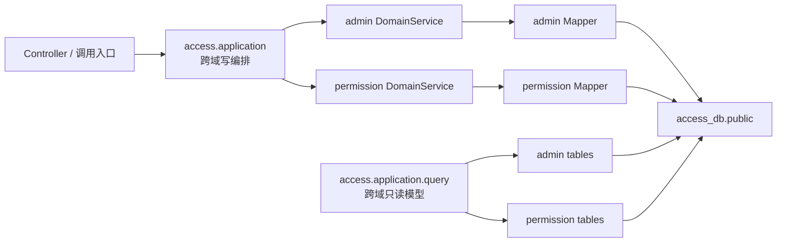

# access-service 目标架构与归并约束

本文定义 `admin-service` 与 `permission-center` 归并为 `access-service` 后的权威目标架构。实施编排见
[`../archive/2026-08-22/access-service-merge-plan.md`](../archive/2026-08-22/access-service-merge-plan.md)（T-ACCESS-001~012 已于 2026-08-22 全部完成归档；后续强化见 [`../plans/access-post-merge-plan.md`](../plans/access-post-merge-plan.md)）。新增和修改不得恢复旧服务边界或内部异步同步链路。

接口字段、权限语义和领域规则仍分别以现有 admin 与 permission 设计文档为准；当服务拓扑、事务边界、数据源、缓存或调用方式与旧文档冲突时，以本文为准。

## 1. 目标与非目标

### 1.1 目标

- 将 `admin-service` 与 `permission-center` 物理归并为一个 Maven 模块、一个 Spring Boot 进程和一个部署单元 `access-service`。
- 当前采用模块化单体，保留管理域与权限域的代码边界；后续根据复杂度和性能数据演进到完全扁平化。
- 使用单一 PostgreSQL 数据库 `access_db` 和单一 `public` schema。
- 将原 admin 到 permission 的异步同步改为单库本地强事务。
- 保持既有 HTTP 路径、请求/响应结构和错误码兼容。
- 支持至少两个 `access-service` 实例并行运行。

### 1.2 非目标

- 不在归并过程中增加新的业务功能或改变权限产品语义。
- 不提供 `admin-service`、`permission-center` 旧部署单元、旧服务名或旧端口的兼容代理。
- 不迁移历史数据；项目尚未部署，数据库从空库创建。
- 本阶段不引入 Flyway、Liquibase 或权限版本号机制。
- 本阶段不把两个领域立即完全扁平化。

## 2. 目标工程与部署单元

| 项目 | 目标值 |
|---|---|
| Maven 模块 | `access-service` |
| Spring 应用名 / Nacos 服务名 | `access-service` |
| 启动类 | `AccessServiceApplication` |
| Java 基线 | Java 21 |
| 建议端口 | `9100` |
| 数据库 | `access_db` |
| schema | `public` |
| Redis logical DB | `0` |

根 Maven 聚合在归并完成后不得继续包含 `admin-service` 或 `permission-center`。Gateway、Docker Compose、Nacos、日志应用名、指标标签和 SDK 目标服务统一使用 `access-service`。

旧 HTTP 路径继续有效，但服务发现不保留 `admin-service`、`permission-center` 别名。

## 3. 模块边界

目标包结构：

```text
cn.ac.fage.accessmesh.access
├── AccessServiceApplication
├── application          # 跨域写编排（User/Org/Menu/UserOrgWrite + RoleProxy/门禁）
│   └── query            # 跨域只读模型（T-ACCESS-006）
├── admin
├── permission
└── infrastructure
```



边界规则：

- `access.application` 是唯一跨域写事务编排层，只调用两个领域的 DomainService 接口。
- `admin` 与 `permission` 禁止相互依赖实现类、Mapper 或 AppService，禁止横向调用（唯一例外：query 包只读查询依赖 `PermissionViewAppService`，白名单见下「依赖白名单」）。
- 单域用例继续由各自 AppService 调度，不为形式统一搬入 `access.application`。
- 跨域组合读取集中到 `access.application.query`。该包可以使用专用 QueryMapper 批量查询或 JOIN 两域表，但只能返回 Projection/DTO，严禁写 SQL。
- QueryMapper 必须显式带租户条件、正确处理分页，并遵守 N+1 查询禁令。
- 重名 Spring Bean 使用清晰的域前缀类名消除冲突，不依赖模糊的 Bean 覆盖。
- 架构测试应将上述依赖白名单固化。

`access.application.query` 落地形态（T-ACCESS-006）：

- 查询服务（接口 + `impl/` 同包实现，方法标注 `@Transactional(readOnly = true)`）：
  - `UserMenuQueryService`：`/auth/user-menu`、`/user/user-menus`、`/role/my-info` 聚合（sys_menu 树 + 角色/权限码 + 菜单可见性判定）。
  - `UserRoleQueryService`：`/role/list` 功能角色列表、`/user-role/list` 角色列表（POSITION 补所属组织名）。
  - `OrgVisibilityQueryService`：组织可见性过滤（含 ORG_VISIBILITY 缓存，租户级失效由 PermissionChangeAspect 统一执行）。
- 专用 QueryMapper（`query/mapper`，XML 在 `resources/mapper/query/`）：只 SELECT、显式 `tenant_id` 条件、返回 `query/projection` 包 Projection record，不暴露或修改领域实体；权限判定一律经 `PermQueryEngine`/`TypeResolutionService`，不直查权限表判定。
- 依赖白名单（架构测试固化）：`admin`/`permission` 域互不使用对方 Mapper；`application` 非 query 包（写编排/门禁）不使用两域 Mapper；query 包不依赖两域实体/Mapper；query 包依赖的 permission AppService 仅限 `PermissionViewAppService`（写/管理 AppService 黑名单固化于 `QueryBoundaryArchitectureTest`）；组合查询数据读取只发生在 query 包。

菜单可见性判定（v3.5 §4.1 派生公式）：

- `UserMenuQueryServiceImpl` 不再按「用户菜单 = 角色授权的子集」的 ADMIN_MENU 模型（v3.5 已删除 ADMIN_MENU 资源类型），改为按 v3.5 §4.1 派生：业务菜单（`resource_type` 非空；`resource_code` 为空按不可解析资源 fail-closed，评审 P2-1）→ 用户对该资源有任意有效操作码即可见；纯展示菜单（`resource_type IS NULL`）→ 全员可见；DIR → 存在可见子节点（树构建剪枝）；HIDDEN/EXTERNAL/IFRAME → 派生方式同业务菜单（HIDDEN 不进 `menus[]`）。
- 有效操作码判定经 `PermissionViewAppService.getEffectiveResourceAccess`（评审新增）：复用 `buildEffectiveView` 公共 pipeline 收集两类事实——资源类型 `scopeAll` 全范围授权（`allScopeTypes`）与用户有任意有效操作码的资源实例 ID 集合（`resourceEntityIds`）；菜单资源实例经 `TypeResolutionService.batchResolveResourceIds` 解析后匹配（未解析 fail-closed 不可见）。权限事实查询失败降级为纯展示菜单（登录链路容错）。
- 递归环保护（P2-4）：菜单树构建以 `visited` 集合防脏数据 parent 环/重复（重复祖先导致死循环时停止递归），避免脏数据引发栈溢出。

门禁与限额：

- `/user/user-menus` 查询他人时需 `ADMIN_USER:VIEW@目标用户`，查自己豁免（方案1+2，P1-2）：`AdminUserController.getUserMenus` 在 `req.id() != 当前登录用户` 时经 `AdminPermissionValidator.checkInstanceLevel(USER, id, VIEW)` 门禁。
- 权限码下发门禁下放入口（方案「门禁下放入口」）：`PermissionViewAppService.buildEffectiveView` 公共管线不再设 `USER:VIEW` 门禁；permission 域独立 HTTP 入口 `/effective-permission-codes` 走 `getEffectivePermissionCodesForManage`（自查豁免 + 查他人需 `USER:VIEW`）；query 包内部调用由其入口 Controller 门禁（自查豁免 + `ADMIN_USER:VIEW`，P1-2）兜底；`getEffectivePermissions` 管理员视图保留原 `USER:VIEW`/`ROLE:VIEW` 门禁不动。
- `/role/list` 保持 `LIMIT 0,200` 上限并在 `UserRoleQueryService` Javadoc 声明（P2-3，用户决策「保持 + 文档声明上限」）：功能角色面向前端下拉，超出 200 属配置异常，由组织治理收敛。
- `OrgVisibilityQueryServiceImpl` 缓存读写故障旁路 DB（P2-1）：`CacheService.get/put` 异常时记 `log.warn` 并降级直查 DB，不阻断可见性计算（fail-open 至数据库层，权限判定本身仍经 engine fail-closed）。
- 角色数据走 query 服务（P2-2，用户决策「角色走 query 服务 + 权限保留 AppService」）：`UserRoleQueryService` 经 `UserRoleQueryMapper` 直读 `user_role ⨝ abstract_role`（跨域只读），权限事实（有效权限码/资源访问）保留经 `PermissionViewAppService`。

角色代理退役（T-ACCESS-006，用户决策「角色直接由 permission 管理」）：

- `RoleProxyService`/`RoleProxyServiceImpl`、`OrgVisibilityService`/`OrgVisibilityServiceImpl`（Feign 时代遗留的 admin 接口 + application 实现代理形态）已删除，admin 域直接依赖 `application.query` 查询服务。
- admin 侧角色写代理端点保留映射但恒拒绝：`/role/create` 恒 `20045`（LOCAL_PROJECTION_IMMUTABLE，语义不变）；`/role/grant-menu`、`/role/revoke-menu`、`/user-role/assign`、`/user-role/revoke` 恒 `10111`（ROLE_API_RETIRED）。角色与授权管理由 permission 域直接提供（`/api/perm/abstract-role`、`/api/perm/user-role`、`/api/perm/role-resource-permission`）。
- 菜单查询按权威 schema（`display_name`/DIR-MENU 枚举）读取；schema 收敛后 `sys_menu` 无 `component`/`visible`/`perm_code` 等旧列，菜单树构建对缺失字段取默认值（component=null、showLink=true、keepAlive=false、auths=null；EXTERNAL/IFRAME 类型 frameSrc=path；HIDDEN 不进 menus[]）。存量 DDL-实体漂移（菜单 CRUD 写路径仍使用旧实体字段 `name`/`visible`/`perm_code`，真实库写入会失败）登记于 T-ACCESS-006 完成记录，由 T-ACCESS-015 统一收口（2026-08-22 改挂：功能开发不混入文档收口任务）。

## 4. 管理事实与权限投影

### 4.1 所有权

- `sys_user`、`sys_org`、`sys_menu` 等是 AccessMesh 管理事实源。
- `abstract_user`、`abstract_role`、`resource_entity`、`user_role` 等继续承担权限计算事实。
- 管理事实对应的权限记录属于本地权限投影，由 `access-service` 管理；权限管理 API 不得绕过管理事实直接修改这些投影。
- 外部业务服务同步的权限主体与资源继续独立存在，并由外部同步所有权规则约束。

### 4.2 标识与事务

- 管理事实和权限投影保留独立主键，不强制共享数值 ID。
- 本地投影通过稳定外部键关联，例如本地用户投影的 `external_id = sys_user.id.toString()`。
- 权限投影必须具有明确的来源/所有权标识，AccessMesh 本地投影统一标记为 `access-service` 管理。
- `access.application` 在同一 PostgreSQL 事务内更新管理事实、权限投影和强事务审计；任一步骤失败，全部回滚。
- 内部投影不写 `sync_metadata`。`sync_metadata` 仅保留给外部服务的增量/全量同步。
- **门禁主体（两套 ID 空间）**：登录会话 / 签名代理主体持有的操作者 ID 是 admin 域 `sys_user.id`；权限引擎按 `abstract_user.id` 匹配 `user_role.abstract_user_id`。所有 engine 门禁（`hasPermission` / `validateBatch` / `getDeniedIds`）与投影空间自查逻辑，操作者 ID 必须先经 `OperatorSubjectResolver.requireSubjectId(tenantId, operatorId, engine)` 转换为投影主体；转换失败（投影不存在）fail-closed 抛 `SecurityException`。非门禁用途（createdBy 戳记、审计 `ChangeLogContext`、日志消息）保留 `sys_user.id`。

### 4.3 内部同步退役

以下内部 admin→permission 机制全部退役：

- `sys_sync_task` 表及管理 API（Gateway 对外路径 `/admin/sync-task/*`，服务内路径 `/sync-task/*`）。T-ACCESS-005 已将过渡表与内部同步代码一并删除，最终 DDL 不再包含该表。
- 同步任务 builder、handler、scheduler、重试、乱序版本、人工补偿和内部 full-sync 编排。
- access 内部 `PermissionFeignClient` / `SyncTaskFeignClient` 及 `@EnableFeignClients`。
- 为旧同步链路存在的配置、测试和运行手册。

面向外部服务的 `/api/perm/**/sync`、`/full-sync` 契约和 `sync_metadata` 继续保留。外部 sync 不得使用 `sourceService∈{access-service,admin-service}`，也不得写入保留业务键（`ADMIN_USER` / `ORG|POSITION` / `ADMIN_USER|ADMIN_ORG|ADMIN_MENU` / `SYS_USER_ORG`）。本地投影只能由 `access.application` 经 `LocalProjectionDomainService` 写入。

## 5. 数据库与共享表

### 5.1 单库单 schema

- 所有表物理归并到 `access_db.public`。
- 最终 DDL 的唯一权威文件为 `docs/design/schema/access-service.sql`。
- 最终 DDL 必须同时包含 §8.1 所需的任务执行键、唯一约束、租约、状态与幂等持久化结构，不允许运行时临时建表补齐。
- `admin-service.sql` 和 `permission-center.sql` 已随 T-ACCESS-012 物理归档至 `docs/archive/2026-08-22/schema/`，不再作为实现依据。
- 因无部署和历史数据，不提供旧库搬迁、兼容视图或升级脚本。
- 本阶段不引入数据库迁移框架；本地和 CI 必须能够从空 PostgreSQL 完整执行最终 DDL。

### 5.2 表合并边界

| 目标表 | 来源 | 约束 |
|---|---|---|
| `system_config` | `sys_config` + 原 `system_config` | `tenant_id + config_key` 唯一；JSONB 值；键使用 `admin.*`、`permission.*`、`access.*` 命名空间 |
| `operation_log` | `sys_audit_log` + 原 `operation_log` | 字段取超集；`target_id` 使用字符串；模块标识 `ADMIN/PERMISSION/ACCESS`；敏感内容脱敏并限长 |

以下表保持独立：

- `sys_login_log`：认证安全日志。
- `permission_change_log`：权限关系详细变更日志。
- `sys_job_log`：定时任务执行日志。
- 管理事实表与权限计算表：因语义不同不强行合并。
- `sys_dict_*` 与 `type_definition`：分别承担业务字典和权限类型定义，不合并。

**配置键命名空间（T-ACCESS-007 §5.2 落地）**：`system_config.config_key` 的唯一合法前缀为 `admin.`/`permission.`/`access.` 三值。存量种子键已全部迁移至 `admin.*`；`SystemConfigAppServiceImpl.upsertSystemConfig` 在权限校验后、触达数据访问前校验前缀，非法键 fail-closed 抛 `BizException`（`CONFIG_KEY_NAMESPACE_INVALID`），防止无命名空间键扩散。

**`operation_log` 合并列（T-ACCESS-007 落地）**：`target_id` 为 `VARCHAR(256)`（覆盖 `configKey`(128) / `roleExternalId`(256) 等业务键上限），由原数值列字符串化；`module` 三值化 `ADMIN/PERMISSION/ACCESS`（判定见 §8.2）；补充 `(tenant_id, module, created_at DESC)` 排序索引及列注释，操作者索引为 `(tenant_id, operator_id, created_at DESC)`。`sys_audit_log` 的 `user_id`/`username` 列并入 `operator_id`/`operator_name` 承载，不复用。

## 6. 可信请求上下文与安全策略

### 6.1 唯一请求上下文

`access-service` 内只保留一个可信请求上下文 `AccessRequestContext`（infrastructure，T-ACCESS-004 落地），承载四要素：

- `tenantId`（已验证租户 ID）
- `operatorId`（已验证操作者 ID）
- `callerType`（四态：`USER` 平台用户 / `SERVICE` 注册业务服务 / `TASK` 定时任务 / `ANONYMOUS` 公开路径）
- `verifiedServiceCode`（已验证服务编码，仅 SERVICE 调用非 null）

只有统一安全入口 `RequestContextInterceptor` 可以绑定上下文，业务代码只能读取（`AccessRequestContext` 提供便捷 getter 与 `snapshot()/restore()` 快照 API）。原始请求头不能未经验证直接成为租户、操作人或服务身份。`TenantContextHolder` 保留为兼容门面（set/get/clear 委托新上下文，约 60 处存量引用零迁移；T-ACCESS-012 收口时扁平化）。admin 与 permission 共用一套 MyBatis-Flex 租户配置（`MybatisFlexTenantConfig` 的 TenantFactory 从 `TenantContextHolder` 取值；原共用 `TenantIdProvider` 已随 T-ACCESS-009 跨租户批量加载删除）。

请求完成必须在 `afterCompletion` 清理上下文（拦截器统一执行，含异常路径）。异步任务显式传递上下文快照（现有 @Async 均显式传 tenantId 参数，不读 ThreadLocal），定时任务通过显式 set 建立有界作用域（任务执行线程绑定 `RequestContext.task(tenantId)`，T-ACCESS-009），禁止盲目继承 ThreadLocal。

日志 MDC 由同一拦截器注入（`traceId`=X-Request-Id 或 UUID、`userId`、`tenantId`、`serviceCode`，配合 log4j2 JsonLayout properties=true；外部可控值截断 64 字符），afterCompletion 同步清理。

**统一安全链**（`SecurityWebMvcConfig` 唯一 WebMvcConfigurer，T-ACCESS-004 替换原 admin/permission 双链）：

| order | 拦截器 | 覆盖 | 职责 |
|---|---|---|---|
| 1 | `InternalApiSecretInterceptor` | `/api/perm/**` | 内部凭证（X-Internal-Secret）验证，通过写 `INTERNAL_AUTHENTICATED` attribute |
| 2 | `HeaderSignatureInterceptor` | `/api/**`、`/internal/**` | X-User-Id 头恒需验签（内部凭证路径不再无条件信任用户头），通过写 `SIGNATURE_VERIFIED` attribute |
| 3 | `RequestContextInterceptor` | `/**` | 唯一上下文绑定入口：安全策略矩阵决策 + MDC 注入 + afterCompletion 清理；/error ERROR dispatch 放行（防真实错误被 401 掩蔽） |

操作者绑定规则（T-ACCESS-004 用户决策）：`operatorId` 只在 Sa-Token 会话、签名验证通过或 OAuth2 JWT 验签通过后绑定（JWT 来源：`SaJwtUtil` HS256 + loginType + 超时校验 + `oauth2:blacklist:<jti>` 撤销检查）；内部凭证单独不授予操作者身份（SERVICE 调用 operatorId=null，管理接口权限判定 fail-closed）。服务身份绑定规则：内部凭证验证通过后 `X-Service-Code` 视为凭证持有者声明的服务身份（防无凭证外部伪造）；凭证持有者互冒充为已知限制，T-ACCESS-005/010 服务白名单收敛。OAuth2 JWT 认证分支**仅对 `/auth/oauth2/userinfo` 端点生效**（唯一消费方；精确匹配防前缀覆盖 authorize 等非资源端点）：委托令牌不得触达管理接口或其他端点（防 OAuth2 委托令牌越权访问 `/user/**` 等）；未来开放业务 API 由 T-ACCESS-013（OAuth2 资源服务器 + scope 授权模型）显式逐项放开，不得默认放开 `/auth/oauth2/**` 通配。

平台用户会话只保留一套：`/auth/**` 是用户登录与会话签发入口，Gateway 负责校验并向 `access-service` 注入可信身份。Gateway 与 `access-service` 在 Redis logical DB 0 上使用兼容且唯一的 Sa-Token 权威配置（T-ACCESS-003 落实）：`token-name=Authorization`、`token-style=uuid`（uuid 模式无会话密钥概念，会话有效性以共享 Redis 条目为唯一事实，Redis 清空后两端一致失效 fail-closed）、`timeout=7200`（2 小时绝对有效期）、`active-timeout=1800`（30 分钟无操作滑动续期）、`is-concurrent=true`、`is-share=false`、token-prefix 均为 `Bearer`（Gateway 配置，access 签发返回 tokenType=Bearer）；登录类型两侧均为 `StpUtil.login()` 默认 `login`（Sa-Token 无 login-type 配置键，文档口径而非配置项）。`jwt-secret-key` 仅用于 OAuth2 访问令牌签发（HS256，`SaJwtUtil`），不属于平台用户会话密钥。平台用户会话固定为 2 小时绝对有效期和 30 分钟无操作有效期，登录、校验、续期、注销和失效必须端到端一致。Sa-Token 键命名空间只与业务缓存隔离，不得在 Gateway 与 `access-service` 之间相互隔离。两端配置一致性由部署配置约束保障，代码不实现跨进程启动校验（T-ACCESS-003 用户决策：运维部署部分不影响代码逻辑）；`jwt-secret-key` 配置无默认值（`${JWT_SECRET_KEY}`），缺失时 Spring 占位符解析失败导致启动失败。

登录响应 `LoginResp.expiresIn` 的单一权威来源为 `sa-token.timeout`（`SaManager.getConfig().getTimeout()`，即真实会话 TTL），无独立展示键——避免 Nacos 只覆盖一项配置时展示与真实会话漂移（T-ACCESS-003 评审 P2，2026-08-14）。Gateway 配置经 T-ACCESS-003 评审 P1 从 `bootstrap.yml` 迁移至 `application.yml`（Boot 3 标准 ConfigData + `spring.config.import: optional:nacos:gateway.yml`，与 access-service 同模式）；原 bootstrap.yml 在 Boot 3 默认不加载（无 starter-bootstrap），Gateway 的 sa-token/Redis/路由/Nacos 配置实际从未生效，且存在 7 个启动缺陷（WebMvc 组件冲突、Bean 名冲突、spring-webmvc 在 classpath 触发 SCG 异常、路由前缀错误等）已随迁移修复；Gateway 上下文配置测试（`GatewayApplicationConfigTest`）固化为回归保障。

OAuth2 客户端令牌继续使用各客户端注册配置的有效期，不套用平台用户会话的 2 小时/30 分钟口径。`perm-sdk`、外部 `sync/full-sync` 和注册业务服务调用属于服务身份认证，不复用平台用户 Sa-Token 会话，继续按权限 API 契约使用签名或内部服务凭证建立 `callerType=SERVICE` 的可信上下文。

### 6.2 安全策略矩阵

T-ACCESS-004 落地实现（2026-08-14，`SecurityMatrixIT` 固化）：

| 入口 | 调用方要求 | 关键约束 | 实现 |
|---|---|---|---|
| `/auth/**` 公开子集 | 匿名/会话/OAuth2 JWT | 精确拆分：{captcha, login, login/sms, oauth2/token, oauth2/refresh, oauth2/revoke, logout} 匿名放行（logout 保持未登录 200 幂等）；{userinfo, user-menu, oauth2/authorize} 需会话 → USER 分支；{oauth2/userinfo} 需 OAuth2 JWT（验签 + 撤销黑名单后绑定，仅限该端点；revoke 验签后写黑名单防匿名 Redis 键 DoS） | ANONYMOUS / USER 上下文；登录会话键 tenantId + subjectTypeCode |
| 用户管理接口（`/user/**` 等） | 有效用户会话 | 租户与会话一致；X-Tenant-Id/X-User-Id 头存在必须与会话一致（不一致 403）；未登录显式 401 | 会话权威：operatorId=loginId、tenantId=session 租户 |
| `/api/perm/auth/**` | 已验证 Gateway 或注册业务服务 | 保持现有 SDK 请求头兼容；按服务和操作授权 | 内部凭证 → SERVICE（或签名用户态）；请求体主体非操作者 |
| `/api/perm/**/sync`、`/full-sync` | 已验证服务身份 | `sourceService` 必须等于已验证服务身份（凭证通过后绑定的 X-Service-Code，`SyncAuthVerifier` 从上下文比对） | SERVICE 上下文；不匹配 → SECURITY_DENIED |
| 其他 `/api/perm/**` 管理接口 | 已验证 Gateway + 用户身份，或显式服务白名单 | 内部凭证不隐式获得全量管理权限：纯凭证调用 operatorId=null → 权限判定 fail-closed；X-User-Id 恒需验签才绑定操作者 | USER（验签）/ SERVICE（无操作者） |
| `/internal/**` | 已签名/凭证调用 | 与 /api/** 同签名链；匿名放行后由 RequestContext 显式 401 | HeaderSignature 覆盖 |
| `/actuator/**` | 匿名 | 健康检查匿名放行（不强制 X-Tenant-Id）；暴露面最小化 health,info | ANONYMOUS；不在签名链 |

`access-service` 端口仅在内部网络开放，Gateway 是用户流量唯一入口。本地跨域调用不模拟 HTTP 请求头，但仍使用可信上下文和权限校验器。

## 7. 缓存与多实例一致性

### 7.1 统一缓存框架

- 业务代码只注入唯一 `CacheService`。
- Redis 统一使用 logical DB 0；Sa-Token 使用与业务缓存隔离、但由 Gateway 与 `access-service` 共享的唯一会话键命名空间。
- `access-service` 内缓存目录按领域使用 `admin:*`、`perm:*`、`access:*` 前缀；独立部署的 Gateway 继续使用 `gw:*` 前缀，不并入 `access-service` 的目录命名空间。
- 统一缓存 TTL 类型使用 `java.time.Duration`：`CacheCatalogEntry`、`CacheProperties`、Caffeine 与 Redisson store 均支持秒级精度，YAML 使用 Spring Boot Duration 文法（例如 `15s`、`5m`），禁止业务侧硬编码换算。
- 现有 `l1TtlMinutes`、`l2TtlMinutes`、`l1-expire-minutes`、`l2-ttl-minutes` 在 T-ACCESS-008 中一次性迁移并删除，不保留分钟字段或兼容别名。
- 删除 admin 的 Spring Cache/裸 Caffeine 和 permission 的自定义 RedisTemplate/ObjectMapper 分叉。
- 普通写路径使用事务提交后失效；多实例非授权 L1 通过失效事件及时清理。

### 7.2 授权读取边界

- 数据库业务事实与跨域写入保持强事务一致。
- 第一阶段不引入 `permission_revision`。
- `access-service` 内所有可能影响接口权限快照的授权缓存统一使用 `L2_ONLY`，TTL 均不得超过 10 秒且不创建授权 L1。
- 每次授权 L2 miss 必须在开始数据库读取事务或快照查询前记录单调时钟起点，回填值的绝对过期时刻不得晚于“读取起点 + catalog TTL”；写入时只使用扣除数据库处理时间后的剩余 TTL，剩余 TTL 小于等于零时不得回填。单条、批量、并发合并及重试不得重置该读取起点。
- `CacheService` 与底层 Store SPI 必须支持单次写入的有效 TTL，并同时受 catalog TTL 上限约束；单条与批量写入语义一致。业务代码不得直接操作 Redis/Caffeine，也不得把单次有效 TTL 放大到 catalog 上限之外；非授权普通缓存继续使用 catalog TTL。
- `access-service` 缓存不可用时绕过缓存查询数据库；无法获得可信授权结果时 fail-closed。
- Gateway 本地权限快照使用 `L1_ONLY`，TTL 不得超过 15 秒；删除 `gateway.permission.fail-mode` 配置及 `open`、`stale-allow` 分支，权限回源失败固定 fail-closed，不得绕过授权或使用过期的放行结果。
- Gateway 一次授权请求触发的整个权限快照加载流程必须具有不超过 5 秒的墙钟硬截止时间。计时范围覆盖服务发现与负载均衡、连接、请求发送、`access-service` 处理、响应读取与解码，以及失效竞争触发的重试；连接超时、响应超时等分段限制不能代替该全链路截止时间。超过截止时间不得写入 Gateway 缓存并固定 fail-closed。
- 串行总预算必须满足“上游授权 L2 TTL + Gateway 快照回源全链路截止时间 + Gateway 权限 L1 TTL ≤ 30 秒”；第一阶段固定采用 10 秒 + 5 秒 + 15 秒。配置覆盖值超过任一分项上限时必须启动失败，不在 `InterfaceSnapshotResp` 增加版本号或 `validUntil`。
- 接受广播丢失、提交后缓存删除失败或失效后旧读取完成回填时最长 30 秒的授权读取不一致窗口；正常失效目标为毫秒到亚秒级。
- 后续只有在性能数据证明必须启用授权 L1 时，才评估租户级权限版本屏障。

**落地实现（T-ACCESS-008，2026-08-21）**：

- **快照链路 6 目录**（`perm:effective-roles`、`perm:role-perm-snapshot`、`perm:type-value`、`perm:type-code`、`perm:condition-rules`、`perm:role-mutex-rule`）L2_ONLY + 10s（用户决策①）；`OPERATION_PERMISSIONS_BY_TYPE` 不进快照内容，保持 L1_L2 60m/120m 普通缓存；`ORG_VISIBILITY` 保持 L2_ONLY 60s。`PermCacheBoundaryValidator` 启动强制有效 L2 TTL≤10s（含 YAML 覆盖）。
- **剩余 TTL 回填**：`CacheService.beginRead` 令牌记录单调时钟起点（DB 读取前），`put(token,...)` 只写「读取起点 + catalog 有效 TTL」剩余 TTL、≤0 不写、批量/重试不重置；`put(..., Duration)` 单次有效 TTL 强制 cap catalog TTL。L1 层（Caffeine 固定过期）仅当 catalog L1 TTL 在预算内才写，否则跳过。
- **普通 L1 跨实例失效**：L1_L2 目录 evict/evictAll 时经 RTopic `accessmesh:cache:l1-invalidate` 广播，各实例订阅清本地 L1；失败计 `cache.invalidate.failures` 指标，L1 TTL 兜底；回滚不失效。
- **Gateway**：快照缓存迁统一 CacheService（L1_ONLY `gw:interface-snapshot` 15s/50000，`accessmesh.cache.catalogs` 运维覆盖）；失效粒度用户级精确（跟踪索引 + 在途回源注册表候选；索引缺失由快照 TTL 兜底）+ 租户级兜底（用户决策③）；失效先递增代际再清缓存（防旧回源复活窗口）；固定 fail-closed（fail-mode/open/stale-allow 删除）；`snapshot-load-deadline` 5s 全链路墙钟硬截止（重试共享截止、超时不写缓存 503）；`GatewayCacheBoundaryValidator` 启动强制 L1≤15s、截止≤5s。

## 8. 任务、异步与审计

### 8.1 多实例任务协调

- 同一计划触发使用稳定的数据库执行键（例如 `jobId + scheduledTime`）和唯一约束。
- 通过 `lease_owner`、`lease_until`、状态和原子抢占保证同一时刻最多一个活动执行者。
- 长任务续租，实例故障后允许其他实例接管。
- 任务处理必须幂等；外部副作用携带执行键。
- 语义为“最多一个并发执行者 + 失败后至少一次重试”，不承诺端到端 exactly-once。
- Redis 不承担任务正确性。
- 仅为旧内部同步兜底的维护任务随同步子系统一起删除；外部同步仍需要的维护任务才保留。

**落地实现（T-ACCESS-009，2026-08-21，7 项用户决策）**：

- **执行键**：`job:{jobId}:{yyyyMMdd'T'HHmmss}`（计划触发时刻秒级截断）；手动触发为 `job:{jobId}:manual:{epochMilli}-{UUID}`（独立执行，不与计划执行竞争，UUID 防同毫秒并发触发碰撞）。`JobServiceImpl` 通过 `ExecutionKeyCronTrigger` 在 Trigger 计算时捕获本轮触发时刻传入执行编排。cron 按 JVM 时区计算，**各实例部署约定同一时区（项目约定，不做跨时区支持）**。多实例继续各自触发 Spring Scheduler；正确性全部由 `sys_task_execution` 的原子条件 SQL 承担（`SysTaskExecutionMapper.xml`：`tryClaimExecution` INSERT ... ON CONFLICT（部分唯一索引推断）+ 条件 DO UPDATE ... RETURNING，租约判定/续租/完成全部以数据库 `now()` 为基准），Redis 不参与。
- **attempt 级 fencing**：`attempt_count` 同时是 fencing token——每次抢占原子递增并由 RETURNING 返回本次尝试号；续租与完成写回按「`lease_owner` + `attempt_count`」双条件判定。同实例接管自己的过期任务（owner 不变、attempt 递增）时旧尝试不能续租或覆盖新尝试的结果。
- **租约生命周期**：抢占（PENDING/FAILED 或租约过期才允许，且 `attempt_count < MAX_ATTEMPTS=3`）→ **抢占成功后立即启动后台续租（每 20s，租约 60s）——覆盖执行器排队等待期，排队超过租约期不会被误接管；执行线程出队后再做一次租约校验，丢失则跳过执行** → 条件完成/失败；SUCCESS 后不可再抢占。业务失败写回 FAILED 后由扫描器按「失败后至少一次重试」语义接管重试（同一执行键，attempt+1），超限后收敛终态。执行编排位于调度层 `JobServiceImpl`（DomainService 不承担线程池/调度编排，也不横向注入其他 DomainService）。**计划触发时重读数据库任务行**：已删除/已停用任务跳过执行、新 invokeTarget 即时生效；接管重试的计划时刻由执行键反解（`parseScheduledTime`，手动键为 null），不随尝试漂移。
- **多实例配置对账（用户决策：周期对账 + 触发时重读）**：任务 CRUD 只操作当前实例内存调度表；各实例经 `JobScheduleReconciler`（60s 周期）跨租户**单条批量查询**（`selectAllEnabledJobs`，§8.4.8 禁止按租户循环查询——启动加载同步迁移）重载启用任务并 diff 重调度。对账为**真 diff**——按已调度任务的 cron 快照跳过未变化项，不做每轮全量取消/重建；Trigger 先构造成功再取消旧调度，cron 非法时保留旧调度。**批量加载失败 = 全部状态未知**，本轮不做任何调度变更（含删除判定）——错过的计划触发不产生执行记录，接管无法补偿，临时数据库异常不得被解释成全部停用。配置漂移窗口约为对账间隔 60s + 单轮对账耗时；窗口内旧 cron 可能多触发一次（独立执行键、走完整租约/幂等治理），不引入实时广播（MQ）避免过度设计。
- **故障接管与失败重试**：`TaskLeaseTakeoverScheduler`（每实例 30s 周期，access-service 内保留的系统维护调度任务之一）先收敛超过 MAX_ATTEMPTS 的过期执行为 FAILED，再对可重试执行（RUNNING 租约过期 / FAILED 未超限）经 `JobService.takeoverExpiredExecutions()` 原子接管重试。**任务已删除/已停用或执行键无法解析的候选立即收敛（`abandonExecution` 按候选快照 fencing——status + attempt 匹配且不碰 SUCCESS、RUNNING 候选要求租约仍过期——读取后被其他实例抢占/完成的行不受影响；attempt 拉满后退出重试候选），防止僵尸记录每轮占据接管批次（ORDER BY updated_at LIMIT 20）导致有效重试饥饿**。扫描器自身多实例并发由 PostgreSQL 会话级 advisory lock（`pg_try_advisory_lock`，单连接内加锁/解锁，抢锁失败跳过本轮）协调（用户决策）——任务卡「数据库执行键竞争同一次计划执行」由被接管的任务执行本身承载，advisory lock 仅为扫描效率优化；锁不可用（非 PostgreSQL）时所有实例都扫描，正确性不受影响。
- **invokeTarget 真实执行（ARCH-DEBT-001 关闭）**：`JobInvokeDomainService` 反射调用 `beanName.methodName`。安全边界为 `@JobInvocable` 注解白名单（infrastructure.task，用户决策）——未标注的方法一律拒绝，防止任务配置指向任意 Bean 方法；**唯一受支持签名为单一 `TaskExecutionContext` 参数（用户决策：必须接收上下文——幂等键必有传递通道，无参签名拒绝）**（record：tenantId/jobId/executionKey/attemptCount/scheduledTime），**executionKey 即外部副作用幂等键**（手动键为 `job:{id}:manual:{epochMilli}-{UUID}`，UUID 防同毫秒并发触发碰撞），副作用方按键去重实现 at-least-once 不重复业务结果。业务异常去包装后原样传播。**代理兼容**：白名单注解与签名在 `AopProxyUtils.ultimateTargetClass` 目标类上解析（CGLIB 代理类生成的方法不携带目标方法注解，事务化任务 Bean 不能因此被误判未授权），调用经 `ClassUtils.getMostSpecificMethod` + `BridgeMethodResolver` 换回代理对象上可反射调用的方法，保留 `@Transactional` 等代理语义。
- **异步执行治理（用户决策：专用执行器）**：任务业务执行走 `accessTaskExecutor`（有界、命名前缀 `access-task-`，容量唯一来源 `application.yml access.task.executor.*`），与审计异步 `accessAsyncExecutor` 容量隔离。**拒绝语义：拒绝处理器记告警后必须抛 `RejectedExecutionException`（ThreadPoolTaskExecutor 转 `TaskRejectedException` 通知提交方），提交方停续租并写回 FAILED**——只记日志不抛会使已启动的续租永远续下去、任务永久 RUNNING 无法接管；未超限时由接管扫描按至少一次语义重试。执行线程显式绑定 `RequestContext.task(tenantId)` TASK 可信上下文 + TenantContextHolder，finally 清理，不继承调度/请求线程 ThreadLocal。**续租专用调度器**：`taskLeaseRenewalScheduler`（单线程、`removeOnCancelPolicy`）与共享调度器隔离——续租是正确性路径，共享调度器上的对账/接管扫描会同步做数据库 IO，阻塞超过租约窗口会停摆续租、误触发接管，破坏「最多一个活动执行者」。**声明任何 TaskScheduler Bean 都会使 Boot 的 TaskSchedulingAutoConfiguration 退让（@ConditionalOnMissingBean）**——只声明续租调度器会让全容器只剩一个单线程调度器（隔离失效且 `spring.task.scheduling.pool.size` 不生效），因此显式声明共享 `taskScheduler`（Bean 名保持 `taskScheduler` 供 @Scheduled 按名解析，池大小跟随 `spring.task.scheduling.pool.size`，设 2）；拓扑由 `TaskExecutorConfigTest` 经 ApplicationContextRunner 固化（两 Bean 互异、池大小正确）。
- **收敛删除**：无使用者的 `TenantAwareScheduled` 注解（common）与 `TenantScheduledAspect` 切面（admin/config）随本任务删除——静态任务的租户调度未来经 `sys_task_execution` 统一治理后再引入；按租户循环查询改为跨租户批量后，`TenantIdProvider` 接口（common）与 `AdminTenantIdProvider`（唯一消费者消失）一并删除。内部同步兜底维护任务已随 T-ACCESS-005 删除；gateway 的 `cleanupOrphanedMarkers`（60s）保持每实例本地执行——清理的是本实例内存中的孤立失效标记，属本地缓存治理（T-ACCESS-008），加数据库租约反而错误。
- **测试**：`TaskExecutionLeaseConcurrencyTest`（PostgreSQL Testcontainers，双实例以不同 lease_owner + 并发线程模拟；建表在 `@BeforeAll`——先于 Spring 上下文创建，因 `JobServiceImpl @PostConstruct` 会查 `sys_job`）覆盖并发抢占唯一赢家、续租仅持有者且仅当前尝试号、**同实例接管自己的过期任务被 attempt fencing 挡住**、过期接管 + 旧持有者不可覆盖、SUCCESS 不可重抢占、抢占超限阻断、FAILED 至少一次重试、**僵尸执行收敛（任务删除后 attempt 拉满不再候选）与 abandon 对并发抢占/SUCCESS 行的 fencing**、编排级幂等（同一执行键多触发只执行一次）与接管重试携带同一幂等键；单元测试覆盖拒绝与调度器拓扑（`TaskExecutorConfigTest`：拒绝转 TaskRejectedException、ApplicationContextRunner 验证共享/续租两调度器 Bean 互异且池大小正确）、对账编排（`JobServiceImplTest`：拒绝时停续租写 FAILED / 停用删除跳过 / 对账 diff 不重建 / **cron 变更替换调度** / 停用取消 / **批量加载失败保持现有调度**）、CGLIB 代理白名单解析（`JobInvokeDomainServiceTest`）、执行键构建与反解（`TaskExecutionDomainServiceImplTest`）。

### 8.2 审计事务分级

- `permission_change_log` 与权限事实变更位于同一事务，日志失败则权限变更回滚。
- `operation_log`、`sys_login_log`、`sys_job_log` 使用独立短事务，写入失败不回滚已成功的主业务，但必须产生错误日志和监控指标。
- 异步日志使用有界线程池；队列满时不得静默丢弃，应降级同步写入或明确告警。
- 缓存失效继续在主事务提交后执行，不与审计事务混合。

**落地实现（T-ACCESS-007）**：

- **module 三值化判定（按事务边界）**：`ACCESS` = `application` 包 Write 服务在单事务内同时写管理事实与权限投影（跨域编排，如用户创建连带权限投影）；`PERMISSION` = permission 域本体写（角色/资源/服务/条件/类型等）；`ADMIN` = 纯管理事实写（字典/配置/任务/通知/文件/机构等）。事件码统一大写 `{业务对象}_{动作}`（如 `USER_PASSWORD_RESET`、`SYSTEM_CONFIG_UPSERT`）。
- **唯一入口**：入口级操作日志统一由 `@OperationLog` AOP 切面记录（必填 `module`/`action`/`targetType`/`targetId`/`summary` 五属性；`targetType` 小写物理表名，批量操作用对应业务表名（如 `abstract_role`）且 `targetId=""`；逻辑对象码例外显式登记——`oauth2_token` 以 JWT（jti）+ Redis 黑名单存储、无物理表，`OAUTH2_TOKEN_REVOKE` 用该码标识；`summary` 必须为合法 SpEL，纯文本用单引号包裹）。**覆盖范围**：permission 域 4 个 `*SyncAppServiceImpl`（AbstractRole/AbstractUser/ResourceEntity/UserRole）的 sync/fullSync 共 8 个写入口同样标注——module=PERMISSION（SYNC 边界）、action 大写事件码（如 `ABSTRACT_ROLE_SYNC`）、单条 sync targetId 用业务键（roleExternalId/subjectExternalId/resourceCode）、fullSync 留空、summary 记 `from {sourceService}`。覆盖由 `AppServiceOperationLogCoverageTest` 包扫描 `permission.service.impl` 强制断言（public `@Transactional` 非 readOnly 方法必须标注）+ 全域已标注方法契约校验（module 三值化/action 大写事件码/targetType ∈ 物理表名白名单（access-service.sql 33 表）∪ 登记例外/summary 与 targetId 合法 SpEL）；admin/application 域强制覆盖由 T-ACCESS-014 落地（见下）。注解类位于 `infrastructure.aop`（跨域通用能力；admin/application 写服务同样标注，若置于 permission 包会使 admin 依赖 permission 违反架构边界），切面 `OperationLogAspect` 留在 `permission.aop`，运行时上下文 `OperationLogRuntimeContext` 与注解同置 `infrastructure.aop`（admin 需在其服务内登记运行时 override，放 permission 包会使 admin 依赖 permission）。**切面定序**：`OperationLogAspect` 设 `@Order(Ordered.LOWEST_PRECEDENCE - 1)` 位于事务切面（默认 LOWEST_PRECEDENCE）外层——主事务提交成功后才记录，回滚时 `proceed()` 抛异常走 finally 不记录，避免残留 responseCode=200 的虚假日志。**operatorName 会话回填**：`AuthServiceImpl` 登录成功写 `operatorName` 到 Sa-Token 会话，切面读取回填；无会话调用（SERVICE/TASK/ANONYMOUS）为 null。**审计豁免登记**：`NoticeServiceImpl.markNoticeAsRead`（用户自操作高频低价值已读标记，写 `sys_user_notice` 状态位）不标注 `@OperationLog`，已读事件经 `read_at` 列追踪。原 `@AuditLog` 切面及 `AuditLogController`（`/audit-log/**`，前端零引用）随收敛删除。内部动态日志（diff 快照、冲突通知）仍由 `AuditDomainService` 显式调用。
- **独立短事务**：`operation_log` 经 `AuditDomainService.asyncRecordLog` 异步写入（`@Async` 线程池 + `REQUIRES_NEW`）；`sys_login_log`、`sys_job_log` 经 `LoginLogDomainService`/`JobLogDomainService` 同步写入但 `REQUIRES_NEW`（登录/任务日志同步落库，主流程回滚不影响日志）。**登录日志完整回填**：`recordLoginLog` 收 `LoginLogEntry` record（tenantId/userId/username/loginType/clientId/ipAddress/userAgent/status/failReason）；IP/UA/请求 ID 由 `infrastructure.util.HttpRequestUtils` 从请求上下文集中提取（`X-Forwarded-For` 取代理链首地址，对齐 VARCHAR(64)/512 限长），`OperationLogAspect` 复用同源消除重复；SMS 成功/命中用户分支 username 回填实际用户名；loginType 大写 `PASSWORD`/`SMS`/`OAUTH2` 对齐 DDL 列注释。**调用方兜底**：方法体不吞异常——REQUIRES_NEW 异常（含 Spring 代理层 commit 阶段的连接中断/rollback-only）自然传播，由 `AuthServiceImpl.safeRecordLoginLog` / `JobServiceImpl.executeJob` finally 统一 try-catch 兜底，日志失败仅告警不阻断。
- **脱敏限长**：`SensitiveDataUtils`（infrastructure/util）采用 **Jackson 递归树遍历**脱敏：按 JSON 字段名匹配（`password/pwd/secret/token/smscode/captchacode/apikey/authorization`，忽略大小写与下划线），命中敏感字段名时将其值整体替换为掩码 `***`——覆盖所有值形态（标量字符串/数字/布尔、嵌套对象、数组元素、以及值为内嵌 JSON 字符串如 `SystemConfigReq.configValue` 的内层敏感键值，后者先递归解析内层再脱敏），字段名不敏感时其非字符串标量值原样保留。`maskRequestBody` 脱敏后限长 `REQUEST_BODY_MAX_LEN=4000`，超长截断追加省略号（截断后总长不得越过列上限，对齐 `operation_log.request_body` 列）。切面在同步线程以参数名包装后序列化，保证敏感字段名在 JSON 中可被识别；`targetId`/`summary` 涉及 Token 等敏感值时留空不落库。**大对象元数据替换**：`MultipartFile`/`Part`/`byte[]`/流/`File`/`Resource`/`HttpServletRequest`/`Response`/`Session` 在序列化前替换为仅含类型/名称/大小的元数据 Map，文件内容不写入审计字段。**请求头限长**：`request_id`/`ip_address` 对齐 VARCHAR(64) 截断，`X-Forwarded-For` 取代理链第一个地址。**匿名安全写租户解析**：`OperationLogAspect.resolveTenantId` 解析顺序为 ① `OperationLogRuntimeContext.setTenantId`（方法体内显式登记，覆盖匿名认证派生端点——OAuth2 token/refresh/revoke 从授权码/刷新令牌/JWT 载荷解析租户后登记）；② 方法参数 `tenantId`（如登录失败自动锁定 `lockUser`）；③ `TenantContextHolder`。三者皆空的纯匿名端点该条操作日志跳过并告警（不写 `tenant_id=null` 违反 NOT NULL）。OAuth2 签发/刷新/撤销均经 runtime override 正常落 `@OperationLog`（OAUTH2_TOKEN_ISSUE / _REFRESH / _REVOKE）；登录（成功及失败）由 `sys_login_log`（loginType=OAUTH2）承载，失败尝试在租户可解析时写 status=0、不可解析时跳过并告警。
- **有界线程池降级**：`AsyncConfig` 线程池容量参数唯一来源 `application.yml spring.task.execution.pool`（运维可调，代码不设硬编码容量）；executor 注册为 `@Bean("accessAsyncExecutor")` 由容器管理初始化/销毁生命周期，`getAsyncExecutor()` 返回同一实例。拒绝处理器等价 JDK `CallerRunsPolicy`：线程池已关闭（应用停机）时丢弃不再执行，否则调用者线程同步执行 + 告警日志（不丢失）。监控以错误/告警日志呈现，不引入 Micrometer。

**落地实现（T-ACCESS-014，2026-08-22）**：

- **admin/application 域强制覆盖**：`AppServiceOperationLogCoverageTest` 新增域内强制断言，与 permission 域同口径——`admin.service.impl`（`*ServiceImpl`）、`application.impl`（`*WriteAppServiceImpl`）、`application.query.impl`（`*QueryServiceImpl`）的 public `@Transactional` 非 readOnly 写方法必须标注 `@OperationLog` 并通过契约校验；扫描后缀统一 `*ServiceImpl` 与类名实际一致，附类数下限防清单漂移（admin ≥14、application ≥7）。已标注方法契约校验覆盖 permission/admin/application 三域（不依赖事务）。豁免经测试内 `EXEMPT_WRITE_METHODS` 清单显式登记（当前唯一：`NoticeServiceImpl#markNoticeAsRead`，与方法 Javadoc、任务卡验收三处同步，禁止静默缺标）——键为「完整类名#方法名(参数完整类名,…)」并校验每项精确命中唯一写方法，方法改名/删除/失去事务后失配即失败。
- **无事务方法不强制（按事务边界判定，防双重记录）**：`MenuServiceImpl`/`OrgServiceImpl`/`UserOrgServiceImpl` 的 Controller 直连写方法为委托门面（无 `@Transactional`），审计由事务边界的 `*WriteAppServiceImpl` 承载，门面重复标注会产生双重 `operation_log`；`AuthServiceImpl` login/smsLogin/logout 会话操作由 `sys_login_log` 承载（§8.2 登录日志口径）；`application.query.impl` 三个查询服务全部 `readOnly=true` 无写方法；`OAuth2ServiceImpl`/`JobServiceImpl` 已标注但非事务的方法（token/refresh/revoke、trigger）继续由全域已标注方法契约校验覆盖。实施核验：三包既有写方法已全部标注或登记豁免，无补标、无主代码变更。

## 9. API、SDK 与生态切换

- 除 §4.3 明确退役的内部同步管理接口外，保持现有 POST + JSON Body、HTTP 路径、DTO、统一响应体和错误码分段；`/admin/sync-task/*` 不属于兼容范围。
- 错误码继续按业务域归属：管理域保留并新增于 `1xxxx`，权限域保留并新增于 `2xxxx`；`access.application` 的跨域编排错误按对外入口所属领域取码，与领域无关的公共技术失败使用 `9xxxx`。不得为 `access-service` 新增 `4xxxx` 段，也不得因归并重编号既有错误码。
- `/admin/**`、`/perm/**`、`/auth/**` 的 Gateway 目标统一为 `lb://access-service`。
- `perm-sdk` 继续作为外部客户端，Feign 目标从 `permission-center` 改为 `access-service`。
- access 内部代码禁止通过 `perm-sdk` 或 Feign 调用自身。
- `serviceCode`、服务配置、资源映射、owner code、缓存失效载荷、日志和指标中原本代表两个旧服务的值立即统一为 `access-service`；不保留历史别名。
- 外部业务服务自己的 `sourceService` 仍使用其已验证服务身份，不统一改成 `access-service`。

**落地实现（T-ACCESS-010，2026-08-22，4 项用户决策）**：

- **Gateway 路由合并（用户决策①）**：`/admin/**` 与 `/perm/**` 合并为一条路由 `id=access-service`（`lb://access-service`、`StripPrefix=1`、`metadata.serviceCode=access-service`），`/auth/**` 独立路由同目标（`StripPrefix=0`）；`gateway.permission.service-url` 默认值切换为 `lb://access-service`（`GatewayProperties` 与 YAML 同步）。路由契约由 `GatewayApplicationConfigTest` 固化：3 条路由（access-service/example-service/auth-routes）、合并路由的 Path/StripPrefix/serviceCode、以及旧服务名不得出现在路由 id 或发现目标（负向断言）。
- **perm-sdk（用户决策②③）**：`PermissionFeignClient` 的 `@FeignClient` name 切换为 `access-service`，18 个 `@PostMapping` 路径契约由新增 `PermissionFeignClientContractTest` 封闭清单固化（含 POST + 单一 `@RequestBody` 形态断言），证明切换不产生契约漂移。`SyncTaskFeignClient`（admin-service S5 内部同步调度器定制、Map 请求体、仓库内无使用者）删除；其封装的 8 个 sync/full-sync 端点对外部服务继续由服务端保留，外部服务按需经 `PermissionFeignClient` 或自行调用。`FeignInternalSyncInterceptor` 的 `perm.service-code` 去除默认值 `admin-service`（用户决策③）：配置了 `perm.internal-secret` 但未显式声明 `perm.service-code` 时 Spring 占位符解析失败启动失败（fail-fast，与 `jwt-secret-key` 同模式），防止调用方冒充已退役服务身份。
- **旧名清理（用户决策④全量清理）**：主代码/测试的 Javadoc 与日志文本、Micrometer 指标 description（`gateway.perm.unreachable` 等 3 项）、测试 serviceCode 数据（统一中性值 `example-service`）、前端 mock/src 注释与 `serviceCode` mock 值（注册服务列表两条旧服务记录合并为一条 `access-service`）全部更新；`GatewayApplication` 侧无 `@LoadBalanced RestTemplate` 残留（无使用者的 `RestTemplateConfig` 已删除）。权威 DDL `access-service.sql` 表注释中"admin-service 事实源"更新为"access-service admin 域事实源"。**保留项**：`LocalProjectionOwner.LEGACY_ADMIN_SOURCE="admin-service"`（安全拒绝列表值，外部 sync 冒充旧来源仍被拒绝，含 `LocalProjectionGuardTest`/`AbstractUserSyncAppServiceTest.shouldRejectInternalSourceService` 负向断言）；`docs/design/services/admin-service-api-contract.md` 等真实文档路径引用（T-ACCESS-012 重基线处理）；归并历史陈述（如 `AccessServiceApplication` Javadoc）。
- **部署单元**：根 Maven 聚合自 T-ACCESS-001 起即不含旧模块，本任务核验无旧启动类/运行配置/源码目录/docker-compose 残留（仓库无容器编排文件，AGENTS.md 基础设施命令示例不涉及服务名）；`common/GlobalErrorCode` 错误码分段注释更新为管理域/权限域措辞，分段值不变。

## 10. 验收门禁

归并至少通过以下门禁：

- Java 21 全量构建、单元测试和 Spring Context 启动通过，无 Bean 名冲突。
- 空 PostgreSQL 可一次执行最终 DDL，表、索引、约束和种子数据正确。
- 除退役的 `/admin/sync-task/*` 外，原 admin 与 permission HTTP 契约回归通过；退役接口必须无法路由或返回明确的不存在响应，且不得残留 Controller 映射。
- 错误码扫描测试证明既有管理域 `1xxxx`、权限域 `2xxxx` 码值保持兼容，`9xxxx` 只由公共错误定义，跨枚举无重复码，且不存在新增 `4xxxx` 业务错误码。
- 故障注入证明管理事实、权限投影与强事务审计能够整体回滚。
- 安全测试覆盖租户串扰、伪造请求头、服务身份冒充和同步所有权。
- 两个 `access-service` 实例共享 PostgreSQL/Redis 时，授权失效满足 30 秒上限，普通 L1 能跨节点失效。
- 缓存故障测试覆盖上游授权 L2 接近 10 秒过期时、Gateway 快照回源被注入接近 5 秒的全链路延迟后再回填 15 秒 L1 的边界，证明最坏陈旧窗口仍不超过 30 秒；回源超过 5 秒时必须验证不写缓存并返回 503。
- 陈旧回填并发测试用闩锁制造“旧授权读取开始 → 权限事务提交并失效 → 旧读取完成并尝试回填”，验证回填仅获得从读取起点计算的剩余 TTL，预算耗尽时不写缓存，且批量与重试不能重新获得完整 TTL。
- Gateway 权限回源不可达时固定返回 503；代码与配置中不存在 `open`、`stale-allow` 或可切换的 `gateway.permission.fail-mode`。
- 多实例任务不存在同一执行键的并发执行，故障接管和幂等重试通过。
- 架构测试证明跨域依赖只出现在允许的 application/query 边界。
- 非归档代码、配置和有效设计中不存在可运行的旧服务、旧数据库或内部同步链路残留。

## 11. 演进方向（非本阶段约束）

完成模块化单体并获得运行数据后，可以按独立任务评估：

- 将重复的领域模型进一步扁平化。
- 在授权读取需要 L1 时引入租户级权限版本屏障。
- 首次正式部署前引入数据库版本管理工具，并以 `access-service.sql` 作为 V1 基线。
- 根据查询与变更热点细化缓存、权限版本和任务分片粒度。
