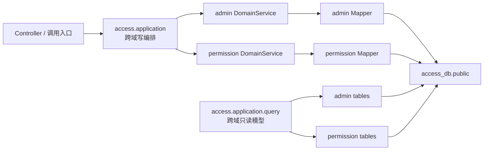

# access-service 目标架构与归并约束

本文定义 `admin-service` 与 `permission-center` 归并为 `access-service` 后的权威目标架构。实施编排见
[`../archive/2026-08-22/access-service-merge-plan.md`](../archive/2026-08-22/access-service-merge-plan.md)（T-ACCESS-001~012 已于 2026-08-22 全部完成归档；后续强化 T-ACCESS-013~015 亦已完成，其计划见 [`../archive/2026-08-27/access-post-merge-plan.md`](../archive/2026-08-27/access-post-merge-plan.md)）。新增和修改不得恢复旧服务边界或内部异步同步链路。

接口字段、权限语义和领域规则仍分别以现有 admin 与 permission 设计文档为准；当服务拓扑、事务边界、数据源、缓存或调用方式与旧文档冲突时，以本文为准。

## 1. 目标与非目标

### 1.1 目标

- 将 `admin-service` 与 `permission-center` 物理归并为一个 Maven 模块、一个 Spring Boot 进程和一个部署单元 `access-service`。
- 当前采用模块化单体，保留管理域与权限域的代码边界；后续根据复杂度和性能数据演进到完全扁平化。
- 使用单一 PostgreSQL 数据库 `access_db` 和单一 `public` schema。
- 将原 admin 到 permission 的异步同步改为单库本地强事务。
- 保持既有 HTTP 路径、请求/响应结构和错误码兼容。
- 支持至少两个 `access-service` 实例并行运行。

### 1.2 非目标

- 不在归并过程中增加新的业务功能或改变权限产品语义。
- 不提供 `admin-service`、`permission-center` 旧部署单元、旧服务名或旧端口的兼容代理。
- 不迁移历史数据；项目尚未部署，数据库从空库创建。
- 本阶段不引入 Flyway、Liquibase 或权限版本号机制。
- 本阶段不把两个领域立即完全扁平化。

## 2. 目标工程与部署单元

| 项目 | 目标值 |
|---|---|
| Maven 模块 | `access-service` |
| Spring 应用名 / Nacos 服务名 | `access-service` |
| 启动类 | `AccessServiceApplication` |
| Java 基线 | Java 21 |
| 建议端口 | `9100` |
| 数据库 | `access_db` |
| schema | `public` |
| Redis logical DB | `0` |

根 Maven 聚合在归并完成后不得继续包含 `admin-service` 或 `permission-center`。Gateway、Docker Compose、Nacos、日志应用名、指标标签和 SDK 目标服务统一使用 `access-service`。

旧 HTTP 路径继续有效，但服务发现不保留 `admin-service`、`permission-center` 别名。

## 3. 模块边界

目标包结构：

```text
cn.ac.fage.accessmesh.access
├── AccessServiceApplication
├── application          # 跨域写编排（User/Org/Menu/UserOrgWrite + RoleProxy/门禁）
│   └── query            # 跨域只读模型（T-ACCESS-006）
├── admin
├── permission
└── infrastructure
```



边界规则：

- `access.application` 是唯一跨域写事务编排层，只调用两个领域的 DomainService 接口。
- `admin` 与 `permission` 禁止相互依赖实现类或 Mapper（跨域 Mapper 直读边界不变）；Service 层同层横向调用允许（2026-08-22 用户确认全局放开，通用约束见 project-rules §8.2：仅限同层、禁循环依赖、复用优先于重实现）。
- 单域用例继续由各自 AppService 调度，不为形式统一搬入 `access.application`。
- 跨域组合读取集中到 `access.application.query`。该包可以使用专用 QueryMapper 批量查询或 JOIN 两域表，但只能返回 Projection/DTO，严禁写 SQL。
- QueryMapper 必须显式带租户条件、正确处理分页，并遵守 N+1 查询禁令。
- 重名 Spring Bean 使用清晰的域前缀类名消除冲突，不依赖模糊的 Bean 覆盖。
- 架构测试应将上述依赖白名单固化。

`access.application.query` 落地形态（T-ACCESS-006）：

- 查询服务（接口 + `impl/` 同包实现，方法标注 `@Transactional(readOnly = true)`）：
  - `UserMenuQueryService`：`/auth/user-menu`、`/user/user-menus`、`/role/my-info` 聚合（sys_menu 树 + 角色/权限码 + 菜单可见性判定）。
  - `UserRoleQueryService`：`/role/list` 功能角色列表、`/user-role/list` 角色列表（POSITION 补所属组织名）。
  - `OrgVisibilityQueryService`：组织可见性过滤（含 ORG_VISIBILITY 缓存，租户级失效由 PermissionChangeAspect 统一执行）。
- 专用 QueryMapper（`query/mapper`，XML 在 `resources/mapper/query/`）：只 SELECT、显式 `tenant_id` 条件、返回 `query/projection` 包 Projection record，不暴露或修改领域实体；权限判定一律经 `PermQueryEngine`/`TypeResolutionService`，不直查权限表判定。
- 数据访问白名单（架构测试固化）：`admin`/`permission` 域互不使用对方 Mapper；`application` 非 query 包（写编排/门禁）不使用两域 Mapper；query 包不依赖两域实体/Mapper；组合查询数据读取只发生在 query 包。（Service 层横向依赖不限白名单，2026-08-22 同层调用全局放开。）

菜单可见性判定（v3.5 §4.1 派生公式）：

- `UserMenuQueryServiceImpl` 不再按「用户菜单 = 角色授权的子集」的 ADMIN_MENU 模型（v3.5 已删除 ADMIN_MENU 资源类型），改为按 v3.5 §4.1 派生：业务菜单（`resource_type` 非空；`resource_code` 为空按不可解析资源 fail-closed，评审 P2-1）→ 用户对该资源有任意有效操作码即可见；纯展示菜单（`resource_type IS NULL`）→ 全员可见；DIR → 存在可见子节点（树构建剪枝）；HIDDEN/EXTERNAL/IFRAME → 派生方式同业务菜单（HIDDEN 不进 `menus[]`）。
- 有效操作码判定经 `PermissionViewAppService.getEffectiveResourceAccess`（评审新增）：复用 `buildEffectiveView` 公共 pipeline 收集两类事实——资源类型 `scopeAll` 全范围授权（`allScopeTypes`）与用户有任意有效操作码的资源实例 ID 集合（`resourceEntityIds`）；菜单资源实例经 `TypeResolutionService.batchResolveResourceIds` 解析后匹配（未解析 fail-closed 不可见）。权限事实查询失败降级为纯展示菜单（登录链路容错）。
- 递归环保护（P2-4）：菜单树构建以 `visited` 集合防脏数据 parent 环/重复（重复祖先导致死循环时停止递归），避免脏数据引发栈溢出。

门禁与限额：

- `/user/user-menus` 查询他人时需 `USER:VIEW@目标用户`，查自己豁免（方案1+2，P1-2；T-ACCESS-018 类型收敛后为 USER）：`AdminUserController.getUserMenus` 在 `req.id() != 当前登录用户` 时经 `AdminPermissionValidator.checkInstanceLevel(USER, id, VIEW)` 门禁。
- 权限码下发门禁下放入口（方案「门禁下放入口」）：`PermissionViewAppService.buildEffectiveView` 公共管线不再设 `USER:VIEW` 门禁；permission 域独立 HTTP 入口 `/effective-permission-codes` 走 `getEffectivePermissionCodesForManage`（自查豁免 + 查他人需 `USER:VIEW`）；query 包内部调用由其入口 Controller 门禁（自查豁免 + `USER:VIEW`，P1-2）兜底；`getEffectivePermissions` 管理员视图保留原 `USER:VIEW`/`ROLE:VIEW` 门禁不动。
- `/role/list` 保持 `LIMIT 0,200` 上限并在 `UserRoleQueryService` Javadoc 声明（P2-3，设计定案「保持 + 文档声明上限」）：功能角色面向前端下拉，超出 200 属配置异常，由组织治理收敛。
- `OrgVisibilityQueryServiceImpl` 缓存读写故障旁路 DB（P2-1）：`CacheService.get/put` 异常时记 `log.warn` 并降级直查 DB，不阻断可见性计算（fail-open 至数据库层，权限判定本身仍经 engine fail-closed）。
- 角色数据走 query 服务（P2-2，设计定案「角色走 query 服务 + 权限保留 AppService」）：`UserRoleQueryService` 经 `UserRoleQueryMapper` 直读 `user_role ⨝ abstract_role`（跨域只读），权限事实（有效权限码/资源访问）保留经 `PermissionViewAppService`。

角色代理退役（T-ACCESS-006，设计定案「角色直接由 permission 管理」）：

- `RoleProxyService`/`RoleProxyServiceImpl`、`OrgVisibilityService`/`OrgVisibilityServiceImpl`（Feign 时代遗留的 admin 接口 + application 实现代理形态）已删除，admin 域直接依赖 `application.query` 查询服务。
- admin 侧角色写代理端点已删除（T-ADMIN-024，无存量调用方直删、无映射 404）：`/role/create`、`/role/grant-menu`、`/role/revoke-menu`、`/user-role/assign`、`/user-role/revoke`；错误码 `10111`（ROLE_API_RETIRED）随端点删除退役、码值不复用（退役登记见 ErrorCodeContractTest）；运行时观察值按入口区分——匿名直连 admin 路径族 401（RequestContextInterceptor）、带身份直连 404、经 Gateway 未注册路径 403（快照 `unregistered-policy=DENY`），无 Handler 映射的注册表证据见 HttpApiPathSnapshotTest。角色与授权管理由 permission 域直接提供（`/api/perm/abstract-role`、`/api/perm/user-role`、`/api/perm/role-resource-permission`）。
- 菜单查询按权威 schema（`display_name`/DIR-MENU 枚举）读取；schema 收敛后 `sys_menu` 无 `component`/`visible`/`perm_code` 等旧列，菜单树构建对缺失字段取默认值（component=null、showLink=true、keepAlive=false、auths=null；EXTERNAL/IFRAME 类型 frameSrc=path；HIDDEN 不进 menus[]）。存量 DDL-实体漂移已由 T-ACCESS-015 收口（2026-08-22）：菜单 CRUD 写路径（实体/Mapper/DTO/`MenuWriteAppServiceImpl`）对齐权威 DDL，BUTTON 类型与 `perm_code` 唯一性退役，唯一性由 `uk_sys_menu_tenant_path`/`uk_sys_menu_tenant_resource` 及错误码 10205/10206 承接，MENU 投影对五值枚举全量维护；对外契约见 admin-service-api-contract §4.6。

## 4. 管理事实与权限投影

### 4.1 所有权

- `sys_user`、`sys_org`、`sys_menu` 等是 AccessMesh 管理事实源。
- `abstract_user`、`abstract_role`、`resource_entity`、`user_role` 等继续承担权限计算事实。
- 管理事实对应的权限记录属于本地权限投影，由 `access-service` 管理；权限管理 API 不得绕过管理事实直接修改这些投影。
- 外部业务服务同步的权限主体与资源继续独立存在，并由外部同步所有权规则约束。

### 4.2 标识与事务

- 管理事实和权限投影保留独立主键，不强制共享数值 ID（本条为统一前口径；本地用户已由 §12.2 定稿取代——`sys_user.id = abstract_user.id` 序列预取共享主体 ID。其余管理事实表如 `sys_org`/`sys_menu` 与投影仍保持独立主键、以稳定外部键关联，不受 §12 影响）。
- 本地投影通过稳定外部键关联，例如本地用户投影的 `external_id = sys_user.id.toString()`。
- 权限投影必须具有明确的来源/所有权标识，AccessMesh 本地投影统一标记为 `access-service` 管理。
- `access.application` 在同一 PostgreSQL 事务内更新管理事实、权限投影和强事务审计；任一步骤失败，全部回滚。
- 内部投影不写 `sync_metadata`。`sync_metadata` 仅保留给外部服务的增量/全量同步。
- **门禁主体（两套 ID 空间 → 已由 §12 终态取代）**：本段为统一前过渡态口径。登录会话 / 签名代理主体持有的操作者 ID 是 admin 域 `sys_user.id`；权限引擎按 `abstract_user.id` 匹配 `user_role.abstract_user_id`；所有 engine 门禁（`hasPermission` / `validateBatch` / `getDeniedIds`）与投影空间自查逻辑，操作者 ID 必须先经 `OperatorSubjectResolver.requireSubjectId(tenantId, operatorId, engine)` 转换为投影主体；转换失败（投影不存在）fail-closed 抛 `SecurityException`。非门禁用途（createdBy 戳记、审计 `ChangeLogContext`、日志消息）保留 `sys_user.id`。**终态（T-ACCESS-016 定稿，T-ORG-001 已实施）**：`sys_user.id = abstract_user.id`（§12.2 唯一 ID 源），操作者 ID 即主体 ID，`OperatorSubjectResolver`/`resolveOperatorSubjectId` 已删除，上述转换与"非门禁用途保留 sys_user.id"的区分整体消失——本段仅为统一前过渡口径的历史记录。

### 4.3 内部同步退役

以下内部 admin→permission 机制全部退役：

- `sys_sync_task` 表及管理 API（Gateway 对外路径 `/admin/sync-task/*`，服务内路径 `/sync-task/*`）。T-ACCESS-005 已将过渡表与内部同步代码一并删除，最终 DDL 不再包含该表。
- 同步任务 builder、handler、scheduler、重试、乱序版本、人工补偿和内部 full-sync 编排。
- access 内部 `PermissionFeignClient` / `SyncTaskFeignClient` 及 `@EnableFeignClients`。
- 为旧同步链路存在的配置、测试和运行手册。

面向外部服务的 `/api/perm/**/sync`、`/full-sync` 契约和 `sync_metadata` 继续保留。外部 sync 不得使用 `sourceService∈{access-service,admin-service}`，也不得写入保留业务键（subject `LOCAL_USER`（原 ADMIN_USER 更名）/ `ORG|POSITION` / `SYS_USER_ORG`；resource 侧已取消类型级保留，本地投影行按 owner=access-service 所有权保护，终态见下方注记）。本地投影只能经 `LocalProjectionDomainService` 写入——调用方为 access.application（用户/组织/菜单编排）与 permission 域管理入口（角色/主体编排，RoleManage/UserManage AppService，T-ACCESS-019），事务由调用方 AppService 声明。

**保留业务键终态（T-ACCESS-016 定稿，收敛后按所有权保护，实施归 T-ACCESS-018）**：

- subject 保留类型（user_type）：`ADMIN_USER`→`LOCAL_USER`（类型解析与保留清单同步更名，无兼容别名）；role 保留类型 `ORG|POSITION` 不变（role_type 未收敛）；`SYS_USER_ORG` 不变。
- **resource 侧取消类型级保留**：收敛后 `USER`/`MENU` 是既有公共基础类型（外部业务服务同步自身菜单/用户资源合法，`ResourceEntitySyncAppServiceTest` 以 MENU 类型为 fixture），若把保留清单换成公共类型会整体拒绝合法外部同步（20045）。本地 `resource_entity` 投影行的保护改为**所有权检查**：外部 sync 的 UPSERT/DISABLE/DELETE 任一 mutation 分支，在进入分支前按 code 命中已有实体（`existing != null`）即统一执行 `owner=access-service` 拒绝（现状三个分支均缺失所有权检查，类型级保留是唯一防线，收敛时必须补齐——DELETE 分支现状直接软删命中实体，移除类型保留后外部服务可删除本地投影）；新建撞本地投影 code 由 `uk_resource_entity (tenant_id, resource_type, code, code_type)` 唯一约束 fail-closed 兜底；资源实体 full-sync 的清理范围按 api-contract §6.2.2 以 `sync_metadata(entityKind=RESOURCE_ENTITY, sourceService, scopeKey)` 界定（`owner_service_code/maintain_source/sync_key` 不是本接口清理依据），本地投影不写 `sync_metadata`（§4.2），天然不在清理集合内。
- 管理入口（`/perm/resource-entity/create|update` 等人工建资源）的类型保留清单为 `{USER, ORG, MENU, ROLE}`（T-ACCESS-019 增补 ROLE）：人工不得绕过管理事实链路（用户/组织/菜单/角色管理）直接建这四类本地业务资源投影——ROLE 资源由角色管理写路径同事务产出（code=roleId，§12.3）；其余类型不受限。

## 5. 数据库与共享表

### 5.1 单库单 schema

- 所有表物理归并到 `access_db.public`。
- 最终 DDL 的唯一权威文件为 `docs/design/schema/access-service.sql`。
- 最终 DDL 必须同时包含 §8.1 所需的任务执行键、唯一约束、租约、状态与幂等持久化结构，不允许运行时临时建表补齐。
- `admin-service.sql` 和 `permission-center.sql` 已随 T-ACCESS-012 物理归档至 `docs/archive/2026-08-22/schema/`，不再作为实现依据。
- 因无部署和历史数据，不提供旧库搬迁、兼容视图或升级脚本。
- 本阶段不引入数据库迁移框架；本地和 CI 必须能够从空 PostgreSQL 完整执行最终 DDL。

### 5.2 表合并边界

| 目标表 | 来源 | 约束 |
|---|---|---|
| `system_config` | `sys_config` + 原 `system_config` | `tenant_id + config_key` 唯一；JSONB 值；键使用 `admin.*`、`permission.*`、`access.*` 命名空间 |
| `operation_log` | `sys_audit_log` + 原 `operation_log` | 字段取超集；`target_id` 使用字符串；模块标识 `ADMIN/PERMISSION/ACCESS`；敏感内容脱敏并限长 |

以下表保持独立：

- `sys_login_log`：认证安全日志。
- `permission_change_log`：权限关系详细变更日志。
- `sys_job_log`：定时任务执行日志。
- 管理事实表与权限计算表：因语义不同不强行合并。
- `sys_dict_*` 与 `type_definition`：分别承担业务字典和权限类型定义，不合并。

**配置键命名空间（T-ACCESS-007 §5.2 落地）**：`system_config.config_key` 的唯一合法前缀为 `admin.`/`permission.`/`access.` 三值。存量种子键已全部迁移至 `admin.*`；`SystemConfigAppServiceImpl.upsertSystemConfig` 在权限校验后、触达数据访问前校验前缀，非法键 fail-closed 抛 `BizException`（`CONFIG_KEY_NAMESPACE_INVALID`），防止无命名空间键扩散。

**`operation_log` 合并列（T-ACCESS-007 落地）**：`target_id` 为 `VARCHAR(256)`（覆盖 `configKey`(128) / `roleExternalId`(256) 等业务键上限），由原数值列字符串化；`module` 三值化 `ADMIN/PERMISSION/ACCESS`（判定见 §8.2）；补充 `(tenant_id, module, created_at DESC)` 排序索引及列注释，操作者索引为 `(tenant_id, operator_id, created_at DESC)`。`sys_audit_log` 的 `user_id`/`username` 列并入 `operator_id`/`operator_name` 承载，不复用。

## 6. 可信请求上下文与安全策略

### 6.1 唯一请求上下文

`access-service` 内只保留一个可信请求上下文 `AccessRequestContext`（infrastructure，T-ACCESS-004 落地），承载四要素：

- `tenantId`（已验证租户 ID）
- `operatorId`（已验证操作者 ID）
- `callerType`（四态：`USER` 平台用户 / `SERVICE` 注册业务服务 / `TASK` 定时任务 / `ANONYMOUS` 公开路径）
- `verifiedServiceCode`（已验证服务编码，仅 SERVICE 调用非 null）

只有统一安全入口 `RequestContextInterceptor` 可以绑定上下文，业务代码只能读取（`AccessRequestContext` 提供便捷 getter 与 `snapshot()/restore()` 快照 API）。原始请求头不能未经验证直接成为租户、操作人或服务身份。`TenantContextHolder` 保留为兼容门面（set/get/clear 委托新上下文，约 60 处存量引用零迁移；T-ACCESS-012 收口时扁平化）。admin 与 permission 共用一套 MyBatis-Flex 租户配置（`MybatisFlexTenantConfig` 的 TenantFactory 从 `TenantContextHolder` 取值；原共用 `TenantIdProvider` 已随 T-ACCESS-009 跨租户批量加载删除）。

请求完成必须在 `afterCompletion` 清理上下文（拦截器统一执行，含异常路径）。异步任务显式传递上下文快照（现有 @Async 均显式传 tenantId 参数，不读 ThreadLocal），定时任务通过显式 set 建立有界作用域（任务执行线程绑定 `RequestContext.task(tenantId)`，T-ACCESS-009），禁止盲目继承 ThreadLocal。

日志 MDC 由同一拦截器注入（`traceId`=X-Request-Id 或 UUID、`userId`、`tenantId`、`serviceCode`，配合 log4j2 JsonLayout properties=true；外部可控值截断 64 字符），afterCompletion 同步清理。

**统一安全链**（`SecurityWebMvcConfig` 唯一 WebMvcConfigurer，T-ACCESS-004 替换原 admin/permission 双链）：

| order | 拦截器 | 覆盖 | 职责 |
|---|---|---|---|
| 1 | `InternalApiSecretInterceptor` | `/api/perm/**` | 内部凭证（X-Internal-Secret）验证，通过写 `INTERNAL_AUTHENTICATED` attribute |
| 2 | `HeaderSignatureInterceptor` | `/api/**`、`/internal/**` | X-User-Id 头恒需验签（内部凭证路径不再无条件信任用户头），通过写 `SIGNATURE_VERIFIED` attribute |
| 3 | `RequestContextInterceptor` | `/**` | 唯一上下文绑定入口：安全策略矩阵决策 + MDC 注入 + afterCompletion 清理；/error ERROR dispatch 放行（防真实错误被 401 掩蔽） |

操作者绑定规则（T-ACCESS-004 落地；T-ACCESS-013 扩展 OAuth2 JWT 资源服务器）：`operatorId` 只在 Sa-Token 会话、签名验证通过或 OAuth2 JWT 验签通过后绑定（JWT 来源：`SaJwtUtil` HS256 + loginType + 超时校验 + `oauth2:blacklist:<jti>` 撤销检查）；内部凭证单独不授予操作者身份（SERVICE 调用 operatorId=null，管理接口权限判定 fail-closed）。服务身份绑定规则：内部凭证验证通过后 `X-Service-Code` 视为凭证持有者声明的服务身份（防无凭证外部伪造）；凭证持有者互冒充为已知限制，T-ACCESS-005/010 服务白名单收敛。**主体 ID 语义（§12 定稿）**：统一后 `operatorId` 承载的即主体 ID（`abstract_user.id` = `sys_user.id`），会话 `loginId` 与审计操作者同源，无需转换。

OAuth2 资源服务器与开放路径清单（T-ACCESS-013 落地，2026-08-22 设计定案）：

- **开放路径白名单配置化**（`access.oauth2.resource-paths`，application.yml 静态配置、全量替换语义）：默认仅 `/auth/oauth2/userinfo`；每条规则 = path（Ant 通配允许）+ `requiredScopes` + `audience` + `clientIds`。未配置路径上 OAuth2 JWT 默认拒绝（落到会话分支 → 401）。启动防护 fail-fast（`OAuth2ResourcePathProperties.afterPropertiesSet`）：① 模式不得覆盖 `/auth/**` 会话端点（userinfo/user-menu/oauth2/authorize——有限端点集逐样本匹配即完备）与 `/api/perm/**` 内部凭证空间（无限路径集合，按静态前缀保守判定：模式第一个通配符（`*`/`?`/URI 模板变量 `{`——AntPathMatcher 段内正则支持 `{name}`/`{name:regex}`）前的静态前缀为空、为 `/api/perm` 的字符前缀、或以 `/api/perm/` 开头即拒绝——`/api/**/sync`、`/api/*`、`/**`、`/api/per?/**`、`/api/{module}/**` 等形态均拦截，防双认证机制冲突；无关节务路径的 `{var}` 模板如 `/example/{id}` 为有效配置不受影响），不得以 `/auth/oauth2/**` 通配放开；② **业务开放路径（非 userinfo 豁免路径）必须声明 `requiredScopes` 与 `audience`**——空值在运行时直接跳过两项授权门禁，属配置遗漏放行面（fail-fast 拒绝启动）。
- **授权链**（`RequestContextInterceptor.authenticateOAuth2Jwt`）：验签 → 必填 claim（loginId/jti/client_id）→ 撤销黑名单（对全部开放路径生效，路径限定不产生绕过）→ 客户端启用动态校验（`OAuth2ClientDomainService.findActiveByClientId` 唯一索引点查，不经缓存保证禁用立即失效；客户端禁用/删除 → 401）→ 路径门禁三重校验（`clientIds` 限定 / `requiredScopes` 令牌 scope 子集校验 / `audience` 令牌 aud 匹配；不满足 → 403 授权不足）→ 绑定委托用户上下文。
- **scope → 权限映射采用独立映射模型**（设计定案，不接入 PermQueryEngine）：scope 保持 OAuth2 标准委托范围语义（签发时空格分隔、授权时校验 ⊆ 客户端注册 scopes），授权判定即"开放路径声明所需 scope、令牌 scope 必须全部包含"；委托主体是客户端而非用户，与平台权限正交互不冲突。
- **audience**（设计定案：客户端注册配置加列）：`sys_oauth2_client.audiences`（逗号分隔资源服务器标识）非空时签发写入 JWT `aud` claim（List 形态）；`/auth/oauth2/userinfo` 默认豁免 audience 校验（旧令牌无 aud 兼容）；其他开放路径**强制** audience 匹配（令牌 aud 缺失或不含路径声明的受众 → 403）。种子客户端 audiences=`access-service`。
- **委托上下文第五要素**：`RequestContext` 增加 `delegatedClientId`（仅 OAuth2 JWT 分支非 null，callerType 维持 USER——operatorId=JWT loginId 委托用户身份）；审计/日志经 `AccessRequestContext.getDelegatedClientId()` 区分第三方委托调用与用户直调。
- **Gateway 透传**（设计定案：同步支持；评审 P1 修复：仅委托 JWT 启用）：`gateway.oauth2.passthrough-paths`（外部路径口径，默认为空 = 无业务路径默认开放）命中**且 Authorization 为 Bearer 三段式 JWT**（形态识别与下游 JWT 分支同口径，不验签——伪造 JWT 透传后下游验签 401）时 `OAuth2PassthroughFilter`（order -79）设 skipAuth=true——跳过会话校验（否则 OAuth2 JWT 被 uuid 会话校验 401）、权限校验与身份头注入/签名，Authorization 头原样透传下游验签。**平台用户 uuid 会话令牌与无 Authorization 头的请求不启用透传**（skipAuth 不设置）：走正常 AuthTokenFilter 会话校验 + PermissionFilter 接口鉴权，平台会话认证路径不变——否则透传路径上 uuid 会话会被下游共享 Redis 会话分支接受，绕过 Gateway 接口权限（评审 P1）。`/auth/**` 已由白名单覆盖（userinfo 无需重复配置）。**双侧路径口径差异部署约束**：Gateway 匹配外部路径（如 `/admin/api/**`），access-service 匹配 StripPrefix 后路径（`/api/**`），开放业务路径需双侧同步配置并人工对应；`InternalSecretFilter` 会向透传请求注入 X-Internal-Secret，因开放路径禁止位于 `/api/perm/**`（启动防护），该头在开放路径无消费者、无冲突。

平台用户会话只保留一套：`/auth/**` 是用户登录与会话签发入口，Gateway 负责校验并向 `access-service` 注入可信身份。Gateway 与 `access-service` 在 Redis logical DB 0 上使用兼容且唯一的 Sa-Token 权威配置（T-ACCESS-003 落实）：`token-name=Authorization`、`token-style=uuid`（uuid 模式无会话密钥概念，会话有效性以共享 Redis 条目为唯一事实，Redis 清空后两端一致失效 fail-closed）、`timeout=7200`（2 小时绝对有效期）、`active-timeout=1800`（30 分钟无操作滑动续期）、`is-concurrent=true`、`is-share=false`、token-prefix 均为 `Bearer`（Gateway 配置，access 签发返回 tokenType=Bearer）；登录类型两侧均为 `StpUtil.login()` 默认 `login`（Sa-Token 无 login-type 配置键，文档口径而非配置项）。`jwt-secret-key` 仅用于 OAuth2 访问令牌签发（HS256，`SaJwtUtil`），不属于平台用户会话密钥。平台用户会话固定为 2 小时绝对有效期和 30 分钟无操作有效期，登录、校验、续期、注销和失效必须端到端一致。Sa-Token 键命名空间只与业务缓存隔离，不得在 Gateway 与 `access-service` 之间相互隔离。两端配置一致性由部署配置约束保障，代码不实现跨进程启动校验（T-ACCESS-003 设计定案：运维部署部分不影响代码逻辑）；`jwt-secret-key` 配置无默认值（`${JWT_SECRET_KEY}`），缺失时 Spring 占位符解析失败导致启动失败。

登录响应 `LoginResp.expiresIn` 的单一权威来源为 `sa-token.timeout`（`SaManager.getConfig().getTimeout()`，即真实会话 TTL），无独立展示键——避免 Nacos 只覆盖一项配置时展示与真实会话漂移（T-ACCESS-003 评审 P2，2026-08-14）。Gateway 配置经 T-ACCESS-003 评审 P1 从 `bootstrap.yml` 迁移至 `application.yml`（Boot 3 标准 ConfigData + `spring.config.import: optional:nacos:gateway.yml`，与 access-service 同模式）；原 bootstrap.yml 在 Boot 3 默认不加载（无 starter-bootstrap），Gateway 的 sa-token/Redis/路由/Nacos 配置实际从未生效，且存在 7 个启动缺陷（WebMvc 组件冲突、Bean 名冲突、spring-webmvc 在 classpath 触发 SCG 异常、路由前缀错误等）已随迁移修复；Gateway 上下文配置测试（`GatewayApplicationConfigTest`）固化为回归保障。

OAuth2 客户端令牌继续使用各客户端注册配置的有效期，不套用平台用户会话的 2 小时/30 分钟口径。`perm-sdk`、外部 `sync/full-sync` 和注册业务服务调用属于服务身份认证，不复用平台用户 Sa-Token 会话，继续按权限 API 契约使用签名或内部服务凭证建立 `callerType=SERVICE` 的可信上下文。

### 6.2 安全策略矩阵

T-ACCESS-004 落地实现（2026-08-14，`SecurityMatrixIT` 固化）：

| 入口 | 调用方要求 | 关键约束 | 实现 |
|---|---|---|---|
| `/auth/**` 公开子集 | 匿名/会话/OAuth2 JWT | 精确拆分：{captcha, login, login/sms, oauth2/token, oauth2/refresh, oauth2/revoke, logout} 匿名放行（logout 保持未登录 200 幂等）；{userinfo, user-menu, oauth2/authorize} 需会话 → USER 分支；{oauth2/userinfo} 需 OAuth2 JWT（验签 + 撤销黑名单 + 客户端启用校验后绑定；revoke 验签后写黑名单防匿名 Redis 键 DoS） | ANONYMOUS / USER 上下文；登录会话键 tenantId + subjectTypeCode |
| OAuth2 开放业务路径（`access.oauth2.resource-paths` 显式配置，默认零开放） | OAuth2 JWT（验签 + 黑名单 + 客户端启用 + scope/audience/clientIds 门禁） | 默认拒绝；启动防护禁覆盖会话端点与 /api/perm/**；userinfo 豁免 audience、业务路径强制 | USER + delegatedClientId 委托上下文 |
| 用户管理接口（`/user/**` 等） | 有效用户会话 | 租户与会话一致；X-Tenant-Id/X-User-Id 头存在必须与会话一致（不一致 403）；未登录显式 401 | 会话权威：operatorId=loginId、tenantId=session 租户 |
| `/api/perm/auth/**` | 已验证 Gateway 或注册业务服务 | 保持现有 SDK 请求头兼容；按服务和操作授权 | 内部凭证 → SERVICE（或签名用户态）；请求体主体非操作者 |
| `/api/perm/**/sync`、`/full-sync` | 已验证服务身份 | `sourceService` 必须等于已验证服务身份（凭证通过后绑定的 X-Service-Code，`SyncAuthVerifier` 从上下文比对） | SERVICE 上下文；不匹配 → SECURITY_DENIED |
| 其他 `/api/perm/**` 管理接口 | 已验证 Gateway + 用户身份，或显式服务白名单 | 内部凭证不隐式获得全量管理权限：纯凭证调用 operatorId=null → 权限判定 fail-closed；X-User-Id 恒需验签才绑定操作者 | USER（验签）/ SERVICE（无操作者） |
| `/internal/**` | 已签名/凭证调用 | 与 /api/** 同签名链；匿名放行后由 RequestContext 显式 401 | HeaderSignature 覆盖 |
| `/actuator/**` | 匿名 | 健康检查匿名放行（不强制 X-Tenant-Id）；暴露面最小化 health,info | ANONYMOUS；不在签名链 |

`access-service` 端口仅在内部网络开放，Gateway 是用户流量唯一入口。本地跨域调用不模拟 HTTP 请求头，但仍使用可信上下文和权限校验器。

## 7. 缓存与多实例一致性

### 7.1 统一缓存框架

- 业务代码只注入唯一 `CacheService`。
- Redis 统一使用 logical DB 0；Sa-Token 使用与业务缓存隔离、但由 Gateway 与 `access-service` 共享的唯一会话键命名空间。
- `access-service` 内缓存目录按领域使用 `admin:*`、`perm:*`、`access:*` 前缀；独立部署的 Gateway 继续使用 `gw:*` 前缀，不并入 `access-service` 的目录命名空间。
- 统一缓存 TTL 类型使用 `java.time.Duration`：`CacheCatalogEntry`、`CacheProperties`、Caffeine 与 Redisson store 均支持秒级精度，YAML 使用 Spring Boot Duration 文法（例如 `15s`、`5m`），禁止业务侧硬编码换算。
- 现有 `l1TtlMinutes`、`l2TtlMinutes`、`l1-expire-minutes`、`l2-ttl-minutes` 在 T-ACCESS-008 中一次性迁移并删除，不保留分钟字段或兼容别名。
- 删除 admin 的 Spring Cache/裸 Caffeine 和 permission 的自定义 RedisTemplate/ObjectMapper 分叉。
- 普通写路径使用事务提交后失效；多实例非授权 L1 通过失效事件及时清理。

### 7.2 授权读取边界

- 数据库业务事实与跨域写入保持强事务一致。
- 第一阶段不引入 `permission_revision`。
- `access-service` 内所有可能影响接口权限快照的授权缓存统一使用 `L2_ONLY`，TTL 均不得超过 10 秒且不创建授权 L1。
- 每次授权 L2 miss 必须在开始数据库读取事务或快照查询前记录单调时钟起点，回填值的绝对过期时刻不得晚于“读取起点 + catalog TTL”；写入时只使用扣除数据库处理时间后的剩余 TTL，剩余 TTL 小于等于零时不得回填。单条、批量、并发合并及重试不得重置该读取起点。
- `CacheService` 与底层 Store SPI 必须支持单次写入的有效 TTL，并同时受 catalog TTL 上限约束；单条与批量写入语义一致。业务代码不得直接操作 Redis/Caffeine，也不得把单次有效 TTL 放大到 catalog 上限之外；非授权普通缓存继续使用 catalog TTL。
- `access-service` 缓存不可用时绕过缓存查询数据库；无法获得可信授权结果时 fail-closed。
- Gateway 本地权限快照使用 `L1_ONLY`，TTL 不得超过 15 秒；删除 `gateway.permission.fail-mode` 配置及 `open`、`stale-allow` 分支，权限回源失败固定 fail-closed，不得绕过授权或使用过期的放行结果。
- Gateway 一次授权请求触发的整个权限快照加载流程必须具有不超过 5 秒的墙钟硬截止时间。计时范围覆盖服务发现与负载均衡、连接、请求发送、`access-service` 处理、响应读取与解码，以及失效竞争触发的重试；连接超时、响应超时等分段限制不能代替该全链路截止时间。超过截止时间不得写入 Gateway 缓存并固定 fail-closed。
- 串行总预算必须满足“上游授权 L2 TTL + Gateway 快照回源全链路截止时间 + Gateway 权限 L1 TTL ≤ 30 秒”；第一阶段固定采用 10 秒 + 5 秒 + 15 秒。配置覆盖值超过任一分项上限时必须启动失败，不在 `InterfaceSnapshotResp` 增加版本号或 `validUntil`。
- 接受广播丢失、提交后缓存删除失败或失效后旧读取完成回填时最长 30 秒的授权读取不一致窗口；正常失效目标为毫秒到亚秒级。
- 后续只有在性能数据证明必须启用授权 L1 时，才评估租户级权限版本屏障。

**落地实现（T-ACCESS-008，2026-08-21）**：

- **快照链路 6 目录**（`perm:effective-roles`、`perm:role-perm-snapshot`、`perm:type-value`、`perm:type-code`、`perm:condition-rules`、`perm:role-mutex-rule`）L2_ONLY + 10s（设计定案①）；`OPERATION_PERMISSIONS_BY_TYPE` 不进快照内容，保持 L1_L2 60m/120m 普通缓存；`ORG_VISIBILITY` 保持 L2_ONLY 60s。`PermCacheBoundaryValidator` 启动强制有效 L2 TTL≤10s（含 YAML 覆盖）。
- **剩余 TTL 回填**：`CacheService.beginRead` 令牌记录单调时钟起点（DB 读取前），`put(token,...)` 只写「读取起点 + catalog 有效 TTL」剩余 TTL、≤0 不写、批量/重试不重置；`put(..., Duration)` 单次有效 TTL 强制 cap catalog TTL。L1 层（Caffeine 固定过期）仅当 catalog L1 TTL 在预算内才写，否则跳过。
- **普通 L1 跨实例失效**：L1_L2 目录 evict/evictAll 时经 RTopic `accessmesh:cache:l1-invalidate` 广播，各实例订阅清本地 L1；失败计 `cache.invalidate.failures` 指标，L1 TTL 兜底；回滚不失效。
- **Gateway**：快照缓存迁统一 CacheService（L1_ONLY `gw:interface-snapshot` 15s/50000，`accessmesh.cache.catalogs` 运维覆盖）；失效粒度用户级精确（跟踪索引 + 在途回源注册表候选；索引缺失由快照 TTL 兜底）+ 租户级兜底（设计定案③）；失效先递增代际再清缓存（防旧回源复活窗口）；固定 fail-closed（fail-mode/open/stale-allow 删除）；`snapshot-load-deadline` 5s 全链路墙钟硬截止（重试共享截止、超时不写缓存 503）；`GatewayCacheBoundaryValidator` 启动强制 L1≤15s、截止≤5s。

## 8. 任务、异步与审计

### 8.1 多实例任务协调

- 同一计划触发使用稳定的数据库执行键（例如 `jobId + scheduledTime`）和唯一约束。
- 通过 `lease_owner`、`lease_until`、状态和原子抢占保证同一时刻最多一个活动执行者。
- 长任务续租，实例故障后允许其他实例接管。
- 任务处理必须幂等；外部副作用携带执行键。
- 语义为“最多一个并发执行者 + 失败后至少一次重试”，不承诺端到端 exactly-once。
- Redis 不承担任务正确性。
- 仅为旧内部同步兜底的维护任务随同步子系统一起删除；外部同步仍需要的维护任务才保留。

**落地实现（T-ACCESS-009，2026-08-21，7 项设计定案）**：

- **执行键**：`job:{jobId}:{yyyyMMdd'T'HHmmss}`（计划触发时刻秒级截断）；手动触发为 `job:{jobId}:manual:{epochMilli}-{UUID}`（独立执行，不与计划执行竞争，UUID 防同毫秒并发触发碰撞）。`JobServiceImpl` 通过 `ExecutionKeyCronTrigger` 在 Trigger 计算时捕获本轮触发时刻传入执行编排。cron 按 JVM 时区计算，JVM 默认时区由 common `UtcTimezoneEnvironmentPostProcessor` 启动即强制 UTC（§16，2026-08-25 起），**各实例天然同时区（项目约定，不做跨时区支持）**。多实例继续各自触发 Spring Scheduler；正确性全部由 `sys_task_execution` 的原子条件 SQL 承担（`SysTaskExecutionMapper.xml`：`tryClaimExecution` INSERT ... ON CONFLICT（部分唯一索引推断）+ 条件 DO UPDATE ... RETURNING，租约判定/续租/完成全部以数据库 `now()` 为基准），Redis 不参与。
- **attempt 级 fencing**：`attempt_count` 同时是 fencing token——每次抢占原子递增并由 RETURNING 返回本次尝试号；续租与完成写回按「`lease_owner` + `attempt_count`」双条件判定。同实例接管自己的过期任务（owner 不变、attempt 递增）时旧尝试不能续租或覆盖新尝试的结果。
- **租约生命周期**：抢占（PENDING/FAILED 或租约过期才允许，且 `attempt_count < MAX_ATTEMPTS=3`）→ **抢占成功后立即启动后台续租（每 20s，租约 60s）——覆盖执行器排队等待期，排队超过租约期不会被误接管；执行线程出队后再做一次租约校验，丢失则跳过执行** → 条件完成/失败；SUCCESS 后不可再抢占。业务失败写回 FAILED 后由扫描器按「失败后至少一次重试」语义接管重试（同一执行键，attempt+1），超限后收敛终态。执行编排位于调度层 `JobServiceImpl`（DomainService 不承担线程池/调度编排，也不横向注入其他 DomainService）。**计划触发时重读数据库任务行**：已删除/已停用任务跳过执行、新 invokeTarget 即时生效；接管重试的计划时刻由执行键反解（`parseScheduledTime`，手动键为 null），不随尝试漂移。
- **多实例配置对账（设计定案：周期对账 + 触发时重读）**：任务 CRUD 只操作当前实例内存调度表；各实例经 `JobScheduleReconciler`（60s 周期）跨租户**单条批量查询**（`selectAllEnabledJobs`，§8.4.8 禁止按租户循环查询——启动加载同步迁移）重载启用任务并 diff 重调度。对账为**真 diff**——按已调度任务的 cron 快照跳过未变化项，不做每轮全量取消/重建；Trigger 先构造成功再取消旧调度，cron 非法时保留旧调度。**批量加载失败 = 全部状态未知**，本轮不做任何调度变更（含删除判定）——错过的计划触发不产生执行记录，接管无法补偿，临时数据库异常不得被解释成全部停用。配置漂移窗口约为对账间隔 60s + 单轮对账耗时；窗口内旧 cron 可能多触发一次（独立执行键、走完整租约/幂等治理），不引入实时广播（MQ）避免过度设计。
- **故障接管与失败重试**：`TaskLeaseTakeoverScheduler`（每实例 30s 周期，access-service 内保留的系统维护调度任务之一）先收敛超过 MAX_ATTEMPTS 的过期执行为 FAILED，再对可重试执行（RUNNING 租约过期 / FAILED 未超限）经 `JobService.takeoverExpiredExecutions()` 原子接管重试。**任务已删除/已停用或执行键无法解析的候选立即收敛（`abandonExecution` 按候选快照 fencing——status + attempt 匹配且不碰 SUCCESS、RUNNING 候选要求租约仍过期——读取后被其他实例抢占/完成的行不受影响；attempt 拉满后退出重试候选），防止僵尸记录每轮占据接管批次（ORDER BY updated_at LIMIT 20）导致有效重试饥饿**。扫描器自身多实例并发由 PostgreSQL 会话级 advisory lock（`pg_try_advisory_lock`，单连接内加锁/解锁，抢锁失败跳过本轮）协调（设计定案）——任务卡「数据库执行键竞争同一次计划执行」由被接管的任务执行本身承载，advisory lock 仅为扫描效率优化；锁不可用（非 PostgreSQL）时所有实例都扫描，正确性不受影响。
- **invokeTarget 真实执行（ARCH-DEBT-001 关闭）**：`JobInvokeDomainService` 反射调用 `beanName.methodName`。安全边界为 `@JobInvocable` 注解白名单（infrastructure.task，设计定案）——未标注的方法一律拒绝，防止任务配置指向任意 Bean 方法；**唯一受支持签名为单一 `TaskExecutionContext` 参数（设计定案：必须接收上下文——幂等键必有传递通道，无参签名拒绝）**（record：tenantId/jobId/executionKey/attemptCount/scheduledTime），**executionKey 即外部副作用幂等键**（手动键为 `job:{id}:manual:{epochMilli}-{UUID}`，UUID 防同毫秒并发触发碰撞），副作用方按键去重实现 at-least-once 不重复业务结果。业务异常去包装后原样传播。**代理兼容**：白名单注解与签名在 `AopProxyUtils.ultimateTargetClass` 目标类上解析（CGLIB 代理类生成的方法不携带目标方法注解，事务化任务 Bean 不能因此被误判未授权），调用经 `ClassUtils.getMostSpecificMethod` + `BridgeMethodResolver` 换回代理对象上可反射调用的方法，保留 `@Transactional` 等代理语义。
- **异步执行治理（设计定案：专用执行器）**：任务业务执行走 `accessTaskExecutor`（有界、命名前缀 `access-task-`，容量唯一来源 `application.yml access.task.executor.*`），与审计异步 `accessAsyncExecutor` 容量隔离。**拒绝语义：拒绝处理器记告警后必须抛 `RejectedExecutionException`（ThreadPoolTaskExecutor 转 `TaskRejectedException` 通知提交方），提交方停续租并写回 FAILED**——只记日志不抛会使已启动的续租永远续下去、任务永久 RUNNING 无法接管；未超限时由接管扫描按至少一次语义重试。执行线程显式绑定 `RequestContext.task(tenantId)` TASK 可信上下文 + TenantContextHolder，finally 清理，不继承调度/请求线程 ThreadLocal。**续租专用调度器**：`taskLeaseRenewalScheduler`（单线程、`removeOnCancelPolicy`）与共享调度器隔离——续租是正确性路径，共享调度器上的对账/接管扫描会同步做数据库 IO，阻塞超过租约窗口会停摆续租、误触发接管，破坏「最多一个活动执行者」。**声明任何 TaskScheduler Bean 都会使 Boot 的 TaskSchedulingAutoConfiguration 退让（@ConditionalOnMissingBean）**——只声明续租调度器会让全容器只剩一个单线程调度器（隔离失效且 `spring.task.scheduling.pool.size` 不生效），因此显式声明共享 `taskScheduler`（Bean 名保持 `taskScheduler` 供 @Scheduled 按名解析，池大小跟随 `spring.task.scheduling.pool.size`，设 2）；拓扑由 `TaskExecutorConfigTest` 经 ApplicationContextRunner 固化（两 Bean 互异、池大小正确）。
- **收敛删除**：无使用者的 `TenantAwareScheduled` 注解（common）与 `TenantScheduledAspect` 切面（admin/config）随本任务删除——静态任务的租户调度未来经 `sys_task_execution` 统一治理后再引入；按租户循环查询改为跨租户批量后，`TenantIdProvider` 接口（common）与 `AdminTenantIdProvider`（唯一消费者消失）一并删除。内部同步兜底维护任务已随 T-ACCESS-005 删除；gateway 的 `cleanupOrphanedMarkers`（60s）保持每实例本地执行——清理的是本实例内存中的孤立失效标记，属本地缓存治理（T-ACCESS-008），加数据库租约反而错误。
- **测试**：`TaskExecutionLeaseConcurrencyTest`（PostgreSQL Testcontainers，双实例以不同 lease_owner + 并发线程模拟；建表在 `@BeforeAll`——先于 Spring 上下文创建，因 `JobServiceImpl @PostConstruct` 会查 `sys_job`）覆盖并发抢占唯一赢家、续租仅持有者且仅当前尝试号、**同实例接管自己的过期任务被 attempt fencing 挡住**、过期接管 + 旧持有者不可覆盖、SUCCESS 不可重抢占、抢占超限阻断、FAILED 至少一次重试、**僵尸执行收敛（任务删除后 attempt 拉满不再候选）与 abandon 对并发抢占/SUCCESS 行的 fencing**、编排级幂等（同一执行键多触发只执行一次）与接管重试携带同一幂等键；单元测试覆盖拒绝与调度器拓扑（`TaskExecutorConfigTest`：拒绝转 TaskRejectedException、ApplicationContextRunner 验证共享/续租两调度器 Bean 互异且池大小正确）、对账编排（`JobServiceImplTest`：拒绝时停续租写 FAILED / 停用删除跳过 / 对账 diff 不重建 / **cron 变更替换调度** / 停用取消 / **批量加载失败保持现有调度**）、CGLIB 代理白名单解析（`JobInvokeDomainServiceTest`）、执行键构建与反解（`TaskExecutionDomainServiceImplTest`）。

### 8.2 审计事务分级

- `permission_change_log` 与权限事实变更位于同一事务，日志失败则权限变更回滚。
- `operation_log`、`sys_login_log`、`sys_job_log` 使用独立短事务，写入失败不回滚已成功的主业务，但必须产生错误日志和监控指标。
- 异步日志使用有界线程池；队列满时不得静默丢弃，应降级同步写入或明确告警。
- 缓存失效继续在主事务提交后执行，不与审计事务混合。

**落地实现（T-ACCESS-007）**：

- **module 三值化判定（按事务边界）**：`ACCESS` = `application` 包 Write 服务在单事务内同时写管理事实与权限投影（跨域编排，如用户创建连带权限投影）；`PERMISSION` = permission 域本体写（角色/资源/服务/条件/类型等）；`ADMIN` = 纯管理事实写（字典/配置/任务/通知/文件/机构等）。事件码统一大写 `{业务对象}_{动作}`（如 `USER_PASSWORD_RESET`、`SYSTEM_CONFIG_UPSERT`）。
- **唯一入口**：入口级操作日志统一由 `@OperationLog` AOP 切面记录（必填 `module`/`action`/`targetType`/`targetId`/`summary` 五属性；`targetType` 小写物理表名，批量操作用对应业务表名（如 `abstract_role`）且 `targetId=""`；逻辑对象码例外显式登记——`oauth2_token` 以 JWT（jti）+ Redis 黑名单存储、无物理表，`OAUTH2_TOKEN_REVOKE` 用该码标识；`summary` 必须为合法 SpEL，纯文本用单引号包裹）。**覆盖范围**：permission 域 4 个 `*SyncAppServiceImpl`（AbstractRole/AbstractUser/ResourceEntity/UserRole）的 sync/fullSync 共 8 个写入口同样标注——module=PERMISSION（SYNC 边界）、action 大写事件码（如 `ABSTRACT_ROLE_SYNC`）、单条 sync targetId 用业务键（roleExternalId/subjectExternalId/resourceCode）、fullSync 留空、summary 记 `from {sourceService}`。**覆盖不再测试强制（T-ACCESS-025 收敛）**：原「public `@Transactional` 非 readOnly 方法必须标注」的包扫描强制断言与豁免登记机制（`EXEMPT_WRITE_METHODS`）已删除——写方法是否标注由写入口通用清单（project-rules §写入口通用清单）规范指导，存量注解不强制新增；`AppServiceOperationLogCoverageTest` 保留全域**已标注方法契约校验**（module 三值化/action 大写事件码/targetType ∈ 物理表名白名单（access-service.sql 33 表）∪ 登记例外/summary 与 targetId 合法 SpEL），不再阻断未标注方法。注解类位于 `infrastructure.aop`（跨域通用能力；admin/application 写服务同样标注，若置于 permission 包会使 admin 依赖 permission 违反架构边界），切面 `OperationLogAspect` 留在 `permission.aop`，运行时上下文 `OperationLogRuntimeContext` 与注解同置 `infrastructure.aop`（admin 需在其服务内登记运行时 override，放 permission 包会使 admin 依赖 permission）。**切面定序**：`OperationLogAspect` 设 `@Order(Ordered.LOWEST_PRECEDENCE - 1)` 位于事务切面（默认 LOWEST_PRECEDENCE）外层——主事务提交成功后才记录，回滚时 `proceed()` 抛异常走 finally 不记录，避免残留 responseCode=200 的虚假日志。**operatorName 会话回填**：`AuthServiceImpl` 登录成功写 `operatorName` 到 Sa-Token 会话，切面读取回填；无会话调用（SERVICE/TASK/ANONYMOUS）为 null。**审计口径**：`NoticeServiceImpl.markNoticeAsRead`（用户自操作高频低价值已读标记，写 `sys_user_notice` 状态位）不标注 `@OperationLog`，已读事件经 `read_at` 列追踪。原 `@AuditLog` 切面及 `AuditLogController`（`/audit-log/**`，前端零引用）随收敛删除。内部动态日志（diff 快照、冲突通知）仍由 `AuditDomainService` 显式调用。
- **独立短事务**：`operation_log` 经 `AuditDomainService.asyncRecordLog` 异步写入（`@Async` 线程池 + `REQUIRES_NEW`）；`sys_login_log`、`sys_job_log` 经 `LoginLogDomainService`/`JobLogDomainService` 同步写入但 `REQUIRES_NEW`（登录/任务日志同步落库，主流程回滚不影响日志）。**登录日志完整回填**：`recordLoginLog` 收 `LoginLogEntry` record（tenantId/userId/username/loginType/clientId/ipAddress/userAgent/status/failReason）；IP/UA/请求 ID 由 `infrastructure.util.HttpRequestUtils` 从请求上下文集中提取（`X-Forwarded-For` 取代理链首地址，对齐 VARCHAR(64)/512 限长），`OperationLogAspect` 复用同源消除重复；SMS 成功/命中用户分支 username 回填实际用户名；loginType 大写 `PASSWORD`/`SMS`/`OAUTH2` 对齐 DDL 列注释。**调用方兜底**：方法体不吞异常——REQUIRES_NEW 异常（含 Spring 代理层 commit 阶段的连接中断/rollback-only）自然传播，由 `AuthServiceImpl.safeRecordLoginLog` / `JobServiceImpl.executeJob` finally 统一 try-catch 兜底，日志失败仅告警不阻断。
- **参数不入库（T-ACCESS-025 收敛）**：`OperationLogAspect` 默认不再序列化方法参数/请求体——`operation_log` 只保留租户、操作者、动作、目标（targetType/targetId）、结果摘要（summary）、耗时与请求上下文（requestId/ip/requestUrl）；`request_body` 列停用恒 NULL，`OperationLogEntry` 不再承载该字段。操作日志记动作与目标、不记载荷；载荷级审计由 `permission_change_log` 等专用强事务日志承载（同节上方分级口径）。高风险操作摘要复用现有机制：`@OperationLog.summary` SpEL 属性与 `OperationLogRuntimeContext.setSummary()` 运行时覆盖，只记录对象 ID、动作、结果——密码、OAuth2 客户端密钥等凭证即使脱敏也不进入摘要；不新增摘要 Provider、策略接口、白名单注册表或注解属性。原「按调用作用域登记精确敏感字段」机制（`OperationLogRuntimeContext.markSensitiveField`，OAuth2 授权码 `code`、密钥类 `configValue` 场景）随序列化删除一并移除。`SensitiveDataUtils`（infrastructure/util）冻结保留现状——不再有审计链路生产调用方，不扩展脱敏字典与递归规则（类 Javadoc 标注冻结口径）。**请求头限长**：`request_id`/`ip_address` 对齐 VARCHAR(64) 截断，`X-Forwarded-For` 取代理链第一个地址。**匿名安全写租户解析**：`OperationLogAspect.resolveTenantId` 解析顺序为 ① `OperationLogRuntimeContext.setTenantId`（方法体内显式登记，覆盖匿名认证派生端点——OAuth2 token/refresh/revoke 从授权码/刷新令牌/JWT 载荷解析租户后登记）；② 方法参数 `tenantId`（匿名上下文经方法参数携带租户的写入口；历史示例 lockUser 已随 T-ADMIN-022 临时锁定不落库删除，解析能力保留）；③ `TenantContextHolder`。三者皆空的纯匿名端点该条操作日志跳过并告警（不写 `tenant_id=null` 违反 NOT NULL）。OAuth2 签发/刷新/撤销均经 runtime override 正常落 `@OperationLog`（OAUTH2_TOKEN_ISSUE / _REFRESH / _REVOKE）；登录（成功及失败）由 `sys_login_log`（loginType=OAUTH2）承载，失败尝试在租户可解析时写 status=0、不可解析时跳过并告警。
- **有界线程池降级**：`AsyncConfig` 线程池容量参数唯一来源 `application.yml spring.task.execution.pool`（运维可调，代码不设硬编码容量）；executor 注册为 `@Bean("accessAsyncExecutor")` 由容器管理初始化/销毁生命周期，`getAsyncExecutor()` 返回同一实例。拒绝处理器等价 JDK `CallerRunsPolicy`：线程池已关闭（应用停机）时丢弃不再执行，否则调用者线程同步执行 + 告警日志（不丢失）。监控以错误/告警日志呈现，不引入 Micrometer。

**落地实现（T-ACCESS-014，2026-08-22；强制覆盖断言已随 T-ACCESS-025 删除）**：

- **强制覆盖已收敛（T-ACCESS-025）**：原 admin/application 域与 permission 域同口径的「public `@Transactional` 非 readOnly 写方法必须标注 `@OperationLog`（或登记豁免）」包扫描强制断言（含 `EXEMPT_WRITE_METHODS` 豁免清单与失配校验、类数下限防漂移）已随操作日志收敛删除——存量标注不强制新增，仅保持已标注语义（三域已标注方法契约校验继续生效）。写方法是否标注由写入口通用清单（project-rules §写入口通用清单）规范指导。历史豁免项 `NoticeServiceImpl#markNoticeAsRead` 的口径见上方「审计口径」。
- **无事务方法不强制（按事务边界判定，防双重记录）**：`MenuServiceImpl`/`OrgServiceImpl`/`UserOrgServiceImpl` 的 Controller 直连写方法为委托门面（无 `@Transactional`），审计由事务边界的 `*WriteAppServiceImpl` 承载，门面重复标注会产生双重 `operation_log`；`AuthServiceImpl` login/smsLogin/logout 会话操作由 `sys_login_log` 承载（§8.2 登录日志口径）；`application.query.impl` 三个查询服务全部 `readOnly=true` 无写方法；`OAuth2ServiceImpl`/`JobServiceImpl` 已标注但非事务的方法（token/refresh/revoke、trigger）继续由全域已标注方法契约校验覆盖。实施核验：三包既有写方法已全部标注或按审计口径不标注（`markNoticeAsRead`），无补标、无主代码变更。

## 9. API、SDK 与生态切换

- 除 §4.3 明确退役的内部同步管理接口外，保持现有 POST + JSON Body、HTTP 路径、DTO、统一响应体和错误码分段；`/admin/sync-task/*` 不属于兼容范围。
- 错误码继续按业务域归属：管理域保留并新增于 `1xxxx`，权限域保留并新增于 `2xxxx`；`access.application` 的跨域编排错误按对外入口所属领域取码，与领域无关的公共技术失败使用 `9xxxx`。不得为 `access-service` 新增 `4xxxx` 段，也不得因归并重编号既有错误码。
- `/admin/**`、`/perm/**`、`/auth/**` 的 Gateway 目标统一为 `lb://access-service`。
- `perm-sdk` 继续作为外部客户端，Feign 目标从 `permission-center` 改为 `access-service`。
- access 内部代码禁止通过 `perm-sdk` 或 Feign 调用自身。
- `serviceCode`、服务配置、资源映射、owner code、缓存失效载荷、日志和指标中原本代表两个旧服务的值立即统一为 `access-service`；不保留历史别名。
- 外部业务服务自己的 `sourceService` 仍使用其已验证服务身份，不统一改成 `access-service`。

**落地实现（T-ACCESS-010，2026-08-22，4 项设计定案）**：

- **Gateway 路由合并（设计定案①）**：`/admin/**` 与 `/perm/**` 合并为一条路由 `id=access-service`（`lb://access-service`、`StripPrefix=1`、`metadata.serviceCode=access-service`），`/auth/**` 独立路由同目标（`StripPrefix=0`）；`gateway.permission.service-url` 默认值切换为 `lb://access-service`（`GatewayProperties` 与 YAML 同步）。路由契约由 `GatewayApplicationConfigTest` 固化：3 条路由（access-service/example-service/auth-routes）、合并路由的 Path/StripPrefix/serviceCode、以及旧服务名不得出现在路由 id 或发现目标（负向断言）。
- **perm-sdk（设计定案②③）**：`PermissionFeignClient` 的 `@FeignClient` name 切换为 `access-service`，18 个 `@PostMapping` 路径契约由新增 `PermissionFeignClientContractTest` 封闭清单固化（含 POST + 单一 `@RequestBody` 形态断言），证明切换不产生契约漂移。`SyncTaskFeignClient`（admin-service S5 内部同步调度器定制、Map 请求体、仓库内无使用者）删除；其封装的 8 个 sync/full-sync 端点对外部服务继续由服务端保留，外部服务按需经 `PermissionFeignClient` 或自行调用。`FeignInternalSyncInterceptor` 的 `perm.service-code` 去除默认值 `admin-service`（设计定案③）：配置了 `perm.internal-secret` 但未显式声明 `perm.service-code` 时 Spring 占位符解析失败启动失败（fail-fast，与 `jwt-secret-key` 同模式），防止调用方冒充已退役服务身份。
- **旧名清理（设计定案④全量清理）**：主代码/测试的 Javadoc 与日志文本、Micrometer 指标 description（`gateway.perm.unreachable` 等 3 项）、测试 serviceCode 数据（统一中性值 `example-service`）、前端 mock/src 注释与 `serviceCode` mock 值（注册服务列表两条旧服务记录合并为一条 `access-service`）全部更新；`GatewayApplication` 侧无 `@LoadBalanced RestTemplate` 残留（无使用者的 `RestTemplateConfig` 已删除）。权威 DDL `access-service.sql` 表注释中"admin-service 事实源"更新为"access-service admin 域事实源"。**保留项**：`LocalProjectionOwner.LEGACY_ADMIN_SOURCE="admin-service"`（安全拒绝列表值，外部 sync 冒充旧来源仍被拒绝，含 `LocalProjectionGuardTest`/`AbstractUserSyncAppServiceTest.shouldRejectInternalSourceService` 负向断言）；`docs/design/services/admin-service-api-contract.md` 等真实文档路径引用（T-ACCESS-012 重基线处理）；归并历史陈述（如 `AccessServiceApplication` Javadoc）。
- **部署单元**：根 Maven 聚合自 T-ACCESS-001 起即不含旧模块，本任务核验无旧启动类/运行配置/源码目录/docker-compose 残留（仓库无容器编排文件，AGENTS.md 基础设施命令示例不涉及服务名）；`common/GlobalErrorCode` 错误码分段注释更新为管理域/权限域措辞，分段值不变。

## 10. 验收门禁

归并至少通过以下门禁：

- Java 21 全量构建、单元测试和 Spring Context 启动通过，无 Bean 名冲突。
- 空 PostgreSQL 可一次执行最终 DDL，表、索引、约束和种子数据正确。
- 除退役的 `/admin/sync-task/*` 外，原 admin 与 permission HTTP 契约回归通过；退役接口必须无法路由或返回明确的不存在响应，且不得残留 Controller 映射。
- 错误码扫描测试证明既有管理域 `1xxxx`、权限域 `2xxxx` 码值保持兼容，`9xxxx` 只由公共错误定义，跨枚举无重复码，且不存在新增 `4xxxx` 业务错误码。
- 故障注入证明管理事实、权限投影与强事务审计能够整体回滚。
- 安全测试覆盖租户串扰、伪造请求头、服务身份冒充和同步所有权。
- 两个 `access-service` 实例共享 PostgreSQL/Redis 时，授权失效满足 30 秒上限，普通 L1 能跨节点失效。
- 缓存故障测试覆盖上游授权 L2 接近 10 秒过期时、Gateway 快照回源被注入接近 5 秒的全链路延迟后再回填 15 秒 L1 的边界，证明最坏陈旧窗口仍不超过 30 秒；回源超过 5 秒时必须验证不写缓存并返回 503。
- 陈旧回填并发测试用闩锁制造“旧授权读取开始 → 权限事务提交并失效 → 旧读取完成并尝试回填”，验证回填仅获得从读取起点计算的剩余 TTL，预算耗尽时不写缓存，且批量与重试不能重新获得完整 TTL。
- Gateway 权限回源不可达时固定返回 503；代码与配置中不存在 `open`、`stale-allow` 或可切换的 `gateway.permission.fail-mode`。
- 多实例任务不存在同一执行键的并发执行，故障接管和幂等重试通过。
- 架构测试证明跨域依赖只出现在允许的 application/query 边界。
- 非归档代码、配置和有效设计中不存在可运行的旧服务、旧数据库或内部同步链路残留。

## 11. 演进方向（非本阶段约束）

完成模块化单体并获得运行数据后，可以按独立任务评估：

- 将重复的领域模型进一步扁平化。
- 在授权读取需要 L1 时引入租户级权限版本屏障。
- 首次正式部署前引入数据库版本管理工具，并以 `access-service.sql` 作为 V1 基线。
- 根据查询与变更热点细化缓存、权限版本和任务分片粒度。
- 时间类型全面改 `OffsetDateTime`/`Instant` 携带时区（97 个 TIMESTAMPTZ 列 + 全部实体/DTO 改型）：T-ACCESS-024 以「`LocalDateTime` 全链路 UTC 墙钟」止血档（§16）闭合正确性风险，改型属改动量与收益不匹配的可选演进，多时区部署需求出现前不启动。

## 12. 主体身份模型（B-lite 终态，T-ACCESS-016 定稿）

> 本章是主体身份的唯一权威（2026-08-23 定稿，T-ORG-001 已落地实施）。§4.2「门禁主体（两套 ID 空间）」描述的 `sys_user.id → abstract_user.id` 转换要求由本章取代：统一后操作者 ID 即主体 ID，不再需要任何运行时转换（原 `OperatorSubjectResolver` 与引擎 `resolveOperatorSubjectId` 已删除清零）；引擎门禁 API 形态归 T-PERM-042（见 permission-center implementation §3.1）。

### 12.1 终态规则

- `abstract_user.id` 是**唯一主体 ID**（"谁"）。本地用户 `sys_user.id = abstract_user.id`（数值一致，同一 Long）；外部同步主体仅有 `abstract_user` 行，业务键 `external_id` 同步链路不变（§4.2）。
- 统一承载主体 ID 的位置（对外形态不变，仍为同一 Long）：Sa-Token 会话 `loginId`、`AccessRequestContext.operatorId` / `OperatorContext`、审计戳记 `createdBy/updatedBy/deletedBy`（含 `operation_log.operator_id`、`sys_login_log.user_id` 等）、`user_role.abstract_user_id`、`perm:effective-roles` 等主体键缓存的标识符。
- `OperatorSubjectResolver` 与 `PermQueryEngine.resolveOperatorSubjectId` 已随 T-ORG-001 **删除**（原约 80 处调用分布于 18 个生产文件，含 Javadoc 全量清零）。统一后引擎门禁的操作者参数就是主体 ID，禁止再出现任何 ID 空间转换层。
- 统一后保留的两个 ID 属不同概念，不视为重复设计：主体 ID（`abstract_user.id`/`sys_user.id`，"谁"）与 `resource_entity.id`（"哪条授权资源记录"）。二者的边界与业务编码语义见 §12.3。
- 缓存框架与 catalog 零修改：主体键缓存（`perm:effective-roles` 等）本以 `abstract_user.id` 为标识符，统一后数值与键格式均不变；不做 evictAll 迁移或兼容键，空库重建 runbook 含清理开发/验收 Redis 实例（T-ORG-001）。

### 12.2 ID 分配机制（abstract_user 唯一 ID 源）

采用 **`abstract_user.id` 作为唯一 ID 生成源**，不新建序列：

- `abstract_user.id` 保持 `BIGSERIAL` 自增不变。
- `sys_user.id` 由 `BIGSERIAL` 改为普通 `BIGINT PRIMARY KEY` 列（去自增，T-ORG-001 已落地权威 DDL），插入时显式赋值；实体侧 `SysUser @Id(keyType=None)` 与 `AbstractUserMapper.insertWithExplicitId` 使显式 id 随 INSERT 落库（Flex `KeyType.Auto` 会忽略已设置的 id）。
- 本地用户创建在同一事务内按**序列预取**闭环执行（`abstract_user.external_id NOT NULL` 且终态要求其等于主体 ID，不能先插行再回填）：
  1. `SELECT nextval(pg_get_serial_sequence('abstract_user','id'))` 预取主体 ID `N`；
  2. 显式 `INSERT abstract_user(id = N, external_id = N.toString(), user_type = LOCAL_USER, ...)`（serial 列显式插值合法，`GENERATED BY DEFAULT` 语义）；
  3. `INSERT sys_user(id = N, ...)`。
- 外部主体仅插 `abstract_user`（自增取号，`external_id` 为外部业务键），与本地用户共用同一生成源，天然不碰撞——"先创建外部主体、再创建本地用户"（T-ORG-001 验收口径）与反向顺序均不会碰撞。
- **取舍说明**：备选方案是"用户主体专用共享序列"（新建独立 sequence，两表均显式 `nextval` 取号，插入顺序自由）。不采用的原因：多一个表外序列对象成为第三个"影子权威"，两表都要改显式取号，而其唯一收益（插入顺序自由）在单库强事务编排层（§4.2 `access.application` 同事务写链）下没有实际调用方需要。预取既有序列的代价——两表插入共用同一次取号——已由 T-ORG-001 在用户创建写链路落实：`LocalProjectionDomainService.createLocalUserSubject`（预取 + `abstract_user(id=N, external_id=N)` + USER 资源投影）先行，`UserWriteAppServiceImpl.createUser` 以同一 N 显式插 `sys_user(id=N)`，`external_id` = 主体 ID 的投影语义不变；投影缺失补建分支维持自增取号（统一后正常链路不可达，2026-08-23 设计定案）。
- 不做在线数据迁移（未上线、空库重建模式）；不引入全局对象 ID 中心、全平台共享序列或 ID 包装类型双轨。

### 12.3 业务编码语义与 `resource_entity.id` 边界

- `resource_entity(USER).code` = 主体 ID 字符串化（`subjectId.toString()`）；`resource_entity(ROLE).code` = roleId 字符串化（`abstract_role.id.toString()`）。二者是实例级授权的业务编码（`resourceCode`），由 USER/ROLE 全写路径同事务投影维护（T-ACCESS-019 已落地 2026-08-23：admin 域 `UserWriteAppService`（既有）与 permission 域 `RoleManageAppService`/`UserManageAppService` 的 create/update/move/remove/启停全量经 `LocalProjectionDomainService` 维护投影；ROLE 投影 `parent_id` 镜像角色树且父投影缺失 fail-closed 回滚；`abstract-user/update` 门禁升实例级 `USER:MANAGE@subjectId`。范围口径：外部 `/api/perm/**/sync|full-sync` 三入口不产投影、亦无缓存失效登记，为登记遗留——外部主体的 USER 资源按 §4.3 由外部经 resource-entity sync 自行维护，`UserRoleSync` 缓存失效缺口见 T-ACCESS-019 任务卡遗留节）。
- **`resource_entity.id` 边界**：USER/ROLE 等业务对象门禁与跨服务 SDK **不得使用** `resource_entity.id`，统一使用业务 code/externalId；权限域内部及直接管理资源实体的后台接口（资源树、API 映射、资源依赖、权限树等 `resource_entity` 自身的管理链路）允许继续使用，现有 `ApiMappingResp`/`ResourceDependencyResp`/`ResourcePermissionTreeResp` 等契约不因此重构。
- 引擎门禁按业务编码判定的契约（`hasPermissionByCode`/`getDeniedResourceCodes` 等）以 permission-center `implementation.md` §3.1 为准。

## 13. 资源类型注册表（T-ACCESS-016 定稿）

> 本章是资源类型命名与 `type_value` 分配的唯一权威（2026-08-23 定稿）。DDL 种子实际重编、双常量合一与全量代码/前端切换归 T-ACCESS-018；本注册表同时是其实施契约。退役码值不复用（T-ACCESS-018 已拍板：旧类型码直接删除，沿用 ErrorCodeContractTest 退役清单模式登记）。

### 13.1 收敛映射定稿

| 旧类型（type_value）          | 终态类型（type_value） | 说明                                       |
| ----------------------------- | ---------------------- | ------------------------------------------ |
| `ADMIN_USER`(16)              | `USER`(6)              | 用户管理门禁并入既有外部用户类型 USER      |
| `ADMIN_ROLE`(18)              | `ROLE`(5)              | 角色管理门禁并入既有角色类型 ROLE          |
| `ADMIN_MENU`(19)              | `MENU`(1)              | 菜单管理门禁并入既有菜单类型 MENU          |
| `ADMIN_CONFIG`(22)            | `SYSTEM_CONFIG`(11)    | 系统配置门禁并入既有类型 SYSTEM_CONFIG     |
| `ADMIN_ORG`(17)               | `ORG`(29，新值)        | 组织/岗位管理门禁收敛为 ORG；退役值 17 不复用，ORG 取当前最大值 28 之后的新值 29 |
| `ADMIN_SYNC_TASK`(28)         | —（删除）              | 内部同步子系统已退役（§4.3），类型与种子一并删除 |

- **不改名**（无重复对象的类型，防止范围扩大）：`ADMIN_DICT`(20)、`ADMIN_DICT_DATA`(21)、`ADMIN_OAUTH2_CLIENT`(23)、`ADMIN_NOTICE`(24)、`ADMIN_FILE`(25)、`ADMIN_JOB`(26)、`ADMIN_ORG_TREE_CONFIG`(27)。
- **退役 type_value 段不复用**：16、17、18、19、22、28 从种子中消失，后续新类型取现用最大值 +1 顺延分配，禁止复用退役值（防新旧语义在同一 `tenant_id + type_key` 内产生隐性撞值）。
- **终态 resource_type 全表**（`tenant_id=1`；权威以 schema 种子为准）：`MENU`(1)、`BUTTON`(2)、`API`(3)、`DATA`(4)、`ROLE`(5)、`USER`(6)、`RESOURCE`(7)、`SERVICE`(8)、`DOMAIN`(9)、`TYPE_DEFINITION`(10)、`SYSTEM_CONFIG`(11)、`OPERATION`(12)、`CONDITION`(13)、`CONFLICT_RULE`(14)、`DEPENDENCY`(15)、`ADMIN_DICT`(20)、`ADMIN_DICT_DATA`(21)、`ADMIN_OAUTH2_CLIENT`(23)、`ADMIN_NOTICE`(24)、`ADMIN_FILE`(25)、`ADMIN_JOB`(26)、`ADMIN_ORG_TREE_CONFIG`(27)、`ORG`(29)、`OPERATION_LOG`(30)（T-PERM-025 审计分离新增）。

### 13.2 user_type 与 role_type

- `user_type`：`USER`(1，外部人员)、`SERVICE`(2，外部服务)、**`LOCAL_USER`(3，原 `ADMIN_USER` 更名，值不变)**。更名后语义为**主体来源**（本地/外部），不再兼任资源类型；`subjectTypeCode` 对外值与 `abstract_user` 投影定位同步更名，无兼容别名——旧名经类型解析失败直接拒绝。§4.3 保留业务键的 subject 侧随之更名 `LOCAL_USER`；resource 侧取消类型级保留、本地投影行改按所有权保护（见 §4.3 终态注记）。
- `role_type` 不变：`ORG`(1)、`POSITION`(2)、`PERSONAL`(3)、`GROUP_ROLE`(5)、`BASIC_ROLE`(6)。`role_type.ORG=1` 与 `resource_type.ORG=29` 属不同 `type_key`，唯一性约束按 `tenant_id + type_key` 判定，不冲突。
- `type_value` 终值分配表以 `docs/design/schema/access-service.sql` 文件头注释为准（本任务同步写入）。

### 13.3 扩展操作归属与 bit 终值

扩展操作码随类型收敛重新归属。`operation_permission` 存在 `(tenant_id, resource_type, binary_bit)` 唯一索引（`uk_operation_permission_typed_bit`）与 `(tenant_id, resource_type, code)` 唯一索引，迁移后同类型内 code 与 bit 均不得与既有操作冲突，因此**不是简单换 `resource_type`**：

| 旧归属（code@bit）                                                                                       | 终态归属                       | 说明                                                         |
| --------------------------------------------------------------------------------------------------------- | ------------------------------ | ------------------------------------------------------------ |
| `ADMIN_USER:ENABLE`@16                                                                                    | `USER:ENABLE`@32               | bit 重分配：USER 下 16 已被 `MANAGE` 占用（bit 唯一索引），32 空闲 |
| `ADMIN_USER:RESET_PASSWORD`@64                                                                            | `USER:RESET_PASSWORD`@64       | bit 不变：USER 下 1/2/4/8/16 被占，64 空闲                    |
| `ADMIN_ROLE:GRANT`@16 / `ADMIN_ROLE:REVOKE`@32                                                            | —（删除，不迁移）              | 零生产消费者（原用于已删除的 `/user-role/assign|revoke` 门禁）；职责已由 `ROLE:MANAGE` 承担；且 bit 与 `ROLE:MANAGE`@16 / `ROLE:ASSIGN`@32 冲突、`REVOKE` 与既有 `ROLE:REVOKE`@64（撤用户角色，语义不同）code 冲突。`AdminOperationCode.GRANT/REVOKE` 常量随 T-ACCESS-018 删除 |
| `ADMIN_ORG:CREATE_POSITION`@16 / `UPDATE_POSITION`@32 / `DELETE_POSITION`@64 / `ASSIGN_POSITION_USER`@128 / `MANAGE_MEMBER`@256 / `VIEW_POSITION`@512 | `ORG:*` 同名同 bit 迁移 | ORG 为新类型，仅 CRUD 预置 1/2/4/8 占用，16-512 空闲无冲突     |
| `ADMIN_ORG:VIEW` / `ADMIN_USER:VIEW`（与 CRUD 预置 VIEW 完全重复，同 code/bit/mask）                      | 由 CRUD 预置 VIEW 覆盖         | 既有去重语义保持，不单独立行                                  |

`inherit_mask` 语义不变（写类继承 VIEW=2、读类 0）；终态操作码全集与 bit 分配由 T-ACCESS-018 按本表落 DDL 并核对生产消费清单（缺漏补种、无消费者不保留）。

### 13.4 常量合一与关联模型

- 引擎枚举 `ResourceTypeCode`（12 码）与管理门禁 `AdminResourceType`（14 码）**合一为单一常量类**（T-ACCESS-018 实施命名），全量生产代码、前端权限串、安全矩阵按终态类型码切换；无兼容别名双写。
- 对外 API 只使用稳定字符串 `type_code`；内部表继续存 `type_value INT`（api-contract §3.4 原则不变）。
- 业务域分类模型联动：`domain_config` 的 `CLASSIFY` 配置按 `resourceTypeCode` 关联，类型码切换后自然生效；全局域（`global=true`）范围隐式包含未被其他域认领的资源类型，注册表收敛不改变三模式（ALL/GLOBAL_PLUS/DOMAIN_ONLY）过滤逻辑。
- **MENU 资源语义**：`MENU:CREATE/UPDATE/DELETE/VIEW` 仅保护菜单配置后台（`/menu/**` 管理链路）；普通用户菜单可见性仍按 `sys_menu.resource_type`/`resource_code` 关联业务权限派生（`UserMenuQueryService` v3.5 §4.1 语义，§3 已述），两者不混同。

## 14. 空库 bootstrap 首管理员权限模型（T-ACCESS-016 定稿）

> 本章定稿空库首管理员的权限种子模型（2026-08-23 定稿）。种子执行、幂等实现与 docker-compose 归 T-ACCESS-020；E2E 验收链路归 T-ACCESS-021。

### 14.1 总则（闭环只能靠最小种子，不开任何旁路）

- **双角色双用户模型**：bootstrap 只创建首管理员（绑定一个管理用功能角色）；E2E 目标用户与普通功能角色（BASIC_ROLE）由 E2E 场景内经管理链路创建。
- **禁止**：平台超管旁路、硬编码超级用户、Gateway 临时白名单、API 类型级 `scopeAll` 大包授权。
- 两个"先有鸡"问题经最小种子解决：Gateway 对空快照默认拒绝（无授权则一切 403）；授权传递要求操作者持有目标权限且 `canGrant=true`（首管理员经管理角色对目标 API 预持 `API:ACCESS + canGrant`，授权传递链合法）。
- 存在业务门禁的管理 API 采用**双层最小权限**：Gateway 层实例级 `API:ACCESS`（精确到该 API 的 `resource_entity(API)`）+ 接口内部业务门禁（含读接口 VIEW 门禁）。例外：`permission-condition/list` 无业务门禁（api-contract §5.6 既有产品确认，见 §14.5），仅由 Gateway 层实例授权保护，不得为其补建 `CONDITION:VIEW`。
- **授权落库载体**：`role_resource_permission.abstract_role_id NOT NULL`，权限事实只能挂角色，不存在用户直授权；首管理员不引入 PERSONAL 个人角色链路（生命周期机制未实现），全部授权——含目标 API 的 `API:ACCESS + canGrant`——统一落**管理用功能角色**。首期首管理员是该角色唯一绑定者，效果等价"仅首管理员持有"。

### 14.2 载体终态

- 固定租户 1（类型种子即租户 1，不做租户开通）；载体为 access-service 内**默认关闭**（`access.bootstrap.enabled`，默认 false）的幂等 `ApplicationRunner`，仅负责触发一个事务化 initializer。
- 复用现有领域服务（用户/主体/投影/角色创建与授权绑定链）与 BCrypt；不走带操作者权限校验的管理 AppService、不向通用授权链加入 `bootstrapBypass`——需要无操作者写入的授权环节使用包内可见、bootstrap 专用的写入组件（复用 DomainService 内部逻辑），不给通用授权服务增加公开的无操作者入口。
- 首管理员密码经环境变量注入（`ACCESS_BOOTSTRAP_ADMIN_PASSWORD`，Java 侧 BCrypt 哈希落库，无明文）；`enabled=true` 时密码缺失或空白 fail-fast，密码不写日志。
- **固定图稳定业务键（三状态幂等的判定依据）**：
  - 首管理员：`username=admin`（租户 1 内唯一）；`abstract_user(user_type=LOCAL_USER, external_id=主体 ID)`（§12.2）；`sys_user.id=主体 ID`；`resource_entity(USER).code=主体 ID`（§12.3）。
  - 管理用功能角色：`roleTypeCode=BASIC_ROLE`、`domainCode=null`（全局域）、`externalId=bootstrap-admin`；首管理员经 `user_role` 绑定该角色。
  - `resource_entity(SERVICE, code=access-service)`（固定图对象 1）。
  - 管理 API 与目标接口的 API 资源：`resource_entity(API).code = {METHOD}:{外部路径}`（如 `POST:/admin/role/my-info`、`POST:/perm/api/perm/abstract-role/tree`），`code_type=default`；`resource_api_mapping.serviceCode=access-service`、`httpMethod/pathPattern` 与外部路径的方法和路径一致。
  - 幂等三状态的「完整匹配」按上述键定位对象后比对身份、角色、关联与授权；「业务键被占用」= 任一键被非本图数据持有（fail-fast 报告具体冲突）。
- **幂等三状态**：① 固定图完全不存在——单事务创建完整固定图；② 完整存在且身份、角色、关联与授权完全匹配——整体 no-op，绝不重置密码；③ 部分存在、关联缺失或固定业务键被其他数据占用——启动失败并报告具体冲突，不自动修复、不补权、不扩权。不新增 ownership 字段、种子版本表或通用 bootstrap 框架；唯一约束仅并发兜底（仅单实例启用）。
- 不维护 SQL bootstrap 种子链路，不建 bootstrap 框架/独立模块/分布式锁；docker-compose 仅承诺一键基础设施（PostgreSQL/Redis/Nacos），README 写明 access-service → Gateway → 前端的启动顺序。

### 14.3 固定图组成与 bootstrap 管理 API 清单

固定图幂等写入以下对象：

1. `resource_entity(SERVICE, code=access-service)`——当前 DDL 无 SERVICE 类型资源种子、本地投影亦不产出（仅 USER/ROLE/MENU 投影）；`SERVICE:MANAGE_API_MAPPING` 已改类型级（§14.4），该资源保留为固定图种子对象（scopeAll 授权不依赖实例绑定，历史兼容且供未来实例级授权使用）。
2. 管理用功能角色（BASIC_ROLE，业务键固定）。
3. 首管理员主体链：`abstract_user(LOCAL_USER)` + `sys_user`（同主体 ID，§12.2）+ `resource_entity(USER)` 投影。
4. 管理 API 清单内每个接口的 `resource_entity(API)` 资源 + `resource_api_mapping`，并给管理角色精确授予实例级 `API:ACCESS`。
5. 业务门禁最小集授权（§14.4）。
6. 目标接口 `/admin/role/my-info` 的 `resource_entity(API)` 资源 + 管理角色上 `API:ACCESS + canGrant=true` 的实例授权（授权载体见 §14.1；`canGrant` 使首管理员可向 BASIC_ROLE 传递该权限），**不创建**其 `resource_api_mapping`（映射由 E2E 真实创建）。

**bootstrap 管理 API 清单**（Gateway 外部路径口径：admin 域 `/admin/**`、权限域 `/perm/api/perm/**`；目标 API 与管理 API 的 `resource_entity(API)` 资源均由 bootstrap 内部写入，E2E 外部管理链路只创建目标映射，不授予 `RESOURCE:CREATE`）：

| # | 外部路径（Gateway）                                              | 动作 | 用途                                   |
| - | ---------------------------------------------------------------- | ---- | -------------------------------------- |
| 1 | `POST /perm/api/perm/abstract-role/tree`                          | 读   | 授权页角色树（选择目标角色）           |
| 2 | `POST /perm/api/perm/type-definition/list`                        | 读   | 授权页类型定义列表（无条件加载）       |
| 3 | `POST /perm/api/perm/resource-entity/tree`                        | 读   | 授权页资源树                           |
| 4 | `POST /perm/api/perm/operation-permission/list`                   | 读   | 授权页操作列表                         |
| 5 | `POST /perm/api/perm/permission-condition/list`                   | 读   | 授权页条件列表（无业务读取门禁，api-contract §5.6：条件规则全租户开放、非敏感；访问控制仅由 Gateway 层实例授权承担） |
| 6 | `POST /perm/api/perm/role-resource-permission/list`               | 读   | 授权页既有授权查询（baseline）         |
| 7 | `POST /perm/api/perm/role-resource-permission/sub-perm-allowed-types` | 读 | 授权页子权限类型只读查询               |
| 8 | `POST /admin/user/create`                                        | 写   | 创建 E2E 目标用户                      |
| 9 | `POST /perm/api/perm/abstract-role/create`                        | 写   | 创建 BASIC_ROLE                        |
| 10 | `POST /perm/api/perm/resource-api-mapping/create`                | 写   | E2E 真实创建目标 API 映射             |
| 11 | `POST /perm/api/perm/role-resource-permission/apply-grant-plan`  | 写   | 授权与回收（removes 段；授权与撤权同接口族，bootstrap 不为回收单列接口） |
| 12 | `POST /perm/api/perm/user-role/assign`                           | 写   | 将 BASIC_ROLE 分配给目标用户           |
| T | `POST /admin/role/my-info`                                       | 目标 | 登录用户自查（无二层管理门禁）；仅预建资源 + 预授 `API:ACCESS+canGrant`，**无映射** |

> 读接口以授权页（`views/perm/grant`）实际加载链路为准逐项核定（role-manage/type-def/resource-operation/permission-condition/permission-grant 五个消费模块）；缺读接口则首管理员能进页面但初始化请求全 403。

### 14.4 业务门禁最小集

管理角色按以下清单授予业务门禁（明确到 resourceType + operation + scopeMode；实施时按写入口门禁全量核对微调——缺漏补种、过授收敛）。

> **权威指针**：条目与计数以 `BootstrapGraphDefinition.businessGrants()`（代码）与 `AccessBootstrapPgIT` 断言为准，本表为设计叙述；代码新增授权时本表同步补行（T-PERM-026/027 曾连续漏同步，2026-08-29 双轨评审收口）。

| 权限                                   | scopeMode          | 资源/说明                                                                                       |
| -------------------------------------- | ------------------ | ----------------------------------------------------------------------------------------------- |
| `USER:CREATE`                          | ALL                | 创建目标用户                                                                                     |
| `ROLE:CREATE`                          | ALL                | 创建 BASIC_ROLE                                                                                  |
| `ROLE:MANAGE`                          | ALL                | 管理新建角色与为用户分配角色；继承掩码已含 VIEW，角色树 `ROLE:VIEW`、授权列表与 sub-perm 查询的 `ROLE:VIEW@目标角色` 均被覆盖，不重复授 `ROLE:VIEW` |
| `SERVICE:MANAGE_API_MAPPING`           | ALL                | 管理任意接入服务的 API 映射（T-API-001 起类型级：新接入服务的首条映射必须由首管理员创建，实例级会造成无正规入口的鸡生蛋） |
| `SERVICE:VIEW` / `SERVICE:MANAGE` / `SERVICE:SYNC_INTERFACE` | ALL | 服务与接口映射页读写门禁（T-PERM-027：死锁防护=持有解锁首管理员页面读写；三条均类型级、与全部业务门禁同口径不可转授（转授链仅 API:ACCESS），实例粒度由租户自行收紧） |
| `TYPE_DEFINITION:VIEW`                 | ALL                | 授权页无条件加载类型列表且后端 `listTypes` 强制门禁                                              |
| `RESOURCE:VIEW`                        | ALL                | 授权页资源树加载门控（门禁补齐见 §14.5）                                                        |
| `OPERATION:VIEW`                       | ALL                | 授权页操作列表加载门控（同上）                                                                   |
| `OPERATION_LOG:VIEW`                   | ALL                | 操作日志查询门禁（T-PERM-025 审计分离：独立权限码取代复用 SYSTEM_CONFIG:VIEW；固定图持否则新码无授予起点） |
| `PERMISSION_CHANGE_LOG:VIEW`           | ALL                | 权限变更日志查询门禁（T-PERM-032 审计分离：对齐 OPERATION_LOG 先例；排查视图 explain/recent-changes 已随 T-PERM-033 切被查目标实例 USER:VIEW/ROLE:VIEW，无独立排查码） |
| `DOMAIN:VIEW`                          | ALL                | 业务域页读门禁（T-PERM-026：固定图不持则空库上业务域页读路径无授予起点死锁，OPERATION_LOG:VIEW 先例） |
| `CONFLICT_RULE:VIEW/CREATE/UPDATE/DELETE` | ALL             | 冲突规则页读写四档（T-PERM-030：读三端点 list/detail/detect 与写三档均类型级；固定图不持则空库上该页读写路径无授予起点死锁，DOMAIN:VIEW 先例；均不可转授） |
| `CONDITION:CREATE/UPDATE/DELETE`      | ALL                | 权限条件页写门禁三档（T-PERM-030 顺带补授：T-PERM-029 遗漏的同款死锁缺口——checkCanGrant 要求操作者先持有；条件读取无门禁故无 VIEW 条目） |
| `API:ACCESS`（类型级）                  | ALL + `canGrant=true` | 向 BASIC_ROLE 授权任意接口（授权传递链；T-API-001 起类型级：新接入服务接口的授权必须由首管理员完成，实例级会造成鸡生蛋）；落管理角色（首管理员唯一绑定，等价仅首管理员持有，见 §14.1）。管理 API 清单的实例级 `API:ACCESS` 授权保留（最小暴露面不变）。**语义强度提示**：该条 + canGrant 使首管理员等效「任意服务、任意<b>已注册</b> API 经 Gateway 放行且可转授」——即已注册接口的内置超管（§14.2 禁止 API 类型级 scopeAll 大包授权的约束下，快照装配将 API 类型级 scopeAll 展开为该服务全部 enabled 映射的 INSTANCE 条目，未注册接口维持默认拒绝），属鸡生蛋消解的必要代价 |

不授予 `RESOURCE:CREATE` 等 API 资源创建权限，避免无谓扩大根权限。

### 14.5 授权页读接口 VIEW 门禁终态（随 T-PERM-042 补齐 3 项）

以下 3 个读接口现状无业务门禁（仅 `type-definition/list` 有 `TYPE_DEFINITION:VIEW`、`role-resource-permission/list` 有 `ROLE:VIEW@角色`），终态补齐**类型级 VIEW 门禁**，实施随 T-PERM-042 门禁改造落地（同一批 AppService 文件）。`permission-condition/list` 维持无业务读取门禁——api-contract §5.6 既有产品确认（条件规则全租户开放、非敏感、用户自查询权限亦涉及），不在补齐范围，其访问控制仅由 Gateway 层实例级 `API:ACCESS` 承担：

| 接口（服务内路径）                        | 终态门禁（类型级）     |
| ----------------------------------------- | ---------------------- |
| `/api/perm/abstract-role/tree`            | `ROLE:VIEW`            |
| `/api/perm/resource-entity/tree`          | `RESOURCE:VIEW`        |
| `/api/perm/operation-permission/list`     | `OPERATION:VIEW`       |

bootstrap 的 §14.4 最小集（`RESOURCE:VIEW`/`OPERATION:VIEW` scopeAll + `ROLE:MANAGE` 掩码）以本终态为前提闭合。

### 14.6 E2E 目标接口定稿

- 目标接口固定为 `POST /admin/role/my-info`（登录用户自查，无二层管理门禁）。
- bootstrap 仅预建其 `resource_entity(API)` 资源并在管理角色上精确授予该 API 的 `API:ACCESS + canGrant=true`（首管理员经该角色预持，授权载体见 §14.1），不创建其 `resource_api_mapping`——映射由 E2E 真实创建：既保证「真实创建 API 映射」步骤成立，又使 `canGrant` 授权传递链合法、目标用户保持初始 403。
- E2E 目标用户与普通功能角色由 E2E 场景内经管理链路创建（双角色双用户模型，配合 T-ACCESS-020/T-ACCESS-021）。

### 14.7 实施终态（T-ACCESS-020，2026-08-24）

- **组件落位**：`access.application.bootstrap` 包承载 `AccessBootstrapRunner`（`@ConditionalOnProperty` 装配 + 密码 fail-fast + 租户上下文绑定）、`AccessBootstrapInitializer`（事务化 initializer，`@Transactional` + `@PermissionChange` 单事务）、`AccessBootstrapProperties`、`BootstrapGraphDefinition`（固定图唯一定义源：API 清单 + 全量固定图授权）；无操作者写入组件为 `permission.service.domain.BootstrapSeedWriter`（接口）+ `impl` 包内可见实现（非 public 类，仅经接口被 bootstrap initializer 注入）。放 application 层原因：需同时依赖 admin 域（UserDomainService）与 permission 域领域服务，两域互依赖为架构测试所禁。
- **领域服务复用**：主体+USER 投影（`createLocalUserSubject`）、sys_user（`UserDomainService.insert`，字段形态对齐 createUser 链）、角色（`SubjectDomainService.createRole` + `upsertRoleResource` ROLE 投影）；授权写入复用 `PermissionGrantPlanDomainService.apply(PreparedGrantPlan)`（公开 record 可直接构造，apply 为纯写入；写前经 `validateSingleManualGrants`/`validateGrantAttributes` 不变量校验）——未给任何通用授权服务新增无操作者公开入口。类型值经 `TypeResolutionService` 解析、操作位从 `operation_permission.binary_bit` 读取，bootstrap 代码不硬编码内部数值。
- **实施决策**：① 权威 DDL 经 compose `docker-entrypoint-initdb.d` 首启自动执行（`POSTGRES_DB=access_db`、trust 认证与默认数据源零参数对接；重建模式仍按 runbook 手动 psql）；② 幂等状态②为**固定图子集匹配**——固定图全部授权/映射/绑定/身份匹配即 no-op，管理角色上的额外授权与图外数据（E2E 创建物）不构成冲突（T-ACCESS-021 第⑦步重启前提）；`canGrant` 参与匹配（授权传递链依赖）、name/密码不参与（可改名、绝不重置）；③ 首管理员 `force_reset_pwd=false`（密码经环境变量自设，非随机分发，不挡 E2E 登录链）；④ compose 仅初始化 `access_db`（example-service 演示库不在链路，README 单独说明）。
- **固定图规模**：SERVICE 资源 + API 资源 + 映射（目标接口无映射）+ 全量固定图授权（实例级 `API:ACCESS` + §14.4 业务门禁，全部 scopeAll——含 T-API-001 的 `SERVICE:MANAGE_API_MAPPING` 与 `API:ACCESS+canGrant` 两条类型级、T-PERM-025 的 `OPERATION_LOG:VIEW`、T-PERM-032 的 `PERMISSION_CHANGE_LOG:VIEW`、T-PERM-026 的 `DOMAIN:VIEW`、T-PERM-027 的 `SERVICE:VIEW/MANAGE/SYNC_INTERFACE` 三条、T-PERM-030 的 `CONFLICT_RULE` 四条与 `CONDITION` 写三条；条目与计数以 AccessBootstrapPgIT 断言为准）。`resource_api_mapping.path_pattern` 为 Gateway 外部路径（含 `/perm`、`/admin` 副前缀）——Gateway `PermissionFilter` 以原始请求路径匹配。
- **验证**：`AccessBootstrapRunnerTest`（密码 fail-fast/委托/默认关闭装配语义）单测通过；`AccessBootstrapPgIT`（Testcontainers PG16+Redis7）14 用例真实容器执行通过——事务性（创建链最后一步注入故障单事务整体回滚）、状态①全图断言+真实登录（验证码经 Redis、clientId=admin-web）、状态② no-op 不重置密码、状态③绑定/授权/映射 serviceCode/ROLE 投影/主体禁用/主体身份漂移（`user_type`/`external_id` 背离固定图身份键）/API·SERVICE 资源停用/业务键占用/SERVICE-only 部分图 fail-fast、类型种子缺失显式报错；WSL2 Docker 完整链路真实验证通过（compose up→DDL 首启自动执行→bootstrap 创建→captcha+login 200→重启 no-op，证据见任务卡）。
- **交付后加固记录**：修复状态②匹配强度（`abstract_user.enabled`、USER/ROLE 投影 `status`、ROLE 投影存在性）、映射键补 `serviceCode`、授权键补 `conditionId`/`dependOn`/`grantSource`、绑定要求 `relation_id=null` 直绑、部分存在报"固定图部分存在"冲突（不走创建链撞唯一约束）；`BootstrapSeedWriter(Impl)` 由 ArchUnit 规则限定仅 `application.bootstrap` 与所属领域包依赖（public 接口无法 package-private 的补偿强制）。附带修复既有配置缺陷：Redisson 对空串密码也发 AUTH——compose redis 固定开发密码 `accessmesh-dev`，三服务 `REDIS_PASSWORD` 占位符默认值统一。
- **交付后加固记录（续）**：修复 2 P1——状态②检测补主体身份键校验（`abstract_user.user_type=LOCAL_USER`、`external_id=主体 ID`，§14.2 固定图身份；原 ID 相等比较属死代码已删）与 SERVICE/API 固定资源 `status=1` 校验（与 USER/ROLE 投影状态口径对齐）；4 P2——ArchUnit 防扩散收紧为仅 `application.bootstrap` 与 `permission.service.domain.impl`（实现落位包）可依赖 `BootstrapSeedWriter(Impl)`、补 Runner 默认关闭装配语义测试（ApplicationContextRunner）、补单事务回滚故障注入用例（project-rules §测试适用性覆盖）、compose 三服务端口改绑 `127.0.0.1` 且 Redis 密码 `${REDIS_PASSWORD:-accessmesh-dev}` 同源插值（command/healthcheck 一致、可整链覆盖；PG trust 认证维持实施决策①）。

### 14.8 E2E 验收终态（T-ACCESS-021，2026-08-24）

- **自动化轨**：`BasicRoleGrantVerticalSliceE2EIT`（gateway 测试域，`@Tag("testcontainers")` 随 CI 容器门控）——固定 8 步全链路：PG/Redis Testcontainers + 双服务子进程（独立 JVM、随机端口、重启=kill+respawn），Gateway 免 Nacos（`spring.cloud.discovery.client.simple.instances` 静态实例直连，路由与回源 WebClient 同源解析），验证码 Redis 读码，fail-closed 503 与步骤⑦合并；⑥的 30 秒窗口自⑤授权响应到达时刻单调起算、以目标状态响应到达时刻判定（与⑧撤权同口径）；放行路径信封级断言（HTTP 200 + code=200 + 目标用户数据结构）。落位与测试域约束见 `docs/design/services/gateway.md` §测试域。
- **页面轨**：授权页 GUI 授予场景经真实浏览器操作验收（compose 真实环境 + 真实 Nacos；变更暂存→apply-grant-plan 保存→0.4s 生效 200），截图与响应证据归档 `docs/tasks/evidence/t-access-021/`。
- **E2E 修复的四处缺陷**（均为自动化轨/API 轨或页面轨暴露的真实产品缺陷）：① `resource-api-mapping/create` 缺省 matchOrder 显式 null 写库违例（缺省 0 对齐 DDL）；② 用户创建 status 两侧不同源（缺省一次解析同源，DDL 权威语义 1=启用；DTO javadoc 与 admin 契约 create 段表述同步更正）；③ 授权页资源矩阵恒空（前端 capability 门控用了 user-menu 权限串白名单必然排除的 RESOURCE:VIEW/OPERATION:VIEW；改为直接请求、后端类型级 VIEW 门禁为权威）；④ `operation-permission/list` 补齐 api-contract §5.3 `includeGlobalFallback` 后端实现（「专属优先、全局回退」合并；该参数已随全局操作概念退役删除，2026-08-30 T-PERM-049）。

## 15. 文件存储单实例本地盘约束（T-ADMIN-023 登记，2026-08-25）

> 文件模块（`/file/*`，admin 域）物理文件存储在**本地磁盘**（`file.storage.path`，默认 `${user.home}/accessmesh-files`），
> 与 §1.1「支持至少两个 access-service 实例并行运行」目标的关系在此显式登记。

- **已知限制**：多实例部署下本地盘不可共享——元数据（`sys_file`）在共享 PostgreSQL，物理文件在实例本地盘，
  跨实例上传/下载/删除会找不到文件（读失败/清理失败保留孤儿）。多实例部署场景需绑定单实例入口或等待共享存储方案。
- **档位决策（用户确认，安全最小修复）**：不建对象存储抽象层、不做共享存储/分布式文件锁、不做孤儿文件自动回收调度
  （清理失败仅记 WARN，孤儿可人工清）。
- **安全终态（同任务收口）**：全接口 `ADMIN_FILE` 门禁（upload=CREATE、detail/page/download=VIEW、delete=DELETE）；
  统一路径安全函数（规范化后必须位于存储根内）应用于上传目录/上传目标/下载/删除四条物理路径（`filePath` 源于 DB 仍校验，纵深防御）；
  bizType 格式白名单 `^[A-Za-z0-9_-]{1,32}$`；删除顺序=先同事务软删元数据、提交后 afterCommit 物理清理、失败容忍孤儿。
- **演进方向**：多实例/对象存储与「文件夹级授权」（bizType 即文件夹实例）均另立任务（后者为 `T-ADMIN-025`），
  不在本约束内承诺。
- 接口契约与错误码（10501-10507）见 `docs/design/services/admin-service-api-contract.md` §4.7。

## 16. 时间语义 UTC 统一（T-ACCESS-024，2026-08-25）

> 语义定约：**`LocalDateTime` 全链路 UTC 墙钟**。TIMESTAMPTZ 存储唯一瞬时，Java 侧墙钟恒按 UTC 解释，
> 读写、生产（`LocalDateTime.now()`）、序列化、调度四点同源 UTC，TIMESTAMPTZ 语义不再随部署环境漂移。

- **TypeHandler 显式换算**：`TimestamptzLocalDateTimeTypeHandler`（`MybatisFlexTypeHandlerConfig` 全局注册）
  写入 `parameter.atOffset(UTC)`、读取 `atZoneSameInstant(UTC).toLocalDateTime()`，经 pgjdbc 原生
  `OffsetDateTime` 双向映射——不经 `java.sql.Timestamp` 中转（规范 §7.4 禁用，且其按 JVM 默认时区换算是
  旧漂移源）。服务器/会话时区不参与语义，连接串无需任何时区参数。
- **JVM 默认时区强制 UTC（设计定案：代码级）**：common `UtcTimezoneEnvironmentPostProcessor` 经
  `META-INF/spring.factories` 注册，环境准备阶段 `TimeZone.setDefault(UTC)`——应用启动、`@SpringBootTest`
  容器轨、E2E 子进程同源生效（测试 JVM 不经 main()，部署级 `-Duser.timezone`/`TZ` 罩不住该场景，是选
  代码级的决定性原因）。部署侧无需任何时区约定；随之统一为 UTC 的行为面：日志时间戳、cron 调度时区
  （§8.1 各实例同时区约定自动闭合）。
- **生产点**：审计字段等 163 处（51 文件，2026-08-25 实测）`LocalDateTime.now()` 依赖强制后的 JVM UTC 产出 UTC 墙钟，与 DB 侧
  `DEFAULT now()`（真 UTC 瞬时）一致；不需要逐点改 `now(ZoneOffset.UTC)`（改动面大且无防回归护栏，未选）。
- **JDBC URL**：`serverTimezone=Asia/Shanghai` 残留已删（MySQL 语义参数，pgjdbc 忽略且误导）——
  access `application.yml` 与 example `bootstrap.yml` 两处。**Nacos 提示**：远端 `access-service.yml`
  若持有旧 URL 覆盖值需同步清理，否则仅误导不改行为（pgjdbc 忽略该参数）。
- **Jackson（设计定案：文档钉死 + 防御一行）**：`LocalDateTime` 序列化 ISO-8601 无偏移字符串
  （`"2026-04-21T10:00:00"`），契约语义=UTC 墙钟，前端展示时区转换按需另行处理；全局 ObjectMapper
  （common `cacheObjectMapper`，经 `@ConditionalOnMissingBean` 同时承担 HTTP 序列化）`setTimeZone(UTC)`
  为对未来 `Date` 等带时区类型的防御性兜底（现状全仓无此类字段，no-op）。
- **既有开发数据卷**：切换前由非 UTC JVM（+8 开发机）写入的行，切换后读取墙钟整体偏 -8h——
  开发期标准处置 `docker compose down -v` 重建（与 T-ACCESS-021 runbook 同款）；无生产数据，不做迁移。
- **验证**：`TimestamptzDualTimezonePgIT`（容器轨道，设计定案：测试内切换默认时区）同一 PG 上
  Asia/Shanghai 与 UTC 两轮经真实 mapper 写读相同 `LocalDateTime`——轮内往返一致、跨轮读一致、
  两轮库内瞬时（绕过 handler 直读 `OffsetDateTime`）相同且等于墙钟按 UTC 解释；单测轨
  `TimestamptzLocalDateTimeTypeHandlerTest`（换算数学）+ `UtcTimezoneEnvironmentPostProcessorTest`
  （幂等/强制）+ `AccessServiceApplicationTest` EPP spring.factories 注册发现断言（宿主时区无关）+ 时区断言（非 UTC 宿主证明实际执行）。
