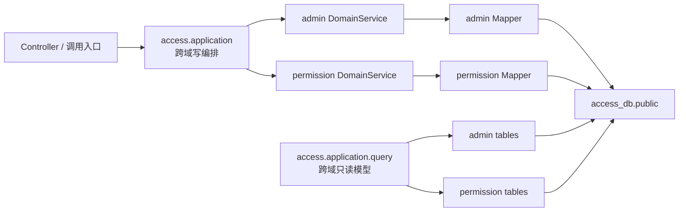

# access-service 目标架构与归并约束

本文定义 `admin-service` 与 `permission-center` 归并为 `access-service` 后的权威目标架构。实施编排见
[`../plans/access-service-merge-plan.md`](../plans/access-service-merge-plan.md)。在归并计划完成前，仓库代码可能仍处于旧拓扑；新增和修改不得继续扩大旧服务边界或内部异步同步链路。

接口字段、权限语义和领域规则仍分别以现有 admin 与 permission 设计文档为准；当服务拓扑、事务边界、数据源、缓存或调用方式与旧文档冲突时，以本文为准。

## 1. 目标与非目标

### 1.1 目标

- 将 `admin-service` 与 `permission-center` 物理归并为一个 Maven 模块、一个 Spring Boot 进程和一个部署单元 `access-service`。
- 当前采用模块化单体，保留管理域与权限域的代码边界；后续根据复杂度和性能数据演进到完全扁平化。
- 使用单一 PostgreSQL 数据库 `access_db` 和单一 `public` schema。
- 将原 admin 到 permission 的异步同步改为单库本地强事务。
- 保持既有 HTTP 路径、请求/响应结构和错误码兼容。
- 支持至少两个 `access-service` 实例并行运行。

### 1.2 非目标

- 不在归并过程中增加新的业务功能或改变权限产品语义。
- 不提供 `admin-service`、`permission-center` 旧部署单元、旧服务名或旧端口的兼容代理。
- 不迁移历史数据；项目尚未部署，数据库从空库创建。
- 本阶段不引入 Flyway、Liquibase 或权限版本号机制。
- 本阶段不把两个领域立即完全扁平化。

## 2. 目标工程与部署单元

| 项目 | 目标值 |
|---|---|
| Maven 模块 | `access-service` |
| Spring 应用名 / Nacos 服务名 | `access-service` |
| 启动类 | `AccessServiceApplication` |
| Java 基线 | Java 21 |
| 建议端口 | `9100` |
| 数据库 | `access_db` |
| schema | `public` |
| Redis logical DB | `0` |

根 Maven 聚合在归并完成后不得继续包含 `admin-service` 或 `permission-center`。Gateway、Docker Compose、Nacos、日志应用名、指标标签和 SDK 目标服务统一使用 `access-service`。

旧 HTTP 路径继续有效，但服务发现不保留 `admin-service`、`permission-center` 别名。

## 3. 模块边界

目标包结构：

```text
cn.ac.fage.accessmesh.access
├── AccessServiceApplication
├── application
│   └── query
├── admin
├── permission
└── infrastructure
```



边界规则：

- `access.application` 是唯一跨域写事务编排层，只调用两个领域的 DomainService 接口。
- `admin` 与 `permission` 禁止相互依赖实现类、Mapper 或 AppService，禁止横向调用。
- 单域用例继续由各自 AppService 调度，不为形式统一搬入 `access.application`。
- 跨域组合读取集中到 `access.application.query`。该包可以使用专用 QueryMapper 批量查询或 JOIN 两域表，但只能返回 Projection/DTO，严禁写 SQL。
- QueryMapper 必须显式带租户条件、正确处理分页，并遵守 N+1 查询禁令。
- 重名 Spring Bean 使用清晰的域前缀类名消除冲突，不依赖模糊的 Bean 覆盖。
- 架构测试应将上述依赖白名单固化。

## 4. 管理事实与权限投影

### 4.1 所有权

- `sys_user`、`sys_org`、`sys_menu` 等是 AccessMesh 管理事实源。
- `abstract_user`、`abstract_role`、`resource_entity`、`user_role` 等继续承担权限计算事实。
- 管理事实对应的权限记录属于本地权限投影，由 `access-service` 管理；权限管理 API 不得绕过管理事实直接修改这些投影。
- 外部业务服务同步的权限主体与资源继续独立存在，并由外部同步所有权规则约束。

### 4.2 标识与事务

- 管理事实和权限投影保留独立主键，不强制共享数值 ID。
- 本地投影通过稳定外部键关联，例如本地用户投影的 `external_id = sys_user.id.toString()`。
- 权限投影必须具有明确的来源/所有权标识，AccessMesh 本地投影统一标记为 `access-service` 管理。
- `access.application` 在同一 PostgreSQL 事务内更新管理事实、权限投影和强事务审计；任一步骤失败，全部回滚。
- 内部投影不写 `sync_metadata`。`sync_metadata` 仅保留给外部服务的增量/全量同步。

### 4.3 内部同步退役

以下内部 admin→permission 机制全部退役：

- `sys_sync_task` 表及管理 API（Gateway 对外路径 `/admin/sync-task/*`，服务内路径 `/sync-task/*`）。
- 同步任务 builder、handler、scheduler、重试、乱序版本、人工补偿和内部 full-sync 编排。
- admin 到 permission 的 Feign 调用及 `SyncTaskFeignClient`。
- 为旧同步链路存在的配置、测试和运行手册。

面向外部服务的 `/api/perm/**/sync`、`/full-sync` 契约和 `sync_metadata` 继续保留。

## 5. 数据库与共享表

### 5.1 单库单 schema

- 所有表物理归并到 `access_db.public`。
- 最终 DDL 的唯一权威文件为 `docs/design/schema/access-service.sql`。
- 最终 DDL 必须同时包含 §8.1 所需的任务执行键、唯一约束、租约、状态与幂等持久化结构，不允许运行时临时建表补齐。
- `admin-service.sql` 和 `permission-center.sql` 在最终 DDL 验收后转为 superseded，不再作为实现依据。
- 因无部署和历史数据，不提供旧库搬迁、兼容视图或升级脚本。
- 本阶段不引入数据库迁移框架；本地和 CI 必须能够从空 PostgreSQL 完整执行最终 DDL。

### 5.2 表合并边界

| 目标表 | 来源 | 约束 |
|---|---|---|
| `system_config` | `sys_config` + 原 `system_config` | `tenant_id + config_key` 唯一；JSONB 值；键使用 `admin.*`、`permission.*`、`access.*` 命名空间 |
| `operation_log` | `sys_audit_log` + 原 `operation_log` | 字段取超集；`target_id` 使用字符串；模块标识 `ADMIN/PERMISSION/ACCESS`；敏感内容脱敏并限长 |

以下表保持独立：

- `sys_login_log`：认证安全日志。
- `permission_change_log`：权限关系详细变更日志。
- `sys_job_log`：定时任务执行日志。
- 管理事实表与权限计算表：因语义不同不强行合并。
- `sys_dict_*` 与 `type_definition`：分别承担业务字典和权限类型定义，不合并。

## 6. 可信请求上下文与安全策略

### 6.1 唯一请求上下文

`access-service` 内只保留一个可信请求上下文，至少承载：

- `tenantId`
- `operatorId`
- 调用方类型（用户、服务、系统任务）
- 已验证的 `serviceCode`

只有统一安全入口可以建立上下文，业务代码只能读取。原始请求头不能未经验证直接成为租户、操作人或服务身份。admin 与 permission 共用一个 `TenantIdProvider` 和一套 MyBatis-Flex 租户配置。

请求完成必须在 `finally`/`afterCompletion` 清理上下文。异步任务显式传递上下文快照，定时任务通过租户提供器建立有界作用域，禁止盲目继承 ThreadLocal。

### 6.2 安全策略矩阵

| 入口 | 调用方要求 | 关键约束 |
|---|---|---|
| `/auth/**` 公开子集 | 匿名 | 只开放登录、验证码、OAuth2 token 等明确接口 |
| 用户管理接口 | 有效用户会话 | 租户与会话一致；Gateway 清除伪造头后重新签名 |
| `/api/perm/auth/**` | 已验证 Gateway 或注册业务服务 | 保持现有 SDK 请求头兼容；按服务和操作授权 |
| `/api/perm/**/sync`、`/full-sync` | 已验证服务身份 | `sourceService` 必须等于认证主体 |
| 其他 `/api/perm/**` 管理接口 | 已验证 Gateway + 用户身份，或显式服务白名单 | 内部凭证不隐式获得全量管理权限 |

`access-service` 端口仅在内部网络开放，Gateway 是用户流量唯一入口。本地跨域调用不模拟 HTTP 请求头，但仍使用可信上下文和权限校验器。

## 7. 缓存与多实例一致性

### 7.1 统一缓存框架

- 业务代码只注入唯一 `CacheService`。
- Redis 统一使用 logical DB 0；Sa-Token 使用独立键前缀。
- `access-service` 内缓存目录按领域使用 `admin:*`、`perm:*`、`access:*` 前缀；独立部署的 Gateway 继续使用 `gw:*` 前缀，不并入 `access-service` 的目录命名空间。
- 统一缓存 TTL 类型使用 `java.time.Duration`：`CacheCatalogEntry`、`CacheProperties`、Caffeine 与 Redisson store 均支持秒级精度，YAML 使用 Spring Boot Duration 文法（例如 `15s`、`5m`），禁止业务侧硬编码换算。
- 现有 `l1TtlMinutes`、`l2TtlMinutes`、`l1-expire-minutes`、`l2-ttl-minutes` 在 T-ACCESS-008 中一次性迁移并删除，不保留分钟字段或兼容别名。
- 删除 admin 的 Spring Cache/裸 Caffeine 和 permission 的自定义 RedisTemplate/ObjectMapper 分叉。
- 普通写路径使用事务提交后失效；多实例非授权 L1 通过失效事件及时清理。

### 7.2 授权读取边界

- 数据库业务事实与跨域写入保持强事务一致。
- 第一阶段不引入 `permission_revision`。
- `access-service` 内所有可能影响接口权限快照的授权缓存统一使用 `L2_ONLY`，TTL 均不得超过 10 秒且不创建授权 L1。
- `access-service` 缓存不可用时绕过缓存查询数据库；无法获得可信授权结果时 fail-closed。
- Gateway 本地权限快照使用 `L1_ONLY`，TTL 不得超过 15 秒；删除 `gateway.permission.fail-mode` 配置及 `open`、`stale-allow` 分支，权限回源失败固定 fail-closed，不得绕过授权或使用过期的放行结果。
- Gateway 一次授权请求触发的整个权限快照加载流程必须具有不超过 5 秒的墙钟硬截止时间。计时范围覆盖服务发现与负载均衡、连接、请求发送、`access-service` 处理、响应读取与解码，以及失效竞争触发的重试；连接超时、响应超时等分段限制不能代替该全链路截止时间。超过截止时间不得写入 Gateway 缓存并固定 fail-closed。
- 串行总预算必须满足“上游授权 L2 TTL + Gateway 快照回源全链路截止时间 + Gateway 权限 L1 TTL ≤ 30 秒”；第一阶段固定采用 10 秒 + 5 秒 + 15 秒。配置覆盖值超过任一分项上限时必须启动失败，不在 `InterfaceSnapshotResp` 增加版本号或 `validUntil`。
- 接受广播丢失或提交后缓存删除失败时最长 30 秒的授权读取不一致窗口；正常失效目标为毫秒到亚秒级。
- 后续只有在性能数据证明必须启用授权 L1 时，才评估租户级权限版本屏障。

## 8. 任务、异步与审计

### 8.1 多实例任务协调

- 同一计划触发使用稳定的数据库执行键（例如 `jobId + scheduledTime`）和唯一约束。
- 通过 `lease_owner`、`lease_until`、状态和原子抢占保证同一时刻最多一个活动执行者。
- 长任务续租，实例故障后允许其他实例接管。
- 任务处理必须幂等；外部副作用携带执行键。
- 语义为“最多一个并发执行者 + 失败后至少一次重试”，不承诺端到端 exactly-once。
- Redis 不承担任务正确性。
- 仅为旧内部同步兜底的维护任务随同步子系统一起删除；外部同步仍需要的维护任务才保留。

### 8.2 审计事务分级

- `permission_change_log` 与权限事实变更位于同一事务，日志失败则权限变更回滚。
- `operation_log`、`sys_login_log`、`sys_job_log` 使用独立短事务，写入失败不回滚已成功的主业务，但必须产生错误日志和监控指标。
- 异步日志使用有界线程池；队列满时不得静默丢弃，应降级同步写入或明确告警。
- 缓存失效继续在主事务提交后执行，不与审计事务混合。

## 9. API、SDK 与生态切换

- 除 §4.3 明确退役的内部同步管理接口外，保持现有 POST + JSON Body、HTTP 路径、DTO、统一响应体和错误码分段；`/admin/sync-task/*` 不属于兼容范围。
- `/admin/**`、`/perm/**`、`/auth/**` 的 Gateway 目标统一为 `lb://access-service`。
- `perm-sdk` 继续作为外部客户端，Feign 目标从 `permission-center` 改为 `access-service`。
- access 内部代码禁止通过 `perm-sdk` 或 Feign 调用自身。
- `serviceCode`、服务配置、资源映射、owner code、缓存失效载荷、日志和指标中原本代表两个旧服务的值立即统一为 `access-service`；不保留历史别名。
- 外部业务服务自己的 `sourceService` 仍使用其已验证服务身份，不统一改成 `access-service`。

## 10. 验收门禁

归并至少通过以下门禁：

- Java 21 全量构建、单元测试和 Spring Context 启动通过，无 Bean 名冲突。
- 空 PostgreSQL 可一次执行最终 DDL，表、索引、约束和种子数据正确。
- 除退役的 `/admin/sync-task/*` 外，原 admin 与 permission HTTP 契约回归通过；退役接口必须无法路由或返回明确的不存在响应，且不得残留 Controller 映射。
- 故障注入证明管理事实、权限投影与强事务审计能够整体回滚。
- 安全测试覆盖租户串扰、伪造请求头、服务身份冒充和同步所有权。
- 两个 `access-service` 实例共享 PostgreSQL/Redis 时，授权失效满足 30 秒上限，普通 L1 能跨节点失效。
- 缓存故障测试覆盖上游授权 L2 接近 10 秒过期时、Gateway 快照回源被注入接近 5 秒的全链路延迟后再回填 15 秒 L1 的边界，证明最坏陈旧窗口仍不超过 30 秒；回源超过 5 秒时必须验证不写缓存并返回 503。
- Gateway 权限回源不可达时固定返回 503；代码与配置中不存在 `open`、`stale-allow` 或可切换的 `gateway.permission.fail-mode`。
- 多实例任务不存在同一执行键的并发执行，故障接管和幂等重试通过。
- 架构测试证明跨域依赖只出现在允许的 application/query 边界。
- 非归档代码、配置和有效设计中不存在可运行的旧服务、旧数据库或内部同步链路残留。

## 11. 演进方向（非本阶段约束）

完成模块化单体并获得运行数据后，可以按独立任务评估：

- 将重复的领域模型进一步扁平化。
- 在授权读取需要 L1 时引入租户级权限版本屏障。
- 首次正式部署前引入数据库版本管理工具，并以 `access-service.sql` 作为 V1 基线。
- 根据查询与变更热点细化缓存、权限版本和任务分片粒度。
