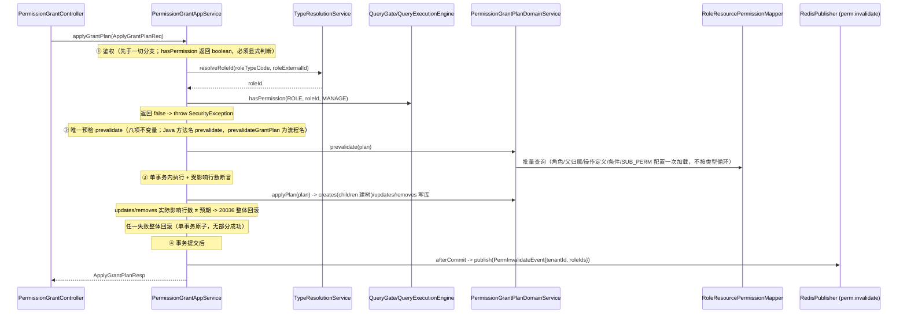

# 权限中心 — 核心功能实现设计

> **迁位注记（2026-09-13，T-ACCESS-040）**：本文档自 `docs/design/permission-center/` 迁至 `docs/design/engine/`（permission-center 目录解散，引擎子系统文档位），内容与章节锚点原样保留；API 契约引用已重挂 [access-service-api-contract.md](../access-service-api-contract.md) 契约总册。

> 本文档是 `overview.md` 的**实现层补充**，聚焦于鉴权查询和权限授权管理两大核心模块的执行链路设计。
> 本文档不定义对外 API 路径、请求体、响应体或错误原因；这些内容以 [`access-service-api-contract.md`](../access-service-api-contract.md)（契约总册）为准。
> 阅读本文档前请先阅读 `overview.md` 了解业务概念；表结构以 `../schema/access-service.sql` 为准（唯一权威 DDL；文中「permission-center」按权限面理解（引擎子系统 + 权限事实能力包），见 overview.md 术语注记（T-ACCESS-041 更新））。

---

## 目录

1. [整体分层与类清单](#1-整体分层与类清单)
2. [公共 Domain Service 设计](#2-公共-domain-service-设计)
3. [鉴权查询模块（统一执行引擎 QueryExecutionEngine）](#3-鉴权查询模块统一执行引擎-queryexecutionengine)
4. [权限授权管理模块](#4-权限授权管理模块)
5. [缓存设计](#5-缓存设计)
6. [操作日志 AOP 机制](#6-操作日志-aop-机制)
7. [DTO 与内部模型边界](#7-dto-与内部模型边界)

---

## 1. 整体分层与类清单

### 1.1 分层架构

```
Controller ──► AppService（调度层） ──► DomainService（领域层） ──► Mapper（数据访问）
                                         ├── QueryGate / QueryExecutionEngine（统一鉴权引擎）
                                         └── AOP（@OperationLog 自动记录入口日志）
```

### 1.2 包结构

```
cn.ac.fage.accessmesh.permission
├── aop
│   ├── OperationLog                  ← 注解
│   ├── OperationLogAspect            ← 切面
│   └── OperationLogRuntimeContext    ← ThreadLocal 上下文
├── cache                             ← CacheService 缓存目录
├── config                            ← 配置类
├── constant                          ← 常量（OperationCode 等）
├── controller (22)
│   ├── AbstractRoleSyncController
│   ├── AbstractUserSyncController
│   ├── AuthController
│   ├── BizDomainController
│   ├── ConditionController
│   ├── ConflictRuleController
│   ├── DomainConfigController
│   ├── LogQueryController
│   ├── OperationController
│   ├── PermissionGrantController
│   ├── PermissionViewController
│   ├── ResourceApiMappingController
│   ├── ResourceController
│   ├── ResourceDependencyController
│   ├── ResourceEntitySyncController
│   ├── RoleController
│   ├── ServiceConfigController
│   ├── SystemConfigController
│   ├── TypeDefinitionController
│   ├── UserController
│   ├── UserRoleController
│   └── UserRoleSyncController
├── service
│   ├── impl (22 AppService 实现；GroupRoleAppServiceImpl 随 T-PERM-043 写入口删除)
│   │   ├── AbstractRoleSyncAppServiceImpl
│   │   ├── AbstractUserSyncAppServiceImpl
│   │   ├── BizDomainAppServiceImpl
│   │   ├── ConditionAppServiceImpl
│   │   ├── ConflictRuleAppServiceImpl
│   │   ├── DependencyAppServiceImpl
│   │   ├── DomainConfigAppServiceImpl
│   │   ├── LogQueryAppServiceImpl
│   │   ├── OperationAppServiceImpl
│   │   ├── PermissionCheckAppServiceImpl
│   │   ├── PermissionGrantAppServiceImpl
│   │   ├── PermissionQueryAppServiceImpl
│   │   ├── PermissionViewAppServiceImpl
│   │   ├── ResourceEntitySyncAppServiceImpl
│   │   ├── ResourceManageAppServiceImpl
│   │   ├── RoleManageAppServiceImpl
│   │   ├── ServiceConfigAppServiceImpl
│   │   ├── ServiceSyncAppServiceImpl
│   │   ├── SystemConfigAppServiceImpl
│   │   ├── TypeDefinitionAppServiceImpl
│   │   ├── UserManageAppServiceImpl
│   │   └── UserRoleSyncAppServiceImpl
│   └── domain（领域服务接口 + 实现，另含同步策略、守卫与批量评估器；个数不在此维护）
│       ├── AuditDomainService / *Impl
│       ├── DomainClassifyService / *Impl
│       ├── MappingSyncHandler / *Impl
│       ├── PermissionConditionDomainService / *Impl
│       ├── PermissionConflictDomainService / *Impl
│       ├── PermissionGrantDomainService / *Impl
│       ├── ResourceEntityDomainService / *Impl
│       ├── ResourceSyncHandler / *Impl
│       ├── SubjectDomainService / *Impl              ← 角色解析+用户查询合并
│       ├── SyncMetadataDomainService / *Impl
│       ├── TypeResolutionService / *Impl
├── mapper (18)
│   ├── AbstractRoleMapper
│   ├── AbstractUserMapper
│   ├── BizDomainMapper
│   ├── DomainConfigMapper
│   ├── OperationLogMapper
│   ├── OperationPermissionMapper
│   ├── PermissionChangeLogMapper
│   ├── PermissionConditionMapper
│   ├── PermissionConflictRuleMapper
│   ├── ResourceApiMappingMapper
│   ├── ResourceDependencyMapper
│   ├── ResourceEntityMapper
│   ├── RoleResourcePermissionMapper
│   ├── ServiceConfigMapper
│   ├── SyncMetadataMapper
│   ├── SystemConfigMapper
│   ├── TypeDefinitionMapper
│   └── UserRoleMapper
├── entity / dto / vo / enums / util（关键类型示例）
│   ├── ConditionEvalUtils
│   ├── JsonValidationUtils
│   ├── OperationPermissionUtils
│   ├── OperatorContext / OperatorUtil
│   ├── PageUtil
│   ├── PermissionConstants
│   ├── PermViewFilter / PermViewResult
│   ├── PermResultUtils
│   ├── PermViewAssembler（登录权限串管线专用，T-PERM-059 后排查视图面已删）
│   ├── RolePermEntryMapper                         ← 在 util 包（非 domain）
│   ├── SecurityEventType / SecurityLogUtil / SecurityUtils
│   ├── SnapshotAssembler
│   ├── StringUtils
│   └── TreeBuilder
└── config
```

---

## 2. 公共 Domain Service 设计

以下 Domain Service 被多个 AppService 复用，是分层规范中公共逻辑复用的关键。

---

### 2.1 `SubjectDomainService` — 主体领域（角色解析 + 用户查询合并）

合并了旧 `AbstractUserDomainService`、`AbstractRoleDomainService` 和 `UserRoleDomainService`。

```java
public interface SubjectDomainService {

    // 用户查询
    AbstractUser selectValidUserById(Long tenantId, Long userId);

    // 角色查询/写入（其余 createRole、softDeleteRoleBatch 等方法省略）
    AbstractRole selectValidRoleById(Long tenantId, Long roleId);

    // 用户有效角色解析
    Set<Long> resolveEffectiveRoles(Long tenantId, Long userId);
    // 保留批量有效角色公共能力；判定入口用 resolveJudgementRoleIds，写守卫用 batchResolveRawHoldings。
    Map<Long, Set<Long>> batchResolveEffectiveRoles(Long tenantId, Set<Long> userIds);

    // 缓存失效
    void invalidateRoleCacheBatch(Long tenantId, Set<Long> userIds);
    void invalidateRoleCacheByRole(Long tenantId, Long roleId);
}
```

---

### 2.2 ~~`PermissionVersionDomainService`~~ — 权限令牌机制（**已整体删除 2026-06-20 T-PERM-018**）

> **已整体删除（T-PERM-018 缓存下沉，2026-06-20）**：`permission_version` 表与 `PermissionVersionController` / `PermissionVersionAppService(Impl)` / `PermissionVersionMapper` / `PermissionVersion` 实体 / `PermissionVersionQueryReq` / `PermissionVersionResp` / `PermissionVersionDomainServiceImplTest` 已物理删除（design-review §A'-3 + v3.5 §9.2，T-PERM-003）。占位接口 `PermissionVersionDomainService(Impl)` 与 `buildPermissionVersionKey` / `buildInterfacePermissionVersion`、各 DTO 的 `permissionVersion` / `notModified` 字段、INTERFACE_SNAPSHOT(L2) 缓存一并彻底移除（T-PERM-018）。
>
> **令牌为何彻底删除**：核实确认令牌「唯一真正作用是 INTERFACE_SNAPSHOT 缓存 key」（`serviceCode|permissionVersion`）。占位令牌只含 roleIds 指纹，不反映角色内权限内容变更 → 撤权后最长 TTL 仍命中陈旧快照。缓存下沉方案（T-PERM-018）移除该 L2 缓存 + 激活 engine `ROLE_PERM_SNAPSHOT` 读缓存（per-role 精确失效）+ 扩展 `PermInvalidateEvent` serviceCodes，正确性不再依赖令牌；令牌随之失效，连带 304/notModified 死代码清除。

> 4 处原 `permissionVersionDomainService.increment(...)` 调用、`PermissionGrantDomainServiceImpl` 未用注入、`buildInterfacePermissionVersion`（`PermissionQueryAppServiceImpl`）均已删除。缓存失效改由 Redis pub/sub 主动广播 `PermInvalidateEvent` + TTL 兜底（Gateway 订阅侧 T-PERM-006）。

---

### 2.3 `AuditDomainService` — 审计领域（合并 PermissionChangeDomainService + OperationLogDomainService）

```java
public interface AuditDomainService {

    // 变更日志记录
    void recordChangeLog(ChangeLogContext context, List<ChangeLogEntry> changes);

    // 操作日志记录（异步）
    void asyncRecordLog(String module, String action, String targetType, Long targetId,
                        String summary, Long operatorId, String ipAddress, String requestId, Long tenantId);

}
```

---

### 2.4 `PermissionConflictDomainService` — 冲突规则

```java
public interface PermissionConflictDomainService {
    // 运行时双删原语；双删命中记 CONFLICT_DETECTED
    // 操作日志（T-PERM-063，每「租户×用户×规则对」每 JVM 1 小时至多一条，Caffeine 去重限流）
    Set<Long> filterRoleMutex(Long tenantId, Long userId, Set<Long> effectiveRoleIds);
    // T-PERM-075 共同判定语义唯一入口（2026-09-22 定案，取代 2026-09-09「角色互斥不归引擎」）：
    // = resolveEffectiveRoles（有效期窗口+启用+组展开）叠加 filterRoleMutex。
    // check/batch/validate/scope/getDenied*/菜单权限串/接口快照全部经此消费同一角色集；
    // EFFECTIVE_ROLES 缓存维持「过滤前集合」（互斥判定时叠加，规则变更沿 10s TTL 收敛）；
    // 写守卫不得使用本方法（写时看原始持有候选 SubjectDomainService.batchResolveRawHoldings）
    Set<Long> resolveJudgementRoleIds(Long tenantId, Long userId);
    // T-PERM-061 批量判定：请求级互斥评估器（静态数据共享 + 计算通知解耦，见 §3.10；
    // PERM_MUTEX 剔除语义唯一入口——单条通知支线 filterPermMutex/computePermMutex 已随 T-PERM-092 裁剪删除）
    BatchPermMutexEvaluator openBatchMutexEvaluator(Long tenantId);
    // T-PERM-063 授予前校验：规则 DB 直查（不经 ROLE_MUTEX_RULE 缓存，新规则即刻生效），
    // 调用方组装「原始持有候选 ∪ 本批未过期新增」（含未来窗口与禁用，T-PERM-075 U002 口径），
    // 命中互斥对整批原子拒绝 20062
    List<RoleMutexAssignConflict> findAssignMutexConflicts(
        Long tenantId, Map<Long, Set<SubjectDomainService.RawHolding>> holdingsByUser);
    // claude 外评 P3-1：预载规则重载（full-sync 批内一次预载，消逐 item 直查的锁内放大）
    // + 规则预载读取；倒置窗口（from>to）运行时恒假=空窗，不参与重叠（P3-2）
    List<RoleMutexAssignConflict> findAssignMutexConflicts(Long tenantId,
        Map<Long, Set<SubjectDomainService.RawHolding>> holdingsByUser,
        List<PermissionConflictRule> preloadedRules);
    List<PermissionConflictRule> loadRoleMutexRulesFresh(Long tenantId);
    // T-PERM-063 存量守卫 + T-PERM-075 口径扩展：原始持有候选同时含两角色的用户
    //（未过期含未来窗口、含禁用持有与禁用组子树——与全部写守卫同口径）
    List<Long> findUsersHoldingBothRoles(Long tenantId, Long firstRoleId, Long secondRoleId);
}
```

角色互斥守卫与判定（T-PERM-063 2026-09-12 落地；T-PERM-064 补全 sync 通道；T-PERM-075 2026-09-22 候选口径统一）：①**授予守卫**——`user-role/assign`、`batch-assign` 与 `UserRoleSyncAppServiceImpl.applyItemSync` BIND 分支（sync/full-sync 共用单点）事务内校验，命中互斥对分别整批原子拒绝 **20062** / item 级 `NON_RETRYABLE` + `ROLE_MUTEX_CONFLICT`（full-sync 同批同用户多 BIND 经请求级批内累积判定）。候选口径（T-PERM-075 U002 两项拍板，[历史定案原文](../../archive/2026-09-26/decision-registry-before.md) 2026-09-22 行）：**未过期原始持有候选**（`batchResolveRawHoldings`：valid_to >= now OR null，未来 valid_from 窗口同入、闭区间口径 null=无限期、首尾相接同刻算重叠；组展开含禁用子树；不缓存 DB 新鲜读）∪ 本批未过期新增（含禁用目标）；已过期行永不生效不计；sync 改写后未过期即检查（旧「幂等改期不触发」随窗口重叠判定消解——纯幂等重放因持有侧无冲突天然通过）；full-sync 批内一次预载消 N+1（批内写入由 appliedThisBatch 补偿）。规则面 create/update 拒绝 ORG/POSITION 角色对（结构角色对由本地投影通道维护，规则面拒绝即闭合投影通道）；②**存量守卫**——`conflict-rule/create`、`update` 的 ROLE_MUTEX 分支写入前检查存量双持（原始持有候选口径，禁用/未来持有同计——消除「绑定时拒、立规时放」双通道不一致），非空拒绝 **20063**（message 含用户 id 清单截断 20），候选经 `findUserIdsByEffectiveRoles` 三路反查（含组角色间接持有），PERM_MUTEX 分支与 remove 不适用；③**运行时统一判定**——全部判定入口经 `resolveJudgementRoleIds` 消费互斥过滤后角色集（双删命中记 CONFLICT_DETECTED 日志；空规则集也回填缓存防判定路径打 DB）。并发双开两笔授予的窄竞态窗口与「禁用角色绑定 vs 启用」竞态窗口接受（运行时双删兜底 fail-closed，无安全回退；角色启用动作不查存量互斥——U002-2 拍板，启用保持全局性）。

成员 sync/full-sync 在依赖与关系预加载前取得租户 ABSTRACT_ROLE 写锁，复用树锁的 afterCompletion 释放协议。版本只读预判、依赖/归属/互斥预检、原子版本比较和关系写入都处于该窗口；预期拒绝不写版本，版本后的技术失败通过入口事务回滚。full-sync 复用批量结果，已确认缺失的主体/角色/关系不回退逐项查询。该锁防止同步入口间旧预加载结果覆盖新事实，不改变管理面与同步面之间已接受的角色互斥竞态边界。

---

### 2.5 `PermissionConditionDomainService` — 条件校验 + 内联轨生命周期（T-PERM-048 扩展 2026-09-11）

```java
public interface PermissionConditionDomainService {
    List<RolePermEntry> evaluate(Long tenantId, List<RolePermEntry> entries, Map<String, Object> context);
    // T-PERM-061 批量判定：请求级条件快照评估器（四态 fail-close + 增量装载，见 §3.10）
    BatchConditionEvaluator openBatchEvaluator(Long tenantId);
    // 原 explain 排查明细 evaluateDetailed 已随 T-PERM-059 删除（2026-09-10）

    // T-PERM-048 双轨制：条件规则写入口径校验双轨共享（管理页 create/update 与内联轨同源）
    void assertConditionRulesValid(String conditionRules, boolean gatewayEvaluable);
    // 内联轨生命周期（apply-grant-plan 同事务调用；门禁随授权入口 ROLE:MANAGE 携带，定案②）
    PermissionCondition createInlineCondition(Long tenantId, Long operatorId, InlineConditionDef def);
    void editInlineCondition(Long tenantId, Long operatorId, PermissionCondition condition, InlineConditionDef def);
    Set<Long> recycleOrphanInlineConditions(Long tenantId, Set<Long> candidateIds);
}
```

条件双轨制（T-PERM-048 五项定案 2026-09-11，详见 [历史定案原文](../../archive/2026-09-26/decision-registry-before.md)）：`permission_condition.source` 区分 MANAGED（管理页轨——ConditionAppService CRUD，update/remove 实例级门禁 CONDITION:UPDATE/DELETE@{code} 经 resource_entity(CONDITION) 投影解析，删除引用守卫 20059，有实例投影）与 INLINE（内联轨——apply-grant-plan 携带 inlineCondition 同事务创建/编辑/回收，由一个 MANUAL 授权拥有，可被其多个系统派生 AUTO_DEP 行按同一条件身份引用；禁止用户显式共享，回收须确认零有效引用（见 [自动授权设计 §6.4](../dependency-auto-grant.md#64-diff撤销与条件回收)），code 自动生成 inline- 前缀，enabled 恒 true，不投影；管理面防线 20060 三面 + conditionCode 引用轨值域焊死 MANAGED）。条件写路径同事务维护 CONDITION 实例投影（`LocalProjectionDomainService.upsertConditionResource`，status 镜像 enabled）+ bootstrap 自愈补种（`backfillConditionProjections` 仅 MANAGED）。

---

### 2.6 `TypeResolutionService` — 类型解析

```java
public interface TypeResolutionService {
    Map<String, Integer> batchResolveTypeValues(Long tenantId, String typeKey, Set<String> codes);
    Map<Integer, String> batchResolveTypeCodes(Long tenantId, String typeKey, Set<Integer> values);
    Map<String, Long> batchResolveOperationIds(Long tenantId, String resourceTypeCode, Set<String> opCodes);
    Map<ResourceResolveKey, Long> batchResolveResourceIds(Long tenantId, List<ResourceResolveRequest> requests);
}
```

---

<a id="domain-classify"></a>

### 2.7 `DomainClassifyService` — 域分类

```java
public interface DomainClassifyService {
    boolean matchesTypeCode(Long tenantId, DomainQueryMode mode, String domainCode, String typeCode);
    Set<String> preloadCoveredTypeCodes(Long tenantId, DomainQueryMode mode, String domainCode);
    Set<String> getClassifiedTypeCodes(Long tenantId, String domainCode);
    Map<String, Long> findDomainIdsByTypeCodes(Long tenantId, Set<String> typeCodes);
}
```

> `preloadCoveredTypeCodes`（T-PERM-055）为 `matchesTypeCode` 同语义的批量预载形态：批量上下文（逐条目循环/列表过滤）必须走预载、循环内 `Set.contains` 复用，消除逐条目点查放大。

---

### 2.8 `PermissionGrantDomainService` — 权限授权领域

```java
public interface PermissionGrantDomainService {
    boolean canGrantPermission(Long tenantId, Long operatorId, String resourceTypeCode,
                               String resourceCode, String operationCode, boolean scopeAll, String domainCode);

    Map<String, GrantCheckResult> checkCanGrant(Long tenantId, Long operatorId,
                                                Set<GrantCheckKey> permissions, String domainCode);

    record GrantCheckKey(String resourceTypeCode, String resourceCode,
                         String operationCode, boolean scopeAll) {}

    record GrantCheckResult(boolean canGrant, String reason) {}
}
```

---

### 2.9 `ResourceEntityDomainService` — 资源实体领域

资源层级操作、树形展开等。

---

### 2.10 ~~`ResolveContext`~~ — 类型预解析上下文（**已删除 2026-09-27 T-PERM-092**：旧执行体附属类，随旧引擎整删；新引擎的解析记忆在 `engine.query.QueryReadSupport` 请求级 RunState 内）

---

<a id="permission-query"></a>

## 3. 鉴权查询模块（统一执行引擎 QueryExecutionEngine）

> **R2 终态（T-PERM-082~088 建核，089~091 迁消费者，092 删旧）**：唯一执行主体为
> `engine.query.QueryExecutionEngine.execute(QueryRequest)`；判定面薄门面 `QueryGate`（T-PERM-089）。
> 旧 `PermQueryEngine` 与四旧 DTO（`PermQuery`/`PermResult`/`PermBatchQuery`/`PermBatchResult`）、
> `TargetMode`、`ResolveContext` 已删除（T-PERM-092；X04 退役锁=`QueryBoundaryArchitectureTest`
> 断言主源码不得再现）。设计稿 `r2-unified-query-and-admission.md` 的模型（§3）、执行单位与
> 生命周期（§4）、阶段算法（§9~10）、投影与审计（§12~13）已按现行规范并入本节——设计稿对应
> 章节已标注「已并入」，整体转 superseded 随计划完结归档（准入面回写由 ADM 系列卡承担）。
> 保留的旧语义锚：角色互斥经 `resolveJudgementRoleIds` 共同判定语义进全部判定入口（T-PERM-075）；
> 条件上下文多层对象 `PermEvalContext`（T-PERM-057，`RunState` 消费）；判定面闭包止步同类型
> （跨类型父边写通道已拦，语义保留作 DB 直写脏数据防线，T-PERM-068）。OAuth2 委托用户链路
> 维持不接入权限判定面（2026-08-22 用户决策，见 §3.9）。

### 3.1 两层入口：判定面门面与执行主体

**业务层唯一门面 `QueryGate`**（T-PERM-089；方法形状沿旧四入口，X03 等价迁移）——显式资源语义，
`code` 与 `entityId` 两轨不得混用：

```java
// —— 对外：业务编码语义（USER/ROLE 等业务对象门禁与跨服务 SDK 统一使用）——

// 单目标鉴权（boolean；code 传 null/空白 = 类型级校验）
boolean ok = queryGate.hasPermissionByCode(tenantId, subjectId,
    ResourceTypeCode.ROLE, roleId.toString(), OperationCode.MANAGE);

// 批量获取被拒绝的业务编码集合（纯查询，不抛异常；异常由调用方显式抛出）
Set<String> denied = queryGate.getDeniedResourceCodes(tenantId, subjectId,
    ResourceTypeCode.ROLE, roleCodes, OperationCode.MANAGE);

// —— 内部 / 已完成解析的调用方：resource_entity.id 语义 ——
// （仅限直接管理资源实体的后台链路：资源树、API 映射、资源依赖、权限树等）

boolean okEntity = queryGate.hasPermissionByEntityId(tenantId, subjectId,
    ResourceTypeCode.RESOURCE, resourceEntityId, OperationCode.MANAGE);

Set<Long> deniedEntityIds = queryGate.getDeniedEntityIds(tenantId, subjectId,
    ResourceTypeCode.RESOURCE, resourceEntityIds, OperationCode.DELETE);
```

**门面评估口径（沿旧 forValidate 拉平语义）**：EVALUATE+ENFORCE+DECISION、判定面继承开
（SELF_AND_ANCESTORS——授父覆盖子）、类型级回退放行（TypeFallback.ALLOW，scopeAll 先行）；
clientIp 从当前请求自动装配（无请求上下文时 IP 类条件 fail-closed）。抛异常语义在调用方
（管理轨 AppService 经引擎门面 `AdminPermissionValidator` 抛出、权限轨 AppService if-throw）；
主体参数即主体 ID（T-ORG-001）；未知类型/未知操作/未解析到投影实体的编码 fail-closed 拒绝；
空白码直接拒绝且不拖垮同批其他目标。**架构约束（设计 §9.4）**：门面仅依赖执行器，禁止注入
权限 Mapper、解析角色或调用条件/互斥服务（`QueryBoundaryArchitectureTest` 锁定）。

**执行主体直构面**：check/batchCheck（`PermissionCheckAppServiceImpl` 适配层，T-PERM-089）、
范围/LEGACY_API 四面（`PermissionQueryAppServiceImpl`/`SnapshotAssembler`，T-PERM-090）、
视图/转授（`PermissionViewAppServiceImpl`/`PermissionGrantDomainServiceImpl`，T-PERM-091）——
适配层直构 `QueryRequest` 经 `execute`，`inheritMode` 线格式解析收编于适配层私有
`inheritClosureOf`（T-PERM-092）。

### 3.2 请求与结果模型（engine.query 包）

| 类别 | 类 | 说明 |
| --- | --- | --- |
| 请求 | `QueryRequest` / `QueryItem` / `QueryRequestValidator` | 不可变请求＋一次 `RunState`；混批/结构非法在执行前拒绝（C02/C03/C05） |
| 主体 | `Subject` / `User` / `Roles` | 封闭变体；User 内部经共同判定语义解析互斥过滤后角色集（T-PERM-075），空 Roles 不回退 User（C04） |
| 目标选择 | `Selection` / `TypeLevel` / `TargetSet` / `TargetClause` / `TypeOperation` / `ByCode` / `ByEntityId` / `ResourceRef` | 旧 targetMode 三态的封闭变体表达（TypeLevel=类型级、TargetSet=实例目标集） |
| 继承/回退 | `Inheritance`（SELF / SELF_AND_ANCESTORS） / `TypeFallback`（ALLOW / DISALLOW） | 判定面继承与 exactInstanceOnly 两独立轴（设计 §9.1 字段迁移） |
| 父要求 | `ParentRequirement` | depend_on 主资源上下文（按选择固定父语义） |
| 读选项 | `ReadOptions` / `ListGrantRead`（ROLE_SNAPSHOT / DATABASE） | LIST 授权来源分桶；转授写校验面用 DATABASE 直查不回填 |
| 评估 | `Evaluation` / `ConditionMode` / `MutexMode` | EVALUATE / PRESERVE / PRESERVE+SKIP；DECISION 不可 SKIP 互斥 |
| 输出 | `OutputSpec` / `FactDetail` / `PresentationExpansion` | 事实粒度（KEPT/RAW_AND_KEPT）、描述块、展示父子展开（不参与判定） |
| 调用方 | `CallerContext` / `CallerContext.fromCallerMap` | SDK context Map 的受信解析（clientIp 键提取；顶层 evaluatedAt/timestamp 结构拒绝 400） |
| 执行 | `QueryExecutionEngine` / `RunState` / `QueryReadSupport` / `CandidateSelector` / `CandidateEvaluator` / `QueryProjector` | 规范化→共享装载→分集合评估→投影；读来源记忆与空集守卫在 ReadSupport |
| 结果 | `QueryResult` / `ItemResult` / `DecisionResult` / `GrantSetResult` / `GrantFact` / `StageFacts` / `ResultDetails` / `PresentationEntry` / `EvaluationCoverage` / `ResultForm` | 三结果形态（判定/授权集合/准入）；raw/retained 分阶段事实 |
| 故障/审计 | `QueryExecutionException` / `QueryValidationException` / `QueryAuditCollector` / `ConflictEvidence` / `QueryEngineMetrics` | X01/X02 统一包装；根 execute finally 一次受控提交（execution＋item＋stage＋ruleRef 聚合，单行单规则结构化摘要） |
| 装配 | `QueryEngineConfiguration` / `ScopeCoverageProjector` / `OperationDefinition` | Bean 装配（构造器包私有）；范围四态纯投影 |

`RolePermEntry`（`engine.vo`）为 `ROLE_PERM_SNAPSHOT` 缓存载荷的**边界例外保留对象**
（`List<RolePermEntry>`，`RolePermEntryMapper.toEntry` 构造，禁止裸 new）；新引擎 GRANT_LIST 读路径
经 `QueryReadSupport` 消费/回填。

### 3.3 执行管线（分阶段）

```
QueryExecutionEngine.execute(QueryRequest)
    │
    ├─ 规范化与校验（QueryRequestValidator：重复 key/空 type/空 op/无实例 clause/结构非法 → 执行前拒绝）
    ├─ RunState 单时钟（请求级单一 evaluatedAt；防御性复制输入集合/嵌套 context——C07/C08）
    ├─ 主体解析（User → resolveJudgementRoleIds 互斥过滤后角色集；Roles 直供不回退）
    │
    ├─ TYPE_GRANT 阶段（scopeAll 先行，1 SQL：selectScopeAllPermsByBitsBatch 分角色批合并；
    │     depend_on 子行随装载进入，读侧不排除）
    │     ├─ depend_on 父绑定先于评估（bind：dependOn=null 或 ∈ 父判定命中权限集——TYPE_LEVEL 与
    │     │     无父上下文目标集即纯排除，T-PERM-058 只认主授权同口径；带父上下文 TargetSet 保留
    │     │     匹配父权限的 scopeAll 子行，排除仅对目标项解释为父上下文不匹配
    │     │     〔DEPENDENT_NOT_IN_PARENT_CONTEXT〕）
    │     ├─ 条件评估（CandidateEvaluator：请求级条件四态增量快照，禁用/缺失/解析失败 fail-close）
    │     └─ DECISION 且类型级放行 → 跳过 INSTANCE 阶段（EvaluationCoverage.SkipReason.SUFFICIENT_DECISION）
    │
    ├─ INSTANCE 阶段（目标下推：selectInstancePermsByBitsBatch 按类型+掩码+实体批合并，SqlBatches 分块）
    │     ├─ Inheritance.SELF_AND_ANCESTORS → selectSelfAndAncestorClosureBatch 闭包 CTE
    │     │     （查询前扩大目标集；止步同类型/软删截断/防环——§3.4）
    │     ├─ depend_on 父绑定先于评估（bind 口径同 TYPE_GRANT——互斥在绑定后集合上判定，
    │     │     被剔除子行不参与两端同场判定）
    │     └─ 条件评估＋PERM_MUTEX 集合语义（共同候选集合两端同场双丢；候选按 clause 精确切分
    │          不串配——D01/D13；无父上下文子行一律不计入，fail-closed，拒绝原因
    │          DEPENDENT_NOT_IN_PARENT_CONTEXT 与无授权区分）
    │
    ├─ GRANT_LIST 阶段（清单/事实面：ReadOptions 读来源=ROLE_SNAPSHOT 缓存或 DATABASE 直查）
    │     ├─ ParentRequirement 给出时父阶段独立判定（不缺不补：父按普通 DECISION item 走
    │     │     TYPE_GRANT→INSTANCE，scopeAll 命中即短路跳过实例读取——P05 不扩读父实例，
    │     │     绑定集来自真实命中权限 ID）
    │     └─ 评估（EVALUATE/PRESERVE）→ raw/retained 分阶段事实（四态组装=ScopeCoverageProjector 纯投影）
    │
    ├─ ADMISSION_CANDIDATES 阶段（OPERATION_ADMISSION 独占用途，不与普通项混批）
    │     ├─ 新鲜完整操作目录解析精确 coveringMask（先于 NO_ROLE 返回核查配置）
    │     ├─ selectAdmissionCandidatesByTypeMasks 合批读取 ALL/实例原行；子候选批量核父结构
    │     └─ ADMISSION 评本行条件、存在性短路；FACTS 只核规则状态，完整保留有效条件身份
    │
    └─ 投影与收尾（QueryProjector：描述块/操作覆盖/展示父子展开克隆 grantSource=INHERITED；
          根 execute finally 一次受控提交 ConflictEvidence——幂等闸、提交期异常不覆盖主异常 A04；
          TRACE=已完成计算快照复用，零新增 I/O 零重评 A05）
```

**共享装载不变量**：同请求多 item 的类型/操作解析、scopeAll/实例 SQL、闭包 CTE、条件装载全部
请求级合并（N 增大 mapper 调用次数不变——`BatchAuthCheckPgIT` ②计数锁）；空目标集守卫——
可解析 entityId 并集为空（纯 TYPE_LEVEL 批/全幽灵 code）不调闭包 CTE 与实例 SQL（空 foreach
`IN ()`=500 / `<if>` 空集无界装载）；分块 SQL 在互斥计算前合并实际行（>500 clause 目标集按
SqlBatches 分块后汇总，`QueryExecutionPgIT` 501 目标锁）。

### 3.4 判定面继承（目标闭包）与展示面展开（两语义拆分）

**判定面继承**（`Inheritance.SELF_AND_ANCESTORS`）：作用在**查询前**扩大目标集——查目标 X 时把
X∪同类型祖先链作为查询目标集（改变 allowed/denied）。

- **闭包实现**：`ResourceEntityMapper.selectSelfAndAncestorClosureBatch` 递归 CTE 上溯（UNION 组合
  去重防环，T-PERM-044 先例；`delete_flag=0` 软删截断；`resource_type` 同类型过滤**止步同类型**）。
  不走全量图（管理 API 每调用 1-3 门禁，逐次加载全租户资源不可接受）。
- **默认值矩阵**（Q12 口径延续）：管理面写门禁（QueryGate 两轨）**开**；读过滤面（组织可见/菜单
  可见/日志过滤）**开**；`/api/access/auth/check`、batch-check **关** + `inheritMode` 参数显式开
  （PARENT/BOTH）；网关快照天然关（API 扁平无树）；清单/视图面不适用（无目标集）。
- **批量拒绝回映射**：`QueryGate.getDenied*` 逐目标独立 item 判定后回映射输入键（T-PERM-095 起
  逐目标语义——独立目标各自 PERM_MUTEX，不再跨 item 合并评估）；条目挂祖先实体经闭包命中映射回
  请求目标（条目挂祖先、请求目标不在条目实体集不得误判 DENIED，`TargetModeClosurePgIT` 锁）。
- **deleteRoles 等价性**：级联根的门禁判定按闭包评估；任一子孙祖先链必含级联根（「级联根有权=
  整棵可删」为闭包语义的自然结果）。
- **读过滤面落位**：组织可见性走 `getDeniedResourceCodes` 批量轨自动获得闭包；菜单可见性
  （`getEffectiveResourceAccess`）对授权实例集做一次子孙扩展（`selectDescendantIdsBatch`）后逐目标
  contains。

**展示面展开**（`OutputSpec.PresentationExpansion`，CHILDREN/PARENTS/BOTH/NONE）：作用在**查询后**
克隆结果行（`PresentationEntry`，`grantSource=INHERITED`）——不改变判定，只改变返回集合内容。
scopeAll 条目不参与展开；query-resources 的树扩展（原 `expandResourceScope` AppService 重复实现）
已收编本轨道（includeChildren/includeInherited → CHILDREN/PARENTS/BOTH/NONE，判定与展示分离）。

### 3.5 条件评估、互斥与审计证据

- **条件评估模式**（`Evaluation`）：EVALUATE（运行时/门禁面默认，含拉平后的管理面写门禁）/
  PRESERVE（配置/转授资格面看原始授权行——条件身份保留、不下发评估结论）/ PRESERVE+SKIP
  （转授写校验面：不评估不互斥，纯事实直查）；接口快照用 PRESERVE+ENFORCE（条件身份保留进快照、
  互斥仍清——网关用真实请求上下文重评，T-PERM-017 C3 语义）。DECISION 结构上不可 SKIP 互斥（C02）。
- **条目互斥（PERM_MUTEX）**：MutexMode.ENFORCE 按共同候选集合判定——一个目标集合项内两端同场
  按共同集合拒绝（D02）、同目标挂两端必须拒绝（D03）、独立目标各自判定（D01，T-PERM-095）、
  条件先摘互斥一端后不产生虚假冲突（D04——条件→互斥固定序）。
- **角色互斥（ROLE_MUTEX）进主体解析**（T-PERM-075）：User 主体内部经 `resolveJudgementRoleIds`
  等价解析（EFFECTIVE_ROLES 缓存 + 互斥双删叠加）；判定面外部消费角色集时经同一入口；写守卫看
  原始持有窗口经 `SubjectDomainService.batchResolveRawHoldings` 不经此入口；授权时校验沿
  T-PERM-063 落地（§2.4 守卫族）。
- **条件上下文**：`CallerContext`（调用方层：clientIp 受信提取 + attributes）＋ `RunState` 单时钟
  （请求级唯一 evaluatedAt）→ `PermEvalContext` 展平为评估输入 Map（clientIp/evaluatedAt/attributes
  三层；时间类条件优先消费 evaluatedAt，缺省回退本机时钟——网关快照重评维持既有行为）。
- **审计证据（T-PERM-088）**：`ConflictEvidence` 按 execution＋item＋stage＋ruleRef 聚合，根 execute
  finally 一次受控提交（`QueryAuditCollector`：非阻塞、幂等闸、提交/聚合期异常不覆盖主异常、
  A04 标 EXECUTION_ERROR_AFTER_CONFIRMED_STAGE）；单行单规则结构化摘要（远低于列上限；旧单条
  多规则拼接截断形态未进入）；角色对证据沿旧 1h 去重、PERM 规则不去重；指标走
  `QueryEngineMetrics` 端口（低基数结构性锁定；Micrometer 绑定随 T-PERM-094）。

**操作准入（T-ACCESS-057）**：准入固定跳过 PERM_MUTEX，父行只核同租户、同角色、未软删和单层主行结构；不评父条件、不执行父目标检查。`GrantFact.admissionCandidateKind()` 区分 ALL、INSTANCE 与 CONTEXT_DEFERRED，父运行时判断延后业务。在线与 FACTS 共用新鲜操作目录和候选查询，不读普通长 TTL 掩码或 GRANT_LIST 结果。准入 FACTS 批量核条件四态及顶层逻辑/结构，坏条件排除并记诊断，不按当前环境筛除有效规则。在线成功可逻辑短路，拒绝必须穷尽；`requestedSelectionComplete` 如实反映是否穷尽，FACTS 完整收集。条件参数的实际求值仍复用既有领域算法；读取故障整体抛技术异常。协议与审计范围见[契约总册 §25.3](../access-service-api-contract.md#operation-admission-protocol)。

### 3.6 结果模型与外部响应转换

- **`DecisionResult`**（判定形态）：outcome（ALLOW/DENY）＋ reason 四词表
  （NO_ROLE/NO_PERMISSION/CONDITION_NOT_MET_OR_CONFLICT/DEPENDENT_NOT_IN_PARENT_CONTEXT——外部
  响应 reason 字符串与枚举 name 1:1）＋ details（matchedRoleIds/matchedPermissionIds 按 OutputSpec、
  stageFacts、coverage 完成与跳过阶段、parentCheck 摘要）。
- **`GrantSetResult`**（授权集合形态）：collectionStatus（含 PARENT_DENIED/FILTERED_EMPTY 等）＋
  stageFacts（rawAfterContext/retainedAfterEvaluation 分阶段事实——四态组装区分 DENIED（raw 无覆盖
  条目）与 EMPTY（有覆盖但评估后清空）的事实源）＋ presentation/effectiveOperations/descriptions
  展示投影。
- **`AdmissionResult`**：MAY_ENTER/DENY，恒 `finalCheckRequired=true`；准入 FACTS 的 `GrantSetResult` 同样标注 `authorizationStage=OPERATION_ADMISSION`、条件 PRESERVED、权限互斥 SKIPPED。要求未知或覆盖相关操作定义损坏抛 `AdmissionConfigurationException`（无关坏行不阻断当前要求、inheritMask 不做符号校验，范围见契约 §25.4），接口层映射 HTTP 200＋20071；准入配置错误优先于 NO_ROLE，普通查询主体短路不变。
- **`GrantFact`**：保留/原始授权事实（permissionId/roleId/resourceEntityId/grantedBits/conditionId/
  scopeAll/grantSource）；视图装配按源授权行主键关联投影行
  （GrantFact.permissionId ↔ EffectiveOperationEntry.sourcePermissionId）。
- **`PermResultUtils`**：新结果→既有外部响应的**纯转换**（toAuthCheckResp / toCheckInterfaceResp；
  不经中间结果对象，设计 §9.1）。需要 matched id 集合的内部场景直接消费引擎结果。

### 3.7 内部 scopeAll 与对外 scopeMode 映射

`scopeAll` 是 `RolePermEntry` / `role_resource_permission.scope_all` 的内部一等维度，引擎分阶段
单独消费；对外协议统一由装配器映射为 `scopeMode`。

| 装配器              | 映射方式 |
| ------------------- | -------- |
| `SnapshotAssembler` | API 类型 `scopeAll=true` 条目展开为该 serviceCode 全部 enabled 注册映射的 `scopeMode=INSTANCE` 条目（不输出 ALL 通配——类型级 API 授权语义=「全部已注册 API」，未注册接口维持默认拒绝，S02；T-PERM-017 C4 多条件分支保留）；实例级条目照常经 API 映射组装 `scopeMode=INSTANCE` |
| `PermViewAssembler` | 按 `resourceType` 分组输出全量范围视图项，对外使用 `scopeMode=ALL` |

query-scopes 四态分组（T-PERM-009 契约维持）：AppService 只留线格式组装——raw 无覆盖条目 DENIED、
有覆盖但条件/互斥评估后清空 EMPTY、过滤后含 scopeAll ALL、仅实例 INSTANCE（评估与 depend_on
过滤全在引擎 GRANT_LIST 阶段；`ScopeCoverageProjector.project` 纯投影，requirements=类型×操作全组合）。

### 3.8 对外接口

| 接口         | 路径                                     | 引擎消费形态 |
| ------------ | ---------------------------------------- | ------------- |
| 单次鉴权     | `POST /api/access/auth/check`              | 适配层直构单 DECISION item（无编码目标→TypeLevel；有编码→单 clause TargetSet；inheritMode 显式开闭包） |
| 批量鉴权     | `POST /api/access/auth/batch-check`        | 多个独立 DECISION item 一次 execute（item key=输入下标，原序/重复项对齐；见 §3.10） |
| 资源权限查询 | `POST /api/access/auth/query-resources`    | GRANT_LIST＋EVALUATE/ENFORCE＋FACTS；树扩展=OutputSpec 展示展开 |
| 范围权限查询 | `POST /api/access/auth/query-scopes`       | GRANT_LIST＋ParentRequirement＋RAW_AND_KEPT；四态组装=ScopeCoverageProjector |
| 接口级判定   | `POST /api/access/auth/check-interface`    | LEGACY_API 共同集合：全部匹配 API 一个 TARGET_SET 单 item（SELF＋TypeFallback.ALLOW；空实体引用退 TYPE_LEVEL） |
| 接口快照     | `POST /api/access/auth/interface-snapshot` | GRANT_LIST＋PRESERVE/ENFORCE＋KEPT；`SnapshotAssembler` 消费 `List<GrantFact>` |
| 操作准入在线判定 | `POST /api/access/auth/interface-admission` | ADMISSION_CANDIDATES＋EVALUATE+SKIP＋ADMISSION（完整路由匹配/歧义 20070/悬空 20071→唯一要求；T-ACCESS-059） |
| 操作准入快照 | `POST /api/access/auth/interface-admission-snapshot` | 全部去重要求一次 execute 多 admissionFacts item（PRESERVE+SKIP＋KEPT）；`InterfaceAdmissionSnapshotAssembler` 投影候选分支（条件内联共享 `GatewayPushableRules`），configGeneration 构建期自一致校验（T-ACCESS-059） |
| 视图/权限串  | `POST /api/access/permission-view/**`      | GRANT_LIST＋EVALUATE/ENFORCE＋KEPT＋descriptions＋effectiveOperations（T-PERM-091） |
| 转授校验     | `PermissionGrantDomainService.checkCanGrant` | GRANT_LIST＋PRESERVE+SKIP＋FACTS＋ListGrantRead.DATABASE（写校验面新鲜度；操作定义装载留领域侧） |

### 3.9 边界声明与回归面

- **旧执行体退役（T-PERM-092）**：旧 `PermQueryEngine`/四旧 DTO/`TargetMode`/`ResolveContext` 删除，
  X04 退役锁=`QueryBoundaryArchitectureTest`（主源码再现即红）；`QueryGate` 薄门面约束同测试锁定
  （仅依赖执行器，禁止注入权限 Mapper/解析角色/条件互斥服务）。回退口径（设计 §9.4）：索引问题
  回退到**同一新核心**的扫描；投影问题只回退投影；代码级故障退到最小正确性修复基线
  （本地 tag `r2-baseline-correctness`，T-PERM-083+095）；禁用安全检查不是回退方案。
- **缓存边界**：ROLE_PERM_SNAPSHOT（=List\<RolePermEntry\>，L2_ONLY）/ OPERATION_PERMISSIONS_BY_TYPE /
  EFFECTIVE_ROLES / 网关快照键与失效不因引擎切换改变（目录代码随 T-ACCESS-059 切换为
  gw:interface-admission-snapshot，schema 隔离 N22）；四旧 DTO 不进任何缓存载荷
  （全仓核实零序列化点，随删除无需兼容动作）；ORG_VISIBILITY 由 PermissionChangeAspect 租户级
  evictAll 覆盖。
- **OAuth2 委托链路显式排除**（2026-08-22 用户决策维持）：OAuth2 资源服务器链路
  （access.oauth2.resource-paths 显式开放路径 + delegatedClientId 独立映射，T-ACCESS-013）不接入
  权限判定面——重构不得误接入。
- **回归面**：`QuerySemanticsBaselinePgIT`（六族消费面 golden，固定事实集 R2BaselineFixture）＋
  `MutexSemanticsCharacterizationPgIT`（PQ-01/06 反例锚终态）＋ `TargetModeClosurePgIT`（三态互不
  串义/闭包/软删截断/inheritMode 接通/depend_on 上下文——T-PERM-092 起服务面驱动）＋
  `BatchAuthCheckPgIT`（批量化①-⑪）＋ `AuthorizationChangeInvalidationPgIT`/`AutoGrantEngineContractPgIT`
  （失效链/自动授权契约，T-PERM-092 起服务面驱动）＋ `QueryExecutionPgIT`/`QueryReadSupportPgIT`
  （引擎核心验收）＋ `QueryGate` 单测族＋ 架构测试（mapper 边界/薄门面/退役锁）。
- **遗留衔接**：`docs/tasks/T-PERM-036.md`（proposed）验收叙述仍含旧引擎链路——该卡推进时须按
  新 execute 口径改写验收（计划 A.8 登记）。

### 3.10 批量判定（batchCheck 一次 execute 多 item）

`batch-check` 语义=多个独立 DECISION item 一次 `execute` 批量表达（禁循环 N 次公开 execute；
T-PERM-089 起，替代旧 queryBatch A+ 形态——wire 契约零变化：请求/响应 JSON、1000 上限、reason
词表、matched 字段族不变）。`PermissionCheckAppServiceImpl.batchCheck` 只做参数组装与结果拆分
（item key=输入下标，原序/重复项天然对齐）。

- **请求级单一评估时刻（a2 定案延续）**：`RunState` 单时钟钉住全链（全部 item 评估、父判定、
  条件评估共用同一 evaluatedAt）——时间类条件观测粒度为**批**而非 item，跨时间边界的大批量不出现
  「前一半放行、后一半拒绝」的批内漂移（`BatchAuthCheckPgIT` ⑦时间窗锁）。
- **请求级父上下文**：同值 `ParentRequirement` 挂全批 item（首版混批约束下单父共享，惰性判定一次；
  父类型/父编码空白归一为无父——父判定必不命中语义等价）。
- **共享装载**：类型/操作解析、scopeAll/实例 SQL、条件装载全部请求级合并（②计数锁：N=10/100 下
  mapper 调用次数不变）；条件快照=请求级增量四态（同 conditionId 跨段至多回源一次，⑪锁；
  仅 OK 入正缓存、失败态 fail-close，⑨锁）。
- **逐 item 互斥语义**：各 item 候选集合独立评估（⑤真锁）；审计证据按 item 独立成行
  （⑧锁：两 item 同规则冲突=两条 CONFLICT_DETECTED 证据行，单行单规则结构化摘要——旧 (组,ruleId)
  合并单行 hitItemCount=2 形态随旧执行体退场）。
- **reason 双轨**：无目标 TYPE_LEVEL 二值（scopeAll 评估清空→CONDITION_NOT_MET_OR_CONFLICT /
  NO_PERMISSION）；有目标 INSTANCE 三支（CONDITION ＞ DEPENDENT_NOT_IN_PARENT_CONTEXT ＞
  NO_PERMISSION）；scopeAll 评估通过即组内放行（幽灵 code 同放行，短路优先）；NO_ROLE/USER_NOT_FOUND
  整批前置；拒绝项 matched 字段族恒空列表。
- **空目标集守卫**：纯 TYPE_LEVEL 批/全幽灵 code 不下推实例 SQL 与闭包 CTE（1000 项上限形态禁
  500，④锁）。
- **等价差分**：check()×N vs batchCheck 逐 item 对拍 allowed/reason/matched（按集合比较，①锁）。

---

## 4. 权限授权管理模块


### 4.1 接口定义（收窄重写）

授权页面写链路收敛为 **list + apply-grant-plan** 两个端点（另加只读契约 `sub-perm-allowed-types`，§6.5.2）。`save/revoke/children/add-child/remove-child` **已随 T-PERM-034 端点退役删除（2026-08-27 端点退役收口：仓库内外无存量调用方、项目未上线，不留兼容层，Controller 无映射 404；SDK 面 perm-common RoleGrantReq/BatchRevokeReq 与 perm-client PermissionFeignClient.batchGrant/batchRevoke 同步移除）**；`update-child/children-save/rebuild` 不实现。角色权限写入的唯一约束并发兜底优先按 PostgreSQL SQLState `23505` 分类，约束名消息仅作驱动包装兼容兜底。

**SUB_PERM 共享策略对象（复审实现建议采纳，复审补公开入口）**：从 `assertSubPermissionAllowed` 抽取不可变策略对象 `SubPermissionPolicy { mode, reason, allowedTypeCodes, allows(childTypeCode) }`，**唯一公开解析入口 `PermissionGrantPlanDomainService.resolveSubPermissionPolicy(tenantId, parentResourceTypeCode)`**——读接口（`sub-perm-allowed-types`）由 AppService 映射其结果直接序列化；写链路 `prevalidate` 内部复用同一解析器（`policy.allows(childTypeCode)`），**禁止在 AppService/Controller 另行编写 SUB_PERM 判断（读写同源）**；顶层通配、全量结构校验（任一 allowed 项非法 -> CONFIG_INVALID）、并集去重、大小写不敏感与错误原因均在策略内统一组装，读写不再各自编排判断（顶层通配当前经真实 jsonb 链路暂不可达——已知缺陷登记见总册 §11.5 判定步骤 1，2026-09-02；ALLOW_ALL 以嵌套通配替代）。**校验顺序**：先按主/子记录分类（子权限 create 非 null/false -> 20043、子权限 update -> 20043），主权限再评估 20041（条件不可转授）→ 20042（条件启用状态）→ 20033 → 其他。

> **落地状态（T-PERM-034 收口，2026-08-30）**：策略对象/端点/校验顺序均已实现（判定优先级 0-6 单测全分支覆盖）；20043 预检先于 20041（update 目标为子权限与两种 create 形态均拒），并补齐「向 AUTO_DEP 父挂子权限 → 20034」遗漏不变量；diff_snapshot 按总册 §16.4 diff_snapshot 规范聚合形状写侧落地（级联删除子权限同记 REMOVE 快照）；`GoldenFixturePgIT`（真库引擎级比对）落地并顺带修复引擎缺口——`resolveBitMasks` 此前不计全局操作位（授权侧允许的全局位运行时被忽略），已改为按类型合并「专属优先、全局回退」（`selectGlobal` mapper + OPERATION_PERMISSIONS_BY_TYPE 缓存合并，与写链路 mergeGlobalFallback 同源）；当时实现还保证：多类型查询的目标位按该类型合并结果中**同码实际生效定义**取值（同码专属取代全局后，全局定义的 binaryBit 属于另一位空间——uk_operation_permission_typed_bit 按 tenant+resource_type 隔离位值，沿用会双向出错），冷缓存回源改批量口径（getBatch 收集 miss 类型 → 1 次全局 + 1 次批量专属 IN → putBatch 分组回填）。**全局操作概念整体退役（2026-08-30 设计定案，T-PERM-049）**：上述全局位合并与同码覆盖目标位解析逻辑随概念一并简化——`resolveBitMasks` 回归纯类型专属位（冷缓存批量口径保留），`resolveOperationId`/`batchResolveOperationIds` 删除全局回退，`OperationResolutionDomainService`（mergeGlobalFallback）与 `selectGlobal*` mapper 删除，DDL 补 `ck_operation_permission_resource_type_required` CHECK 在数据层焊死（授权行只存 resource_type+granted_bits，全局位与专属位同值时授权身份不可区分——外部复审 P1 越权结论的根治）。

| 接口         | 路径                                                             | 说明                                             |
| ------------ | ---------------------------------------------------------------- | ------------------------------------------------ |
| 查询角色权限 | `POST /api/access/role-resource-permission/list`                   | 查询角色已有权限列表（含子权限展开）             |
| 聚合授权提交 | `POST /api/access/role-resource-permission/apply-grant-plan`       | **授权页面唯一写入口**：记录级 `plan{creates/updates/removes}` + 单事务原子 + 受影响行数断言 |
| 子权限类型查询 | `POST /api/access/role-resource-permission/sub-perm-allowed-types` | **授权页只读契约（§6.5.2）**：按父资源类型返回 SUB_PERM 允许策略（mode/reason/allowedChildResourceTypeCodes），AppService 直接映射 `resolveSubPermissionPolicy` 结果 |

> wire 契约（请求/响应/错误码）以 `access-service-api-contract.md §11.2/§11.3/§11.4/§11.5` 为唯一权威；本文不重复完整字段定义。**砍**：expectedRevision CAS / grant_revision 列 / 幂等表 grant_plan_idempotency / clientRequestId / @Idempotent / 20037/20039 / `docs/contracts/perm-grant.schema.json`。

### 4.2 聚合授权执行链路（apply-grant-plan）

#### 入参 DTO（结构示意，字段定义以契约总册为准）

```java
/** POST /api/access/role-resource-permission/apply-grant-plan */
public record ApplyGrantPlanReq(
    String domainCode,
    String roleTypeCode,
    String roleExternalId,
    GrantPlan plan                // creates/updates/removes 记录级变更
) {}

public record GrantPlan(
    List<CreateItem> creates,     // 主权限可带 children 嵌套建树（新父子树唯一通道）；
                                  // 子权限 parentPermissionId 仅引用提交前已存在的父记录
    List<UpdateItem> updates,     // id + canGrant/conditionCode（三态：缺省=不改 / ""=清除 / 非空=覆盖）
    List<Long> removes            // 主权限 id 级联删子；子权限 id 单条删；与 updates 互斥
) {}
```

#### 出参 DTO（结构示意）

```java
public record ApplyGrantPlanResp(
    List<RolePermissionItemResp> items   // 完整持久化结果（无 revision/currentRevision/replayed，砍）
) {}
```

#### 执行链路时序图



#### `PermissionGrantAppService` 调度逻辑（伪代码）

```java
@Service
public class PermissionGrantAppServiceImpl implements PermissionGrantAppService {

    @Transactional(rollbackFor = Exception.class)
    @OperationLog(module = "PERMISSION", action = "APPLY_GRANT_PLAN", targetType = "abstract_role",
        targetId = "#req.roleExternalId", summary = "apply grant plan")
    @PermissionChange
    public ApplyGrantPlanResp applyGrantPlan(Long tenantId, ApplyGrantPlanReq req) {

        Long operatorId = OperatorContext.getOperatorId();

        // ① 鉴权（先于一切分支；hasPermissionByCode 返回 boolean，必须显式判断 false 并抛异常）
        Long roleId = typeResolutionService.resolveRoleId(tenantId, req.roleTypeCode(), ...);
        if (!engine.hasPermissionByCode(tenantId, operatorSubjectId, ResourceTypeCode.ROLE, String.valueOf(roleId), OperationCode.MANAGE)) {
            throw new SecurityException("Permission denied: MANAGE on ROLE:" + roleId);
        }

        // ② 唯一预检：记录存在及角色/父归属、段间互斥、AUTO_DEP 只读、
        //    canGrant 授权传递（批量收口）、SUB_PERM fail-closed、
        //    MANUAL 单直接授权唯一性、scopeMode/资源/单操作兼容
        PreparedGrantPlan prepared = permissionGrantPlanDomainService.prevalidate(
            tenantId, operatorId, roleId, req.domainCode(), req.plan());

        // ③ 单事务内执行 plan + 受影响行数断言
        //    creates（children 嵌套建树）/updates/removes；
        //    updates/removes 实际影响行数 ≠ 预期（记录被并发删除/修改）-> 20036 抛出整体回滚
        permissionGrantPlanDomainService.apply(prepared);

        // ④ 变更审计：同事务内写一条聚合 permission_change_log（总册 §16.4 diff_snapshot 规范形状——T-PERM-034 落地：
        //    eventType=ROLE_PERMISSION_CHANGE + items[]{changeType, permission 6 字段业务键, role 摘要}，
        //    业务键快照由 prevalidate 期 AuditPermissionKey 装配，removes 悬挂引用降级 null 键字段）
        //    回滚随事务消失，不写日志
        String requestId = null; // 当前无统一 RequestIdContext，与现有审计调用一致
        auditDomainService.recordChangeLog(new AuditDomainService.ChangeLogContext(
            tenantId, operatorId, requestId, PermConstants.MaintainSource.MANUAL, "apply-grant-plan"),
            List.of(new AuditDomainService.ChangeLogEntry(
                "role_resource_permission", roleId, "APPLY_GRANT_PLAN", null, null,
                buildDiffSnapshot(req, role, prepared),  // §5.8 diff_snapshot 规范聚合形状（旧「记录 ID 列表」形状已废弃）
                new Long[0],               // affectedUserIds
                new Long[]{roleId})));      // affectedRoleIds

        // ⑤ 业务侧登记影响范围；@PermissionChange AOP afterCommit 统一 flush：发布广播 + evict
        // （禁止业务侧手写 TransactionSynchronizationManager；markRoles 未绑定时 no-op，故必须标注 @PermissionChange）
        PermissionChangeContext.markRoles(tenantId, roleId);

        return buildResp(toItemRespList(rolePermMapper.selectValidByRoleId(tenantId, roleId)));
    }
}
```

- **写入口五项清单（定案，写入口必须齐全）**：① `@Transactional(rollbackFor=Exception.class)` 单事务原子 ② `@OperationLog` 入口级操作日志 ③ `@PermissionChange` 缓存失效 AOP（afterCommit flush markRoles -> 广播 + evict）④ `auditDomainService.recordChangeLog` 同事务聚合 permission_change_log ⑤ `PermissionChangeContext.markRoles` 登记影响范围。缺任一项会导致审计缺失或缓存失效遗漏（markRoles 未绑上下文时 no-op）。
- **无 CAS / 无幂等表 / 无 clientRequestId**（收窄）：前端 saving 期间按钮 disabled 防重复点击；超时提示刷新确认；后端靠单事务原子 + uk 约束 + 受影响行数断言保证不重复/不部分成功。
- **受影响行数断言（问题 5 修复）**：`updates`/`removes` 执行后核对实际影响行数，少于预期（并发删除/修改）-> 20036 整体回滚；plan 至少含一项变更，update 至少改 canGrant/conditionCode，拒绝重复 ID 与 update/remove 交叉 ID。
- **hasPermissionByCode 显式判断（问题 1 修复；T-PERM-042 更名）**：`engine.hasPermissionByCode()` 返回 boolean 不自动抛异常（引擎纯查询），必须 `if(!...) throw SecurityException`，否则 ROLE:MANAGE 门禁失效。

## 5. 缓存设计

### 5.1 缓存 Key 与 TTL 汇总

| 缓存内容                    | Catalog / Key 模式                                                                 | 模式      | L1 TTL    | L2 TTL   |
| --------------------------- | ---------------------------------------------------------------------------------- | --------- | --------- | -------- |
| 用户有效角色集合            | `AccessCacheCatalog.EFFECTIVE_ROLES` / `{tenantId}:perm:effective-roles:{userId}`    | `L2_ONLY` | —         | 10 秒（快照链路安全边界，T-ACCESS-008） |
| 角色权限快照（资源+操作位） | `AccessCacheCatalog.ROLE_PERM_SNAPSHOT` / `{tenantId}:perm:role-perm-snapshot:{roleId}` | `L2_ONLY` | — | 10 秒（仅 GRANT_LIST 清单面消费；DECISION 判定面不经快照） |
| 条件规则                    | `AccessCacheCatalog.CONDITION_RULES` / `{tenantId}:perm:condition-rules:{conditionId}` | `L2_ONLY` | —       | 10 秒（快照链路安全边界） |
| 角色互斥规则                | `AccessCacheCatalog.ROLE_MUTEX_RULE` / `{tenantId}:perm:role-mutex-rule:all`         | `L2_ONLY`   | —       | 10 秒（快照链路安全边界） |
| 操作权限按资源类型索引      | `AccessCacheCatalog.OPERATION_PERMISSIONS_BY_TYPE` / `{tenantId}:perm:operation-permissions-by-type:op_perm:{resourceType}` | `L1_L2` | 60 分钟   | 120 分钟 |
| Gateway 接口快照            | `PermissionFilter.buildCacheKey` / `perm:snapshot:{tenantId}:{subjectTypeCode}:{userId}:{serviceCode}` | `L1_ONLY` | 默认 15 秒 | 无       |

> **缓存 key 修订（2026-06-20 审计 S-001 + T-PERM-018）**：已删除"角色权限版本号"缓存条目（`perm:permission-version:role:*`，原"永不过期（主动更新）"）。T-PERM-018 缓存下沉后，permission-center 侧不再缓存 INTERFACE_SNAPSHOT(L2)，Gateway 接口快照由 Gateway 本地 Caffeine 按 `(tenantId,subjectTypeCode,userId,serviceCode)` 缓存（key 不再含 `permissionVersion`/`permissionDigest`，令牌机制已整体移除），靠 Redis 广播 `PermInvalidateEvent`（含 serviceCodes）+ TTL 兜底失效。缓存 key 以 `AccessCacheCatalog` + `CacheKeyUtil` 为准；Gateway 本地快照实际 key 由 `PermissionFilter.buildCacheKey` 构造，`GatewayCacheCatalog.INTERFACE_SNAPSHOT` 仅声明 `L1_ONLY` 目录语义。

### 5.2 缓存失效触发点

```
权限变更（role_resource_permission）
  → AppService/DomainService 登记影响范围（PermissionChangeContext.markRoles/markUsers）
  → AppService AOP afterCommit 统一处理：
    → cacheService.evictBatch(ROLE_PERM_SNAPSHOT, tenantId, roleIds)
    → SubjectDomainService.invalidateRoleCacheByRoles(tenantId, roleIds)
      （批量反查直接用户 + 祖先 GROUP_ROLE 用户，一次 evictBatch(EFFECTIVE_ROLES)）
    → Redis pub/sub 广播 PermInvalidateEvent(tenantId, roleIds, userIds, serviceCodes)
  → 订阅方（Gateway）收到事件 evict 本地快照；TTL（30-60s）兜底

用户-角色关联变更（user_role）
  → PermissionChangeContext.markUsers 登记受影响用户
  → afterCommit 批量失效 EFFECTIVE_ROLES（SubjectDomainService.invalidateRoleCacheBatch）

依赖规则变更（规划中，dependency-auto-grant 简化方案；T-PERM-071～073 待实施）
  → 从当前显式种子与依赖图完整重算受影响角色 desired AUTO_DEP
  → 同事务与 actual diff；不按 grant_dep_id 单边清理，不存全路径 support
  → 角色权限快照失效（evictBatch ROLE_PERM_SNAPSHOT）+ 用户缓存失效 + Redis 广播 PermInvalidateEvent

API mapping / serviceCode-only 变更
  → PermissionChangeContext.markServiceCodes 登记受影响 serviceCode
  → afterCommit 仅广播 serviceCodes（不清 permission-center 缓存）
  → Gateway 按 tenant+serviceCodes evict 本地接口快照

API 资源删除 / 资源软删导致角色权限事实变化
  → PermissionChangeContext.markRoles + markServiceCodes 双重登记
  → afterCommit 失效 ROLE_PERM_SNAPSHOT / EFFECTIVE_ROLES，并广播 serviceCodes 清 Gateway 本地快照

角色停用（abstract_role.status=0）
  → 递归失效关联所有用户的角色缓存
  → 相关接口快照失效

GROUP_ROLE 树结构变更（moveRole 调整 parent_id；extra.basicRoleIds 无任何写入方，T-PERM-043 后专用写入口已删除）
  → PermissionChangeContext.markRoles(groupRoleId)
  → afterCommit 批量失效 ROLE_PERM_SNAPSHOT + 关联用户 EFFECTIVE_ROLES + 广播
  （T-PERM-043：create/update 已拒绝 GROUP_ROLE(20022)，move/remove 保留为存量行清理通道；
  extra.basicRoleIds 双事实源遗留登记见仓库 README「技术债遗留登记」段与 T-PERM-043 任务卡）

条件规则变更（permission_condition）
  → PermissionChangeContext.markConditions(conditionIds)
  → afterCommit 批量失效 CONDITION_RULES；RolePermEntry 缓存只保存 conditionId，条件仍实时评估

操作权限定义变更（operation_permission：createOperation/updateOperation/deleteOperations；
  resource_type 创建联动预置 CRUD 四操作位同口径，T-PERM-047；
  type-definition/remove 级联软删被删类型操作行同口径按类型集合 evictBatchAfterCommit，T-PERM-050）
  → 写路径事务提交后 evictAfterCommit(OPERATION_PERMISSIONS_BY_TYPE, tenantId,
    "op_perm:" + resourceType)——键构造统一走 AccessCacheCatalog.operationPermissionsByTypeKey，
    deleteOperations 按受影响类型集合一次 evictBatchAfterCommit（同类型去重）
  → 失效粒度 = 缓存 identifier 粒度（per-type；L1_L2 目录，evict 时框架同步清 L2 + 广播各实例清 L1）
  → 兜底：广播丢失时最长陈旧 = L1 TTL 60m（本实例即时）；预置路径当前 typeValue 软删不复用、
    新值必为冷键，接线是「写路径变更集合即失效」的语义完备性保证
```

### 5.3 Gateway 回调鉴权流程

```
Gateway 本地接口快照未命中时：
  1. 从 Token 中提取 tenant_id、abstract_user_id
  2. 从路由信息提取 serviceCode、httpMethod、path
  3. 构建本地快照 key：perm:snapshot:{tenantId}:{subjectTypeCode}:{userId}:{serviceCode}
  4. POST /api/access/auth/interface-snapshot → 权限中心
     入参：{ subjectTypeCode, subjectExternalId, serviceCode }
  5. 权限中心内部：
     a. 引擎 User 主体内部解析有效角色（EFFECTIVE_ROLES 缓存 + 互斥双删，T-PERM-075 共同判定语义）
     b. GRANT_LIST（读来源 ROLE_SNAPSHOT）经 ROLE_PERM_SNAPSHOT getBatch 批量读取角色权限
     c. PRESERVE/ENFORCE 评估（条件身份保留进快照、互斥仍清）
     d. API mapping 组装为 InterfaceSnapshotResp.allowedApis（SnapshotAssembler 消费 List<GrantFact>）
  6. Gateway 写入本地 Caffeine 快照（默认 TTL 30s）
  7. Gateway 使用 InterfaceSnapshotMatcher 本地匹配 serviceCode + httpMethod + path，放行或返回 403

无需版本轮询，无需快照拉取调度器。
```

---

## 6. DTO 与内部模型边界

Controller Request/Response DTO 是对外契约的一部分，统一以 [`access-service-api-contract.md`](../access-service-api-contract.md) 为准；本节只说明实现层需要维护的转换边界，避免把内部数据库 ID 泄漏成外部接口依赖。

### 6.1 Controller DTO 原则

```java
// 对外运行时接口使用稳定业务键，租户来自 X-Tenant-Id 或安全上下文。
record AuthCheckReq(String subjectTypeCode, String subjectExternalId,
                    String resourceTypeCode, String resourceCode,
                    String operationCode, String domainCode,
                    String codeType, String inheritMode,
                    Map<String, Object> context) {}

record CheckInterfaceReq(String subjectTypeCode, String subjectExternalId,
                         String serviceCode, String httpMethod,
                         String path, Map<String, Object> context) {}

record RoleResourcePermissionSaveReq(String domainCode, String roleTypeCode,
                                      String roleExternalId,
                                      List<GrantAddItem> add,
                                      List<GrantUpdateItem> update,
                                      List<Long> remove) {}
```

### 6.2 内部 Command 原则

```java
// 内部 Command 可以使用 tenantId 和数据库 ID，但只能由 Controller/Assembler 解析生成。
record AuthCheckCommand(Long tenantId, Long abstractUserId,
                        Long resourceEntityId, Long operationPermissionId,
                        Long domainId, String inheritMode, // 内部域 ID，由 domainCode 解析得到；非实体内嵌字段
                        Map<String, Object> context) {}

record RoleResourcePermissionSaveCommand(Long tenantId, Long abstractRoleId,
                                         List<RolePermGrantItem> add,
                                         List<RolePermUpdateItem> update,
                                         List<Long> remove) {}

record RolePermEntry(Long roleId, Long resourceEntityId, Long operationPermissionId,
                     Long conditionId, boolean scopeAll, boolean canGrant,
                     Long dependOn) {}
```

转换规则：

- Request DTO 不包含 `tenantId`；`tenantId` 只能来自 `X-Tenant-Id` 或安全上下文。
- 运行时接口不要求调用方传 `abstractUserId/resourceEntityId/operationPermissionId`。
- Controller 或 Assembler 负责把 `subjectExternalId/resourceCode/operationCode` 解析成内部 ID。
- Response DTO 使用 `reason`，错误原因枚举以契约总册为准。
- 列表响应统一包在 `data.items`；分页结构以最终项目规范和契约总册对齐后执行。

### 6.3 公共内部对象

```java
record RolePermSnapshot(Set<Long> roleIds, Map<Long, RolePermBitmap> permBitmaps) {}
record RolePermBitmap(Map<Long, Long> resourceEffectiveBits) {}

// 审计上下文/条目类型直接引用 AuditDomainService.ChangeLogContext / ChangeLogEntry
// 真实签名以代码为准（5 参数 Context：tenantId/operatorId/requestId/changeSource/changeReason；
// 8 参数 Entry：entityType/entityId/operation/oldSnapshot/newSnapshot/diffSnapshot/affectedUserIds[]/affectedRoleIds[]，
// 快照为 String、affected*Ids 为 Long[]），本文不重复声明，避免与代码漂移
```

---

> **下一步建议**：
>
> - 在此基础上补充用户管理（abstract_user + user_role）模块的执行链路设计
> - 或直接开始 access-service 权限面代码骨架搭建（pom.xml + 主启动类 + 基础配置）

---

## 7. 统一权限检查方案

### 7.1 `canGrant` 字段业务含义

`role_resource_permission.can_grant` 字段表示该权限条目是否可被当前角色关联的用户授予（委托）给他人。

**关键区分**：

- **`canGrant` ≠ 管理权限**：`canGrant` 只用于授权流程判断，不用于鉴权判断
- **管理权限判断**：应通过 `operation_permission.code = "MANAGE"` 实现
- **授权流程**：用户想将某权限授予他人时，需检查该用户对该权限是否拥有 `canGrant=true`

**命名变更记录**：
| 旧字段名 | 新字段名 | 旧语义（错误） | 新语义（正确） |
|----------|----------|----------------|----------------|
| `can_manage` | `can_grant` | 可管理该资源 | 可授权给他人 |

**使用场景**：

- 授权时校验：授权者必须拥有目标权限且 `canGrant=true` 才能将同一权限授予他人
- 委托限制：授权者只能授权自己已有的权限，不能扩大资源、操作或范围
- 被授权对象：由业务服务控制候选范围，permission-center 不负责生成候选列表

---

### 7.2 统一权限检查入口

#### 内部入口 `QueryGate`

access-service 内部各 Service 的常规鉴权统一通过 `QueryGate` 完成（终态 API 见 §3.1，T-PERM-089 起判定面唯一门面）。对单目标使用 `hasPermissionByCode`，对批量目标使用 `getDeniedResourceCodes`（抛异常语义走 `AdminPermissionValidator` 门面）；涉及资源实体管理链路（id 即 `resource_entity.id`）使用 `hasPermissionByEntityId`/`getDeniedEntityIds`；复杂查询/范围/快照面由对应 AppService/DomainService 直构 `QueryRequest` 经 `QueryExecutionEngine.execute`（入口形态见 §3.8）。

```java
// 单目标鉴权（业务编码语义）
if (!queryGate.hasPermissionByCode(tenantId, subjectId, ResourceTypeCode.ROLE,
        roleId.toString(), OperationCode.MANAGE)) {
    throw new SecurityException("Permission denied");
}

// 批量获取拒绝集合（业务编码语义，纯查询）
Set<String> deniedRoleCodes = queryGate.getDeniedResourceCodes(
    tenantId, subjectId, ResourceTypeCode.ROLE, roleCodes, OperationCode.MANAGE
);

// 资源实体管理链路（req.id() 本就是 resource_entity.id）
if (!queryGate.hasPermissionByEntityId(tenantId, subjectId, ResourceTypeCode.RESOURCE,
        req.id(), OperationCode.MANAGE)) {
    throw new SecurityException("Permission denied");
}
```

**适用边界（T-ACCESS-016 定稿口径，T-PERM-089 起入口=QueryGate）**：
| 场景 | 入口 |
|------|------|
| 业务对象单目标鉴权（USER/ROLE 等，业务编码） | `queryGate.hasPermissionByCode` |
| 业务对象批量校验（业务编码） | `queryGate.getDeniedResourceCodes`（抛异常由门面/调用方封装） |
| 资源实体管理链路单目标/批量（`resource_entity.id`） | `queryGate.hasPermissionByEntityId` / `queryGate.getDeniedEntityIds` |
| 资源编码、接口路径、范围查询 | 适配层直构 `QueryRequest` 经 `execute`（§3.8） |
| 授权流程中的 `canGrant` 校验 | `PermissionGrantDomainService.checkCanGrant()`（GRANT_LIST＋PRESERVE+SKIP＋DATABASE，§3.8） |

---

### 7.3 批量权限检查建议

批量操作禁止循环调用单目标鉴权，必须复用 `QueryGate` 的批量 API（内部一次 execute 多 item），避免 N+1 查询。

```java
Set<String> deniedRoleCodes = queryGate.getDeniedResourceCodes(
    tenantId, subjectId, ResourceTypeCode.ROLE, roleCodes, OperationCode.MANAGE
);
if (!deniedRoleCodes.isEmpty()) {
    throw new SecurityException("No permission to manage roles: " + deniedRoleCodes);
}
```

**N+1 对比**：
| 方式 | 批量删除 100 个用户 | 批量删除 100 个角色 |
|------|---------------------|---------------------|
| 循环调用 `hasPermissionByCode` | 100 次校验/查询 | 100 次校验/查询 |
| 使用 `getDeniedResourceCodes`（admin 门禁经 `checkBatchInstanceLevel` 同源） | 1 次统一管线 + 批量查询 | 1 次统一管线 + 批量查询 |

---

### 7.4 `canGrant` 授权校验

`canGrant` 语义只用于授权流程，不属于通用鉴权。`canGrant` 校验通过 `PermissionGrantDomainService.checkCanGrant()` 完成：

```java
// operator 需拥有目标权限且 canGrant=true 才能授予他人
// PermissionGrantDomainServiceImpl.checkCanGrant 内部经引擎 GRANT_LIST＋PRESERVE+SKIP＋读来源 DATABASE
// 直查 operator 的 role_resource_permission 保留事实（写校验面新鲜度），
// 检查 operator 是否拥有相同的 (resourceType, resourceCode 或内部 scopeAll, operationCode) 授权且 canGrant=true
```

**内部 scopeAll / 对外 scopeMode 授权规则**：

- 授权对外 `scopeMode=INSTANCE`（内部 `scopeAll=false`，特定资源）：operator 可用内部 `scopeAll=true` 或同一特定资源权限
- 授权对外 `scopeMode=ALL`（内部 `scopeAll=true`，全量范围）：operator 必须已有内部 `scopeAll=true` 权限

**适用边界**：
| 场景 | 入口 |
|------|------|
| 判断是否有普通管理权限 | `QueryGate` |
| 判断是否可以把某权限授予他人 | `PermissionGrantDomainService.checkCanGrant()`（GRANT_LIST＋PRESERVE+SKIP＋DATABASE，同行资格验证） |

---

### 7.6 实现注意事项

1. **移除 `CAN_MANAGE` 误用**：不再使用 `CAN_MANAGE` 作为权限判断条件，统一使用 `OperationCode.MANAGE`
2. **`canGrant` 只用于授权流程**：在 `PermissionGrantAppServiceImpl` 中通过 `PermissionGrantDomainService.checkCanGrant()` 校验，不在普通鉴权时使用
3. **统一入口**：内部权限检查统一调用 `QueryGate.hasPermissionByCode/getDeniedResourceCodes`（业务编码）或 `hasPermissionByEntityId/getDeniedEntityIds`（资源实体管理链路），复杂查询面由适配层直构 `QueryRequest` 经 `execute`，避免各 Service 分散实现（T-ACCESS-016 终态；T-PERM-089 起入口=QueryGate，T-PERM-092 旧引擎删除）
4. **批量检查避免 N+1**：批量操作（删除、修改）使用 `getDeniedResourceCodes`/`getDeniedEntityIds`，一次统一管线完成全部权限校验
5. **业务例外显式处理**：如”允许操作自己”之类的场景，由具体业务服务在调用引擎前后显式处理，不再引入独立的 `PermissionCheckUtils` 抽象

### 7.7 授权安全校验（Grant Validation）

**问题背景**：原 `batchGrant` 方法只检查 operator 是否有 MANAGE 权限，未检查是否能授予特定权限。这导致：用户可授予自己不拥有的权限；用户可授予自己拥有但 `canGrant=false` 的权限；用户可授予对外 `scopeMode=ALL` 但自己只有特定资源权限的权限。

**修复方案**：授权写链路收敛为 `apply-grant-plan` 唯一写入口后，授权校验在 `prevalidateGrantPlan` 内统一执行（批量 `checkCanGrant`），AppService 禁止自行拼门禁。条件权限按 T-PERM-041 不可转授，因此操作者可用于转授的来源记录必为无条件，`conditionCode` 不参与授权传递身份。

#### 校验逻辑（prevalidateGrantPlan 内）

```java
// 对每个 creates 项校验（updates 改 canGrant=true 或 conditionCode 变更同样走此校验）：
// 1. operator 必须有相同的权限（resourceType + resource 或 scopeAll + operation）
// 2. operator 的该权限必须有 canGrant=true
// 3. 授予对外 scopeMode=ALL -> operator 必须有内部 scopeAll=true（不能从特定资源权限授权全量）
// 4. conditionCode 不参与身份：可转授来源按 T-PERM-041 必为无条件

Set<PermissionGrantDomainService.GrantCheckKey> grantKeys = plan.creates().stream()
    .map(item -> new PermissionGrantDomainService.GrantCheckKey(
        item.key().resourceTypeCode(), item.key().resourceCode(), item.key().codeType(),
        item.key().operationCode(),
        ScopeModeSupport.toScopeAllForGrant(item.key().scopeMode(), item.key().resourceCode(), item.key().codeType())
    )).collect(Collectors.toSet());
Map<String, PermissionGrantDomainService.GrantCheckResult> grantResults =
    permissionGrantDomainService.checkCanGrant(tenantId, operatorId, grantKeys, domainCode);
// 不满足 -> 20040 GRANT_CANNOT_DELEGATE
```

#### 实现要点

1. **scopeMode 校验**：`INSTANCE` -> operator 可用 `scopeAll=true` 或同一特定资源权限；`ALL` -> operator 必须已有 `scopeAll=true`。
2. **update 项**：`canGrant=true` 或 `conditionCode` 变更（清空/覆盖）-> 走 `canGrantPermission` 校验。
3. **批量收口**：`prevalidateGrantPlan` 内一次 `selectByTenantAndResourceTypes` 加载后内存分组，查询次数与资源类型数量无关。
4. **条件不可转授**：`conditionCode != null -> canGrant=false` 由数据库约束与预检共同保证，因此不存在“受限条件 + canGrant”的合法来源记录。

---

<a id="business-keys"></a>

## 8. 业务键统一构造（T-PERM-019 D2）

### 8.1 定位与边界

后端全部业务键的统一构造/解析入口为 `perm-common` 的 `cn.ac.fage.accessmesh.perm.common.util.BusinessKeyUtil`（2026-09-07 收敛，格式由 `BusinessKeyUtilParityTest` 以 golden 值锁定——改格式即测试失败，不是运行时静默错配）。

- **为什么收敛**：同一格式的构造与消费曾分散多类（类型解析缓存键由 TypeResolutionServiceImpl 写入、TypeDefinitionAppServiceImpl 失效，靠缓存目录册注释口头约定一致；转授检查五段键在授权域/授权计划域逐字重复实现），任一侧手改格式即静默错配。
- **范围**：跨类格式契约键（类型解析缓存、操作位/操作编码、资源三段、转授五段、relationKey 解析、typeCode 生成码、对外权限串）+ 单文件内部映射键（主体/角色定位、关系去重、diff 去重、API 路由）——2026-09-07 用户定案 A+B 全收。**补收（2026-09-08，业务键统一定案）**：竖线分隔族入 BusinessKeyUtil——`roleProjectionIndexKey`/`userRoleTripleKey`（投影三元组）/`apiRouteResourceKey`（映射同步活跃键）/`apiEntryDedupKey`（快照去重四段）/`apiMappingPresenceKey`（bootstrap 缺行判定）——`scopeItemKey`（T-PERM-090）与 `permEntrySourceKey`/`inheritedEntryKey`（T-PERM-092）随唯一生产调用方（旧执行体）删除而注销；`sync_metadata.sync_key` 三段归 `SyncKeyCodecUtil.syncKey`（同步通道族），`resource_api_mapping.extra.syncKey` 两段随映射同步停写而注销 `apiMappingSyncKey`（T-ACCESS-058）。
- **出界（不经 BusinessKeyUtil）**：sync API 契约键（percent-encoded）归 access-service `SyncKeyCodecUtil`；缓存框架存储信封（common cache）；Gateway 本地快照键；登录计数/任务幂等/树写锁等基础设施键；错误文案与日志 summary 拼接，以及 SignatureVerifier 的基础设施签名载荷。
- **放置依据**：落 perm-common 而非 access-service 自身 util，依据 §3 单一来源先例（PageResp/ItemsResp 同款）——SDK 侧（starter 测试夹具、未来投影数据）需与 access-service 同格式构造 relationKey 等键；任务卡 acceptance 明写「收敛到 perm-common」。
- **TYPE_DEFINITION 实例投影（T-PERM-051 已落地 2026-09-07）**：`typeInstanceBusinessKey(typeKey, typeCode)` 复合键是实例投影与门禁的唯一构造入口（`LocalProjectionDomainService.upsertTypeDefinitionResource`/`TypeDefinitionAppServiceImpl` 全部消费方经此构造，不得裸拼）；语义与级联细节见 architecture §12.3。

业务键格式防回归由 `BusinessKeyUtilParityTest` golden 值锁定，不另建裸拼源码扫描守卫。跨层契约编码键与仅用于单类内存匹配的元组键须区分：资源批量创建/删除的 `TripleKey` 私有 record 保留结构化元组，不能为统一字符串形式重新引入分隔符碰撞；改变公共编码需单独核实全部消费方与 golden 契约。[来源](../../archive/2026-09-26/decision-registry-before.md)（原第 53、168 行）。

### 8.2 大小写口径（T-PERM-066 定案：raw 严格化，2026-09-14）

`operationCodeKey` 族**统一 raw 裸拼、不做大小写归一**——大写由入站 DTO `@Pattern("^[A-Z][A-Z0-9_]*$")` 在边界保证（400/90001 前置拒绝），小写/混合大小写/首尾空格在授权面与查询面**一致拒绝**（原「授权域 `toUpperCase()`/`trim()` 归一 → apply-grant-plan 传小写 `view` 可匹配 DB `VIEW` 授权成功；查询/解析域裸拼 → 同一份小写走 check/dependency 链路 20005 fail-closed 拒绝」的双语义已消除——授权域归一站点随 T-PERM-066 全部退役）。定义侧（operation-permission `code`、type-definition `typeCode`）同款 @Pattern 锁死，小写定义不可再建（未部署零存量）。覆盖面、边界（roleTypeCode/subjectTypeCode/domainCode/typeKey 不在锁范围；OrgQuery VIEW/CREATE 白名单与 check-interface 固定 ACCESS 维持既有口径）与守卫测试见总册 §2.5 T-PERM-066 注记；定案原文见 [历史定案原文](../../archive/2026-09-26/decision-registry-before.md) 2026-09-14 行。

### 8.3 D3 一致性核对结论（2026-09-07）

- 代码门禁调用对 36 组 + bootstrap GrantSpec 33 组逐一比对 DDL 种子：**全部有对应 `operation_permission` 种子行，零缺失**。
- 原旧册 `OperationCodeConstants.ASSIGN/REVOKE` 曾按本口径删除（死常量：DDL 有 ROLE:ASSIGN/REVOKE 种子、授权矩阵可见可授予，但无任何代码门禁消费——历史用户角色代理门禁遗物），种子保留（数据面不动）。**T-ACCESS-034 口径变更（2026-09-13）**：两册常量类合一为 `OperationCode`（engine.constant 唯一常量源）后改为「统一常量面=注册表镜像」——DDL 种子在册即收录（ASSIGN/REVOKE 恢复常量收录、另补录 API:ACCESS），「常量类只镜像代码引用面」约束随之退役；变更登记见 T-ACCESS-034 任务卡。
- typeCode 服务端生成码确认为 `<TYPEKEY大写>_<typeValue>`（如 `RESOURCE_TYPE_12`）；原 javadoc `TYPEKEY_<typeValue>` 为占位示意写法，已订正为准确表述。
