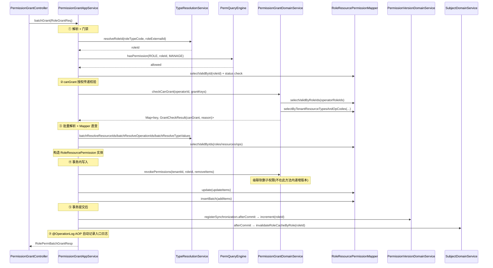

# 权限中心 — 核心功能实现设计

> 本文档是 `overview.md` 的**实现层补充**，聚焦于鉴权查询和权限授权管理两大核心模块的执行链路设计。
> 本文档不定义对外 API 路径、请求体、响应体或错误原因；这些内容以 `api-contract.md` 为准。
> 阅读本文档前请先阅读 `overview.md` 了解业务概念；表结构以 `../schema/permission-center.sql` 为准。

---

## 目录

1. [整体分层与类清单](#1-整体分层与类清单)
2. [公共 Domain Service 设计](#2-公共-domain-service-设计)
3. [鉴权查询模块（PermQueryEngine）](#3-鉴权查询模块permqueryengine)
4. [权限授权管理模块](#4-权限授权管理模块)
5. [缓存设计](#5-缓存设计)
6. [操作日志 AOP 机制](#6-操作日志-aop-机制)
7. [DTO 与内部模型边界](#7-dto-与内部模型边界)

---

## 1. 整体分层与类清单

### 1.1 分层架构

```
Controller ──► AppService（调度层） ──► DomainService（领域层） ──► Mapper（数据访问）
                                         ├── PermQueryEngine（统一鉴权引擎）
                                         └── AOP（@OperationLog 自动记录入口日志）
```

### 1.2 包结构

```
cn.ac.fage.accessmesh.permission
├── aop
│   ├── OperationLog                  ← 注解
│   ├── OperationLogAspect            ← 切面
│   └── OperationLogRuntimeContext    ← ThreadLocal 上下文
├── cache                             ← CacheService 缓存目录
├── config                            ← 配置类
├── constant                          ← 常量（OperationCodeConstants 等）
├── controller (19)
│   ├── AuthController
│   ├── BizDomainController
│   ├── ConditionController
│   ├── ConflictRuleController
│   ├── DomainConfigController
│   ├── LogQueryController
│   ├── OperationController
│   ├── PermissionGrantController
│   ├── PermissionVersionController
│   ├── PermissionViewController
│   ├── ResourceApiMappingController
│   ├── ResourceController
│   ├── ResourceDependencyController
│   ├── RoleController
│   ├── ServiceConfigController
│   ├── SystemConfigController
│   ├── TypeDefinitionController
│   ├── UserController
│   └── UserRoleController
├── service
│   ├── impl (20 AppService 实现)
│   │   ├── BizDomainAppServiceImpl
│   │   ├── ConditionAppServiceImpl
│   │   ├── ConflictRuleAppServiceImpl
│   │   ├── DependencyAppServiceImpl
│   │   ├── DomainConfigAppServiceImpl
│   │   ├── GroupRoleAppServiceImpl
│   │   ├── LogQueryAppServiceImpl
│   │   ├── OperationAppServiceImpl
│   │   ├── PermissionCheckAppServiceImpl
│   │   ├── PermissionGrantAppServiceImpl
│   │   ├── PermissionQueryAppServiceImpl
│   │   ├── PermissionVersionAppServiceImpl
│   │   ├── PermissionViewAppServiceImpl
│   │   ├── ResourceManageAppServiceImpl
│   │   ├── RoleManageAppServiceImpl
│   │   ├── ServiceConfigAppServiceImpl
│   │   ├── ServiceSyncAppServiceImpl
│   │   ├── SystemConfigAppServiceImpl
│   │   ├── TypeDefinitionAppServiceImpl
│   │   └── UserManageAppServiceImpl
│   └── domain (11 个接口 + 11 个实现，另含 ResolveContext 与 PermQueryEngine)
│       ├── AuditDomainService / *Impl
│       ├── DomainClassifyService / *Impl
│       ├── MappingSyncHandler / *Impl
│       ├── PermissionConditionDomainService / *Impl
│       ├── PermissionConflictDomainService / *Impl
│       ├── PermissionGrantDomainService / *Impl
│       ├── PermissionVersionDomainService / *Impl
│       ├── ResolveContext                            ← 类型预解析上下文
│       ├── ResourceEntityDomainService / *Impl
│       ├── ResourceSyncHandler / *Impl
│       ├── SubjectDomainService / *Impl              ← 角色解析+用户查询合并
│       ├── TypeResolutionService / *Impl
│       └── impl/PermQueryEngine                      ← 统一鉴权引擎
├── mapper (18)
│   ├── AbstractRoleMapper
│   ├── AbstractUserMapper
│   ├── BizDomainMapper
│   ├── DomainConfigMapper
│   ├── OperationLogMapper
│   ├── OperationPermissionMapper
│   ├── PermissionChangeLogMapper
│   ├── PermissionConditionMapper
│   ├── PermissionConflictRuleMapper
│   ├── PermissionVersionMapper
│   ├── ResourceApiMappingMapper
│   ├── ResourceDependencyMapper
│   ├── ResourceEntityMapper
│   ├── RoleResourcePermissionMapper
│   ├── ServiceConfigMapper
│   ├── SystemConfigMapper
│   ├── TypeDefinitionMapper
│   └── UserRoleMapper
├── entity / dto / vo / enums / util（关键类型示例）
│   ├── ConditionEvalUtils
│   ├── JsonValidationUtils
│   ├── OperationPermissionUtils
│   ├── OperatorContext / OperatorUtil
│   ├── PageUtil
│   ├── PermissionConstants
│   ├── PermQuery / PermResult / PermViewFilter / PermViewResult
│   ├── PermResultUtils
│   ├── PermTreeAssembler
│   ├── PermViewAssembler
│   ├── RolePermEntryMapper                         ← 在 util 包（非 domain）
│   ├── SecurityEventType / SecurityLogUtil / SecurityUtils
│   ├── SnapshotAssembler
│   ├── StringUtils
│   └── TreeBuilder
└── config
```

---

## 2. 公共 Domain Service 设计

以下 Domain Service 被多个 AppService 复用，是分层规范中公共逻辑复用的关键。

---

### 2.1 `SubjectDomainService` — 主体领域（角色解析 + 用户查询合并）

合并了旧 `AbstractUserDomainService`、`AbstractRoleDomainService` 和 `UserRoleDomainService`。

```java
public interface SubjectDomainService {

    // 用户查询
    AbstractUser selectValidUserById(Long tenantId, Long userId);

    // 角色查询/写入（其余 createRole、softDeleteRoleBatch 等方法省略）
    AbstractRole selectValidRoleById(Long tenantId, Long roleId);

    // 用户有效角色解析
    Set<Long> resolveEffectiveRoles(Long tenantId, Long userId);
    Map<Long, Set<Long>> batchResolveEffectiveRoles(Long tenantId, Set<Long> userIds);

    // 缓存失效
    void invalidateRoleCacheBatch(Long tenantId, Set<Long> userIds);
    void invalidateRoleCacheByRole(Long tenantId, Long roleId);
}
```

---

### 2.2 `PermissionVersionDomainService` — 权限版本管理

```java
public interface PermissionVersionDomainService {
    long getCurrentVersion(Long tenantId, Long roleId);
    long increment(Long tenantId, Long roleId);
    void batchIncrement(Long tenantId, Collection<Long> roleIds);
}
```

---

### 2.3 `AuditDomainService` — 审计领域（合并 PermissionChangeDomainService + OperationLogDomainService）

```java
public interface AuditDomainService {

    // 变更日志记录
    void recordChangeLog(ChangeLogContext context, List<ChangeLogEntry> changes);

    // 操作日志记录（异步）
    void asyncRecordLog(String module, String action, String targetType, Long targetId,
                        String summary, Long operatorId, String ipAddress, String requestId, Long tenantId);

    // 变更历史查询
    List<PermissionChangeLog> queryRecentChanges(...);
    long countRecentChanges(...);
}
```

---

### 2.4 `PermissionConflictDomainService` — 冲突规则

```java
public interface PermissionConflictDomainService {
    Set<Long> filterRoleMutex(Long tenantId, Set<Long> effectiveRoleIds);
    List<RolePermEntry> filterPermMutex(Long tenantId, List<RolePermEntry> passedEntries);
}
```

---

### 2.5 `PermissionConditionDomainService` — 条件校验

```java
public interface PermissionConditionDomainService {
    List<RolePermEntry> evaluate(Long tenantId, List<RolePermEntry> entries, Map<String, Object> context);
}
```

---

### 2.6 `TypeResolutionService` — 类型解析

```java
public interface TypeResolutionService {
    Map<String, Integer> batchResolveTypeValues(Long tenantId, String typeKey, Set<String> codes);
    Map<Integer, String> batchResolveTypeCodes(Long tenantId, String typeKey, Set<Integer> values);
    Map<String, Long> batchResolveOperationIds(Long tenantId, String resourceTypeCode, Set<String> opCodes);
    Map<ResourceResolveKey, Long> batchResolveResourceIds(Long tenantId, List<ResourceResolveRequest> requests);
}
```

---

### 2.7 `DomainClassifyService` — 域分类

```java
public interface DomainClassifyService {
    boolean matchesTypeCode(Long tenantId, DomainQueryMode mode, String domainCode, String typeCode);
    Set<String> getClassifiedTypeCodes(Long tenantId, String domainCode);
    Long findDomainIdByTypeCode(Long tenantId, String typeCode);
}
```

---

### 2.8 `PermissionGrantDomainService` — 权限授权领域

```java
public interface PermissionGrantDomainService {
    boolean canGrantPermission(Long tenantId, Long operatorId, String resourceTypeCode,
                               String resourceCode, String operationCode, boolean scopeAll, String domainCode);

    Map<String, GrantCheckResult> checkCanGrant(Long tenantId, Long operatorId,
                                                Set<GrantCheckKey> permissions, String domainCode);

    void revokePermissions(Long tenantId, Long roleId, List<Long> permissionIds);

    record GrantCheckKey(String resourceTypeCode, String resourceCode,
                         String operationCode, boolean scopeAll) {}

    record GrantCheckResult(boolean canGrant, String reason) {}
}
```

---

### 2.9 `ResourceEntityDomainService` — 资源实体领域

资源层级操作、树形展开等。

---

### 2.10 `ResolveContext` — 类型预解析上下文

在 PermQueryEngine 查询管线中批量预解析 `resourceTypeCode→typeValue` 和 `(resourceTypeCode, operationCode)→operationId`，避免管线中重复调用 TypeResolutionService。

---

## 3. 鉴权查询模块（PermQueryEngine）

### 3.1 统一入口

所有权限查询和校验统一通过 `PermQueryEngine` 执行。引擎提供两层 API：

**AppService 层便捷 API**（适合内部 ID 级单目标/批量校验）：

```java
// 单目标鉴权
boolean ok = engine.hasPermission(tenantId, operatorId, ResourceTypeCode.ROLE, roleId, OperationCodeConstants.MANAGE);

// 批量校验（拒绝时抛 SecurityException）
engine.validateBatch(tenantId, operatorId, ResourceTypeCode.ROLE, roleIds, OperationCodeConstants.DELETE);

// 批量获取拒绝 ID 集合
Set<Long> denied = engine.getDeniedIds(tenantId, operatorId, ResourceTypeCode.USER, userIds, OperationCodeConstants.MANAGE);
```

**`getDeniedIds` 优化策略**（批量拒绝场景）：

1. 一次查询解析用户角色（`SubjectDomainService.resolveEffectiveRoles`）
2. 一次查询类型级权限（`selectScopeAllPermsByBitsBatch`）-- scopeAll 匹配则全部允许
3. 否则，一次批量查询实例级权限（`selectInstancePermsByBitsBatch`）
4. 内存计算拒绝 ID 集合

**复杂查询 API**（`PermQuery` 工厂方法 + `engine.query(PermQuery)`）：

| 工厂方法                      | 模式     | 用途                                                   |
| ----------------------------- | -------- | ------------------------------------------------------ |
| `PermQuery.forAuthCheck`      | 鉴权校验 | 类型+实例，scopeAll 匹配时提前返回，完整评估           |
| `PermQuery.forInterfaceCheck` | 接口鉴权 | 类型优先+实例回退，完整评估，返回所有辅助信息          |
| `PermQuery.forResourceQuery`  | 资源过滤 | 仅实例级查询，不评估条件/冲突，含资源和操作            |
| `PermQuery.forResourceCheck`  | 资源检查 | 全范围+实例，完整评估条件/冲突，含资源和操作           |
| `PermQuery.forValidate`       | 管理校验 | 类型+实例，不评估，最小输出                            |
| `PermQuery.forScopeQuery`     | 范围查询 | 不提前返回，不评估，返回全部辅助信息                   |
| `PermQuery.forUserView`       | 用户视图 | 全量角色权限记录（`selectValidByRoleIds`），不按位过滤 |

### 3.2 引擎管线流程

```
PermQueryEngine.query(PermQuery q)
    │
    ├─ forUserView → queryForUserView()
    │     ├─ resolveRoleIds → SubjectDomainService
    │     ├─ selectValidByRoleIds → 全量角色权限（不按位过滤）
    │     ├─ evaluateIfNeeded → 条件+冲突
    │     └─ loadAncillaryForView → 批量加载 Resource/Operation/Role
    │
    └─ 通用查询：
          ├─ 0. 创建 ResolveContext（预解析 resourceTypes + operationIds）
          ├─ 1. resolveRoleIds → SubjectDomainService
          ├─ 2. resolveResourceTypes → ResolveContext
          ├─ 3. resolveOperationIds + resolveBitMasks → 位掩码计算
          ├─ 4. queryScopeAll → selectScopeAllPermsByBitsBatch (1 SQL)
          │     └─ scopeAll 匹配 && earlyReturnOnScopeAll → 提前返回
          ├─ 5. resolveEntityIds → TypeResolutionService.batchResolveResourceIds
          ├─ 6. queryInstance → selectInstancePermsByBitsBatch (1 SQL)
          ├─ 6.5. expandByInheritMode → inheritParents/inheritChildren 展开
          ├─ 7. 合并 scopeAll + instance entries
          ├─ 8. evaluateIfNeeded → conditions + conflicts
          └─ 9. loadAncillary → 批量加载 Resource/Operation/Role
```

### 3.3 PermResult 与 PermResultUtils

`engine.query()` 返回 `PermResult` 对象，包含：

- `allowed` / `reason`
- `scopeAllMatched` / `scopeAllEntries` / `instanceEntries`
- `resourceMap` / `operationMap` / `roleMap`（按 `includeXxx` 标志选择性加载）

`PermResultUtils` 提供转换方法将 `PermResult` 转为对外响应：

- `PermResultUtils.toAuthCheckResp(result)` — `check` / `batch-check` 响应
- `PermResultUtils.validateOrThrow(result)` — `validate` 模式，拒绝时抛异常

### 3.4 scopeAll 处理

scopeAll 是 `RolePermEntry` 的一等维度，引擎查询管线中作为类型级权限单独查询。两个关键的装配器以不同方式处理 scopeAll：

| 装配器              | scopeAll 处理方式                                                                                          |
| ------------------- | ---------------------------------------------------------------------------------------------------------- |
| `SnapshotAssembler` | 不展开，直接作为 `ApiPermissionEntry(scopeAll=true, httpMethod=null, pathPattern=null)` 返回               |
| `PermViewAssembler` | 按 `resourceType` 分组输出 scopeAll 视图项（如 `DATA_EDIT + DEPT + scopeAll=true` 表示可编辑全部部门范围） |

### 3.5 资源继承展开（引擎层）

- `PermQuery.setInheritMode("PARENT"/"CHILD"/"BOTH")` 设置继承模式 → 自动转为 `inheritParents`/`inheritChildren` 布尔标志
- 引擎在 `expandByInheritMode()` 中：
  1. 加载全部有效资源（`resourceEntityMapper.selectAllValid`）构建父子图
  2. `inheritChildren` → 递归收集所有子孙资源，为每个克隆权限条目（`grantSource="INHERITED"`）
  3. `inheritParents` → 向上遍历父链，为每个祖先克隆权限条目
  4. scopeAll 条目（`resourceEntityId=null`）不参与继承展开

### 3.6 对外接口

| 接口         | 路径                                     | 引擎入口                                                      |
| ------------ | ---------------------------------------- | ------------------------------------------------------------- |
| 单次鉴权     | `POST /api/perm/auth/check`              | `engine.query(PermQuery.forAuthCheck())`                      |
| 批量鉴权     | `POST /api/perm/auth/batch-check`        | `engine.query(PermQuery.forAuthCheck())` x N                  |
| 资源权限查询 | `POST /api/perm/auth/query-resources`    | `engine.query(PermQuery.forResourceCheck())`                  |
| 范围权限查询 | `POST /api/perm/auth/query-scopes`       | `engine.query(PermQuery.forScopeQuery())`                     |
| 接口级判定   | `POST /api/perm/auth/check-interface`    | `engine.query(PermQuery.forInterfaceCheck())`                 |
| 权限视图     | `POST /api/perm/permission-view/*`       | `engine.query(PermQuery.forUserView())` + `PermViewAssembler` |
| 接口快照     | `POST /api/perm/auth/interface-snapshot` | `engine.query()` + `SnapshotAssembler`                        |

---

## 4. 权限授权管理模块

### 4.1 接口定义

| 接口           | 路径                                                   | 说明                                 |
| -------------- | ------------------------------------------------------ | ------------------------------------ |
| 三段式保存授权 | `POST /api/perm/role-resource-permission/save`         | 为角色批量新增/更新/删除资源权限     |
| 查询角色权限   | `POST /api/perm/role-resource-permission/list`         | 查询角色已有权限列表（含子权限展开） |
| 批量回收授权   | `POST /api/perm/role-resource-permission/revoke`       | 按权限记录批量回收授权               |
| 查询子权限     | `POST /api/perm/role-resource-permission/children`     | 查询主权限下子权限                   |
| 添加子权限     | `POST /api/perm/role-resource-permission/add-child`    | 添加依赖主权限的范围/子权限          |
| 删除子权限     | `POST /api/perm/role-resource-permission/remove-child` | 删除子权限                           |

---

### 4.2 批量授权执行链路

#### 入参 DTO

```java
/** POST /api/perm/role-resource-permission/save，对外契约以 api-contract.md 为准 */
public record RoleResourcePermissionSaveReq(
    String domainCode,
    @NotBlank String roleTypeCode,
    @NotBlank String roleExternalId,
    List<PermGrantItem> add,        // 新增条目
    List<PermUpdateItem> update,    // 更新条目
    List<Long> remove               // 要删除的 role_resource_permission.id 列表
) {}

public record PermGrantItem(
    @NotBlank String resourceTypeCode,
    String resourceCode,
    String codeType,
    @NotBlank String operationCode,
    Boolean scopeAll,
    String conditionCode,           // 可空，权限条件业务键
    Boolean canGrant               // 可空，默认 false
) {}

public record PermUpdateItem(
    @NotNull Long id,               // role_resource_permission.id
    String conditionCode,
    Boolean canGrant
) {}

/** Service 层内部对象：Controller 解析 Header、角色业务键、资源业务键、操作码后得到 */
record RoleResourcePermissionSaveCommand(
    Long tenantId,
    Long abstractRoleId,
    List<RolePermGrantItem> add,
    List<RolePermUpdateItem> update,
    List<Long> remove
) {}
```

#### 出参 DTO

```java
public record RolePermBatchGrantResp(
    int addedCount,
    int updatedCount,
    int deletedCount,
    List<Long> autoGrantedIds   // 由 resource_dependency 自动补全的权限 id 列表
) {}
```

#### 执行链路时序图



#### `PermissionGrantAppService` 调度逻辑（伪代码）

```java
@Service
public class PermissionGrantAppServiceImpl implements PermissionGrantAppService {

    @Transactional(rollbackFor = Exception.class)
    @OperationLog(module = "perm", action = "BATCH_GRANT", targetType = "abstract_role",
        targetId = "#req.roleExternalId", summary = "save granted role perms")
    public List<RolePermissionItemResp> batchGrant(Long tenantId, RoleGrantReq req) {

        // ① 解析roleId + 权限门禁
        Long roleId = typeResolutionService.resolveRoleId(tenantId, req.roleTypeCode(), ...);
        engine.hasPermission(tenantId, operatorId, ROLE, roleId, MANAGE);
        AbstractRole role = abstractRoleMapper.selectValidById(roleId, tenantId);

        // ② canGrant 授权传递校验（直查 Mapper，不走引擎）
        permissionGrantDomainService.checkCanGrant(tenantId, operatorId, grantKeys, domainCode);

        // ③ 批量解析 + Mapper 直查
        typeResolutionService.batchResolveResourceIds/batchResolveOperationIds/batchResolveTypeValues
        resourceEntityMapper.selectValidByIds / operationPermissionMapper.selectBy...
        permissionConditionMapper.selectValidByCode

        // ④ 事务内写入
        permissionGrantDomainService.revokePermissions(tenantId, roleId, removeItems); // 含级联子权限
        rolePermMapper.update(updateItems);
        rolePermMapper.insertBatch(toInsert);
        // revokePermissions 不在此处递增版本，由外层 afterCommit 统一处理

        // ⑤ 事务提交后：版本递增 + 缓存失效
        TransactionSynchronizationManager.registerSynchronization(new TransactionSynchronization() {
            public void afterCommit() {
                permissionVersionDomainService.increment(tenantId, roleId);
                subjectDomainService.invalidateRoleCacheByRole(tenantId, roleId);
            }
        });
        // 入口操作日志由 @OperationLog AOP 自动记录
    }
```

## 5. 缓存设计

### 5.1 缓存 Key 与 TTL 汇总

| 缓存内容                    | Redis Key 模式                                                                 | L1 TTL    | L2 TTL               |
| --------------------------- | ------------------------------------------------------------------------------ | --------- | -------------------- |
| 用户有效角色集合            | `perm:user:effective-roles:{tenantId}:{userId}`                                | 60 秒     | 5 分钟               |
| 角色权限快照（资源+操作位） | `perm:role:perms:{tenantId}:{roleId}`                                          | 60 秒     | 5 分钟               |
| 角色权限版本号              | `perm:permission-version:role:{tenantId}:{roleId}`                             | 不缓存 L1 | 永不过期（主动更新） |
| Gateway 接口快照            | `perm:gateway:interface-snapshot:{tenantId}:{serviceCode}:{permissionVersion}` | 30 秒     | 3 分钟               |
| 角色互斥规则                | `perm:conflict-rule:role-mutex:{tenantId}`                                     | 5 分钟    | 10 分钟              |
| 权限互斥规则                | `perm:conflict-rule:perm-mutex:{tenantId}`                                     | 5 分钟    | 10 分钟              |

### 5.2 缓存失效触发点

```
权限变更（role_resource_permission）
  → 角色权限快照失效（evictRolePermSnapshot）
    → 接口快照切换到新 permissionVersion 键（旧键自然冷却）
  → 角色版本递增（setPermVersion）
  → 关联用户角色缓存失效（查询 user_role WHERE target_id=roleId，逐一失效）

用户-角色关联变更（user_role）
  → 该用户角色缓存失效（evictEffectiveRoles）
  → 若目标为 GROUP_ROLE：递归失效所有子角色对应的用户缓存 + extra.basicRoleIds 引用的用户缓存

依赖规则变更（resource_dependency）
  → 按 grant_dep_id 精准清理 role_resource_permission 中的 AUTO_DEP 补全记录
  → 重新评估受影响角色的自动补全状态（清理旧补全 + 补全新权限）
  → 角色权限快照失效 + 接口快照失效 + 角色版本递增 + 用户缓存失效

角色停用（abstract_role.status=0）
  → 递归失效关联所有用户的角色缓存
  → 相关接口快照失效

GROUP_ROLE 变更（parent_id 或 extra.basicRoleIds 修改）
  → 递归失效关联该分组角色（含子角色）的所有用户缓存
```

### 5.3 Gateway 回调鉴权流程

```
Gateway L1 缓存未命中时：
  1. 从 Token 中提取 tenant_id、abstract_user_id
  2. 从路由信息提取 serviceCode、httpMethod、path
  3. 构建 context 对象：{ "ip": "从请求头提取", "timestamp": "当前时间", ... }
  4. POST /api/perm/auth/check-interface → 权限中心
     入参：{ tenantId, userId, serviceCode, httpMethod, path, context }
  5. 权限中心内部：
     a. 读 Redis perm:user:roles:{tenantId}:{userId} → 用户有效角色集合
     b. 对每个角色读 Redis perm:role:perms:{tenantId}:{roleId} → 角色权限
     c. 匹配 serviceCode + httpMethod + path
     d. 对有 hasCondition=true 的条目 → 使用 context 评估条件
     e. 返回 allowed/denied + reason
  6. 写入 L1 缓存（TTL 30s）
  7. 放行或返回 403

无需版本轮询，无需快照拉取调度器。
```

---

## 6. DTO 与内部模型边界

Controller Request/Response DTO 是对外契约的一部分，统一以 `api-contract.md` 为准；本节只说明实现层需要维护的转换边界，避免把内部数据库 ID 泄漏成外部接口依赖。

### 6.1 Controller DTO 原则

```java
// 对外运行时接口使用稳定业务键，租户来自 X-Tenant-Id 或安全上下文。
record AuthCheckReq(String subjectTypeCode, String subjectExternalId,
                    String resourceTypeCode, String resourceCode,
                    String operationCode, String domainCode,
                    String codeType, String inheritMode,
                    Map<String, Object> context) {}

record CheckInterfaceReq(String subjectTypeCode, String subjectExternalId,
                         String serviceCode, String httpMethod,
                         String path, Map<String, Object> context) {}

record RoleResourcePermissionSaveReq(String domainCode, String roleTypeCode,
                                      String roleExternalId,
                                      List<GrantAddItem> add,
                                      List<GrantUpdateItem> update,
                                      List<Long> remove) {}
```

### 6.2 内部 Command 原则

```java
// 内部 Command 可以使用 tenantId 和数据库 ID，但只能由 Controller/Assembler 解析生成。
record AuthCheckCommand(Long tenantId, Long abstractUserId,
                        Long resourceEntityId, Long operationPermissionId,
                        Long domainId, String inheritMode, // 内部域 ID，由 domainCode 解析得到；非实体内嵌字段
                        Map<String, Object> context) {}

record RoleResourcePermissionSaveCommand(Long tenantId, Long abstractRoleId,
                                         List<RolePermGrantItem> add,
                                         List<RolePermUpdateItem> update,
                                         List<Long> remove) {}

record RolePermEntry(Long roleId, Long resourceEntityId, Long operationPermissionId,
                     Long conditionId, boolean scopeAll, boolean canGrant,
                     Long dependOn) {}
```

转换规则：

- Request DTO 不包含 `tenantId`；`tenantId` 只能来自 `X-Tenant-Id` 或安全上下文。
- 运行时接口不要求调用方传 `abstractUserId/resourceEntityId/operationPermissionId`。
- Controller 或 Assembler 负责把 `subjectExternalId/resourceCode/operationCode` 解析成内部 ID。
- Response DTO 使用 `reason`，错误原因枚举以 `api-contract.md` 为准。
- 列表响应统一包在 `data.items`；分页结构以最终项目规范和 `api-contract.md` 对齐后执行。

### 6.3 公共内部对象

```java
record RolePermSnapshot(Set<Long> roleIds, Map<Long, RolePermBitmap> permBitmaps) {}
record RolePermBitmap(Map<Long, Long> resourceEffectiveBits) {}

record ChangeLogContext(Long tenantId, Long operatorId, String requestId,
                        String changeSource) {}
record ChangeLogEntry(String entityType, Long entityId, String operation,
                      Object oldSnapshot, Object newSnapshot, Object diff,
                      List<Long> affectedUserIds, List<Long> affectedRoleIds) {}
```

---

> **下一步建议**：
>
> - 在此基础上补充用户管理（abstract_user + user_role）模块的执行链路设计
> - 或直接开始 permission-center 服务代码骨架搭建（pom.xml + 主启动类 + 基础配置）

---

## 7. 统一权限检查方案

### 7.1 `canGrant` 字段业务含义

`role_resource_permission.can_grant` 字段表示该权限条目是否可被当前角色关联的用户授予（委托）给他人。

**关键区分**：

- **`canGrant` ≠ 管理权限**：`canGrant` 只用于授权流程判断，不用于鉴权判断
- **管理权限判断**：应通过 `operation_permission.code = "MANAGE"` 实现
- **授权流程**：用户想将某权限授予他人时，需检查该用户对该权限是否拥有 `canGrant=true`

**命名变更记录**：
| 旧字段名 | 新字段名 | 旧语义（错误） | 新语义（正确） |
|----------|----------|----------------|----------------|
| `can_manage` | `can_grant` | 可管理该资源 | 可授权给他人 |

**使用场景**：

- 授权时校验：授权者必须拥有目标权限且 `canGrant=true` 才能将同一权限授予他人
- 委托限制：授权者只能授权自己已有的权限，不能扩大资源、操作或范围
- 被授权对象：由业务服务控制候选范围，permission-center 不负责生成候选列表

---

### 7.2 统一权限检查入口

#### 内部入口 `PermQueryEngine`

permission-center 内部各 Service 的常规鉴权统一通过 `PermQueryEngine` 完成。对单目标使用 `hasPermission`，对批量目标使用 `validateBatch` 或 `getDeniedIds`；涉及资源编码、接口路径或范围查询时继续走 `query(PermQuery)`。

```java
// 单目标鉴权
if (!engine.hasPermission(tenantId, operatorId, ResourceTypeCode.ROLE, roleId, OperationCodeConstants.MANAGE)) {
    throw new SecurityException("Permission denied");
}

// 批量鉴权
engine.validateBatch(tenantId, operatorId, ResourceTypeCode.ROLE, roleIds, OperationCodeConstants.DELETE);
Set<Long> deniedUserIds = engine.getDeniedIds(
    tenantId, operatorId, ResourceTypeCode.USER, userIds, OperationCodeConstants.MANAGE
);

// 复杂查询
PermQuery q = PermQuery.forAuthCheck(tenantId, userId, resourceTypeCode, resourceCode, operationCode);
PermResult r = engine.query(q);
```

**适用边界**：
| 场景 | 入口 |
|------|------|
| 内部 ID 级单目标鉴权 | `engine.hasPermission` |
| 内部 ID 级批量校验 | `engine.validateBatch` / `engine.getDeniedIds` |
| 资源编码、接口路径、范围查询 | `engine.query(PermQuery)` |
| 授权流程中的 `canGrant` 校验 | `PermissionGrantDomainService.checkCanGrant()`（直查 Mapper 批量匹配位运算） |

---

### 7.3 批量权限检查建议

批量操作禁止循环调用单目标鉴权，必须复用 `PermQueryEngine` 的批量 API，避免 N+1 查询。

```java
Set<Long> deniedRoleIds = engine.getDeniedIds(
    tenantId, operatorId, ResourceTypeCode.ROLE, roleIds, OperationCodeConstants.MANAGE
);
if (!deniedRoleIds.isEmpty()) {
    throw new SecurityException("No permission to manage roles: " + deniedRoleIds);
}
```

**N+1 对比**：
| 方式 | 批量删除 100 个用户 | 批量删除 100 个角色 |
|------|---------------------|---------------------|
| 循环调用 `hasPermission` | 100 次校验/查询 | 100 次校验/查询 |
| 使用 `validateBatch` / `getDeniedIds` | 1 次统一管线 + 批量查询 | 1 次统一管线 + 批量查询 |

---

### 7.4 `canGrant` 授权校验

`canGrant` 语义只用于授权流程，不属于通用鉴权。`canGrant` 校验通过 `PermissionGrantDomainService.checkCanGrant()` 完成：

```java
// operator 需拥有目标权限且 canGrant=true 才能授予他人
// 在 PermissionGrantAppServiceImpl 中通过 PermQueryEngine 查询 operator 的 role_resource_permission 记录，
// 检查 operator 是否拥有相同的 (resourceType, resourceCode/scopeAll, operationCode) 授权且 canGrant=true
```

**scopeAll 授权规则**：

- 授权 `scopeAll=false`（特定资源）：operator 可用 `scopeAll=true` 或特定资源权限
- 授权 `scopeAll=true`（全量范围）：operator 必须有 `scopeAll=true`

**适用边界**：
| 场景 | 入口 |
|------|------|
| 判断是否有普通管理权限 | `PermQueryEngine` |
| 判断是否可以把某权限授予他人 | `PermissionGrantDomainService.checkCanGrant()`（批量查询 operator 权限，位运算匹配目标操作） |

---

### 7.5 权限树查询接口 `query-permission-tree`

用于外部系统查询从某个资源节点出发，用户能操作的层级关系。

**接口路径**：`POST /api/perm/auth/query-permission-tree`

**入参 DTO**：

```java
public record PermissionTreeReq(
    @NotBlank String subjectTypeCode,
    @NotBlank String subjectExternalId,
    @NotBlank String resourceTypeCode,
    @NotBlank String resourceCode,          // 起点资源
    String codeType,
    @NotEmpty Set<String> operationCodes,   // 操作类型集合
    @NotBlank String direction,             // ANCESTORS(向上) / DESCENDANTS(向下) / BOTH(双向)
    Integer maxDepth,                       // 最大层级深度
    String domainCode,
    Map<String, Object> context
) {}
```

**返回 DTO**：

```java
public record PermissionTreeResp(
    TreeNode root,                          // 起点节点
    List<TreeNode> ancestors,               // 父级链路（direction=ANCESTORS/BOTH）
    List<TreeNode> descendants,             // 子级树（direction=DESCENDANTS/BOTH）
    String permissionVersion,
    int cacheTtlSeconds
) {
    public record TreeNode(
        Long resourceId,
        String resourceTypeCode,
        String resourceCode,
        String resourceName,
        int depth,                          // 相对起点的层级
        Set<String> operations,             // 用户对该节点拥有的操作
        boolean canGrant,                   // 是否可授权
        List<TreeNode> children             // 子节点（仅descendants树）
    ) {}
}
```

**典型场景**：
| 场景 | direction | 用途 |
|------|-----------|------|
| 用户能看到某个菜单，想知道父菜单链路 | `ANCESTORS` | 显示面包屑导航时过滤无权限节点 |
| 用户有某个组织管理权限，想知道下级组织树 | `DESCENDANTS` | 组织管理页面显示可管理的子组织 |
| 用户对某个角色有权限，想知道完整层级关系 | `BOTH` | 角色权限配置页面 |

**与 `query-resources` 的区别**：
| 维度 | `query-resources` | `query-permission-tree` |
|------|-------------------|------------------------|
| 查询起点 | 无起点，查所有可访问资源 | 从指定资源节点出发 |
| 遍历方向 | 只向下（children） | 支持向上/向下/双向 |
| 返回范围 | 用户有权限的全部资源 | 只返回起点路径上有权限的节点 |
| 用途 | "我能访问哪些资源" | "从某资源出发，我能操作的层级关系" |

---

### 7.6 实现注意事项

1. **移除 `CAN_MANAGE` 误用**：不再使用 `CAN_MANAGE` 作为权限判断条件，统一使用 `OperationCodeConstants.MANAGE`
2. **`canGrant` 只用于授权流程**：在 `PermissionGrantAppServiceImpl` 中通过 `PermissionGrantDomainService.checkCanGrant()` 校验，不在普通鉴权时使用
3. **统一入口**：内部权限检查统一调用 `PermQueryEngine.hasPermission/validateBatch/getDeniedIds` 或 `query(PermQuery)`，避免各 Service 分散实现
4. **批量检查避免 N+1**：批量操作（删除、修改）使用 `validateBatch`、`getDeniedIds`，一次统一管线完成全部权限校验
5. **业务例外显式处理**：如”允许操作自己”之类的场景，由具体业务服务在调用引擎前后显式处理，不再引入独立的 `PermissionCheckUtils` 抽象
6. **树形遍历深度限制**：`query-permission-tree` 必须有 `maxDepth` 限制，防止无限递归

### 7.7 授权安全校验（Grant Validation）

**问题背景**：原 `batchGrant` 方法只检查 operator 是否有 MANAGE 权限，未检查是否能授予特定权限。这导致：

- 用户可授予自己不拥有的权限
- 用户可授予自己拥有但 `canGrant=false` 的权限
- 用户可授予 `scopeAll=true` 但自己只有特定资源权限的权限

**修复方案**：在 `PermissionGrantAppServiceImpl.batchGrant` 中增加授权校验逻辑。

#### 校验逻辑

```java
// 对每个 add 项校验：
// 1. operator 必须有相同的权限（resourceType + resource/scopeAll + operation）
// 2. operator 的该权限必须有 canGrant=true
// 3. 如果授予 scopeAll=true，operator 必须有 scopeAll=true（不能从特定资源权限授权全量）

Set<PermissionGrantDomainService.GrantCheckKey> grantKeys = addItems.stream()
    .map(item -> new PermissionGrantDomainService.GrantCheckKey(
        item.resourceTypeCode(),
        item.resourceCode(),
        item.operationCode(),
        item.scopeAll()
    ))
    .collect(Collectors.toSet());

Map<String, PermissionGrantDomainService.GrantCheckResult> grantResults =
    permissionGrantDomainService.checkCanGrant(tenantId, operatorId, grantKeys, domainCode);

// 校验每项，不满足则抛 SecurityException
for (GrantAddItem item : addItems) {
    PermissionGrantDomainService.GrantCheckResult result = grantResults.get(buildGrantKey(item));
    if (result == null || !result.canGrant()) {
        throw new SecurityException("Operator cannot grant permission...");
    }
}
```

#### 实现要点

1. **scopeAll 校验规则**：
   - 授权 `scopeAll=false`（特定资源）：operator 可用 `scopeAll=true` 或特定资源权限
   - 授权 `scopeAll=true`（全量范围）：operator 必须有 `scopeAll=true`

2. **update 项校验**：
   - 如果 update 设置 `canGrant=true`，operator 必须有该权限且 `canGrant=true`

3. **符合 api-contract.md 约定**：
   - 授权者必须已经拥有目标权限且该权限 `canGrant=true`
   - 对范围权限，授权者只能授权自己已有的范围；拥有 `scopeAll=true` 才能授权全量范围

4. **`canGrant` 校验通过 `PermissionGrantDomainService.checkCanGrant()` 完成**：查询 operator 的有效角色权限（`role_resource_permission`），匹配目标 (resourceType, resourceCode/scopeAll, operationCode)，检查是否存在 `canGrant=true` 的记录。

#### 错误码

| reason                  | 说明                               |
| ----------------------- | ---------------------------------- |
| `NO_ROLE`               | operator 无有效角色                |
| `NO_PERMISSION`         | operator 无该权限                  |
| `NO_GRANT_RIGHT`        | operator 有权限但 `canGrant=false` |
| `RESOURCE_NOT_FOUND`    | 资源不存在                         |
| `INVALID_RESOURCE_TYPE` | 资源类型无效                       |
| `INVALID_OPERATION`     | 操作类型无效                       |

#### 批量查询优化（避免 N+1）

采用批量查询策略，通过 `PermQueryEngine.getDeniedIds()` 或直接查询 `RoleResourcePermissionMapper` 完成批量 canGrant 校验，将 N 次数据库访问优化为固定 3-4 次：

| 步骤 | 查询内容                                                                                    | 查询次数     |
| ---- | ------------------------------------------------------------------------------------------- | ------------ |
| 1    | 获取 operator 的有效角色（`SubjectDomainService.resolveEffectiveRoles`）                    | 1 次         |
| 2    | 批量查询所有涉及的 operationPermissions（`TypeResolutionService.batchResolveOperationIds`） | 1 次         |
| 3    | 批量解析所有 resourceEntityIds（`TypeResolutionService.batchResolveResourceIds`）           | 1 次（批量） |
| 4    | 批量查询所有 roleResourcePermissions（`RoleResourcePermissionMapper`）                      | 1 次         |
