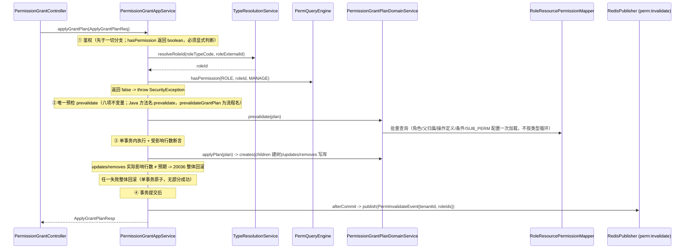

# 权限中心 — 核心功能实现设计

> 本文档是 `overview.md` 的**实现层补充**，聚焦于鉴权查询和权限授权管理两大核心模块的执行链路设计。
> 本文档不定义对外 API 路径、请求体、响应体或错误原因；这些内容以 `api-contract.md` 为准。
> 阅读本文档前请先阅读 `overview.md` 了解业务概念；表结构以 `../schema/access-service.sql` 为准（唯一权威 DDL；文中「permission-center」指 access-service permission 域，见 overview.md 术语注记）。

---

## 目录

1. [整体分层与类清单](#1-整体分层与类清单)
2. [公共 Domain Service 设计](#2-公共-domain-service-设计)
3. [鉴权查询模块（PermQueryEngine）](#3-鉴权查询模块permqueryengine)
4. [权限授权管理模块](#4-权限授权管理模块)
5. [缓存设计](#5-缓存设计)
6. [操作日志 AOP 机制](#6-操作日志-aop-机制)
7. [DTO 与内部模型边界](#7-dto-与内部模型边界)

---

## 1. 整体分层与类清单

### 1.1 分层架构

```
Controller ──► AppService（调度层） ──► DomainService（领域层） ──► Mapper（数据访问）
                                         ├── PermQueryEngine（统一鉴权引擎）
                                         └── AOP（@OperationLog 自动记录入口日志）
```

### 1.2 包结构

```
cn.ac.fage.accessmesh.permission
├── aop
│   ├── OperationLog                  ← 注解
│   ├── OperationLogAspect            ← 切面
│   └── OperationLogRuntimeContext    ← ThreadLocal 上下文
├── cache                             ← CacheService 缓存目录
├── config                            ← 配置类
├── constant                          ← 常量（OperationCodeConstants 等）
├── controller (22)
│   ├── AbstractRoleSyncController
│   ├── AbstractUserSyncController
│   ├── AuthController
│   ├── BizDomainController
│   ├── ConditionController
│   ├── ConflictRuleController
│   ├── DomainConfigController
│   ├── LogQueryController
│   ├── OperationController
│   ├── PermissionGrantController
│   ├── PermissionViewController
│   ├── ResourceApiMappingController
│   ├── ResourceController
│   ├── ResourceDependencyController
│   ├── ResourceEntitySyncController
│   ├── RoleController
│   ├── ServiceConfigController
│   ├── SystemConfigController
│   ├── TypeDefinitionController
│   ├── UserController
│   ├── UserRoleController
│   └── UserRoleSyncController
├── service
│   ├── impl (22 AppService 实现；GroupRoleAppServiceImpl 随 T-PERM-043 写入口删除)
│   │   ├── AbstractRoleSyncAppServiceImpl
│   │   ├── AbstractUserSyncAppServiceImpl
│   │   ├── BizDomainAppServiceImpl
│   │   ├── ConditionAppServiceImpl
│   │   ├── ConflictRuleAppServiceImpl
│   │   ├── DependencyAppServiceImpl
│   │   ├── DomainConfigAppServiceImpl
│   │   ├── LogQueryAppServiceImpl
│   │   ├── OperationAppServiceImpl
│   │   ├── PermissionCheckAppServiceImpl
│   │   ├── PermissionGrantAppServiceImpl
│   │   ├── PermissionQueryAppServiceImpl
│   │   ├── PermissionViewAppServiceImpl
│   │   ├── ResourceEntitySyncAppServiceImpl
│   │   ├── ResourceManageAppServiceImpl
│   │   ├── RoleManageAppServiceImpl
│   │   ├── ServiceConfigAppServiceImpl
│   │   ├── ServiceSyncAppServiceImpl
│   │   ├── SystemConfigAppServiceImpl
│   │   ├── TypeDefinitionAppServiceImpl
│   │   ├── UserManageAppServiceImpl
│   │   └── UserRoleSyncAppServiceImpl
│   └── domain (11 个接口 + 11 个实现，另含同步策略、ResolveContext 与 PermQueryEngine)
│       ├── AuditDomainService / *Impl
│       ├── DomainClassifyService / *Impl
│       ├── MappingSyncHandler / *Impl
│       ├── PermissionConditionDomainService / *Impl
│       ├── PermissionConflictDomainService / *Impl
│       ├── PermissionGrantDomainService / *Impl
│       ├── ResolveContext                            ← 类型预解析上下文
│       ├── ResourceEntityDomainService / *Impl
│       ├── ResourceSyncHandler / *Impl
│       ├── SubjectDomainService / *Impl              ← 角色解析+用户查询合并
│       ├── SyncMetadataDomainService / *Impl
│       ├── TypeResolutionService / *Impl
│       └── impl/PermQueryEngine                      ← 统一鉴权引擎
├── mapper (18)
│   ├── AbstractRoleMapper
│   ├── AbstractUserMapper
│   ├── BizDomainMapper
│   ├── DomainConfigMapper
│   ├── OperationLogMapper
│   ├── OperationPermissionMapper
│   ├── PermissionChangeLogMapper
│   ├── PermissionConditionMapper
│   ├── PermissionConflictRuleMapper
│   ├── ResourceApiMappingMapper
│   ├── ResourceDependencyMapper
│   ├── ResourceEntityMapper
│   ├── RoleResourcePermissionMapper
│   ├── ServiceConfigMapper
│   ├── SyncMetadataMapper
│   ├── SystemConfigMapper
│   ├── TypeDefinitionMapper
│   └── UserRoleMapper
├── entity / dto / vo / enums / util（关键类型示例）
│   ├── ConditionEvalUtils
│   ├── JsonValidationUtils
│   ├── OperationPermissionUtils
│   ├── OperatorContext / OperatorUtil
│   ├── PageUtil
│   ├── PermissionConstants
│   ├── PermQuery / PermResult / PermViewFilter / PermViewResult
│   ├── PermResultUtils
│   ├── PermViewAssembler（登录权限串管线专用，T-PERM-059 后排查视图面已删）
│   ├── RolePermEntryMapper                         ← 在 util 包（非 domain）
│   ├── SecurityEventType / SecurityLogUtil / SecurityUtils
│   ├── SnapshotAssembler
│   ├── StringUtils
│   └── TreeBuilder
└── config
```

---

## 2. 公共 Domain Service 设计

以下 Domain Service 被多个 AppService 复用，是分层规范中公共逻辑复用的关键。

---

### 2.1 `SubjectDomainService` — 主体领域（角色解析 + 用户查询合并）

合并了旧 `AbstractUserDomainService`、`AbstractRoleDomainService` 和 `UserRoleDomainService`。

```java
public interface SubjectDomainService {

    // 用户查询
    AbstractUser selectValidUserById(Long tenantId, Long userId);

    // 角色查询/写入（其余 createRole、softDeleteRoleBatch 等方法省略）
    AbstractRole selectValidRoleById(Long tenantId, Long roleId);

    // 用户有效角色解析
    Set<Long> resolveEffectiveRoles(Long tenantId, Long userId);
    Map<Long, Set<Long>> batchResolveEffectiveRoles(Long tenantId, Set<Long> userIds);

    // 缓存失效
    void invalidateRoleCacheBatch(Long tenantId, Set<Long> userIds);
    void invalidateRoleCacheByRole(Long tenantId, Long roleId);
}
```

---

### 2.2 ~~`PermissionVersionDomainService`~~ — 权限令牌机制（**已整体删除 2026-06-20 T-PERM-018**）

> **已整体删除（T-PERM-018 缓存下沉，2026-06-20）**：`permission_version` 表与 `PermissionVersionController` / `PermissionVersionAppService(Impl)` / `PermissionVersionMapper` / `PermissionVersion` 实体 / `PermissionVersionQueryReq` / `PermissionVersionResp` / `PermissionVersionDomainServiceImplTest` 已物理删除（design-review §A'-3 + v3.5 §9.2，T-PERM-003）。占位接口 `PermissionVersionDomainService(Impl)` 与 `buildPermissionVersionKey` / `buildInterfacePermissionVersion`、各 DTO 的 `permissionVersion` / `notModified` 字段、INTERFACE_SNAPSHOT(L2) 缓存一并彻底移除（T-PERM-018）。
>
> **令牌为何彻底删除**：核实确认令牌「唯一真正作用是 INTERFACE_SNAPSHOT 缓存 key」（`serviceCode|permissionVersion`）。占位令牌只含 roleIds 指纹，不反映角色内权限内容变更 → 撤权后最长 TTL 仍命中陈旧快照。缓存下沉方案（T-PERM-018）移除该 L2 缓存 + 激活 engine `ROLE_PERM_SNAPSHOT` 读缓存（per-role 精确失效）+ 扩展 `PermInvalidateEvent` serviceCodes，正确性不再依赖令牌；令牌随之失效，连带 304/notModified 死代码清除。

> 4 处原 `permissionVersionDomainService.increment(...)` 调用、`PermissionGrantDomainServiceImpl` 未用注入、`buildInterfacePermissionVersion`（`PermissionQueryAppServiceImpl`）均已删除。缓存失效改由 Redis pub/sub 主动广播 `PermInvalidateEvent` + TTL 兜底（Gateway 订阅侧 T-PERM-006）。

---

### 2.3 `AuditDomainService` — 审计领域（合并 PermissionChangeDomainService + OperationLogDomainService）

```java
public interface AuditDomainService {

    // 变更日志记录
    void recordChangeLog(ChangeLogContext context, List<ChangeLogEntry> changes);

    // 操作日志记录（异步）
    void asyncRecordLog(String module, String action, String targetType, Long targetId,
                        String summary, Long operatorId, String ipAddress, String requestId, Long tenantId);

}
```

---

### 2.4 `PermissionConflictDomainService` — 冲突规则

```java
public interface PermissionConflictDomainService {
    Set<Long> filterRoleMutex(Long tenantId, Set<Long> effectiveRoleIds);
    List<RolePermEntry> filterPermMutex(Long tenantId, List<RolePermEntry> passedEntries);
}
```

---

### 2.5 `PermissionConditionDomainService` — 条件校验 + 内联轨生命周期（T-PERM-048 扩展 2026-09-11）

```java
public interface PermissionConditionDomainService {
    List<RolePermEntry> evaluate(Long tenantId, List<RolePermEntry> entries, Map<String, Object> context);
    // 原 explain 排查明细 evaluateDetailed 已随 T-PERM-059 删除（2026-09-10）

    // T-PERM-048 双轨制：条件规则写入口径校验双轨共享（管理页 create/update 与内联轨同源）
    void assertConditionRulesValid(String conditionRules, boolean gatewayEvaluable);
    // 内联轨生命周期（apply-grant-plan 同事务调用；门禁随授权入口 ROLE:MANAGE 携带，定案②）
    PermissionCondition createInlineCondition(Long tenantId, Long operatorId, InlineConditionDef def);
    void editInlineCondition(Long tenantId, Long operatorId, PermissionCondition condition, InlineConditionDef def);
    Set<Long> recycleOrphanInlineConditions(Long tenantId, Set<Long> candidateIds);
}
```

条件双轨制（T-PERM-048 五项定案 2026-09-11，详见 registry）：`permission_condition.source` 区分 MANAGED（管理页轨——ConditionAppService CRUD，update/remove 实例级门禁 CONDITION:UPDATE/DELETE@{code} 经 resource_entity(CONDITION) 投影解析，删除引用守卫 20059，有实例投影）与 INLINE（内联轨——apply-grant-plan 携带 inlineCondition 同事务创建/编辑/回收，1:1 属于授权记录不可共享，code 自动生成 inline- 前缀，enabled 恒 true，不投影；管理面防线 20060 三面 + conditionCode 引用轨值域焊死 MANAGED）。条件写路径同事务维护 CONDITION 实例投影（`LocalProjectionDomainService.upsertConditionResource`，status 镜像 enabled）+ bootstrap 自愈补种（`backfillConditionProjections` 仅 MANAGED）。

---

### 2.6 `TypeResolutionService` — 类型解析

```java
public interface TypeResolutionService {
    Map<String, Integer> batchResolveTypeValues(Long tenantId, String typeKey, Set<String> codes);
    Map<Integer, String> batchResolveTypeCodes(Long tenantId, String typeKey, Set<Integer> values);
    Map<String, Long> batchResolveOperationIds(Long tenantId, String resourceTypeCode, Set<String> opCodes);
    Map<ResourceResolveKey, Long> batchResolveResourceIds(Long tenantId, List<ResourceResolveRequest> requests);
}
```

---

### 2.7 `DomainClassifyService` — 域分类

```java
public interface DomainClassifyService {
    boolean matchesTypeCode(Long tenantId, DomainQueryMode mode, String domainCode, String typeCode);
    Set<String> preloadCoveredTypeCodes(Long tenantId, DomainQueryMode mode, String domainCode);
    Set<String> getClassifiedTypeCodes(Long tenantId, String domainCode);
    Map<String, Long> findDomainIdsByTypeCodes(Long tenantId, Set<String> typeCodes);
}
```

> `preloadCoveredTypeCodes`（T-PERM-055）为 `matchesTypeCode` 同语义的批量预载形态：批量上下文（逐条目循环/列表过滤）必须走预载、循环内 `Set.contains` 复用，消除逐条目点查放大。

---

### 2.8 `PermissionGrantDomainService` — 权限授权领域

```java
public interface PermissionGrantDomainService {
    boolean canGrantPermission(Long tenantId, Long operatorId, String resourceTypeCode,
                               String resourceCode, String operationCode, boolean scopeAll, String domainCode);

    Map<String, GrantCheckResult> checkCanGrant(Long tenantId, Long operatorId,
                                                Set<GrantCheckKey> permissions, String domainCode);

    record GrantCheckKey(String resourceTypeCode, String resourceCode,
                         String operationCode, boolean scopeAll) {}

    record GrantCheckResult(boolean canGrant, String reason) {}
}
```

---

### 2.9 `ResourceEntityDomainService` — 资源实体领域

资源层级操作、树形展开等。

---

### 2.10 `ResolveContext` — 类型预解析上下文

在 PermQueryEngine 查询管线中批量预解析 `resourceTypeCode→typeValue` 和 `(resourceTypeCode, operationCode)→operationId`，避免管线中重复调用 TypeResolutionService。

---

## 3. 鉴权查询模块（PermQueryEngine）

> **统一引擎已落地（T-PERM-057，2026-09-09 定案 → 本日实施）**：一个引擎、一套入参、一个结果模型；多入口 = 参数预设的封装。原六套执行形态（query() 六工厂形态分叉 / getDenied\* 手写管线 / query-resources 的 expandResourceScope / deleteRoles 局部级联 / canGrant 直查 / query-scopes AppService 自评管线）全部收编。三条实施定案（2026-09-09 用户拍板）：①**角色互斥不归引擎**——授权时校验另行立项，快照/权限树的 `filterRoleMutex` 由调用方自理，引擎只做条目互斥（入参开关）；②**条件上下文为多层对象** `PermEvalContext`（用户环境 clientIp + 服务器环境 evaluatedAt + 调用方上下文）；③**判定面闭包止步同类型**（sync 通道允许跨类型父子边，跨类型祖先不参与闭包；「后续禁止资源树跨类型」登记改进项）。OAuth2 委托用户链路维持不接入引擎（2026-08-22 用户决策，见 §3.9）。

### 3.1 统一入口

所有权限查询和校验统一通过 `PermQueryEngine` 执行。引擎提供两层 API：

**引擎便捷 API（T-ACCESS-016 定稿终态，2026-08-23；T-PERM-042 落地；T-PERM-057 拉平口径）**——显式资源语义，`code` 与 `entityId` 两轨不得混用：

```java
// —— 对外：业务编码语义（USER/ROLE 等业务对象门禁与跨服务 SDK 统一使用）——

// 单目标鉴权（boolean）
boolean ok = engine.hasPermissionByCode(tenantId, subjectId,
    ResourceTypeCode.ROLE, roleId.toString(), OperationCodeConstants.MANAGE);

// 批量获取被拒绝的业务编码集合（纯查询，不抛异常）
Set<String> denied = engine.getDeniedResourceCodes(tenantId, subjectId,
    ResourceTypeCode.USER, userCodes, OperationCodeConstants.MANAGE);

// —— 内部 / 已完成解析的调用方：resource_entity.id 语义 ——
// （仅限引擎内部与直接管理资源实体的后台链路：资源树、API 映射、资源依赖、权限树等，
//   这些入口手里的 id 本就是 resource_entity.id）

boolean okEntity = engine.hasPermissionByEntityId(tenantId, subjectId,
    ResourceTypeCode.RESOURCE, resourceEntityId, OperationCodeConstants.MANAGE);

Set<Long> deniedEntityIds = engine.getDeniedEntityIds(tenantId, subjectId,
    ResourceTypeCode.RESOURCE, resourceEntityIds, OperationCodeConstants.DELETE);
```

**拉平后四便捷入口预设（T-PERM-057，Q12/Q13 定案）**：

- **管理面写门禁**（forValidate / forValidateByEntityId 内部构造）：条件评估**开**（入口自动装配当前请求 clientIp——explain 先例 `HttpRequestUtils.getClientIp(currentRequest())`；无请求上下文的内部调用 IP 类条件按 `ConditionEvalUtils.evalIpList` 既有 fail-closed 拒绝）、条目互斥**开**、判定面继承**开**（授权在父资源、查子资源判定通过）。
- **`getDenied*` 批量轨**：同上拉平口径 + **判定面闭包回映射**——目标集扩为 {目标}∪同类型祖先链，条目挂祖先实体经「目标闭包集 ∩ 条目实体集 ≠ ∅」回映射判允许（实现成败点：条目挂祖先、请求目标不在条目实体集不得误判 DENIED）。
- 抛异常语义仍在调用方（admin 域 `AdminPermissionValidator` 门面、permission 域 AppService if-throw）；主体参数即主体 ID（T-ORG-001）；未知类型/未知操作 fail-closed 全量拒绝——三项均为 T-PERM-042 既有终态，不变。

**`getDeniedResourceCodes` 优化策略**（与 `getDeniedEntityIds` 相同管线）：

1. 一次查询解析用户角色（`SubjectDomainService.resolveEffectiveRoles`）
2. 一次查询类型级权限（`selectScopeAllPermsByBitsBatch`，含条件+条目互斥评估）-- scopeAll 匹配则全部允许
3. 否则，一次批量 `code → resource_entity.id` 解析 + 一次闭包 CTE + 一次批量查询实例级权限（`selectInstancePermsByBitsBatch`，含条件+条目互斥评估）
4. 内存按闭包回映射计算拒绝 code 集合

> **T-PERM-058 depend_on 口径**：批量便捷入口（步骤 2/3 的两处查询结果）与单点面同口径排除 depend_on 非空行——便捷入口无主资源上下文概念，fail-closed；步骤 2 的排除同时覆盖 hasPermissionByCode/ByEntityId 的 TYPE_LEVEL 分支（scopeAll 子行不放行类型级门禁）。forUserView 的 LIST 全量（query-resources/快照/视图/登录串）**不在引擎层排除**——组装面各自处置：query-resources 组装与 SnapshotAssembler 排除子行（无父上下文的消费面不呈现），permission-view 系已随七端点删除（T-PERM-059，2026-09-10），登录权限串为该管线唯一存续消费面；canGrant 委托链零行为差（子行 canGrant 恒 false，DDL CHECK 保证其在转授资格判定中本就不贡献资格）。

**复杂查询 API**（`PermQuery` 工厂方法 + `engine.query(PermQuery)`；T-PERM-057 后工厂预设）：

| 工厂方法                      | targetMode（目标三态）                | 评估口径                                           | 判定面继承 |
| ----------------------------- | ------------------------------------- | -------------------------------------------------- | ---------- |
| `PermQuery.forAuthCheck`      | code=null→TYPE_LEVEL；有 code→INSTANCE | 条件评估开、条目互斥开（运行时面）                 | 关 + `setInheritMode("PARENT"/"BOTH")` 显式开（SDK 契约参数接通为闭包真实语义） |
| `PermQuery.forInterfaceCheck` | INSTANCE（entityId 目标集合）          | 完整评估，全部辅助信息；API 扁平无树天然关          | 关         |
| `PermQuery.forValidate`       | code=null→TYPE_LEVEL；有 code→INSTANCE | 条件评估开（拉平）、条目互斥开、条件上下文自动装配  | **开**     |
| `PermQuery.forValidateByEntityId` | id=null→TYPE_LEVEL；有 id→INSTANCE | 同 forValidate（entityId 轨）                       | **开**     |
| `PermQuery.forScopeQuery`     | LIST                                   | 条件评估开、条目互斥开；主资源上下文（`setParentResource`）由引擎执行 depend_on 过滤 | 不适用 |
| `PermQuery.forUserView`       | LIST                                   | 条件评估开（标记态经 `setMarkConditionsOnly(true)`，快照构建消费）、条目互斥开 | 不适用 |

### 3.2 引擎核心类

| 类                              | 包路径                | 职责                    |
| ------------------------------- | --------------------- | ----------------------- |
| `PermQuery.java`                | `dto.query`           | 统一入参 DTO + 6 个工厂方法（参数预设封装） |
| `PermResult.java`               | `dto.query`           | 统一返回对象（双轨 + 主资源上下文回传）  |
| `TargetMode.java`               | `enums`               | 目标模式三态枚举（TYPE_LEVEL/INSTANCE/LIST，T-PERM-057） |
| `PermEvalContext.java`          | `dto.query`           | 条件评估多层上下文（用户环境 clientIp + 服务器环境 evaluatedAt + 调用方上下文 attributes，T-PERM-057） |
| `PermQueryEngine.java`          | `service.domain.impl` | 核心引擎 `query()` 三态管线 |
| `OperationPermissionUtils.java` | `util`                | 位运算/批量过滤工具     |
| `ConditionEvalUtils.java`       | `perm-common util`    | 条件子项静态评估（时间类优先消费 `evaluatedAt` 服务器环境键，缺省回退本机时钟） |
| `PermResultUtils.java`          | `util`                | DTO 转换工具            |

### 3.3 targetMode 三态与引擎管线

**目标模式三态判别**（「无实例目标」不是二义输入，三态互不串义，回归锁 `TargetModeClosurePgIT` + `PermQueryEngineTest` 三态锁各钉一例）：

- **TYPE_LEVEL**（类型级门禁）：无实例目标、只消费 scopeAll，**不做实例查询**（实例级授权不得放行类型级门禁=越权）；**只认主授权**——scopeAll 子权限行（depend_on 非空 + scope_all=true，写侧可造形态）不参与（T-PERM-058 读侧排除，DB 直写脏数据同受防护；该形态生效面为 LIST 父上下文与带主资源上下文的 INSTANCE）。
- **INSTANCE**（实例判定）：带编码/实体 id 目标；scopeAll 类型级命中（评估通过）优先放行；实例查询按目标下推（判定面继承开启时目标集扩为 {目标}∪同类型祖先链）；**depend_on 子权限行按主资源上下文过滤（T-PERM-058）**——无 `parentResource` 上下文一律不计入（fail-closed），给出上下文时惰性父判定（仅当命中集确含子行才触发查询，主行命中的常规路径零额外成本），子行要求 dependOn ∈ 父命中权限 id 集（父判定经 forAuthCheck 递归本引擎、自身无父上下文=只认父的主授权，单层语义）；因「子行被排除致空」的拒绝原因 `DEPENDENT_NOT_IN_PARENT_CONTEXT` 与「无任何授权」区分。
- **LIST**（全量清单）：无目标、按角色全量拉取（`selectValidByRoleIds` + ROLE_PERM_SNAPSHOT 读缓存）；主资源上下文给出时执行 depend_on 子权限过滤。

**统一管线**（角色互斥不归引擎——2026-09-09 定案）：

```
PermQueryEngine.query(PermQuery q)
    │
    ├─ 0. 入口封装：resolveRoleIds（EFFECTIVE_ROLES 缓存）+ 条件上下文装配（四便捷入口）
    │
    ├─ TYPE_LEVEL → queryTypeLevel：
    │     prepareResolveContext → resolveBitMasks → queryScopeAll(1 SQL)
    │     → evaluateIfNeeded（条件三态+条目互斥开关）→ allowed
    │
    ├─ INSTANCE → queryInstanceMode：
    │     ├─ queryScopeAll(1 SQL) → filterDependentEntries（depend_on 上下文过滤，惰性父判定）
    │     │     → 评估通过 → 提前返回 allowed（scopeAll 覆盖任意实例）
    │     │     └─ 命中但评估清空 → 回退实例查询（授权行各自评估：类型级挂条件拒绝 +
    │     │        无条件实例授权并存时由 deny 变 allow——Q13 拉平的授权行独立评估语义）
    │     ├─ resolveEntityIds（code→id 批量解析）
    │     ├─ inheritClosure=true → selectSelfAndAncestorClosureBatch（闭包 CTE，查询前扩大目标集）
    │     ├─ queryInstance(1 SQL，目标下推含闭包集) → filterDependentEntries（同上，两阶段共享一次父判定）
    │     ├─ evaluateIfNeeded → 展示面展开（expandByPresentMode，查询后克隆）
    │     └─ loadAncillary → allowed（任一条目命中）
    │
    └─ LIST → queryList：
          ├─ loadRolePermEntriesWithCache（ROLE_PERM_SNAPSHOT 读缓存，全量角色权限行）
          ├─ parentResource 给出 → checkParentResource（内部 INSTANCE 判定，1 次查询覆盖全部父操作）
          │     → depend_on 过滤（条目 dependOn ∈ 父命中权限 id 集）
          ├─ 记录 rawEntries（评估前）→ evaluateIfNeeded（评估后条目）
          ├─ 展示面展开 → loadAncillaryForView
          └─ 回传 parentMatchedOperationCodes / parentMatchedPermissionIds / rawEntries（四态组装事实源）
```

**修复注记**：旧 `forScopeQuery` 形态 `queryInstance=true` 却无实例目标，实例条目永不返回（query-scopes INSTANCE 四态不可达，单测 mock 引擎返回掩盖）；LIST 化后实例条目自然可达。

### 3.4 判定面继承（目标闭包）与展示面展开（两语义拆分）

**判定面继承**：作用在**查询前**扩大目标集——查目标 X 时把 X∪同类型祖先链作为查询目标集（改变 allowed/denied）。

- **闭包实现**：`ResourceEntityMapper.selectSelfAndAncestorClosureBatch` 递归 CTE 上溯（UNION 组合去重防环，T-PERM-044 先例；`delete_flag=0` 软删截断；`resource_type` 同类型过滤**止步同类型**）。不走 `selectAllValid` 全量图（管理 API 每调用 1-3 门禁，逐次加载全租户资源不可接受）。
- **默认值矩阵**（Q12）：管理面写门禁（code/entityId 两轨）**开**；读过滤面（组织可见/菜单可见/日志过滤）**开**；/auth/check、batch-check **关** + `inheritMode` 参数显式开（PARENT/BOTH）；网关快照天然关（API 扁平无树）；清单/视图面不适用（无目标集）。
- **批量拒绝回映射**：`computeInstanceDenied` 按闭包成员命中映射回请求目标（§3.1）。
- **deleteRoles 等价性**：级联根的门禁判定按闭包评估；任一子孙祖先链必含级联根，其判定结论与级联根一致（「级联根有权=整棵可删」为闭包语义的自然结果，RoleManageAppServiceImpl 注释锚定）。
- **读过滤面落位**：组织可见性走 `getDeniedResourceCodes` 批量轨自动获得闭包；菜单可见性（`getEffectiveResourceAccess`）对授权实例集做一次子孙扩展（`selectDescendantIdsBatch`，语义=判定面继承）后逐目标 contains。

**展示面展开**：作用在**查询后**克隆结果行（`grantSource=INHERITED`）——不改变判定，只改变返回集合内容。

- `PermQuery.setInheritParents(true)` / `setInheritChildren(true)`（清单面 `includeInherited`/`includeChildren` 契约字段收编，语义不变）；scopeAll 条目不参与展开。
- 实现 `expandByPresentMode`：上溯经闭包 CTE（排除自身）、下溯经 `selectDescendantIdsBatch`，均目标下推批量，不走全量图；query-resources 的树扩展（原 `expandResourceScope` AppService 重复实现）已收编本轨道。
- `/auth/check` 的 `inheritMode` 契约参数（api-contract §6.1）从「对单点判定结论无效」接通为目标闭包真实语义：PARENT/BOTH → `inheritClosure=true`；NONE/CHILD 对判定面不适用（子授权不覆盖父判定）。

### 3.5 条件评估三态、条目互斥与条件上下文

- **条件评估三态**：评估（运行时/门禁面默认，含拉平后的管理面写门禁）/ 不评估（配置视图面——canGrant 转授资格看原始授权行）/ 标记下发（快照专用 `markConditionsOnly`，条件在网关用真实请求上下文评，T-PERM-017 C3）。
- **条目互斥（PERM_MUTEX）入参化**：`evaluateConflicts` 开关，默认按入口（运行时面开、配置面关）。**角色互斥（ROLE_MUTEX）不归引擎**（2026-09-09 定案）：授权时校验另行立项；`interfaceSnapshot`/`prepareTreeContext` 的 `filterRoleMutex` 调用点保留为调用方自理。
- **条件上下文 `PermEvalContext`**（多层对象）：`clientIp`（用户环境，入口封装层从当前请求装配）/ `evaluatedAt`（服务器环境，展平时补当前时钟）/ `attributes`（调用方上下文，SDK `context` Map 经 `fromCallerMap` 转换——clientIp 键提取、其余归 attributes）。展平 Map 键：`clientIp`（既有契约）、`evaluatedAt`（ISO-8601，`ConditionEvalUtils` 时间类条件优先消费、缺省回退本机时钟——Gateway 快照重评等无服务器环境上下文的调用方维持既有行为）。原 explain 判定与明细评估共用同一 `PermEvalContext`（同一时钟；该端点已随 T-PERM-059 删除，2026-09-10）。

### 3.6 PermResult 双轨与回传字段

`engine.query()` 返回 `PermResult` 对象（双轨 + 辅助 + 判定结论 + 主资源上下文回传）：

- `allowed` / `reason`
- `scopeAllMatched` / `scopeAllEntries` / `instanceEntries`
- `rawEntries`：LIST 模式回传评估前条目（depend_on 过滤后、条件/互斥评估前）——query-scopes 四态组装区分 DENIED（raw 无覆盖条目）与 EMPTY（有覆盖但评估后清空）的事实源；**操作定义装载源同为 rawEntries 超集且评估清空的 deny 路径仍装载**（条件摘光的类型其操作定义必须在场，否则组装层 covers 缺目标操作定义会把 EMPTY 误判 DENIED；grok 外评 P1，2026-09-10 修复）
- `effectiveOperationEntries`：基于已命中的原始授权条目和 `OperationPermission.effectiveBits` 展开的最终可用操作投影（覆盖投影轨，权限串/用户视图消费）；canGrant 字段在 `RolePermEntry` 上（吸收原 canGrant 直查管线的授权传递校验面，`PermissionGrantDomainServiceImpl` 转授资格判定消费）
- `resourceMap` / `operationMap` / `roleMap`（按 `includeXxx` 标志选择性加载）
- `parentMatchedOperationCodes` / `parentMatchedPermissionIds`：LIST 模式主资源上下文（parentResource\*）判定回传——query-scopes 线格式 `matchedParentOps` 与 depend_on 过滤事实

`PermResultUtils` 提供转换方法将 `PermResult` 转为对外响应（`toAuthCheckResp` / `toCheckInterfaceResp`；validate 模式 AppService 显式 if-throw）。

### 3.7 内部 scopeAll 与对外 scopeMode 映射

`scopeAll` 是 `RolePermEntry` / `role_resource_permission.scope_all` 的内部一等维度，引擎查询管线中作为类型级权限单独查询；对外协议统一由装配器映射为 `scopeMode`。

| 装配器              | 映射方式 |
| ------------------- | -------- |
| `SnapshotAssembler` | 内部 `scopeAll=true` 条目不展开，直接返回 `ApiPermissionEntry(scopeMode=ALL, httpMethod=null, pathPattern=null)`；实例级条目返回 `scopeMode=INSTANCE` |
| `PermViewAssembler` | 按 `resourceType` 分组输出全量范围视图项，对外使用 `scopeMode=ALL`（如 `DATA_EDIT + DEPT + scopeMode=ALL` 表示可编辑全部部门范围） |

query-scopes 四态分组（T-PERM-009 契约维持）：AppService 只留线格式组装——raw 无覆盖条目 DENIED、有覆盖但条件/互斥评估后清空 EMPTY、过滤后含 scopeAll ALL、仅实例 INSTANCE（评估与 depend_on 过滤已全部在引擎 LIST 管线）。

### 3.8 对外接口

| 接口         | 路径                                     | 引擎入口                                                      |
| ------------ | ---------------------------------------- | ------------------------------------------------------------- |
| 单次鉴权     | `POST /api/perm/auth/check`              | `engine.query(PermQuery.forAuthCheck())`；`inheritMode` 接通闭包（§3.4） |
| 批量鉴权     | `POST /api/perm/auth/batch-check`        | `engine.queryBatch(PermBatchQuery.forAuthCheckBatch)` A+ 批量化（T-PERM-061，2026-09-11 实施落地，见 §3.10） |
| 资源权限查询 | `POST /api/perm/auth/query-resources`    | `engine.query(PermQuery.forUserView())`；树扩展经引擎展示面展开轨道（`inheritChildren`/`inheritParents`） |
| 范围权限查询 | `POST /api/perm/auth/query-scopes`       | 一次 `engine.query(forScopeQuery + setParentResource)`——父判定 + depend_on 过滤 + 条件/互斥评估全在引擎，AppService 只留四态线格式组装（T-PERM-057 第六套形态收编）；整表拒绝仅限父判定失败/无角色，条件评估清空走四态分态（EMPTY） |
| 接口级判定   | `POST /api/perm/auth/check-interface`    | `engine.query(PermQuery.forInterfaceCheck())`                 |
| 接口快照     | `POST /api/perm/auth/interface-snapshot` | `engine.query(forUserView + markConditionsOnly)` + `SnapshotAssembler`；`filterRoleMutex` 调用方自理（§3.5） |

### 3.9 收编清单与边界声明

- **收编清零**（全仓无引擎外权限查询独立管线）：getDenied\* 手写管线（共享引擎步骤+闭包回映射）、query-resources 的 `expandResourceScope`（展示面展开轨道）、deleteRoles 局部级联（闭包语义等价，注释锚定）、`PermissionGrantDomainServiceImpl` canGrant 直查（引擎 LIST 授权事实 + 内存转授资格判定）、query-scopes AppService 自评管线（条件/互斥/depend_on 过滤全进引擎；位覆盖语义由组装层复用引擎同一 covers 判定做 (type×op) 线格分桶——分桶即线格式组装的一部分，不归引擎，亦非引擎外自评）。
- **缓存键不变**（§5.2 核对）：ROLE_PERM_SNAPSHOT / OPERATION_PERMISSIONS_BY_TYPE / EFFECTIVE_ROLES / 网关 gw:interface-snapshot 均不因闭包下推改变键与失效；ORG_VISIBILITY 已由 PermissionChangeAspect 租户级 evictAll 覆盖（继承后可见闭包语义确变但失效机制已闭合）。
- **OAuth2 委托链路显式排除**（2026-08-22 用户决策维持）：OAuth2 资源服务器链路（access.oauth2.resource-paths 显式开放路径 + delegatedClientId 独立映射，T-ACCESS-013）不接入统一引擎——重构不得误接入。
- **回归面**：四个门禁入口族（admin 域门面 / permission 域 code 轨 / 资源树 entityId 轨 / SDK auth-check 族）语义回归 + targetMode 三态互不串义锁 + 判定面闭包锁（`TargetModeClosurePgIT`：TYPE_LEVEL 串义拒绝 / 单点闭包 / 批量回映射 / 止步同类型 / 软删截断 / inheritMode 接通）+ golden fixtures（`GoldenFixturePgIT` 单点判定收敛，nodeClosure 语义=引擎原生闭包）。
- **遗留**：角色互斥授权时校验 → 另行立项；（原列两项已收口 2026-09-10：check 族全量回传 → T-API-003 done；权限视图/排查删除 → T-PERM-059 done，新形态另立任务）；「后续禁止资源节点树跨类型」（sync 通道跨类型边治理）→ 改进项登记 decision-registry。

### 3.10 batchCheck 批量化（queryBatch 入口）——A+ 形态（T-PERM-061 设计定稿 2026-09-11，同日实施落地）

`batch-check` 原状逐 item 走完整管线（每 item ≈ 2-3× Redis + 6+K 条无缓存 SQL，主体级数据重复装载 N 次）。实施形态 = **分组 + 请求级共享装载（A+）**：装载共享收敛为常数、判定全部内存化、契约零变化（请求/响应 JSON、1000 上限、reason 词表、matched 字段族不变；api-contract §6.1 的 a2 批量口径注记已回写）。

**共享装载（BatchEvalContext）**——per-request 实例经方法参数传递，**禁止落引擎字段**（@Component 单例并发串数据）；全部 DB 新鲜读，**不引入 ROLE_PERM_SNAPSHOT**（L2_ONLY 10s 陈旧窗口不进运行时鉴权面，T-ACCESS-008 边界）：角色 ×1（空=整批 NO_ROLE 前置）＋「已尝试解析」显式状态（resolveRoleIds/resolveEntityIds/resolveOperationIds 三处空集哨兵）；全类型与全 (type,op) 对一次解析；scopeAll 行全组 BitMaskEntry 合并一次；**分段化**——实例装载仅对 scopeAll 段未放行的组（短路是既有优化，两阶段保持）；entity 预解析合并一次按 Map 键取（resolveEntityIds 现状 values() 合并丢 key 不可复用）；闭包 CTE 仅对 inheritClosure=true 档目标发一次；共享父判定 ×1（惰性保留，只经既有 roleIds+evalContext 注入面，父类型/操作解析不并入共享上下文）；PERM_MUTEX 静态数据 ×1（规则一次+操作索引 O(distinct types)，只共享装载不共享计算）；**唯一非空 PermEvalContext(ip, now(), attrs) 强制注入全链**（item/父递归/条件评估共用，a2 定案——禁各 item 重钉禁 now() 回退）；批量路径不调 loadAncillary（matched 字段族由条目派生）；**空目标集守卫**——可解析 entityId 并集为空（纯 TYPE_LEVEL 批/全幽灵 code）禁调闭包 CTE（空 foreach `IN ()`=500）与实例 SQL（`<if>` 空集丢实体过滤=无界装载），queryInstance 空 entityIds 直接 List.of()。

**条件快照 = 请求级增量、四态建模**（设计定稿口径；**需新增批量条件快照接口**——PermissionConditionDomainService 扩展，见 §2.5 面的改动归属）：快照形态 `conditionId → LoadedRules 四态（OK/NOT_FOUND/DISABLED/INVALID）`，仅 enabled=true 且解析成功作为 OK 写 CONDITION_RULES 正缓存（putBatch 带 beginRead 剩余 TTL）；失败态请求级记忆、评估 fail-close（与单条 loadRules 语义一致——selectValidByIds 不滤 enabled，朴素批量把禁用条件当有效规则入缓存=权限绕过）。**增量装载**：scopeAll/实例/父判定各阶段只批量加载新出现的 conditionId（每阶段至多一批次、同 ID 请求内至多回源一次——分段化与预取严格 ×1 存在数据依赖环，弃 ×1 口径）。

**分组键**：`(targetMode, resourceTypeCode, operationCode, codeType, domainCode, inheritMode)`；parentResource 请求级共享不进键。

**合并 SQL 切回投影谓词不变量**（预置操作 CROSS JOIN 各类型同四位，位值跨类型数值相同——缺类型谓词即跨组泄漏）：

| 段 | 投影谓词（全部满足） |
| --- | --- |
| 组 scopeAll 子集 | `resourceType == 组类型` AND `(granted_bits & 组 coveringMask) != 0`；TYPE_LEVEL 组再 `dependOn == null`（**无条件**丢子行，queryTypeLevel 现状）；INSTANCE 组再 filterDependentEntries |
| item 实例子集 | 同类型+掩码谓词；`entityId ∈ (inheritClosure ? cteClosure[target] ∪ {target} : {target})`（**false 档含缺省恒 {自身}——不分档=默认模式获得祖先继承=越权**）；再 filterDependentEntries |

**评估粒度与顺序不变量**：scopeAll 段组内一次（子集与 item 无关）；实例段逐 item（PERM_MUTEX 集合语义：filterPermMutex 对子集整体算 opIds、两端同场才冲突且两端全丢——合并评估必不等价；computeInstanceDenied 的并集互斥回映射不可复用于 check 族）；每个投影子集固定 `depend_on 过滤 → 条件评估 → PERM_MUTEX 计算`（现状序：depend_on 过滤在调用方——TYPE_LEVEL 组 queryTypeLevel 无条件丢子行、INSTANCE 组 filterDependentEntries；条件→互斥在 evaluateIfNeeded；重排致条件摘掉互斥一端前两端同场全丢=false deny+虚假审计）。

**数据时点（登记）**：READ COMMITTED 下批量化把「逐 item 各语句各看各的」变为「批内一次装载同源」——与 a2 同向的行为变化，随定案接受（非缺陷）。

**reason 双轨**：TYPE_LEVEL 组二值（scopeAllMatchedBeforeEval ? CONDITION_NOT_MET_OR_CONFLICT : NO_PERMISSION，无 DEPENDENT 支无目标不可解析支）；INSTANCE 组两段各三支——目标空：scopeAllEvaluatedEmpty→CONDITION ＞ dependentOnlyExcluded→DEPENDENT ＞ NO_PERMISSION；评估清空：(评估前有行||scopeAllEvaluatedEmpty)→CONDITION ＞ dependentOnlyExcluded→DEPENDENT ＞ NO_PERMISSION。组 scopeAll 评估通过→组内全 allowed（code 可不可解析都放行，短路优先）。NO_ROLE/USER_NOT_FOUND 整批前置；ResultSlot 按原始输入序输出；拒绝项 matched 字段族恒空列表。

**互斥通知（b2 定案）**：计算与通知解耦；批量层维护 `(组, ruleId) → 命中 originalIndex 列表` ledger，scopeAll 段与实例段分桶写入、scopeAll 短路 return 前 flush；每 (组, ruleId) 一条审计行，detail 由实际命中规则集（AND 两端）构造 + hitItemCount（item 去重段间合并）；**父判定审计桶**——共享父判定每请求 ≤1 次触发，其内部互斥通知维持现有形态不入 ledger（无去重需求；纳入需穿透递归 query 与既有注入面决策冲突）。

**回归锁（容器轨，GoldenFixturePgIT/TargetModeClosurePgIT 先例）**：等价差分（query()×N vs queryBatch 逐 item 对拍 allowed/reason/matched 按集合比较）＋共享计数锁（N=10/100 mapper 调用次数不变）＋投影谓词否定锁（默认模式授父查子 deny / TYPE_LEVEL+depend_on+父上下文 deny / 跨类型位泄漏 deny）＋空目标集批（1000 项上限形态）200 全 deny 禁 500 ＋互斥真锁（VIEW 行+UPDATE 行（inherit_mask 覆盖）+互斥规则→逐 item 双 allowed）＋reason 边界（幽灵 code+仅子行 scopeAll→DEPENDENT_NOT_IN_PARENT_CONTEXT）＋时间窗边界＋通知次数/内容锁＋禁用条件 fail-close 两轨锁＋条件-互斥顺序锁＋条件增量快照次数锁。现有 PermissionCheckAppServiceImplTest mock 了引擎——改 stub 到新入口，不作等价证据。

**实施落点（2026-09-11 落地）**：引擎 `PermQueryEngine.queryBatch(PermBatchQuery)`（分组键/共享装载/分段评估/reason 双轨全部在引擎内，`BatchEvalContext` 为 per-request 对象经方法参数传递）；入参 `PermBatchQuery.forAuthCheckBatch`（item 粒度参数与 forAuthCheck 对齐 + 请求级 parentResource + 唯一非空 `PermEvalContext`）与结果 `PermBatchResult`（outcomes 与 items 下标对齐，拒绝项 matched 恒空）；编排 `PermissionCheckAppServiceImpl.batchCheck` 只做参数组装 + 时刻钉住 + 结果拆分。条件快照 = `PermissionConditionDomainService.openBatchEvaluator`（`BatchConditionEvaluator`：四态/增量/fail-close/评估记忆封装在请求级 evaluator）；互斥 = `openBatchMutexEvaluator`（`BatchPermMutexEvaluator`：规则/操作索引请求级共享、`compute` 不通知、`notifyHits` 消费引擎 ledger）；`queryInstance` 补空 entityIds 守卫。回归锁容器轨落位 `BatchAuthCheckPgIT`（characterization 包，①-⑪ 全量），evaluator 四态/增量另有单测轨行为锁。

---

## 4. 权限授权管理模块


### 4.1 接口定义（收窄重写）

授权页面写链路收敛为 **list + apply-grant-plan** 两个端点（另加只读契约 `sub-perm-allowed-types`，§6.5.2）。`save/revoke/children/add-child/remove-child` **已随 T-PERM-034 端点退役删除（2026-08-27 端点退役收口：仓库内外无存量调用方、项目未上线，不留兼容层，Controller 无映射 404；SDK 面 perm-common RoleGrantReq/BatchRevokeReq 与 perm-client PermissionFeignClient.batchGrant/batchRevoke 同步移除）**；`update-child/children-save/rebuild` 不实现。角色权限写入的唯一约束并发兜底优先按 PostgreSQL SQLState `23505` 分类，约束名消息仅作驱动包装兼容兜底。

**SUB_PERM 共享策略对象（复审实现建议采纳，复审补公开入口）**：从 `assertSubPermissionAllowed` 抽取不可变策略对象 `SubPermissionPolicy { mode, reason, allowedTypeCodes, allows(childTypeCode) }`，**唯一公开解析入口 `PermissionGrantPlanDomainService.resolveSubPermissionPolicy(tenantId, parentResourceTypeCode)`**——读接口（`sub-perm-allowed-types`）由 AppService 映射其结果直接序列化；写链路 `prevalidate` 内部复用同一解析器（`policy.allows(childTypeCode)`），**禁止在 AppService/Controller 另行编写 SUB_PERM 判断（读写同源）**；顶层通配、全量结构校验（任一 allowed 项非法 -> CONFIG_INVALID）、并集去重、大小写不敏感与错误原因均在策略内统一组装，读写不再各自编排判断（顶层通配当前经真实 jsonb 链路暂不可达——已知缺陷登记见 api-contract §6.5.2 判定步骤 1，2026-09-02；ALLOW_ALL 以嵌套通配替代）。**校验顺序**：先按主/子记录分类（子权限 create 非 null/false -> 20043、子权限 update -> 20043），主权限再评估 20041（条件不可转授）→ 20042（条件启用状态）→ 20033 → 其他。

> **落地状态（T-PERM-034 收口，2026-08-30；外部复评二轮同日修正）**：策略对象/端点/校验顺序均已实现（判定优先级 0-6 单测全分支覆盖）；20043 预检先于 20041（update 目标为子权限与两种 create 形态均拒），并补齐「向 AUTO_DEP 父挂子权限 → 20034」遗漏不变量；diff_snapshot 按 api-contract §5.8 diff_snapshot 规范聚合形状写侧落地（级联删除子权限同记 REMOVE 快照）；`GoldenFixturePgIT`（真库引擎级比对）落地并顺带修复引擎缺口——`resolveBitMasks` 此前不计全局操作位（授权侧允许的全局位运行时被忽略），已改为按类型合并「专属优先、全局回退」（`selectGlobal` mapper + OPERATION_PERMISSIONS_BY_TYPE 缓存合并，与写链路 mergeGlobalFallback 同源）；复评二轮修正两点：多类型查询的目标位按该类型合并结果中**同码实际生效定义**取值（同码专属取代全局后，全局定义的 binaryBit 属于另一位空间——uk_operation_permission_typed_bit 按 tenant+resource_type 隔离位值，沿用会双向出错），冷缓存回源改批量口径（getBatch 收集 miss 类型 → 1 次全局 + 1 次批量专属 IN → putBatch 分组回填）。**全局操作概念整体退役（2026-08-30 设计定案，T-PERM-049）**：上述全局位合并与同码覆盖目标位解析逻辑随概念一并简化——`resolveBitMasks` 回归纯类型专属位（冷缓存批量口径保留），`resolveOperationId`/`batchResolveOperationIds` 删除全局回退，`OperationResolutionDomainService`（mergeGlobalFallback）与 `selectGlobal*` mapper 删除，DDL 补 `ck_operation_permission_resource_type_required` CHECK 在数据层焊死（授权行只存 resource_type+granted_bits，全局位与专属位同值时授权身份不可区分——外部复审 P1 越权结论的根治）。

| 接口         | 路径                                                             | 说明                                             |
| ------------ | ---------------------------------------------------------------- | ------------------------------------------------ |
| 查询角色权限 | `POST /api/perm/role-resource-permission/list`                   | 查询角色已有权限列表（含子权限展开）             |
| 聚合授权提交 | `POST /api/perm/role-resource-permission/apply-grant-plan`       | **授权页面唯一写入口**：记录级 `plan{creates/updates/removes}` + 单事务原子 + 受影响行数断言 |
| 子权限类型查询 | `POST /api/perm/role-resource-permission/sub-perm-allowed-types` | **授权页只读契约（§6.5.2）**：按父资源类型返回 SUB_PERM 允许策略（mode/reason/allowedChildResourceTypeCodes），AppService 直接映射 `resolveSubPermissionPolicy` 结果 |

> wire 契约（请求/响应/错误码）以 `api-contract.md §6.4/§6.5/§6.5.1/§6.5.2` 为唯一权威；本文不重复完整字段定义。**砍**：expectedRevision CAS / grant_revision 列 / 幂等表 grant_plan_idempotency / clientRequestId / @Idempotent / 20037/20039 / `docs/contracts/perm-grant.schema.json`。

### 4.2 聚合授权执行链路（apply-grant-plan）

#### 入参 DTO（结构示意，字段定义以 api-contract 为准）

```java
/** POST /api/perm/role-resource-permission/apply-grant-plan */
public record ApplyGrantPlanReq(
    String domainCode,
    String roleTypeCode,
    String roleExternalId,
    GrantPlan plan                // creates/updates/removes 记录级变更
) {}

public record GrantPlan(
    List<CreateItem> creates,     // 主权限可带 children 嵌套建树（新父子树唯一通道）；
                                  // 子权限 parentPermissionId 仅引用提交前已存在的父记录
    List<UpdateItem> updates,     // id + canGrant/conditionCode（三态：缺省=不改 / ""=清除 / 非空=覆盖）
    List<Long> removes            // 主权限 id 级联删子；子权限 id 单条删；与 updates 互斥
) {}
```

#### 出参 DTO（结构示意）

```java
public record ApplyGrantPlanResp(
    List<RolePermissionItemResp> items   // 完整持久化结果（无 revision/currentRevision/replayed，砍）
) {}
```

#### 执行链路时序图



#### `PermissionGrantAppService` 调度逻辑（伪代码）

```java
@Service
public class PermissionGrantAppServiceImpl implements PermissionGrantAppService {

    @Transactional(rollbackFor = Exception.class)
    @OperationLog(module = "PERMISSION", action = "APPLY_GRANT_PLAN", targetType = "abstract_role",
        targetId = "#req.roleExternalId", summary = "apply grant plan")
    @PermissionChange
    public ApplyGrantPlanResp applyGrantPlan(Long tenantId, ApplyGrantPlanReq req) {

        Long operatorId = OperatorContext.getOperatorId();

        // ① 鉴权（先于一切分支；hasPermissionByCode 返回 boolean，必须显式判断 false 并抛异常）
        Long roleId = typeResolutionService.resolveRoleId(tenantId, req.roleTypeCode(), ...);
        if (!engine.hasPermissionByCode(tenantId, operatorSubjectId, ResourceTypeCode.ROLE, String.valueOf(roleId), OperationCodeConstants.MANAGE)) {
            throw new SecurityException("Permission denied: MANAGE on ROLE:" + roleId);
        }

        // ② 唯一预检：记录存在及角色/父归属、段间互斥、AUTO_DEP 只读、
        //    canGrant 授权传递（批量收口）、SUB_PERM fail-closed、
        //    MANUAL 单直接授权唯一性、scopeMode/资源/单操作兼容
        PreparedGrantPlan prepared = permissionGrantPlanDomainService.prevalidate(
            tenantId, operatorId, roleId, req.domainCode(), req.plan());

        // ③ 单事务内执行 plan + 受影响行数断言
        //    creates（children 嵌套建树）/updates/removes；
        //    updates/removes 实际影响行数 ≠ 预期（记录被并发删除/修改）-> 20036 抛出整体回滚
        permissionGrantPlanDomainService.apply(prepared);

        // ④ 变更审计：同事务内写一条聚合 permission_change_log（api-contract §5.8 diff_snapshot 规范形状——T-PERM-034 落地：
        //    eventType=ROLE_PERMISSION_CHANGE + items[]{changeType, permission 6 字段业务键, role 摘要}，
        //    业务键快照由 prevalidate 期 AuditPermissionKey 装配，removes 悬挂引用降级 null 键字段）
        //    回滚随事务消失，不写日志
        String requestId = null; // 当前无统一 RequestIdContext，与现有审计调用一致
        auditDomainService.recordChangeLog(new AuditDomainService.ChangeLogContext(
            tenantId, operatorId, requestId, PermConstants.MaintainSource.MANUAL, "apply-grant-plan"),
            List.of(new AuditDomainService.ChangeLogEntry(
                "role_resource_permission", roleId, "APPLY_GRANT_PLAN", null, null,
                buildDiffSnapshot(req, role, prepared),  // §5.8 diff_snapshot 规范聚合形状（旧「记录 ID 列表」形状已废弃）
                new Long[0],               // affectedUserIds
                new Long[]{roleId})));      // affectedRoleIds

        // ⑤ 业务侧登记影响范围；@PermissionChange AOP afterCommit 统一 flush：发布广播 + evict
        // （禁止业务侧手写 TransactionSynchronizationManager；markRoles 未绑定时 no-op，故必须标注 @PermissionChange）
        PermissionChangeContext.markRoles(tenantId, roleId);

        return buildResp(toItemRespList(rolePermMapper.selectValidByRoleId(tenantId, roleId)));
    }
}
```

- **写入口五项清单（定案，写入口必须齐全）**：① `@Transactional(rollbackFor=Exception.class)` 单事务原子 ② `@OperationLog` 入口级操作日志 ③ `@PermissionChange` 缓存失效 AOP（afterCommit flush markRoles -> 广播 + evict）④ `auditDomainService.recordChangeLog` 同事务聚合 permission_change_log ⑤ `PermissionChangeContext.markRoles` 登记影响范围。缺任一项会导致审计缺失或缓存失效遗漏（markRoles 未绑上下文时 no-op）。
- **无 CAS / 无幂等表 / 无 clientRequestId**（收窄）：前端 saving 期间按钮 disabled 防重复点击；超时提示刷新确认；后端靠单事务原子 + uk 约束 + 受影响行数断言保证不重复/不部分成功。
- **受影响行数断言（问题 5 修复）**：`updates`/`removes` 执行后核对实际影响行数，少于预期（并发删除/修改）-> 20036 整体回滚；plan 至少含一项变更，update 至少改 canGrant/conditionCode，拒绝重复 ID 与 update/remove 交叉 ID。
- **hasPermissionByCode 显式判断（问题 1 修复；T-PERM-042 更名）**：`engine.hasPermissionByCode()` 返回 boolean 不自动抛异常（引擎纯查询），必须 `if(!...) throw SecurityException`，否则 ROLE:MANAGE 门禁失效。

## 5. 缓存设计

### 5.1 缓存 Key 与 TTL 汇总

| 缓存内容                    | Catalog / Key 模式                                                                 | 模式      | L1 TTL    | L2 TTL   |
| --------------------------- | ---------------------------------------------------------------------------------- | --------- | --------- | -------- |
| 用户有效角色集合            | `PermCacheCatalog.EFFECTIVE_ROLES` / `{tenantId}:perm:effective-roles:{userId}`    | `L2_ONLY` | —         | 10 秒（快照链路安全边界，T-ACCESS-008） |
| 角色权限快照（资源+操作位） | `PermCacheCatalog.ROLE_PERM_SNAPSHOT` / `{tenantId}:perm:role-perm-snapshot:{roleId}` | `L2_ONLY` | — | 10 秒（仅 LIST 管线消费；forAuthCheck 鉴权面不经快照，见 §3.10） |
| 条件规则                    | `PermCacheCatalog.CONDITION_RULES` / `{tenantId}:perm:condition-rules:{conditionId}` | `L2_ONLY` | —       | 10 秒（快照链路安全边界） |
| 角色互斥规则                | `PermCacheCatalog.ROLE_MUTEX_RULE` / `{tenantId}:perm:role-mutex-rule:all`         | `L2_ONLY`   | —       | 10 秒（快照链路安全边界） |
| 操作权限按资源类型索引      | `PermCacheCatalog.OPERATION_PERMISSIONS_BY_TYPE` / `{tenantId}:perm:operation-permissions-by-type:op_perm:{resourceType}` | `L1_L2` | 60 分钟   | 120 分钟 |
| Gateway 接口快照            | `PermissionFilter.buildCacheKey` / `perm:snapshot:{tenantId}:{subjectTypeCode}:{userId}:{serviceCode}` | `L1_ONLY` | 默认 30 秒 | 无       |

> **缓存 key 修订（2026-06-20 审计 S-001 + T-PERM-018）**：已删除"角色权限版本号"缓存条目（`perm:permission-version:role:*`，原"永不过期（主动更新）"）。T-PERM-018 缓存下沉后，permission-center 侧不再缓存 INTERFACE_SNAPSHOT(L2)，Gateway 接口快照由 Gateway 本地 Caffeine 按 `(tenantId,subjectTypeCode,userId,serviceCode)` 缓存（key 不再含 `permissionVersion`/`permissionDigest`，令牌机制已整体移除），靠 Redis 广播 `PermInvalidateEvent`（含 serviceCodes）+ TTL 兜底失效。permission-center 缓存 key 以 `PermCacheCatalog` + `CacheKeyUtil` 为准；Gateway 本地快照实际 key 由 `PermissionFilter.buildCacheKey` 构造，`GatewayCacheCatalog.INTERFACE_SNAPSHOT` 仅声明 `L1_ONLY` 目录语义。

### 5.2 缓存失效触发点

```
权限变更（role_resource_permission）
  → AppService/DomainService 登记影响范围（PermissionChangeContext.markRoles/markUsers）
  → AppService AOP afterCommit 统一处理：
    → cacheService.evictBatch(ROLE_PERM_SNAPSHOT, tenantId, roleIds)
    → SubjectDomainService.invalidateRoleCacheByRoles(tenantId, roleIds)
      （批量反查直接用户 + 祖先 GROUP_ROLE 用户，一次 evictBatch(EFFECTIVE_ROLES)）
    → Redis pub/sub 广播 PermInvalidateEvent(tenantId, roleIds, userIds, serviceCodes)
  → 订阅方（Gateway）收到事件 evict 本地快照；TTL（30-60s）兜底

用户-角色关联变更（user_role）
  → PermissionChangeContext.markUsers 登记受影响用户
  → afterCommit 批量失效 EFFECTIVE_ROLES（SubjectDomainService.invalidateRoleCacheBatch）

依赖规则变更（resource_dependency）
  → 按 grant_dep_id 精准清理 role_resource_permission 中的 AUTO_DEP 补全记录
  → 重新评估受影响角色的自动补全状态（清理旧补全 + 补全新权限）
  → 角色权限快照失效（evictBatch ROLE_PERM_SNAPSHOT）+ 用户缓存失效 + Redis 广播 PermInvalidateEvent

API mapping / serviceCode-only 变更
  → PermissionChangeContext.markServiceCodes 登记受影响 serviceCode
  → afterCommit 仅广播 serviceCodes（不清 permission-center 缓存）
  → Gateway 按 tenant+serviceCodes evict 本地接口快照

API 资源删除 / 资源软删导致角色权限事实变化
  → PermissionChangeContext.markRoles + markServiceCodes 双重登记
  → afterCommit 失效 ROLE_PERM_SNAPSHOT / EFFECTIVE_ROLES，并广播 serviceCodes 清 Gateway 本地快照

角色停用（abstract_role.status=0）
  → 递归失效关联所有用户的角色缓存
  → 相关接口快照失效

GROUP_ROLE 树结构变更（moveRole 调整 parent_id；extra.basicRoleIds 无任何写入方，T-PERM-043 后专用写入口已删除）
  → PermissionChangeContext.markRoles(groupRoleId)
  → afterCommit 批量失效 ROLE_PERM_SNAPSHOT + 关联用户 EFFECTIVE_ROLES + 广播
  （T-PERM-043：create/update 已拒绝 GROUP_ROLE(20022)，move/remove 保留为存量行清理通道；
  extra.basicRoleIds 双事实源遗留登记见仓库 README「技术债遗留登记」段与 T-PERM-043 任务卡）

条件规则变更（permission_condition）
  → PermissionChangeContext.markConditions(conditionIds)
  → afterCommit 批量失效 CONDITION_RULES；RolePermEntry 缓存只保存 conditionId，条件仍实时评估

操作权限定义变更（operation_permission：createOperation/updateOperation/deleteOperations；
  resource_type 创建联动预置 CRUD 四操作位同口径，T-PERM-047；
  type-definition/remove 级联软删被删类型操作行同口径按类型集合 evictBatchAfterCommit，T-PERM-050）
  → 写路径事务提交后 evictAfterCommit(OPERATION_PERMISSIONS_BY_TYPE, tenantId,
    "op_perm:" + resourceType)——键构造统一走 PermCacheCatalog.operationPermissionsByTypeKey，
    deleteOperations 按受影响类型集合一次 evictBatchAfterCommit（同类型去重）
  → 失效粒度 = 缓存 identifier 粒度（per-type；L1_L2 目录，evict 时框架同步清 L2 + 广播各实例清 L1）
  → 兜底：广播丢失时最长陈旧 = L1 TTL 60m（本实例即时）；预置路径当前 typeValue 软删不复用、
    新值必为冷键，接线是「写路径变更集合即失效」的语义完备性保证
```

### 5.3 Gateway 回调鉴权流程

```
Gateway 本地接口快照未命中时：
  1. 从 Token 中提取 tenant_id、abstract_user_id
  2. 从路由信息提取 serviceCode、httpMethod、path
  3. 构建本地快照 key：perm:snapshot:{tenantId}:{subjectTypeCode}:{userId}:{serviceCode}
  4. POST /api/perm/auth/interface-snapshot → 权限中心
     入参：{ subjectTypeCode, subjectExternalId, serviceCode }
  5. 权限中心内部：
     a. SubjectDomainService.resolveEffectiveRoles 读取 EFFECTIVE_ROLES（CacheService L1/L2）
     b. 过滤角色互斥
     c. PermQueryEngine 通过 ROLE_PERM_SNAPSHOT getBatch 批量读取角色权限
     d. 条件实时评估，API mapping 组装为 InterfaceSnapshotResp.allowedApis
  6. Gateway 写入本地 Caffeine 快照（默认 TTL 30s）
  7. Gateway 使用 InterfaceSnapshotMatcher 本地匹配 serviceCode + httpMethod + path，放行或返回 403

无需版本轮询，无需快照拉取调度器。
```

---

## 6. DTO 与内部模型边界

Controller Request/Response DTO 是对外契约的一部分，统一以 `api-contract.md` 为准；本节只说明实现层需要维护的转换边界，避免把内部数据库 ID 泄漏成外部接口依赖。

### 6.1 Controller DTO 原则

```java
// 对外运行时接口使用稳定业务键，租户来自 X-Tenant-Id 或安全上下文。
record AuthCheckReq(String subjectTypeCode, String subjectExternalId,
                    String resourceTypeCode, String resourceCode,
                    String operationCode, String domainCode,
                    String codeType, String inheritMode,
                    Map<String, Object> context) {}

record CheckInterfaceReq(String subjectTypeCode, String subjectExternalId,
                         String serviceCode, String httpMethod,
                         String path, Map<String, Object> context) {}

record RoleResourcePermissionSaveReq(String domainCode, String roleTypeCode,
                                      String roleExternalId,
                                      List<GrantAddItem> add,
                                      List<GrantUpdateItem> update,
                                      List<Long> remove) {}
```

### 6.2 内部 Command 原则

```java
// 内部 Command 可以使用 tenantId 和数据库 ID，但只能由 Controller/Assembler 解析生成。
record AuthCheckCommand(Long tenantId, Long abstractUserId,
                        Long resourceEntityId, Long operationPermissionId,
                        Long domainId, String inheritMode, // 内部域 ID，由 domainCode 解析得到；非实体内嵌字段
                        Map<String, Object> context) {}

record RoleResourcePermissionSaveCommand(Long tenantId, Long abstractRoleId,
                                         List<RolePermGrantItem> add,
                                         List<RolePermUpdateItem> update,
                                         List<Long> remove) {}

record RolePermEntry(Long roleId, Long resourceEntityId, Long operationPermissionId,
                     Long conditionId, boolean scopeAll, boolean canGrant,
                     Long dependOn) {}
```

转换规则：

- Request DTO 不包含 `tenantId`；`tenantId` 只能来自 `X-Tenant-Id` 或安全上下文。
- 运行时接口不要求调用方传 `abstractUserId/resourceEntityId/operationPermissionId`。
- Controller 或 Assembler 负责把 `subjectExternalId/resourceCode/operationCode` 解析成内部 ID。
- Response DTO 使用 `reason`，错误原因枚举以 `api-contract.md` 为准。
- 列表响应统一包在 `data.items`；分页结构以最终项目规范和 `api-contract.md` 对齐后执行。

### 6.3 公共内部对象

```java
record RolePermSnapshot(Set<Long> roleIds, Map<Long, RolePermBitmap> permBitmaps) {}
record RolePermBitmap(Map<Long, Long> resourceEffectiveBits) {}

// 审计上下文/条目类型直接引用 AuditDomainService.ChangeLogContext / ChangeLogEntry
// 真实签名以代码为准（5 参数 Context：tenantId/operatorId/requestId/changeSource/changeReason；
// 8 参数 Entry：entityType/entityId/operation/oldSnapshot/newSnapshot/diffSnapshot/affectedUserIds[]/affectedRoleIds[]，
// 快照为 String、affected*Ids 为 Long[]），本文不重复声明，避免与代码漂移
```

---

> **下一步建议**：
>
> - 在此基础上补充用户管理（abstract_user + user_role）模块的执行链路设计
> - 或直接开始 access-service permission 域代码骨架搭建（pom.xml + 主启动类 + 基础配置）

---

## 7. 统一权限检查方案

### 7.1 `canGrant` 字段业务含义

`role_resource_permission.can_grant` 字段表示该权限条目是否可被当前角色关联的用户授予（委托）给他人。

**关键区分**：

- **`canGrant` ≠ 管理权限**：`canGrant` 只用于授权流程判断，不用于鉴权判断
- **管理权限判断**：应通过 `operation_permission.code = "MANAGE"` 实现
- **授权流程**：用户想将某权限授予他人时，需检查该用户对该权限是否拥有 `canGrant=true`

**命名变更记录**：
| 旧字段名 | 新字段名 | 旧语义（错误） | 新语义（正确） |
|----------|----------|----------------|----------------|
| `can_manage` | `can_grant` | 可管理该资源 | 可授权给他人 |

**使用场景**：

- 授权时校验：授权者必须拥有目标权限且 `canGrant=true` 才能将同一权限授予他人
- 委托限制：授权者只能授权自己已有的权限，不能扩大资源、操作或范围
- 被授权对象：由业务服务控制候选范围，permission-center 不负责生成候选列表

---

### 7.2 统一权限检查入口

#### 内部入口 `PermQueryEngine`

permission-center 内部各 Service 的常规鉴权统一通过 `PermQueryEngine` 完成（终态 API 见 §3.1，T-ACCESS-016 定稿）。对单目标使用 `hasPermissionByCode`，对批量目标使用 `getDeniedResourceCodes`（抛异常语义走 `AdminPermissionValidator` 门面）；涉及资源实体管理链路（id 即 `resource_entity.id`）使用 `hasPermissionByEntityId`/`getDeniedEntityIds`；复杂查询继续走 `query(PermQuery)`。

```java
// 单目标鉴权（业务编码语义）
if (!engine.hasPermissionByCode(tenantId, subjectId, ResourceTypeCode.ROLE,
        roleId.toString(), OperationCodeConstants.MANAGE)) {
    throw new SecurityException("Permission denied");
}

// 批量获取拒绝集合（业务编码语义，纯查询）
Set<String> deniedUserCodes = engine.getDeniedResourceCodes(
    tenantId, subjectId, ResourceTypeCode.USER, userCodes, OperationCodeConstants.MANAGE
);

// 资源实体管理链路（req.id() 本就是 resource_entity.id）
if (!engine.hasPermissionByEntityId(tenantId, subjectId, ResourceTypeCode.RESOURCE,
        req.id(), OperationCodeConstants.MANAGE)) {
    throw new SecurityException("Permission denied");
}

// 复杂查询
PermQuery q = PermQuery.forAuthCheck(tenantId, subjectId, resourceTypeCode, resourceCode, operationCode);
PermResult r = engine.query(q);
```

**适用边界（T-ACCESS-016 定稿）**：
| 场景 | 入口 |
|------|------|
| 业务对象单目标鉴权（USER/ROLE 等，业务编码） | `engine.hasPermissionByCode` |
| 业务对象批量校验（业务编码） | `engine.getDeniedResourceCodes`（抛异常由门面/调用方封装） |
| 资源实体管理链路单目标/批量（`resource_entity.id`） | `engine.hasPermissionByEntityId` / `engine.getDeniedEntityIds` |
| 资源编码、接口路径、范围查询 | `engine.query(PermQuery)` |
| 授权流程中的 `canGrant` 校验 | `PermissionGrantDomainService.checkCanGrant()`（直查 Mapper 批量匹配位运算） |

---

### 7.3 批量权限检查建议

批量操作禁止循环调用单目标鉴权，必须复用 `PermQueryEngine` 的批量 API，避免 N+1 查询。

```java
Set<String> deniedRoleCodes = engine.getDeniedResourceCodes(
    tenantId, subjectId, ResourceTypeCode.ROLE, roleCodes, OperationCodeConstants.MANAGE
);
if (!deniedRoleCodes.isEmpty()) {
    throw new SecurityException("No permission to manage roles: " + deniedRoleCodes);
}
```

**N+1 对比**：
| 方式 | 批量删除 100 个用户 | 批量删除 100 个角色 |
|------|---------------------|---------------------|
| 循环调用 `hasPermissionByCode` | 100 次校验/查询 | 100 次校验/查询 |
| 使用 `getDeniedResourceCodes`（admin 门禁经 `checkBatchInstanceLevel` 同源） | 1 次统一管线 + 批量查询 | 1 次统一管线 + 批量查询 |

---

### 7.4 `canGrant` 授权校验

`canGrant` 语义只用于授权流程，不属于通用鉴权。`canGrant` 校验通过 `PermissionGrantDomainService.checkCanGrant()` 完成：

```java
// operator 需拥有目标权限且 canGrant=true 才能授予他人
// 在 PermissionGrantAppServiceImpl 中通过 PermQueryEngine 查询 operator 的 role_resource_permission 记录，
// 检查 operator 是否拥有相同的 (resourceType, resourceCode 或内部 scopeAll, operationCode) 授权且 canGrant=true
```

**内部 scopeAll / 对外 scopeMode 授权规则**：

- 授权对外 `scopeMode=INSTANCE`（内部 `scopeAll=false`，特定资源）：operator 可用内部 `scopeAll=true` 或同一特定资源权限
- 授权对外 `scopeMode=ALL`（内部 `scopeAll=true`，全量范围）：operator 必须已有内部 `scopeAll=true` 权限

**适用边界**：
| 场景 | 入口 |
|------|------|
| 判断是否有普通管理权限 | `PermQueryEngine` |
| 判断是否可以把某权限授予他人 | `PermissionGrantDomainService.checkCanGrant()`（批量查询 operator 权限，位运算匹配目标操作） |

---

### 7.6 实现注意事项

1. **移除 `CAN_MANAGE` 误用**：不再使用 `CAN_MANAGE` 作为权限判断条件，统一使用 `OperationCodeConstants.MANAGE`
2. **`canGrant` 只用于授权流程**：在 `PermissionGrantAppServiceImpl` 中通过 `PermissionGrantDomainService.checkCanGrant()` 校验，不在普通鉴权时使用
3. **统一入口**：内部权限检查统一调用 `PermQueryEngine.hasPermissionByCode/getDeniedResourceCodes`（业务编码）或 `hasPermissionByEntityId/getDeniedEntityIds`（资源实体管理链路）或 `query(PermQuery)`，避免各 Service 分散实现（T-ACCESS-016 终态，旧 `hasPermission/validateBatch/getDeniedIds` 随 T-PERM-042 删除）
4. **批量检查避免 N+1**：批量操作（删除、修改）使用 `getDeniedResourceCodes`/`getDeniedEntityIds`，一次统一管线完成全部权限校验
5. **业务例外显式处理**：如”允许操作自己”之类的场景，由具体业务服务在调用引擎前后显式处理，不再引入独立的 `PermissionCheckUtils` 抽象

### 7.7 授权安全校验（Grant Validation）

**问题背景**：原 `batchGrant` 方法只检查 operator 是否有 MANAGE 权限，未检查是否能授予特定权限。这导致：用户可授予自己不拥有的权限；用户可授予自己拥有但 `canGrant=false` 的权限；用户可授予对外 `scopeMode=ALL` 但自己只有特定资源权限的权限。

**修复方案**：授权写链路收敛为 `apply-grant-plan` 唯一写入口后，授权校验在 `prevalidateGrantPlan` 内统一执行（批量 `checkCanGrant`），AppService 禁止自行拼门禁。条件权限按 T-PERM-041 不可转授，因此操作者可用于转授的来源记录必为无条件，`conditionCode` 不参与授权传递身份。

#### 校验逻辑（prevalidateGrantPlan 内）

```java
// 对每个 creates 项校验（updates 改 canGrant=true 或 conditionCode 变更同样走此校验）：
// 1. operator 必须有相同的权限（resourceType + resource 或 scopeAll + operation）
// 2. operator 的该权限必须有 canGrant=true
// 3. 授予对外 scopeMode=ALL -> operator 必须有内部 scopeAll=true（不能从特定资源权限授权全量）
// 4. conditionCode 不参与身份：可转授来源按 T-PERM-041 必为无条件

Set<PermissionGrantDomainService.GrantCheckKey> grantKeys = plan.creates().stream()
    .map(item -> new PermissionGrantDomainService.GrantCheckKey(
        item.key().resourceTypeCode(), item.key().resourceCode(), item.key().codeType(),
        item.key().operationCode(),
        ScopeModeSupport.toScopeAllForGrant(item.key().scopeMode(), item.key().resourceCode(), item.key().codeType())
    )).collect(Collectors.toSet());
Map<String, PermissionGrantDomainService.GrantCheckResult> grantResults =
    permissionGrantDomainService.checkCanGrant(tenantId, operatorId, grantKeys, domainCode);
// 不满足 -> 20040 GRANT_CANNOT_DELEGATE
```

#### 实现要点

1. **scopeMode 校验**：`INSTANCE` -> operator 可用 `scopeAll=true` 或同一特定资源权限；`ALL` -> operator 必须已有 `scopeAll=true`。
2. **update 项**：`canGrant=true` 或 `conditionCode` 变更（清空/覆盖）-> 走 `canGrantPermission` 校验。
3. **批量收口**：`prevalidateGrantPlan` 内一次 `selectByTenantAndResourceTypes` 加载后内存分组，查询次数与资源类型数量无关。
4. **条件不可转授**：`conditionCode != null -> canGrant=false` 由数据库约束与预检共同保证，因此不存在“受限条件 + canGrant”的合法来源记录。

---

## 8. 业务键统一构造（T-PERM-019 D2）

### 8.1 定位与边界

后端全部业务键的统一构造/解析入口为 `perm-common` 的 `cn.ac.fage.accessmesh.perm.common.util.BusinessKeys`（2026-09-07 收敛，格式由 `BusinessKeysParityTest` 以 golden 值锁定——改格式即测试失败，不是运行时静默错配）。

- **为什么收敛**：同一格式的构造与消费曾分散多类（类型解析缓存键由 TypeResolutionServiceImpl 写入、TypeDefinitionAppServiceImpl 失效，靠 PermCacheCatalog 注释口头约定一致；转授检查五段键在授权域/授权计划域逐字重复实现），任一侧手改格式即静默错配。
- **范围**：跨类格式契约键（类型解析缓存、操作位/操作编码、资源三段、转授五段、relationKey 解析、typeCode 生成码、对外权限串）+ 单文件内部映射键（主体/角色定位、关系去重、diff 去重、API 路由）——2026-09-07 用户定案 A+B 全收。**补收（2026-09-08，codex 复评 P2-1 用户拍板全量收敛）**：竖线分隔八族入 BusinessKeys——`permEntrySourceKey`（权限条目生效来源六段，三处逐字重复实现收编）/`inheritedEntryKey`（继承展开去重）/`roleProjectionIndexKey`/`userRoleTripleKey`（投影三元组）/`apiRouteResourceKey`（映射同步活跃键）/`scopeItemKey`/`apiEntryDedupKey`（快照去重四段）/`apiMappingPresenceKey`（bootstrap 缺行判定）；`sync_metadata.sync_key` 三段与 `resource_api_mapping.extra.syncKey` 两段归 `SyncKeyCodec.syncKey/apiMappingSyncKey`（同步通道族）。
- **出界（不经 BusinessKeys）**：sync API 契约键（percent-encoded）归 access-service `SyncKeyCodec`；缓存框架存储信封（common cache）；Gateway 本地快照键；登录计数/任务幂等/树写锁等基础设施键；错误文案与日志 summary 拼接。
- **放置依据**：落 perm-common 而非 access-service 自身 util，依据 §3 单一来源先例（PageResp/ItemsResp 同款）——SDK 侧（starter 测试夹具、未来投影数据）需与 access-service 同格式构造 relationKey 等键；任务卡 acceptance 明写「收敛到 perm-common」。
- **TYPE_DEFINITION 实例投影（T-PERM-051 已落地 2026-09-07）**：`typeInstanceBusinessKey(typeKey, typeCode)` 复合键是实例投影与门禁的唯一构造入口（`LocalProjectionDomainService.upsertTypeDefinitionResource`/`TypeDefinitionAppServiceImpl` 全部消费方经此构造，不得裸拼）；语义与级联细节见 architecture §12.3。

### 8.2 大小写口径（登记待统一）

`operationCodeKey` 族**不做大小写归一**（2026-09-07 用户定案：保持各点现状语义，后续另行统一）。现状不一致事实：授权域（PermissionGrantDomainServiceImpl 及 Plan 域）先 `toUpperCase()` 再拼键——`applyGrantPlan` 传小写 `view` 可匹配 DB `VIEW` 授权成功；查询/解析域（TypeResolutionService、ResolveContext、PermissionQuery）裸拼——同一份小写 `view` 走 check/dependency 链路解析不到、按 20005 fail-closed 拒绝。当前无实际影响的原因：唯一活跃调用方为管理前端（全发大写常量），且 `operationCode` 入参仅 `@NotBlank` 无大写 `@Pattern` 锁。统一时的方向选择（raw 严格化 / 归一宽松化 + DTO Pattern 前置拒绝）属行为变更，需单独立项。

### 8.3 D3 一致性核对结论（2026-09-07）

- 代码门禁调用对 36 组 + bootstrap GrantSpec 33 组逐一比对 DDL 种子：**全部有对应 `operation_permission` 种子行，零缺失**。
- `OperationCodeConstants.ASSIGN/REVOKE` 为死常量（DDL 有 ROLE:ASSIGN/REVOKE 种子、授权矩阵可见可授予，但无任何代码门禁消费——历史用户角色代理门禁遗物）：常量已删、种子保留（数据面不动）。
- typeCode 服务端生成码确认为 `<TYPEKEY大写>_<typeValue>`（如 `RESOURCE_TYPE_12`）；原 javadoc `TYPEKEY_<typeValue>` 为占位示意写法，已订正为准确表述。
