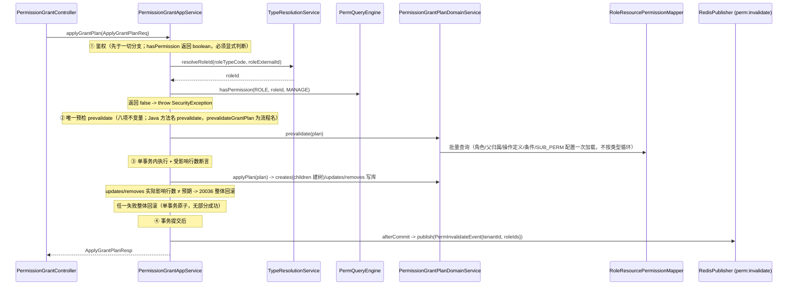

# 权限中心 — 核心功能实现设计

> 本文档是 `overview.md` 的**实现层补充**，聚焦于鉴权查询和权限授权管理两大核心模块的执行链路设计。
> 本文档不定义对外 API 路径、请求体、响应体或错误原因；这些内容以 `api-contract.md` 为准。
> 阅读本文档前请先阅读 `overview.md` 了解业务概念；表结构以 `../schema/access-service.sql` 为准（唯一权威 DDL；文中「permission-center」指 access-service permission 域，见 overview.md 术语注记）。

---

## 目录

1. [整体分层与类清单](#1-整体分层与类清单)
2. [公共 Domain Service 设计](#2-公共-domain-service-设计)
3. [鉴权查询模块（PermQueryEngine）](#3-鉴权查询模块permqueryengine)
4. [权限授权管理模块](#4-权限授权管理模块)
5. [缓存设计](#5-缓存设计)
6. [操作日志 AOP 机制](#6-操作日志-aop-机制)
7. [DTO 与内部模型边界](#7-dto-与内部模型边界)

---

## 1. 整体分层与类清单

### 1.1 分层架构

```
Controller ──► AppService（调度层） ──► DomainService（领域层） ──► Mapper（数据访问）
                                         ├── PermQueryEngine（统一鉴权引擎）
                                         └── AOP（@OperationLog 自动记录入口日志）
```

### 1.2 包结构

```
cn.ac.fage.accessmesh.permission
├── aop
│   ├── OperationLog                  ← 注解
│   ├── OperationLogAspect            ← 切面
│   └── OperationLogRuntimeContext    ← ThreadLocal 上下文
├── cache                             ← CacheService 缓存目录
├── config                            ← 配置类
├── constant                          ← 常量（OperationCodeConstants 等）
├── controller (22)
│   ├── AbstractRoleSyncController
│   ├── AbstractUserSyncController
│   ├── AuthController
│   ├── BizDomainController
│   ├── ConditionController
│   ├── ConflictRuleController
│   ├── DomainConfigController
│   ├── LogQueryController
│   ├── OperationController
│   ├── PermissionGrantController
│   ├── PermissionViewController
│   ├── ResourceApiMappingController
│   ├── ResourceController
│   ├── ResourceDependencyController
│   ├── ResourceEntitySyncController
│   ├── RoleController
│   ├── ServiceConfigController
│   ├── SystemConfigController
│   ├── TypeDefinitionController
│   ├── UserController
│   ├── UserRoleController
│   └── UserRoleSyncController
├── service
│   ├── impl (22 AppService 实现；GroupRoleAppServiceImpl 随 T-PERM-043 写入口删除)
│   │   ├── AbstractRoleSyncAppServiceImpl
│   │   ├── AbstractUserSyncAppServiceImpl
│   │   ├── BizDomainAppServiceImpl
│   │   ├── ConditionAppServiceImpl
│   │   ├── ConflictRuleAppServiceImpl
│   │   ├── DependencyAppServiceImpl
│   │   ├── DomainConfigAppServiceImpl
│   │   ├── LogQueryAppServiceImpl
│   │   ├── OperationAppServiceImpl
│   │   ├── PermissionCheckAppServiceImpl
│   │   ├── PermissionGrantAppServiceImpl
│   │   ├── PermissionQueryAppServiceImpl
│   │   ├── PermissionViewAppServiceImpl
│   │   ├── ResourceEntitySyncAppServiceImpl
│   │   ├── ResourceManageAppServiceImpl
│   │   ├── RoleManageAppServiceImpl
│   │   ├── ServiceConfigAppServiceImpl
│   │   ├── ServiceSyncAppServiceImpl
│   │   ├── SystemConfigAppServiceImpl
│   │   ├── TypeDefinitionAppServiceImpl
│   │   ├── UserManageAppServiceImpl
│   │   └── UserRoleSyncAppServiceImpl
│   └── domain (11 个接口 + 11 个实现，另含同步策略、ResolveContext 与 PermQueryEngine)
│       ├── AuditDomainService / *Impl
│       ├── DomainClassifyService / *Impl
│       ├── MappingSyncHandler / *Impl
│       ├── PermissionConditionDomainService / *Impl
│       ├── PermissionConflictDomainService / *Impl
│       ├── PermissionGrantDomainService / *Impl
│       ├── ResolveContext                            ← 类型预解析上下文
│       ├── ResourceEntityDomainService / *Impl
│       ├── ResourceSyncHandler / *Impl
│       ├── SubjectDomainService / *Impl              ← 角色解析+用户查询合并
│       ├── SyncMetadataDomainService / *Impl
│       ├── TypeResolutionService / *Impl
│       └── impl/PermQueryEngine                      ← 统一鉴权引擎
├── mapper (18)
│   ├── AbstractRoleMapper
│   ├── AbstractUserMapper
│   ├── BizDomainMapper
│   ├── DomainConfigMapper
│   ├── OperationLogMapper
│   ├── OperationPermissionMapper
│   ├── PermissionChangeLogMapper
│   ├── PermissionConditionMapper
│   ├── PermissionConflictRuleMapper
│   ├── ResourceApiMappingMapper
│   ├── ResourceDependencyMapper
│   ├── ResourceEntityMapper
│   ├── RoleResourcePermissionMapper
│   ├── ServiceConfigMapper
│   ├── SyncMetadataMapper
│   ├── SystemConfigMapper
│   ├── TypeDefinitionMapper
│   └── UserRoleMapper
├── entity / dto / vo / enums / util（关键类型示例）
│   ├── ConditionEvalUtils
│   ├── JsonValidationUtils
│   ├── OperationPermissionUtils
│   ├── OperatorContext / OperatorUtil
│   ├── PageUtil
│   ├── PermissionConstants
│   ├── PermQuery / PermResult / PermViewFilter / PermViewResult
│   ├── PermResultUtils
│   ├── PermTreeAssembler
│   ├── PermViewAssembler
│   ├── RolePermEntryMapper                         ← 在 util 包（非 domain）
│   ├── SecurityEventType / SecurityLogUtil / SecurityUtils
│   ├── SnapshotAssembler
│   ├── StringUtils
│   └── TreeBuilder
└── config
```

---

## 2. 公共 Domain Service 设计

以下 Domain Service 被多个 AppService 复用，是分层规范中公共逻辑复用的关键。

---

### 2.1 `SubjectDomainService` — 主体领域（角色解析 + 用户查询合并）

合并了旧 `AbstractUserDomainService`、`AbstractRoleDomainService` 和 `UserRoleDomainService`。

```java
public interface SubjectDomainService {

    // 用户查询
    AbstractUser selectValidUserById(Long tenantId, Long userId);

    // 角色查询/写入（其余 createRole、softDeleteRoleBatch 等方法省略）
    AbstractRole selectValidRoleById(Long tenantId, Long roleId);

    // 用户有效角色解析
    Set<Long> resolveEffectiveRoles(Long tenantId, Long userId);
    Map<Long, Set<Long>> batchResolveEffectiveRoles(Long tenantId, Set<Long> userIds);

    // 缓存失效
    void invalidateRoleCacheBatch(Long tenantId, Set<Long> userIds);
    void invalidateRoleCacheByRole(Long tenantId, Long roleId);
}
```

---

### 2.2 ~~`PermissionVersionDomainService`~~ — 权限令牌机制（**已整体删除 2026-06-20 T-PERM-018**）

> **已整体删除（T-PERM-018 缓存下沉，2026-06-20）**：`permission_version` 表与 `PermissionVersionController` / `PermissionVersionAppService(Impl)` / `PermissionVersionMapper` / `PermissionVersion` 实体 / `PermissionVersionQueryReq` / `PermissionVersionResp` / `PermissionVersionDomainServiceImplTest` 已物理删除（design-review §A'-3 + v3.5 §9.2，T-PERM-003）。占位接口 `PermissionVersionDomainService(Impl)` 与 `buildPermissionVersionKey` / `buildInterfacePermissionVersion`、各 DTO 的 `permissionVersion` / `notModified` 字段、INTERFACE_SNAPSHOT(L2) 缓存一并彻底移除（T-PERM-018）。
>
> **令牌为何彻底删除**：核实确认令牌「唯一真正作用是 INTERFACE_SNAPSHOT 缓存 key」（`serviceCode|permissionVersion`）。占位令牌只含 roleIds 指纹，不反映角色内权限内容变更 → 撤权后最长 TTL 仍命中陈旧快照。缓存下沉方案（T-PERM-018）移除该 L2 缓存 + 激活 engine `ROLE_PERM_SNAPSHOT` 读缓存（per-role 精确失效）+ 扩展 `PermInvalidateEvent` serviceCodes，正确性不再依赖令牌；令牌随之失效，连带 304/notModified 死代码清除。

> 4 处原 `permissionVersionDomainService.increment(...)` 调用、`PermissionGrantDomainServiceImpl` 未用注入、`buildInterfacePermissionVersion`（`PermissionQueryAppServiceImpl`）均已删除。缓存失效改由 Redis pub/sub 主动广播 `PermInvalidateEvent` + TTL 兜底（Gateway 订阅侧 T-PERM-006）。

---

### 2.3 `AuditDomainService` — 审计领域（合并 PermissionChangeDomainService + OperationLogDomainService）

```java
public interface AuditDomainService {

    // 变更日志记录
    void recordChangeLog(ChangeLogContext context, List<ChangeLogEntry> changes);

    // 操作日志记录（异步）
    void asyncRecordLog(String module, String action, String targetType, Long targetId,
                        String summary, Long operatorId, String ipAddress, String requestId, Long tenantId);

    // 变更历史查询
    List<PermissionChangeLog> queryRecentChanges(...);
    long countRecentChanges(...);
}
```

---

### 2.4 `PermissionConflictDomainService` — 冲突规则

```java
public interface PermissionConflictDomainService {
    Set<Long> filterRoleMutex(Long tenantId, Set<Long> effectiveRoleIds);
    List<RolePermEntry> filterPermMutex(Long tenantId, List<RolePermEntry> passedEntries);
}
```

---

### 2.5 `PermissionConditionDomainService` — 条件校验

```java
public interface PermissionConditionDomainService {
    List<RolePermEntry> evaluate(Long tenantId, List<RolePermEntry> entries, Map<String, Object> context);
}
```

---

### 2.6 `TypeResolutionService` — 类型解析

```java
public interface TypeResolutionService {
    Map<String, Integer> batchResolveTypeValues(Long tenantId, String typeKey, Set<String> codes);
    Map<Integer, String> batchResolveTypeCodes(Long tenantId, String typeKey, Set<Integer> values);
    Map<String, Long> batchResolveOperationIds(Long tenantId, String resourceTypeCode, Set<String> opCodes);
    Map<ResourceResolveKey, Long> batchResolveResourceIds(Long tenantId, List<ResourceResolveRequest> requests);
}
```

---

### 2.7 `DomainClassifyService` — 域分类

```java
public interface DomainClassifyService {
    boolean matchesTypeCode(Long tenantId, DomainQueryMode mode, String domainCode, String typeCode);
    Set<String> getClassifiedTypeCodes(Long tenantId, String domainCode);
    Long findDomainIdByTypeCode(Long tenantId, String typeCode);
}
```

---

### 2.8 `PermissionGrantDomainService` — 权限授权领域

```java
public interface PermissionGrantDomainService {
    boolean canGrantPermission(Long tenantId, Long operatorId, String resourceTypeCode,
                               String resourceCode, String operationCode, boolean scopeAll, String domainCode);

    Map<String, GrantCheckResult> checkCanGrant(Long tenantId, Long operatorId,
                                                Set<GrantCheckKey> permissions, String domainCode);

    void revokePermissions(Long tenantId, Long roleId, List<Long> permissionIds);

    record GrantCheckKey(String resourceTypeCode, String resourceCode,
                         String operationCode, boolean scopeAll) {}

    record GrantCheckResult(boolean canGrant, String reason) {}
}
```

---

### 2.9 `ResourceEntityDomainService` — 资源实体领域

资源层级操作、树形展开等。

---

### 2.10 `ResolveContext` — 类型预解析上下文

在 PermQueryEngine 查询管线中批量预解析 `resourceTypeCode→typeValue` 和 `(resourceTypeCode, operationCode)→operationId`，避免管线中重复调用 TypeResolutionService。

---

## 3. 鉴权查询模块（PermQueryEngine）

### 3.1 统一入口

所有权限查询和校验统一通过 `PermQueryEngine` 执行。引擎提供两层 API：

**引擎便捷 API（T-ACCESS-016 定稿终态，2026-08-23；实施归 T-PERM-042）**——显式资源语义，`code` 与 `entityId` 两轨不得混用：

```java
// —— 对外：业务编码语义（USER/ROLE 等业务对象门禁与跨服务 SDK 统一使用）——

// 单目标鉴权（boolean）
boolean ok = engine.hasPermissionByCode(tenantId, subjectId,
    ResourceTypeCode.ROLE, roleId.toString(), OperationCodeConstants.MANAGE);

// 批量获取被拒绝的业务编码集合（纯查询，不抛异常）
Set<String> denied = engine.getDeniedResourceCodes(tenantId, subjectId,
    ResourceTypeCode.USER, userCodes, OperationCodeConstants.MANAGE);

// —— 内部 / 已完成解析的调用方：resource_entity.id 语义 ——
// （仅限引擎内部与直接管理资源实体的后台链路：资源树、API 映射、资源依赖、权限树等，
//   这些入口手里的 id 本就是 resource_entity.id）

boolean okEntity = engine.hasPermissionByEntityId(tenantId, subjectId,
    ResourceTypeCode.RESOURCE, resourceEntityId, OperationCodeConstants.MANAGE);

Set<Long> deniedEntityIds = engine.getDeniedEntityIds(tenantId, subjectId,
    ResourceTypeCode.RESOURCE, resourceEntityIds, OperationCodeConstants.DELETE);
```

**终态契约要点**：

- **删除**泛型 `<ID>`、`Object resourceId`、`toLongId()` 运行时猜测；删除现名 `hasPermission`/`validateBatch`/`getDeniedIds`（调用点由 T-PERM-042 逐处改造，全量 grep 清零）。
- **抛异常语义从引擎删除**（引擎只留拒绝集方法，纯查询、不抛 `SecurityException`）。抛异常是**调用方**职责：admin 域统一经 `AdminPermissionValidator` 门面（`checkTypeLevel` / `checkInstanceLevel` / `checkBatchInstanceLevel` 基于 `hasPermissionByCode`/`getDeniedResourceCodes` 封装，接口形态不变，见 admin-service-api-contract §2）；permission 域 AppService 延续 `if (!engine.hasPermissionByCode(...)) throw new SecurityException(...)` 显式模式。「唯一出口」约束仅指**引擎层面不再提供抛异常便捷方法**（`validateBatch` 删除），不限制业务调用方显式抛出。
- **主体参数即主体 ID**（T-ORG-001 已统一：`operatorId = abstract_user.id = sys_user.id`），无任何运行时 ID 空间转换；`OperatorSubjectResolver`/`resolveOperatorSubjectId` 已删除清零。
- **业务编码语义定稿**：`resource_entity(USER).code = subjectId.toString()`、`resource_entity(ROLE).code = roleId.toString()`（投影已由 T-ACCESS-019 管理写路径同事务维护，2026-08-23 落地；外部 sync 入口不产投影，遗留登记）；`code → entity` 解析统一下沉 `TypeResolutionService` 批量方法（禁 N+1）。
- 未知类型/未知操作维持 fail-closed 全量拒绝（现状语义不变）。

**`getDeniedResourceCodes` 优化策略**（批量拒绝场景，与 `getDeniedEntityIds` 相同管线，T-PERM-042 已落地）：

1. 一次查询解析用户角色（`SubjectDomainService.resolveEffectiveRoles`）
2. 一次查询类型级权限（`selectScopeAllPermsByBitsBatch`）-- scopeAll 匹配则全部允许
3. 否则，一次批量 `code → resource_entity.id` 解析 + 一次批量查询实例级权限（`selectInstancePermsByBitsBatch`）
4. 内存计算拒绝 code 集合

**复杂查询 API**（`PermQuery` 工厂方法 + `engine.query(PermQuery)`）：

| 工厂方法                      | 模式     | 用途                                                   |
| ----------------------------- | -------- | ------------------------------------------------------ |
| `PermQuery.forAuthCheck`      | 鉴权校验 | 类型+实例，scopeAll 匹配时提前返回，完整评估           |
| `PermQuery.forInterfaceCheck` | 接口鉴权 | 类型优先+实例回退，完整评估，返回所有辅助信息          |
| `PermQuery.forResourceQuery`  | 资源过滤 | 仅实例级查询，不评估条件/冲突，含资源和操作            |
| `PermQuery.forResourceCheck`  | 资源检查 | 全范围+实例，完整评估条件/冲突，含资源和操作           |
| `PermQuery.forValidate`       | 管理校验 | 类型+实例，不评估，最小输出                            |
| `PermQuery.forScopeQuery`     | 范围查询 | 不提前返回，不评估，返回全部辅助信息                   |
| `PermQuery.forUserView`       | 用户视图 | 全量角色权限记录（`selectValidByRoleIds`），不按位过滤；按 `effectiveBits` 生成最终可用操作投影 |

### 3.2 引擎核心类

| 类                              | 包路径                | 职责                    |
| ------------------------------- | --------------------- | ----------------------- |
| `PermQuery.java`                | `dto.query`           | 入参 DTO + 8 个工厂方法 |
| `PermResult.java`               | `dto.query`           | 统一返回对象            |
| `PermQueryEngine.java`          | `service.domain.impl` | 核心引擎 `query()` 方法 |
| `OperationPermissionUtils.java` | `util`                | 位运算/批量过滤工具     |
| `ConditionEvalUtils.java`       | `util`                | 条件子项静态评估        |
| `PermResultUtils.java`          | `util`                | DTO 转换工具            |

### 3.3 引擎管线流程

```
PermQueryEngine.query(PermQuery q)
    │
    ├─ forUserView → queryForUserView()
    │     ├─ resolveRoleIds → SubjectDomainService
    │     ├─ selectValidByRoleIds → 全量角色权限（不按位过滤）
    │     ├─ evaluateIfNeeded → 条件+冲突
    │     ├─ loadAncillaryForView → 批量加载 Resource/Operation/Role
    │     └─ buildEffectiveOperationEntries → 按 effectiveBits 展开最终可用操作
    │
    └─ 通用查询：
          ├─ 0. 创建 ResolveContext（预解析 resourceTypes + operationIds）
          ├─ 1. resolveRoleIds → SubjectDomainService
          ├─ 2. resolveResourceTypes → ResolveContext
          ├─ 3. resolveOperationIds + resolveBitMasks → 位掩码计算
          ├─ 4. queryScopeAll → selectScopeAllPermsByBitsBatch (1 SQL)
          │     └─ scopeAll 匹配 && earlyReturnOnScopeAll → 提前返回
          ├─ 5. resolveEntityIds → TypeResolutionService.batchResolveResourceIds
          ├─ 6. queryInstance → selectInstancePermsByBitsBatch (1 SQL)
          ├─ 6.5. expandByInheritMode → inheritParents/inheritChildren 展开
          ├─ 7. 合并 scopeAll + instance entries
          ├─ 8. evaluateIfNeeded → conditions + conflicts
          └─ 9. loadAncillary → 批量加载 Resource/Operation/Role
```

### 3.3 PermResult 与 PermResultUtils

`engine.query()` 返回 `PermResult` 对象，包含：

- `allowed` / `reason`
- `scopeAllMatched` / `scopeAllEntries` / `instanceEntries`
- `effectiveOperationEntries`：基于已命中的原始授权条目和 `OperationPermission.effectiveBits` 展开的最终可用操作投影；不替代原始授权条目
- `resourceMap` / `operationMap` / `roleMap`（按 `includeXxx` 标志选择性加载）

`PermResultUtils` 提供转换方法将 `PermResult` 转为对外响应：

- `PermResultUtils.toAuthCheckResp(result)` — `check` / `batch-check` 响应
- `PermResultUtils.validateOrThrow(result)` — `validate` 模式，拒绝时抛异常

### 3.4 内部 scopeAll 与对外 scopeMode 映射

`scopeAll` 是 `RolePermEntry` / `role_resource_permission.scope_all` 的内部一等维度，引擎查询管线中作为类型级权限单独查询；对外协议统一由装配器映射为 `scopeMode`。

| 装配器              | 映射方式 |
| ------------------- | -------- |
| `SnapshotAssembler` | 内部 `scopeAll=true` 条目不展开，直接返回 `ApiPermissionEntry(scopeMode=ALL, httpMethod=null, pathPattern=null)`；实例级条目返回 `scopeMode=INSTANCE` |
| `PermViewAssembler` | 按 `resourceType` 分组输出全量范围视图项，对外使用 `scopeMode=ALL`（如 `DATA_EDIT + DEPT + scopeMode=ALL` 表示可编辑全部部门范围） |

### 3.5 资源继承展开（引擎层）

- `PermQuery.setInheritMode("PARENT"/"CHILD"/"BOTH")` 设置继承模式 → 自动转为 `inheritParents`/`inheritChildren` 布尔标志
- 引擎在 `expandByInheritMode()` 中：
  1. 加载全部有效资源（`resourceEntityMapper.selectAllValid`）构建父子图
  2. `inheritChildren` → 递归收集所有子孙资源，为每个克隆权限条目（`grantSource="INHERITED"`）
  3. `inheritParents` → 向上遍历父链，为每个祖先克隆权限条目
  4. scopeAll 条目（`resourceEntityId=null`）不参与继承展开

### 3.6 对外接口

| 接口         | 路径                                     | 引擎入口                                                      |
| ------------ | ---------------------------------------- | ------------------------------------------------------------- |
| 单次鉴权     | `POST /api/perm/auth/check`              | `engine.query(PermQuery.forAuthCheck())`                      |
| 批量鉴权     | `POST /api/perm/auth/batch-check`        | `engine.query(PermQuery.forAuthCheck())` x N                  |
| 资源权限查询 | `POST /api/perm/auth/query-resources`    | `engine.query(PermQuery.forUserView())`                       |
| 范围权限查询 | `POST /api/perm/auth/query-scopes`       | `engine.query(PermQuery.forScopeQuery())`                     |
| 接口级判定   | `POST /api/perm/auth/check-interface`    | `engine.query(PermQuery.forInterfaceCheck())`                 |
| 权限视图     | `POST /api/perm/permission-view/*`       | `engine.query(PermQuery.forUserView())` + `PermViewAssembler` |
| 接口快照     | `POST /api/perm/auth/interface-snapshot` | `engine.query()` + `SnapshotAssembler`                        |

---

## 4. 权限授权管理模块


### 4.1 接口定义（收窄重写）

授权页面写链路收敛为 **list + apply-grant-plan** 两个端点（另加只读契约 `sub-perm-allowed-types`，§6.5.2）。`save/revoke/children/add-child/remove-child` **已随 T-PERM-034 端点退役删除（2026-08-27 评审 F-07 收口：仓库内外无存量调用方、项目未上线，不留兼容层，Controller 无映射 404；SDK 面 perm-common RoleGrantReq/BatchRevokeReq 与 perm-client PermissionFeignClient.batchGrant/batchRevoke 同步移除）**；`update-child/children-save/rebuild` 不实现。角色权限写入的唯一约束并发兜底优先按 PostgreSQL SQLState `23505` 分类，约束名消息仅作驱动包装兼容兜底。

**SUB_PERM 共享策略对象（复审实现建议采纳，复审补公开入口）**：从 `assertSubPermissionAllowed` 抽取不可变策略对象 `SubPermissionPolicy { mode, reason, allowedTypeCodes, allows(childTypeCode) }`，**唯一公开解析入口 `PermissionGrantPlanDomainService.resolveSubPermissionPolicy(tenantId, parentResourceTypeCode)`**——读接口（`sub-perm-allowed-types`）由 AppService 映射其结果直接序列化；写链路 `prevalidate` 内部复用同一解析器（`policy.allows(childTypeCode)`），**禁止在 AppService/Controller 另行编写 SUB_PERM 判断（读写同源）**；顶层通配、全量结构校验（任一 allowed 项非法 -> CONFIG_INVALID）、并集去重、大小写不敏感与错误原因均在策略内统一组装，读写不再各自编排判断。**校验顺序**：先按主/子记录分类（子权限 create 非 null/false -> 20043、子权限 update -> 20043），主权限再评估 20041（条件不可转授）→ 20042（条件启用状态）→ 20033 → 其他。

| 接口         | 路径                                                             | 说明                                             |
| ------------ | ---------------------------------------------------------------- | ------------------------------------------------ |
| 查询角色权限 | `POST /api/perm/role-resource-permission/list`                   | 查询角色已有权限列表（含子权限展开）             |
| 聚合授权提交 | `POST /api/perm/role-resource-permission/apply-grant-plan`       | **授权页面唯一写入口**：记录级 `plan{creates/updates/removes}` + 单事务原子 + 受影响行数断言 |
| 子权限类型查询 | `POST /api/perm/role-resource-permission/sub-perm-allowed-types` | **授权页只读契约（§6.5.2）**：按父资源类型返回 SUB_PERM 允许策略（mode/reason/allowedChildResourceTypeCodes），AppService 直接映射 `resolveSubPermissionPolicy` 结果 |

> wire 契约（请求/响应/错误码）以 `api-contract.md §6.4/§6.5/§6.5.1/§6.5.2` 为唯一权威；本文不重复完整字段定义。**砍**：expectedRevision CAS / grant_revision 列 / 幂等表 grant_plan_idempotency / clientRequestId / @Idempotent / 20037/20039 / `docs/contracts/perm-grant.schema.json`。

### 4.2 聚合授权执行链路（apply-grant-plan）

#### 入参 DTO（结构示意，字段定义以 api-contract 为准）

```java
/** POST /api/perm/role-resource-permission/apply-grant-plan */
public record ApplyGrantPlanReq(
    String domainCode,
    String roleTypeCode,
    String roleExternalId,
    GrantPlan plan                // creates/updates/removes 记录级变更
) {}

public record GrantPlan(
    List<CreateItem> creates,     // 主权限可带 children 嵌套建树（新父子树唯一通道）；
                                  // 子权限 parentPermissionId 仅引用提交前已存在的父记录
    List<UpdateItem> updates,     // id + canGrant/conditionCode（三态：缺省=不改 / ""=清除 / 非空=覆盖）
    List<Long> removes            // 主权限 id 级联删子；子权限 id 单条删；与 updates 互斥
) {}
```

#### 出参 DTO（结构示意）

```java
public record ApplyGrantPlanResp(
    List<RolePermissionItemResp> items   // 完整持久化结果（无 revision/currentRevision/replayed，砍）
) {}
```

#### 执行链路时序图



#### `PermissionGrantAppService` 调度逻辑（伪代码）

```java
@Service
public class PermissionGrantAppServiceImpl implements PermissionGrantAppService {

    @Transactional(rollbackFor = Exception.class)
    @OperationLog(module = "PERMISSION", action = "APPLY_GRANT_PLAN", targetType = "abstract_role",
        targetId = "#req.roleExternalId", summary = "apply grant plan")
    @PermissionChange
    public ApplyGrantPlanResp applyGrantPlan(Long tenantId, ApplyGrantPlanReq req) {

        Long operatorId = OperatorContext.getOperatorId();

        // ① 鉴权（先于一切分支；hasPermissionByCode 返回 boolean，必须显式判断 false 并抛异常）
        Long roleId = typeResolutionService.resolveRoleId(tenantId, req.roleTypeCode(), ...);
        if (!engine.hasPermissionByCode(tenantId, operatorSubjectId, ResourceTypeCode.ROLE, String.valueOf(roleId), OperationCodeConstants.MANAGE)) {
            throw new SecurityException("Permission denied: MANAGE on ROLE:" + roleId);
        }

        // ② 唯一预检：记录存在及角色/父归属、段间互斥、AUTO_DEP 只读、
        //    canGrant 授权传递（批量收口）、SUB_PERM fail-closed、
        //    MANUAL 单直接授权唯一性、scopeMode/资源/单操作兼容
        PreparedGrantPlan prepared = permissionGrantPlanDomainService.prevalidate(
            tenantId, operatorId, roleId, req.domainCode(), req.plan());

        // ③ 单事务内执行 plan + 受影响行数断言
        //    creates（children 嵌套建树）/updates/removes；
        //    updates/removes 实际影响行数 ≠ 预期（记录被并发删除/修改）-> 20036 抛出整体回滚
        permissionGrantPlanDomainService.apply(prepared);

        // ④ 变更审计：同事务内写一条聚合 permission_change_log（diff_snapshot.items 覆盖 creates/updates/removes，含权限记录 ID）
        //    回滚随事务消失，不写日志
        String requestId = null; // 当前无统一 RequestIdContext，与现有审计调用一致
        auditDomainService.recordChangeLog(new AuditDomainService.ChangeLogContext(
            tenantId, operatorId, requestId, PermConstants.MaintainSource.MANUAL, "apply-grant-plan"),
            List.of(new AuditDomainService.ChangeLogEntry(
                "role_resource_permission", roleId, "APPLY_GRANT_PLAN", null, null,
                buildDiffSnapshot(prepared),  // diff_snapshot 含 creates/updates/removes 记录 ID
                new Long[0],               // affectedUserIds
                new Long[]{roleId})));      // affectedRoleIds

        // ⑤ 业务侧登记影响范围；@PermissionChange AOP afterCommit 统一 flush：发布广播 + evict
        // （禁止业务侧手写 TransactionSynchronizationManager；markRoles 未绑定时 no-op，故必须标注 @PermissionChange）
        PermissionChangeContext.markRoles(tenantId, roleId);

        return buildResp(toItemRespList(rolePermMapper.selectValidByRoleId(tenantId, roleId)));
    }
}
```

- **写入口五项清单（定案，写入口必须齐全）**：① `@Transactional(rollbackFor=Exception.class)` 单事务原子 ② `@OperationLog` 入口级操作日志 ③ `@PermissionChange` 缓存失效 AOP（afterCommit flush markRoles -> 广播 + evict）④ `auditDomainService.recordChangeLog` 同事务聚合 permission_change_log ⑤ `PermissionChangeContext.markRoles` 登记影响范围。缺任一项会导致审计缺失或缓存失效遗漏（markRoles 未绑上下文时 no-op）。
- **无 CAS / 无幂等表 / 无 clientRequestId**（收窄）：前端 saving 期间按钮 disabled 防重复点击；超时提示刷新确认；后端靠单事务原子 + uk 约束 + 受影响行数断言保证不重复/不部分成功。
- **受影响行数断言（问题 5 修复）**：`updates`/`removes` 执行后核对实际影响行数，少于预期（并发删除/修改）-> 20036 整体回滚；plan 至少含一项变更，update 至少改 canGrant/conditionCode，拒绝重复 ID 与 update/remove 交叉 ID。
- **hasPermissionByCode 显式判断（问题 1 修复；T-PERM-042 更名）**：`engine.hasPermissionByCode()` 返回 boolean 不自动抛异常（引擎纯查询），必须 `if(!...) throw SecurityException`，否则 ROLE:MANAGE 门禁失效。

## 5. 缓存设计

### 5.1 缓存 Key 与 TTL 汇总

| 缓存内容                    | Catalog / Key 模式                                                                 | 模式      | L1 TTL    | L2 TTL   |
| --------------------------- | ---------------------------------------------------------------------------------- | --------- | --------- | -------- |
| 用户有效角色集合            | `PermCacheCatalog.EFFECTIVE_ROLES` / `{tenantId}:perm:effective-roles:{userId}`    | `L1_L2`   | 5 分钟    | 30 分钟  |
| 角色权限快照（资源+操作位） | `PermCacheCatalog.ROLE_PERM_SNAPSHOT` / `{tenantId}:perm:role-perm-snapshot:{roleId}` | `L1_L2` | 5 分钟    | 30 分钟  |
| 条件规则                    | `PermCacheCatalog.CONDITION_RULES` / `{tenantId}:perm:condition-rules:{conditionId}` | `L1_L2` | 10 分钟   | 30 分钟  |
| 角色互斥规则                | `PermCacheCatalog.ROLE_MUTEX_RULE` / `{tenantId}:perm:role-mutex-rule:all`         | `L1_L2`   | 10 分钟   | 30 分钟  |
| 操作权限按资源类型索引      | `PermCacheCatalog.OPERATION_PERMISSIONS_BY_TYPE` / `{tenantId}:perm:operation-permissions-by-type:op_perm:{resourceType}` | `L1_L2` | 60 分钟   | 120 分钟 |
| Gateway 接口快照            | `PermissionFilter.buildCacheKey` / `perm:snapshot:{tenantId}:{subjectTypeCode}:{userId}:{serviceCode}` | `L1_ONLY` | 默认 30 秒 | 无       |

> **缓存 key 修订（2026-06-20 审计 S-001 + T-PERM-018）**：已删除"角色权限版本号"缓存条目（`perm:permission-version:role:*`，原"永不过期（主动更新）"）。T-PERM-018 缓存下沉后，permission-center 侧不再缓存 INTERFACE_SNAPSHOT(L2)，Gateway 接口快照由 Gateway 本地 Caffeine 按 `(tenantId,subjectTypeCode,userId,serviceCode)` 缓存（key 不再含 `permissionVersion`/`permissionDigest`，令牌机制已整体移除），靠 Redis 广播 `PermInvalidateEvent`（含 serviceCodes）+ TTL 兜底失效。permission-center 缓存 key 以 `PermCacheCatalog` + `CacheKeyUtil` 为准；Gateway 本地快照实际 key 由 `PermissionFilter.buildCacheKey` 构造，`GatewayCacheCatalog.INTERFACE_SNAPSHOT` 仅声明 `L1_ONLY` 目录语义。

### 5.2 缓存失效触发点

```
权限变更（role_resource_permission）
  → AppService/DomainService 登记影响范围（PermissionChangeContext.markRoles/markUsers）
  → AppService AOP afterCommit 统一处理：
    → cacheService.evictBatch(ROLE_PERM_SNAPSHOT, tenantId, roleIds)
    → SubjectDomainService.invalidateRoleCacheByRoles(tenantId, roleIds)
      （批量反查直接用户 + 祖先 GROUP_ROLE 用户，一次 evictBatch(EFFECTIVE_ROLES)）
    → Redis pub/sub 广播 PermInvalidateEvent(tenantId, roleIds, userIds, serviceCodes)
  → 订阅方（Gateway）收到事件 evict 本地快照；TTL（30-60s）兜底

用户-角色关联变更（user_role）
  → PermissionChangeContext.markUsers 登记受影响用户
  → afterCommit 批量失效 EFFECTIVE_ROLES（SubjectDomainService.invalidateRoleCacheBatch）

依赖规则变更（resource_dependency）
  → 按 grant_dep_id 精准清理 role_resource_permission 中的 AUTO_DEP 补全记录
  → 重新评估受影响角色的自动补全状态（清理旧补全 + 补全新权限）
  → 角色权限快照失效（evictBatch ROLE_PERM_SNAPSHOT）+ 用户缓存失效 + Redis 广播 PermInvalidateEvent

API mapping / serviceCode-only 变更
  → PermissionChangeContext.markServiceCodes 登记受影响 serviceCode
  → afterCommit 仅广播 serviceCodes（不清 permission-center 缓存）
  → Gateway 按 tenant+serviceCodes evict 本地接口快照

API 资源删除 / 资源软删导致角色权限事实变化
  → PermissionChangeContext.markRoles + markServiceCodes 双重登记
  → afterCommit 失效 ROLE_PERM_SNAPSHOT / EFFECTIVE_ROLES，并广播 serviceCodes 清 Gateway 本地快照

角色停用（abstract_role.status=0）
  → 递归失效关联所有用户的角色缓存
  → 相关接口快照失效

GROUP_ROLE 树结构变更（moveRole 调整 parent_id；extra.basicRoleIds 无任何写入方，T-PERM-043 后专用写入口已删除）
  → PermissionChangeContext.markRoles(groupRoleId)
  → afterCommit 批量失效 ROLE_PERM_SNAPSHOT + 关联用户 EFFECTIVE_ROLES + 广播
  （T-PERM-043：create/update 已拒绝 GROUP_ROLE(20022)，move/remove 保留为存量行清理通道；
  extra.basicRoleIds 双事实源遗留登记见仓库 README「技术债遗留登记」段与 T-PERM-043 任务卡）

条件规则变更（permission_condition）
  → PermissionChangeContext.markConditions(conditionIds)
  → afterCommit 批量失效 CONDITION_RULES；RolePermEntry 缓存只保存 conditionId，条件仍实时评估
```

### 5.3 Gateway 回调鉴权流程

```
Gateway 本地接口快照未命中时：
  1. 从 Token 中提取 tenant_id、abstract_user_id
  2. 从路由信息提取 serviceCode、httpMethod、path
  3. 构建本地快照 key：perm:snapshot:{tenantId}:{subjectTypeCode}:{userId}:{serviceCode}
  4. POST /api/perm/auth/interface-snapshot → 权限中心
     入参：{ subjectTypeCode, subjectExternalId, serviceCode }
  5. 权限中心内部：
     a. SubjectDomainService.resolveEffectiveRoles 读取 EFFECTIVE_ROLES（CacheService L1/L2）
     b. 过滤角色互斥
     c. PermQueryEngine 通过 ROLE_PERM_SNAPSHOT getBatch 批量读取角色权限
     d. 条件实时评估，API mapping 组装为 InterfaceSnapshotResp.allowedApis
  6. Gateway 写入本地 Caffeine 快照（默认 TTL 30s）
  7. Gateway 使用 InterfaceSnapshotMatcher 本地匹配 serviceCode + httpMethod + path，放行或返回 403

无需版本轮询，无需快照拉取调度器。
```

---

## 6. DTO 与内部模型边界

Controller Request/Response DTO 是对外契约的一部分，统一以 `api-contract.md` 为准；本节只说明实现层需要维护的转换边界，避免把内部数据库 ID 泄漏成外部接口依赖。

### 6.1 Controller DTO 原则

```java
// 对外运行时接口使用稳定业务键，租户来自 X-Tenant-Id 或安全上下文。
record AuthCheckReq(String subjectTypeCode, String subjectExternalId,
                    String resourceTypeCode, String resourceCode,
                    String operationCode, String domainCode,
                    String codeType, String inheritMode,
                    Map<String, Object> context) {}

record CheckInterfaceReq(String subjectTypeCode, String subjectExternalId,
                         String serviceCode, String httpMethod,
                         String path, Map<String, Object> context) {}

record RoleResourcePermissionSaveReq(String domainCode, String roleTypeCode,
                                      String roleExternalId,
                                      List<GrantAddItem> add,
                                      List<GrantUpdateItem> update,
                                      List<Long> remove) {}
```

### 6.2 内部 Command 原则

```java
// 内部 Command 可以使用 tenantId 和数据库 ID，但只能由 Controller/Assembler 解析生成。
record AuthCheckCommand(Long tenantId, Long abstractUserId,
                        Long resourceEntityId, Long operationPermissionId,
                        Long domainId, String inheritMode, // 内部域 ID，由 domainCode 解析得到；非实体内嵌字段
                        Map<String, Object> context) {}

record RoleResourcePermissionSaveCommand(Long tenantId, Long abstractRoleId,
                                         List<RolePermGrantItem> add,
                                         List<RolePermUpdateItem> update,
                                         List<Long> remove) {}

record RolePermEntry(Long roleId, Long resourceEntityId, Long operationPermissionId,
                     Long conditionId, boolean scopeAll, boolean canGrant,
                     Long dependOn) {}
```

转换规则：

- Request DTO 不包含 `tenantId`；`tenantId` 只能来自 `X-Tenant-Id` 或安全上下文。
- 运行时接口不要求调用方传 `abstractUserId/resourceEntityId/operationPermissionId`。
- Controller 或 Assembler 负责把 `subjectExternalId/resourceCode/operationCode` 解析成内部 ID。
- Response DTO 使用 `reason`，错误原因枚举以 `api-contract.md` 为准。
- 列表响应统一包在 `data.items`；分页结构以最终项目规范和 `api-contract.md` 对齐后执行。

### 6.3 公共内部对象

```java
record RolePermSnapshot(Set<Long> roleIds, Map<Long, RolePermBitmap> permBitmaps) {}
record RolePermBitmap(Map<Long, Long> resourceEffectiveBits) {}

// 审计上下文/条目类型直接引用 AuditDomainService.ChangeLogContext / ChangeLogEntry
// 真实签名以代码为准（5 参数 Context：tenantId/operatorId/requestId/changeSource/changeReason；
// 8 参数 Entry：entityType/entityId/operation/oldSnapshot/newSnapshot/diffSnapshot/affectedUserIds[]/affectedRoleIds[]，
// 快照为 String、affected*Ids 为 Long[]），本文不重复声明，避免与代码漂移
```

---

> **下一步建议**：
>
> - 在此基础上补充用户管理（abstract_user + user_role）模块的执行链路设计
> - 或直接开始 access-service permission 域代码骨架搭建（pom.xml + 主启动类 + 基础配置）

---

## 7. 统一权限检查方案

### 7.1 `canGrant` 字段业务含义

`role_resource_permission.can_grant` 字段表示该权限条目是否可被当前角色关联的用户授予（委托）给他人。

**关键区分**：

- **`canGrant` ≠ 管理权限**：`canGrant` 只用于授权流程判断，不用于鉴权判断
- **管理权限判断**：应通过 `operation_permission.code = "MANAGE"` 实现
- **授权流程**：用户想将某权限授予他人时，需检查该用户对该权限是否拥有 `canGrant=true`

**命名变更记录**：
| 旧字段名 | 新字段名 | 旧语义（错误） | 新语义（正确） |
|----------|----------|----------------|----------------|
| `can_manage` | `can_grant` | 可管理该资源 | 可授权给他人 |

**使用场景**：

- 授权时校验：授权者必须拥有目标权限且 `canGrant=true` 才能将同一权限授予他人
- 委托限制：授权者只能授权自己已有的权限，不能扩大资源、操作或范围
- 被授权对象：由业务服务控制候选范围，permission-center 不负责生成候选列表

---

### 7.2 统一权限检查入口

#### 内部入口 `PermQueryEngine`

permission-center 内部各 Service 的常规鉴权统一通过 `PermQueryEngine` 完成（终态 API 见 §3.1，T-ACCESS-016 定稿）。对单目标使用 `hasPermissionByCode`，对批量目标使用 `getDeniedResourceCodes`（抛异常语义走 `AdminPermissionValidator` 门面）；涉及资源实体管理链路（id 即 `resource_entity.id`）使用 `hasPermissionByEntityId`/`getDeniedEntityIds`；复杂查询继续走 `query(PermQuery)`。

```java
// 单目标鉴权（业务编码语义）
if (!engine.hasPermissionByCode(tenantId, subjectId, ResourceTypeCode.ROLE,
        roleId.toString(), OperationCodeConstants.MANAGE)) {
    throw new SecurityException("Permission denied");
}

// 批量获取拒绝集合（业务编码语义，纯查询）
Set<String> deniedUserCodes = engine.getDeniedResourceCodes(
    tenantId, subjectId, ResourceTypeCode.USER, userCodes, OperationCodeConstants.MANAGE
);

// 资源实体管理链路（req.id() 本就是 resource_entity.id）
if (!engine.hasPermissionByEntityId(tenantId, subjectId, ResourceTypeCode.RESOURCE,
        req.id(), OperationCodeConstants.MANAGE)) {
    throw new SecurityException("Permission denied");
}

// 复杂查询
PermQuery q = PermQuery.forAuthCheck(tenantId, subjectId, resourceTypeCode, resourceCode, operationCode);
PermResult r = engine.query(q);
```

**适用边界（T-ACCESS-016 定稿）**：
| 场景 | 入口 |
|------|------|
| 业务对象单目标鉴权（USER/ROLE 等，业务编码） | `engine.hasPermissionByCode` |
| 业务对象批量校验（业务编码） | `engine.getDeniedResourceCodes`（抛异常由门面/调用方封装） |
| 资源实体管理链路单目标/批量（`resource_entity.id`） | `engine.hasPermissionByEntityId` / `engine.getDeniedEntityIds` |
| 资源编码、接口路径、范围查询 | `engine.query(PermQuery)` |
| 授权流程中的 `canGrant` 校验 | `PermissionGrantDomainService.checkCanGrant()`（直查 Mapper 批量匹配位运算） |

---

### 7.3 批量权限检查建议

批量操作禁止循环调用单目标鉴权，必须复用 `PermQueryEngine` 的批量 API，避免 N+1 查询。

```java
Set<String> deniedRoleCodes = engine.getDeniedResourceCodes(
    tenantId, subjectId, ResourceTypeCode.ROLE, roleCodes, OperationCodeConstants.MANAGE
);
if (!deniedRoleCodes.isEmpty()) {
    throw new SecurityException("No permission to manage roles: " + deniedRoleCodes);
}
```

**N+1 对比**：
| 方式 | 批量删除 100 个用户 | 批量删除 100 个角色 |
|------|---------------------|---------------------|
| 循环调用 `hasPermissionByCode` | 100 次校验/查询 | 100 次校验/查询 |
| 使用 `getDeniedResourceCodes`（admin 门禁经 `checkBatchInstanceLevel` 同源） | 1 次统一管线 + 批量查询 | 1 次统一管线 + 批量查询 |

---

### 7.4 `canGrant` 授权校验

`canGrant` 语义只用于授权流程，不属于通用鉴权。`canGrant` 校验通过 `PermissionGrantDomainService.checkCanGrant()` 完成：

```java
// operator 需拥有目标权限且 canGrant=true 才能授予他人
// 在 PermissionGrantAppServiceImpl 中通过 PermQueryEngine 查询 operator 的 role_resource_permission 记录，
// 检查 operator 是否拥有相同的 (resourceType, resourceCode 或内部 scopeAll, operationCode) 授权且 canGrant=true
```

**内部 scopeAll / 对外 scopeMode 授权规则**：

- 授权对外 `scopeMode=INSTANCE`（内部 `scopeAll=false`，特定资源）：operator 可用内部 `scopeAll=true` 或同一特定资源权限
- 授权对外 `scopeMode=ALL`（内部 `scopeAll=true`，全量范围）：operator 必须已有内部 `scopeAll=true` 权限

**适用边界**：
| 场景 | 入口 |
|------|------|
| 判断是否有普通管理权限 | `PermQueryEngine` |
| 判断是否可以把某权限授予他人 | `PermissionGrantDomainService.checkCanGrant()`（批量查询 operator 权限，位运算匹配目标操作） |

---

### 7.5 权限树查询接口 `query-permission-tree`

用于外部系统查询从某个资源节点出发，用户能操作的层级关系。

**接口路径**：`POST /api/perm/auth/query-permission-tree`

**入参 DTO**：

```java
public record PermissionTreeReq(
    @NotBlank String subjectTypeCode,
    @NotBlank String subjectExternalId,
    @NotBlank String resourceTypeCode,
    @NotBlank String resourceCode,          // 起点资源
    String codeType,
    @NotEmpty Set<String> operationCodes,   // 操作类型集合
    @NotBlank String direction,             // ANCESTORS(向上) / DESCENDANTS(向下) / BOTH(双向)
    Integer maxDepth,                       // 最大层级深度
    String domainCode,
    Map<String, Object> context
) {}
```

**返回 DTO**：

```java
public record PermissionTreeResp(
    TreeNode root,                          // 起点节点
    List<TreeNode> ancestors,               // 父级链路（direction=ANCESTORS/BOTH）
    List<TreeNode> descendants,             // 子级树（direction=DESCENDANTS/BOTH）
    int cacheTtlSeconds                     // 缓存有效时间（秒）
) {
    public record TreeNode(
        Long resourceId,
        String resourceTypeCode,
        String resourceCode,
        String resourceName,
        int depth,                          // 相对起点的层级
        Set<String> operations,             // 用户对该节点拥有的操作
        boolean canGrant,                   // 是否可授权
        List<TreeNode> children             // 子节点（仅descendants树）
    ) {}
}
```

**典型场景**：
| 场景 | direction | 用途 |
|------|-----------|------|
| 用户能看到某个菜单，想知道父菜单链路 | `ANCESTORS` | 显示面包屑导航时过滤无权限节点 |
| 用户有某个组织管理权限，想知道下级组织树 | `DESCENDANTS` | 组织管理页面显示可管理的子组织 |
| 用户对某个角色有权限，想知道完整层级关系 | `BOTH` | 角色权限配置页面 |

**与 `query-resources` 的区别**：
| 维度 | `query-resources` | `query-permission-tree` |
|------|-------------------|------------------------|
| 查询起点 | 无起点，查所有可访问资源 | 从指定资源节点出发 |
| 遍历方向 | 只向下（children） | 支持向上/向下/双向 |
| 返回范围 | 用户有权限的全部资源 | 只返回起点路径上有权限的节点 |
| 用途 | "我能访问哪些资源" | "从某资源出发，我能操作的层级关系" |

---

### 7.6 实现注意事项

1. **移除 `CAN_MANAGE` 误用**：不再使用 `CAN_MANAGE` 作为权限判断条件，统一使用 `OperationCodeConstants.MANAGE`
2. **`canGrant` 只用于授权流程**：在 `PermissionGrantAppServiceImpl` 中通过 `PermissionGrantDomainService.checkCanGrant()` 校验，不在普通鉴权时使用
3. **统一入口**：内部权限检查统一调用 `PermQueryEngine.hasPermissionByCode/getDeniedResourceCodes`（业务编码）或 `hasPermissionByEntityId/getDeniedEntityIds`（资源实体管理链路）或 `query(PermQuery)`，避免各 Service 分散实现（T-ACCESS-016 终态，旧 `hasPermission/validateBatch/getDeniedIds` 随 T-PERM-042 删除）
4. **批量检查避免 N+1**：批量操作（删除、修改）使用 `getDeniedResourceCodes`/`getDeniedEntityIds`，一次统一管线完成全部权限校验
5. **业务例外显式处理**：如”允许操作自己”之类的场景，由具体业务服务在调用引擎前后显式处理，不再引入独立的 `PermissionCheckUtils` 抽象
6. **树形遍历深度限制**：`query-permission-tree` 必须有 `maxDepth` 限制，防止无限递归

### 7.7 授权安全校验（Grant Validation）

**问题背景**：原 `batchGrant` 方法只检查 operator 是否有 MANAGE 权限，未检查是否能授予特定权限。这导致：用户可授予自己不拥有的权限；用户可授予自己拥有但 `canGrant=false` 的权限；用户可授予对外 `scopeMode=ALL` 但自己只有特定资源权限的权限。

**修复方案**：授权写链路收敛为 `apply-grant-plan` 唯一写入口后，授权校验在 `prevalidateGrantPlan` 内统一执行（批量 `checkCanGrant`），AppService 禁止自行拼门禁。条件权限按 T-PERM-041 不可转授，因此操作者可用于转授的来源记录必为无条件，`conditionCode` 不参与授权传递身份。

#### 校验逻辑（prevalidateGrantPlan 内）

```java
// 对每个 creates 项校验（updates 改 canGrant=true 或 conditionCode 变更同样走此校验）：
// 1. operator 必须有相同的权限（resourceType + resource 或 scopeAll + operation）
// 2. operator 的该权限必须有 canGrant=true
// 3. 授予对外 scopeMode=ALL -> operator 必须有内部 scopeAll=true（不能从特定资源权限授权全量）
// 4. conditionCode 不参与身份：可转授来源按 T-PERM-041 必为无条件

Set<PermissionGrantDomainService.GrantCheckKey> grantKeys = plan.creates().stream()
    .map(item -> new PermissionGrantDomainService.GrantCheckKey(
        item.key().resourceTypeCode(), item.key().resourceCode(), item.key().codeType(),
        item.key().operationCode(),
        ScopeModeSupport.toScopeAllForGrant(item.key().scopeMode(), item.key().resourceCode(), item.key().codeType())
    )).collect(Collectors.toSet());
Map<String, PermissionGrantDomainService.GrantCheckResult> grantResults =
    permissionGrantDomainService.checkCanGrant(tenantId, operatorId, grantKeys, domainCode);
// 不满足 -> 20040 GRANT_CANNOT_DELEGATE
```

#### 实现要点

1. **scopeMode 校验**：`INSTANCE` -> operator 可用 `scopeAll=true` 或同一特定资源权限；`ALL` -> operator 必须已有 `scopeAll=true`。
2. **update 项**：`canGrant=true` 或 `conditionCode` 变更（清空/覆盖）-> 走 `canGrantPermission` 校验。
3. **批量收口**：`prevalidateGrantPlan` 内一次 `selectByTenantAndResourceTypes` 加载后内存分组，查询次数与资源类型数量无关。
4. **条件不可转授**：`conditionCode != null -> canGrant=false` 由数据库约束与预检共同保证，因此不存在“受限条件 + canGrant”的合法来源记录。
