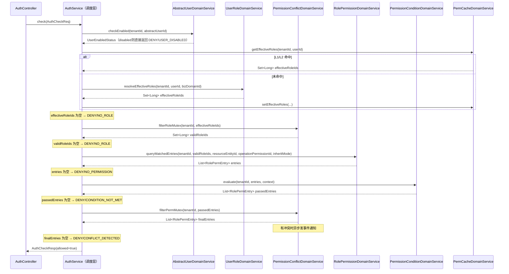
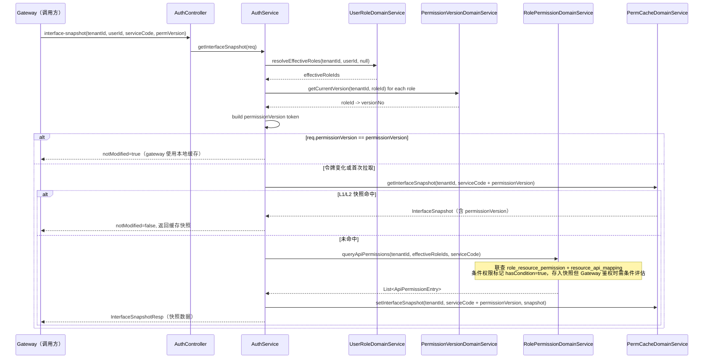
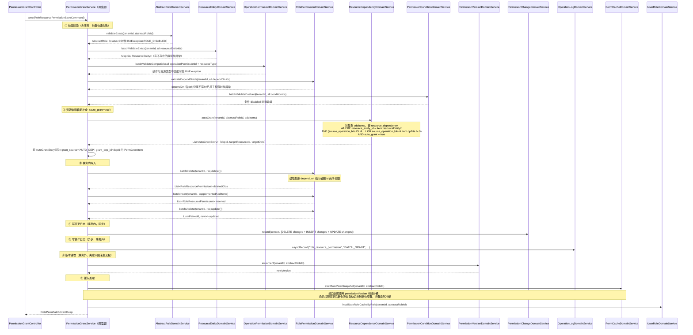

# 权限中心 — 核心功能实现设计

> 本文档是 `overview.md` 的**实现层补充**，聚焦于鉴权查询和权限授权管理两大核心模块的执行链路设计。
> 本文档不定义对外 API 路径、请求体、响应体或错误原因；这些内容以 `api-contract.md` 为准。
> 阅读本文档前请先阅读 `overview.md` 了解业务概念；表结构以 `../schema/permission-center.sql` 为准。

---

## 目录

1. [整体分层与类清单](#1-整体分层与类清单)
2. [公共 Domain Service 设计](#2-公共-domain-service-设计)
3. [鉴权查询模块](#3-鉴权查询模块)
4. [权限授权管理模块](#4-权限授权管理模块)
5. [缓存设计](#5-缓存设计)
6. [DTO 汇总](#6-dto-汇总)

---

## 1. 整体分层与类清单

### 1.1 包结构

```
cn.ac.fage.accessmesh.permission
├── controller
│   ├── AuthController
│   ├── PermissionGrantController
│   ├── UserManageController
│   ├── RoleManageController
│   ├── ResourceManageController
│   ├── TypeDefinitionController
│   ├── BizDomainController
│   ├── DomainConfigController
│   ├── ServiceConfigController
│   ├── PermissionConditionController
│   ├── PermissionConflictController
│   └── SystemConfigController
├── service
│   ├── AuthService / AuthServiceImpl                     ← 调度层
│   ├── PermissionGrantService / PermissionGrantServiceImpl
│   ├── UserManageService / UserManageServiceImpl
│   ├── RoleManageService / RoleManageServiceImpl
│   └── ResourceManageService / ResourceManageServiceImpl
│   └── domain
│       ├── AbstractUserDomainService / *Impl             ← 逻辑级（公共复用）
│       ├── AbstractRoleDomainService / *Impl
│       ├── UserRoleDomainService / *Impl
│       ├── RolePermissionDomainService / *Impl
│       ├── OperationPermissionDomainService / *Impl
│       ├── ResourceEntityDomainService / *Impl
│       ├── ResourceDependencyDomainService / *Impl
│       ├── PermissionConflictDomainService / *Impl
│       ├── PermissionConditionDomainService / *Impl
│       ├── PermissionVersionDomainService / *Impl
│       ├── PermissionChangeDomainService / *Impl
│       ├── OperationLogDomainService / *Impl
│       └── PermCacheDomainService / *Impl               ← L1/L2 缓存操作
├── mapper
│   ├── AbstractUserMapper
│   ├── AbstractRoleMapper
│   ├── UserRoleMapper
│   ├── RoleResourcePermissionMapper
│   ├── OperationPermissionMapper
│   ├── ResourceEntityMapper
│   ├── ResourceApiMappingMapper
│   ├── ResourceDependencyMapper
│   ├── PermissionConditionMapper
│   ├── PermissionConflictRuleMapper
│   ├── PermissionVersionMapper
│   ├── PermissionChangeLogMapper
│   ├── OperationLogMapper
│   ├── DomainConfigMapper
│   ├── BizDomainMapper
│   ├── TypeDefinitionMapper
│   ├── ServiceConfigMapper
│   └── SystemConfigMapper
├── entity                 # 数据库实体，与表一一对应
├── dto
│   ├── req                # XxxReq
│   └── resp               # XxxResp
├── vo                     # 聚合展示对象
├── enums                  # 枚举
└── config
```

---

## 2. 公共 Domain Service 设计

以下 Domain Service 被多个调度层 Service 复用，是分层规范中公共逻辑复用的关键。

---

### 2.1 `UserRoleDomainService` — 用户有效角色解析

**核心职责**：解析一个用户的有效角色 ID 集合，带 L1/L2 缓存。

```java
public interface UserRoleDomainService {

    /**
     * 解析用户有效角色 ID 集合（带缓存）。
     * 执行逻辑：
     *   1. 查 L1 → 命中直接返回
     *   2. 查 L2 Redis，key = perm:user:effective-roles:{tenantId}:{userId}
     *   3. 未命中 → DB 实时解析：
     *      a. 直接角色（BASIC_ROLE/PERSONAL/POSITION/ORG）：user_role WHERE target_type NOT IN ('GROUP_ROLE')
     *         AND (valid_from<=now OR NULL) AND (valid_to>=now OR NULL)
     *      b. 分组角色：user_role WHERE target_type='GROUP_ROLE'
     *         → 递归展开子角色（abstract_role.parent_id 递归查询）
     *         → 解析 extra.basicRoleIds 获取额外关联的基本角色
     *      c. 合并去重，过滤 abstract_role.status=1
     *   4. 若传入 bizDomainId：只保留该域角色（biz_domain_id=bizDomainId）和全局角色（biz_domain_id IS NULL）
     *   5. 写入 L2、L1
     *
     * @param tenantId     租户 ID
     * @param userId       abstract_user.id
     * @param bizDomainId  可空，传入时按域过滤
     * @return 有效角色 ID 集合（空集合表示无任何有效角色）
     */
    Set<Long> resolveEffectiveRoles(Long tenantId, Long userId, Long bizDomainId);

    /**
     * 失效用户有效角色缓存（L1 + L2）。
     * 权限变更后调用。
     */
    void invalidateRoleCache(Long tenantId, Long userId);

    /**
     * 批量失效：某角色被变更后，失效所有关联此角色的用户缓存。
     * 实现策略：
     * 1. 单次 SQL 查询 user_role 获取受影响的用户 ID 集合
     * 2. 使用 Redis Pipeline 或 Lua 脚本批量删除 L2 缓存 key，避免 N 次网络往返
     * 3. L1 缓存通过发布/订阅通知各 Gateway 节点失效
     * 4. 对 GROUP_ROLE 递归处理子角色和 basicRoleIds，合并去重用户 ID 后统一批量失效
     */
    void invalidateRoleCacheByRole(Long tenantId, Long roleId);
}
```

---

### 2.2 `PermissionVersionDomainService` — 权限版本管理

```java
public interface PermissionVersionDomainService {

    /**
     * 获取角色当前版本号。
     * 先查 L2 Redis，key = perm:permission-version:role:{tenantId}:{roleId}
     * 未命中查 permission_version 表（不存在则初始化为 1）
     */
    long getCurrentVersion(Long tenantId, Long roleId);

    /**
     * 递增角色版本号（+1），同步写 DB + 更新 L2。
     * 调用场景：role_resource_permission 任何写操作完成后。
     * 返回新版本号。
     */
    long increment(Long tenantId, Long roleId);

    /**
     * 批量递增（同一请求影响多个角色时使用）。
     */
    void batchIncrement(Long tenantId, Collection<Long> roleIds);
}
```

---

### 2.3 `PermissionChangeDomainService` — 权限变更日志

`PermissionChangeDomainService` 只负责记录权限排查所需的变更事件，不负责生成用户有效权限的历史快照。`oldSnapshot/newSnapshot` 保存原始审计快照，`diff` 保存结构化摘要，供 `permission-view/recent-changes` 展示和筛选。

```java
public interface PermissionChangeDomainService {

    /**
     * 记录一批权限变更（在同一 requestId 下关联）。
     *
     * @param context  包含 tenantId、operatorId、requestId、changeSource
     * @param changes  变更条目列表，每条包含：
     *                   entityType, entityId, operation(CREATE/UPDATE/DELETE),
     *                   oldSnapshot(JSON), newSnapshot(JSON), diff(JSON),
     *                   affectedUserIds, affectedRoleIds
     *
     * diff 规范：
     *   {
     *     "eventType": "ROLE_PERMISSION_CHANGE",
     *     "items": [
     *       {
     *         "changeType": "REMOVE",
     *         "permission": {
     *           "domainCode": "example",
     *           "resourceTypeCode": "REPORT",
     *           "resourceCode": "report:sales",
     *           "codeType": "default",
     *           "operationCode": "DATA_EDIT",
     *           "scopeAll": false
     *         },
     *         "role": {
     *           "roleTypeCode": "BASIC_ROLE",
     *           "roleExternalId": "role_report_editor",
     *           "roleName": "报表编辑员"
     *         }
     *       }
     *     ]
     *   }
     *
     * 枚举约束：
     *   eventType 固定为 USER_ROLE_CHANGE / ROLE_PERMISSION_CHANGE /
     *     ROLE_STATUS_CHANGE / RESOURCE_STATUS_CHANGE / CONDITION_CHANGE /
     *     GROUP_ROLE_CHANGE / RESOURCE_DEPENDENCY_CHANGE
     *   items[].changeType 固定为 ADD / REMOVE / UPDATE
     */
    void record(ChangeLogContext context, List<ChangeLogEntry> changes);
}
```

---

### 2.4 `OperationLogDomainService` — 操作日志

```java
public interface OperationLogDomainService {

    /**
     * 异步写入操作日志（不影响主流程响应时间）。
     *
     * @param module      模块名，如 "role_resource_permission"
     * @param action      操作类型，如 "BATCH_GRANT"
     * @param targetType  操作目标类型
     * @param targetId    操作目标 ID
     * @param summary     简要描述
     * @param operatorId  操作人 abstract_user.id
     */
    void asyncRecord(String module, String action, String targetType, Long targetId,
                     String summary, Long operatorId);
}
```

---

### 2.5 `PermCacheDomainService` — L1/L2 缓存操作

```java
public interface PermCacheDomainService {

    // ---- 用户有效角色缓存 ----
    Optional<Set<Long>> getEffectiveRoles(Long tenantId, Long userId);
    void setEffectiveRoles(Long tenantId, Long userId, Set<Long> roleIds);
    void evictEffectiveRoles(Long tenantId, Long userId);

    // ---- 角色权限快照缓存 ----
    /** key: perm:role:perms:{tenantId}:{roleId} */
    /** 条件权限也存入缓存，标记 hasCondition=true，鉴权时走条件评估流程 */
    Optional<RolePermSnapshot> getRolePermSnapshot(Long tenantId, Long roleId);
    void setRolePermSnapshot(Long tenantId, Long roleId, RolePermSnapshot snapshot);
    void evictRolePermSnapshot(Long tenantId, Long roleId);

    // ---- 权限版本缓存 ----
    Optional<Long> getPermVersion(Long tenantId, Long roleId);
    void setPermVersion(Long tenantId, Long roleId, long version);

    // ---- 接口权限快照（gateway 消费）----
    /** key: perm:gateway:interface-snapshot:{tenantId}:{serviceCode}:{permissionVersion} */
    Optional<InterfaceSnapshot> getInterfaceSnapshot(Long tenantId, String cacheIdentifier);
    void setInterfaceSnapshot(Long tenantId, String cacheIdentifier, InterfaceSnapshot snapshot);
    // 通常无需主动调用；permissionVersion 变化后会自动切换到新快照键
    void evictInterfaceSnapshot(Long tenantId, String cacheIdentifier);
}
```

---

### 2.6 `PermissionConflictDomainService` — 冲突规则

```java
public interface PermissionConflictDomainService {

    /**
     * ROLE_MUTEX：从有效角色集合中移除互斥角色对（两个都移除）。
     * 查询 permission_conflict_rule WHERE conflict_type='ROLE_MUTEX'
     * 结果缓存 TTL=5min（key: perm:conflict-rule:role-mutex:{tenantId}）
     *
     * @return 过滤后的有效角色 ID 集合（不修改入参）
     */
    Set<Long> filterRoleMutex(Long tenantId, Set<Long> effectiveRoleIds);

    /**
     * PERM_MUTEX：对已通过的权限条目进行冲突检测，冲突权限失效（两个都移除）。
     * 触发异步通知（发 EVENT_PERMISSION_CONFLICT 事件）。
     *
     * @return 过滤后的权限条目列表
     */
    List<RolePermEntry> filterPermMutex(Long tenantId, List<RolePermEntry> passedEntries);
}
```

---

### 2.7 `PermissionConditionDomainService` — 条件校验

```java
public interface PermissionConditionDomainService {

    /**
     * 批量评估权限条目的 condition_id，移除条件不满足的条目。
     * 相同 condition_id 的结果在同一次请求内复用（Map 缓存）。
     *
     * 条件类型处理：
     *   DATE_RANGE：比较 now() 是否在区间
     *   TIME_RANGE：比较当前时分是否在区间
     *   IP_WHITELIST：context.clientIp 是否在 CIDR 列表
     *   IP_BLACKLIST：context.clientIp 是否不在 CIDR 列表
     * logic=AND：所有条件均满足；logic=OR：至少一条满足
     *
     * @param context  鉴权上下文（含 clientIp 等）
     * @return 条件通过的权限条目列表
     */
    List<RolePermEntry> evaluate(Long tenantId, List<RolePermEntry> entries,
                                  Map<String, Object> context);
}
```

---

## 3. 鉴权查询模块

### 3.1 接口定义

| 接口         | 路径                                     | 说明                                                                     |
| ------------ | ---------------------------------------- | ------------------------------------------------------------------------ |
| 单次鉴权     | `POST /api/perm/auth/check`              | 精确判定一个用户对一个资源+操作的权限                                    |
| 批量鉴权     | `POST /api/perm/auth/batch-check`        | 一次请求判定多个资源+操作组合                                            |
| 资源权限查询 | `POST /api/perm/auth/query-resources`    | 查询主体可操作的资源业务键集合                                           |
| 范围权限查询 | `POST /api/perm/auth/query-scopes`       | 查询主资源上下文内的直接范围和子权限                                     |
| 接口权限快照 | `POST /api/perm/auth/interface-snapshot` | 返回 gateway 消费的接口权限快照                                          |
| 接口级判定   | `POST /api/perm/auth/check-interface`    | 按 serviceCode+method+path 判定（Gateway 回调入口，含 context 条件评估） |

---

### 3.2 单次鉴权执行链路

#### Controller 入参 DTO 与内部 Command

```java
/** POST /api/perm/auth/check，对外契约以 api-contract.md 为准 */
public record AuthCheckReq(
    @NotBlank String subjectTypeCode,
    @NotBlank String subjectExternalId,
    @NotBlank String resourceTypeCode,
    @NotBlank String resourceCode,
    @NotBlank String operationCode,
    String domainCode,
    String codeType,              // 可空，默认 "default"
    String inheritMode,           // NONE(默认) / CHILDREN / PARENT / BOTH
    Map<String, Object> context   // 可空，条件判断上下文（如 clientIp）
) {}

/** Service 层内部对象，由 Controller 从 Header/SecurityContext 和业务键解析得到 */
record AuthCheckCommand(
    Long tenantId,
    Long abstractUserId,
    Long resourceEntityId,
    Long operationPermissionId,
    Long bizDomainId,
    String inheritMode,
    Map<String, Object> context
) {}
```

#### 出参 DTO

```java
public record AuthCheckResp(
    boolean allowed,
    String reason,                // DENY 时非空：USER_DISABLED / NO_ROLE / NO_PERMISSION /
                                  //   CONDITION_NOT_MET / CONFLICT_DETECTED /
                                  //   ROLE_DISABLED / RESOURCE_DISABLED
    Long matchedRoleId,           // 匹配到的角色ID（allowed=true 时有值）
    Long matchedPermissionId,     // 匹配到的授权记录ID（allowed=true 时有值）
    boolean conditionEvaluated    // 是否经过条件评估（true=有条件权限且已评估，false=无条件或条件不满足）
) {}
```

#### 执行链路时序图



#### `AuthService` 调度逻辑（伪代码）

```java
@Service
public class AuthServiceImpl implements AuthService {

    // 注入各 DomainService（略）

    @Transactional(readOnly = true)
    public AuthCheckResp check(AuthCheckCommand req) {
        // Step 1：用户状态
        AbstractUser user = abstractUserDomainService.getEnabledOrThrow(req.tenantId(), req.abstractUserId());
        if (!user.enabled()) {
            return AuthCheckResp.deny("USER_DISABLED");
        }

        // Step 2：有效角色（走缓存）
        Set<Long> effectiveRoleIds = userRoleDomainService
            .resolveEffectiveRoles(req.tenantId(), req.abstractUserId(), req.bizDomainId());
        if (effectiveRoleIds.isEmpty()) {
            return AuthCheckResp.deny("NO_ROLE");
        }

        // Step 3：角色互斥过滤
        Set<Long> validRoleIds = permissionConflictDomainService
            .filterRoleMutex(req.tenantId(), effectiveRoleIds);
        if (validRoleIds.isEmpty()) {
            return AuthCheckResp.deny("NO_ROLE");
        }

        // Step 4：查授权条目（含资源树继承展开）
        List<RolePermEntry> entries = rolePermissionDomainService.queryMatchedEntries(
            req.tenantId(), validRoleIds,
            req.resourceEntityId(), req.operationPermissionId(),
            InheritMode.of(req.inheritMode())
        );
        if (entries.isEmpty()) {
            return AuthCheckResp.deny("NO_PERMISSION");
        }

        // Step 5：条件评估
        List<RolePermEntry> passedEntries = permissionConditionDomainService
            .evaluate(req.tenantId(), entries, req.context());
        if (passedEntries.isEmpty()) {
            return AuthCheckResp.deny("CONDITION_NOT_MET");
        }

        // Step 6：权限互斥过滤（异步通知冲突）
        List<RolePermEntry> finalEntries = permissionConflictDomainService
            .filterPermMutex(req.tenantId(), passedEntries);
        if (finalEntries.isEmpty()) {
            return AuthCheckResp.deny("CONFLICT_DETECTED");
        }

        return AuthCheckResp.allow();
    }
}
```

---

### 3.3 接口权限快照（备选方案，当前未启用）

> **注意**：当前 Gateway 鉴权采用逐请求回调模式，入口是 `POST /api/perm/auth/check-interface`。
> 本节为备选方案，适用于中大型系统需要降低鉴权延迟的场景，启用时需同步修改 Gateway 路由逻辑。

#### 入参 / 出参

```java
/** POST /api/perm/auth/interface-snapshot，对外契约以 api-contract.md 为准 */
public record InterfaceSnapshotReq(
    @NotBlank String subjectTypeCode,
    @NotBlank String subjectExternalId,
    @NotNull String serviceCode,
    String permissionVersion   // 可空；权限令牌，传入时若与当前令牌一致则返回 NOT_MODIFIED
) {}

public record InterfaceSnapshotResp(
    boolean notModified,           // true 表示权限令牌未变化，gateway 使用本地缓存即可
    String permissionVersion,      // 当前权限令牌（有效角色集合 + 角色版本的摘要）
    List<ApiPermissionEntry> allowedApis   // 允许访问的接口列表（含条件权限标记 hasCondition）
) {}

public record ApiPermissionEntry(
    String serviceCode,
    String httpMethod,
    String pathPattern,
    boolean hasCondition,          // 是否有条件限制
    Long conditionId               // 条件ID（hasCondition=true 时有值）
) {}
```

#### 执行逻辑



---

### 3.4 `RolePermissionDomainService.queryMatchedEntries` 逻辑

```java
public interface RolePermissionDomainService {

    /**
     * 查询角色集合对指定资源+操作的授权条目。
     * 支持资源树继承展开（inheritMode 控制）：
     *   NONE    → 仅精确匹配 resourceEntityId
     *   CHILDREN → 展开 resourceEntityId 的所有子资源（path LIKE）
     *   PARENT  → 向上查父链资源授权
     *   BOTH    → 双向
     *
     * 操作位继承（inherit_mask）：
     *   授权操作的 effective = binary_bit | inherit_mask，
     *   若授权操作的有效位掩码包含目标操作的 binary_bit，则匹配。
     *
     * @return 授权条目列表（含 conditionId、dependOn、canManage）
     */
    List<RolePermEntry> queryMatchedEntries(Long tenantId, Set<Long> roleIds,
                                             Long resourceEntityId, Long operationPermissionId,
                                             InheritMode inheritMode);

    /**
     * 查询接口权限（用于 gateway 快照）。
     * 联查 role_resource_permission + resource_api_mapping，
     * 条件权限标记 hasCondition=true，Gateway 鉴权时需条件评估。
     */
    List<ApiPermissionEntry> queryApiPermissions(Long tenantId, Set<Long> roleIds,
                                                  String serviceCode);

    // --- 授权管理方法（见第 4 节）---
    List<RoleResourcePermission> batchInsert(Long tenantId, List<RolePermGrantItem> items);
    List<RoleResourcePermission> batchUpdate(Long tenantId, List<RolePermUpdateItem> items);
    void batchDelete(Long tenantId, List<Long> ids);
}
```

---

## 4. 权限授权管理模块

### 4.1 接口定义

| 接口           | 路径                                                   | 说明                                 |
| -------------- | ------------------------------------------------------ | ------------------------------------ |
| 三段式保存授权 | `POST /api/perm/role-resource-permission/save`         | 为角色批量新增/更新/删除资源权限     |
| 查询角色权限   | `POST /api/perm/role-resource-permission/list`         | 查询角色已有权限列表（含子权限展开） |
| 批量回收授权   | `POST /api/perm/role-resource-permission/revoke`       | 按权限记录批量回收授权               |
| 查询子权限     | `POST /api/perm/role-resource-permission/children`     | 查询主权限下子权限                   |
| 添加子权限     | `POST /api/perm/role-resource-permission/add-child`    | 添加依赖主权限的范围/子权限          |
| 删除子权限     | `POST /api/perm/role-resource-permission/remove-child` | 删除子权限                           |

---

### 4.2 批量授权执行链路

#### 入参 DTO

```java
/** POST /api/perm/role-resource-permission/save，对外契约以 api-contract.md 为准 */
public record RoleResourcePermissionSaveReq(
    String domainCode,
    @NotBlank String roleTypeCode,
    @NotBlank String roleExternalId,
    List<PermGrantItem> add,        // 新增条目
    List<PermUpdateItem> update,    // 更新条目
    List<Long> remove               // 要删除的 role_resource_permission.id 列表
) {}

public record PermGrantItem(
    @NotBlank String resourceTypeCode,
    String resourceCode,
    String codeType,
    @NotBlank String operationCode,
    Boolean scopeAll,
    String conditionCode,           // 可空，权限条件业务键
    Boolean canManage               // 可空，默认 false
) {}

public record PermUpdateItem(
    @NotNull Long id,               // role_resource_permission.id
    String conditionCode,
    Boolean canManage
) {}

/** Service 层内部对象：Controller 解析 Header、角色业务键、资源业务键、操作码后得到 */
record RoleResourcePermissionSaveCommand(
    Long tenantId,
    Long abstractRoleId,
    List<RolePermGrantItem> add,
    List<RolePermUpdateItem> update,
    List<Long> remove
) {}
```

#### 出参 DTO

```java
public record RolePermBatchGrantResp(
    int addedCount,
    int updatedCount,
    int deletedCount,
    List<Long> autoGrantedIds   // 由 resource_dependency 自动补全的权限 id 列表
) {}
```

#### 执行链路时序图



#### `PermissionGrantService` 调度逻辑（伪代码）

```java
@Service
public class PermissionGrantServiceImpl implements PermissionGrantService {

    @Transactional(rollbackFor = Exception.class)
    public RoleResourcePermissionSaveResp save(RoleResourcePermissionSaveCommand req) {

        // ① 前置校验
        abstractRoleDomainService.validateExists(req.tenantId(), req.abstractRoleId());
        resourceEntityDomainService.batchValidateExists(req.tenantId(), allResourceIds(req));
        operationPermissionDomainService.batchValidateCompatible(req.tenantId(), opResourcePairs(req));
        rolePermissionDomainService.validateDependOnIds(req.tenantId(), allDependOnIds(req));
        permissionConditionDomainService.batchValidateEnabled(req.tenantId(), allConditionIds(req));

        // ② 自动补全（在事务内，补全的记录也随事务回滚）
        List<PermGrantItem> supplemented = resourceDependencyDomainService
            .autoGrant(req.tenantId(), req.abstractRoleId(), req.add());

        // ③ 批量写入（同一事务）
        List<RoleResourcePermission> deletedOlds = rolePermissionDomainService
            .batchDelete(req.tenantId(), req.delete());   // 含级联子权限
        List<RoleResourcePermission> inserted = rolePermissionDomainService
            .batchInsert(req.tenantId(), supplemented);
        List<Pair<RoleResourcePermission, RoleResourcePermission>> updated = rolePermissionDomainService
            .batchUpdate(req.tenantId(), req.update());

        // ④ 写变更日志（事务内）
        permissionChangeDomainService.record(buildContext(req), buildChanges(deletedOlds, inserted, updated));

        // ⑤ 异步操作日志（TransactionSynchronizationManager 注册，事务提交后执行）
        TransactionSynchronizationManager.registerSynchronization(new TransactionSynchronization() {
            public void afterCommit() {
                operationLogDomainService.asyncRecord(...);
                permissionVersionDomainService.increment(req.tenantId(), req.abstractRoleId());
                evictCaches(req.tenantId(), req.abstractRoleId());
            }
        });

        return new RolePermBatchGrantResp(
            inserted.size(), updated.size(), deletedOlds.size(),
            autoGrantedIds(supplemented, req.add())
        );
    }

    private void evictCaches(Long tenantId, Long roleId) {
        permCacheDomainService.evictRolePermSnapshot(tenantId, roleId);
        // 接口快照按 serviceCode + permissionVersion 分桶，版本变化后会自然切换到新键
        // 失效所有关联此角色的用户角色缓存
        userRoleDomainService.invalidateRoleCacheByRole(tenantId, roleId);
    }
}
```

---

### 4.3 重要业务规则

| 规则                       | 处理位置                                                   | 说明                                                                                            |
| -------------------------- | ---------------------------------------------------------- | ----------------------------------------------------------------------------------------------- |
| 操作与资源类型必须匹配     | `OperationPermissionDomainService.batchValidateCompatible` | `operation_permission.resource_type` 必须等于 `resource_entity.resource_type`                   |
| `depend_on` 不能指向子权限 | `RolePermissionDomainService.validateDependOnIds`          | 目标记录的 `depend_on` 必须为 null，防止多层嵌套                                                |
| 删除父权限级联软删子权限   | `RolePermissionDomainService.batchDelete`                  | 删除时查 `depend_on IN (deleteIds)` 一并软删                                                    |
| 自动补全不重复             | `ResourceDependencyDomainService.autoGrant`                | 若角色已拥有依赖资源的权限则跳过，补全记录 grant_source='AUTO_DEP' + grant_dep_id               |
| 授权来源标记               | `RolePermissionDomainService.batchInsert`                  | 手动授权 grant_source='MANUAL'（默认），自动补全 grant_source='AUTO_DEP'，记录触发规则 id       |
| 依赖规则变更清理           | `ResourceDependencyDomainService.onRuleChanged`            | 规则删除/修改时按 grant_dep_id 精准清理 + 重新评估补全，递增受影响角色 version                  |
| 委托授权不扩大             | `PermissionGrantService` 前置校验                          | `canManage=true` 只允许授权同一权限给他人，不能扩大资源、操作或范围；候选被授权人由业务服务控制 |
| 版本递增在事务外           | `afterCommit` 钩子                                         | 防止事务回滚后版本已递增导致缓存失效不一致                                                      |
| 接口快照失效范围           | 通过 `resource_api_mapping` 查受影响 serviceCode           | 只失效变更涉及的服务，减少无效失效                                                              |

### 4.4 ResourceDependencyDomainService 资源依赖自动补全与变更处理

资源依赖方向固定为：`resource_dependency.resource_entity_id` 是源资源/被授权资源，`depends_on_resource_entity_id` 是被源资源依赖、需要自动补全的目标资源。授权源资源时按 `resource_entity_id = addItem.resourceEntityId` 查询依赖规则。

```java
public interface ResourceDependencyDomainService {

    /**
     * 自动补全：授权时根据依赖规则补充对应的接口/资源权限。
     * 场景：按钮 CREATE 权限 → 自动补全 POST /api/admin/users/create 的 ACCESS 权限
     * 同一源资源和依赖资源允许按不同 source_operation_bits 配置多条规则。
     *
     * @param addItems 本次新增的授权条目
     * @return 补全后的新增条目（含 grant_source='AUTO_DEP' + grant_dep_id 标记）
     */
    List<PermGrantItem> autoGrant(Long tenantId, Long abstractRoleId, List<PermGrantItem> addItems);

    /**
     * 依赖规则变更时的清理与重新评估。
     * 触发时机：resource_dependency 被删除 / auto_grant 改为 false / source_operation_bits 修改 / required_operation_bits 修改
     *
     * 处理步骤：
     * 1. 清理：DELETE role_resource_permission WHERE grant_source='AUTO_DEP' AND grant_dep_id = dep.id
     * 2. 重新评估：遍历所有拥有 resource_entity_id 源资源的角色
     *    - 不满足新规则的：已清理
     *    - 新满足的：补全自动补全条目
     * 3. 递增所有受影响角色的 permission_version
     * 4. 记录权限变更日志
     */
    void onRuleChanged(Long tenantId, Long dependencyId);

    /**
     * 评估单个角色的自动补全状态（内部方法）。
     * 用于 onRuleChanged 中遍历角色时调用。
     */
    void evaluateRoleAutoGrant(Long tenantId, Long abstractRoleId);
}
```

---

## 5. 缓存设计

### 5.1 缓存 Key 与 TTL 汇总

| 缓存内容                    | Redis Key 模式                                                                 | L1 TTL    | L2 TTL               |
| --------------------------- | ------------------------------------------------------------------------------ | --------- | -------------------- |
| 用户有效角色集合            | `perm:user:effective-roles:{tenantId}:{userId}`                                | 60 秒     | 5 分钟               |
| 角色权限快照（资源+操作位） | `perm:role:perms:{tenantId}:{roleId}`                                          | 60 秒     | 5 分钟               |
| 角色权限版本号              | `perm:permission-version:role:{tenantId}:{roleId}`                             | 不缓存 L1 | 永不过期（主动更新） |
| Gateway 接口快照            | `perm:gateway:interface-snapshot:{tenantId}:{serviceCode}:{permissionVersion}` | 30 秒     | 3 分钟               |
| 角色互斥规则                | `perm:conflict-rule:role-mutex:{tenantId}`                                     | 5 分钟    | 10 分钟              |
| 权限互斥规则                | `perm:conflict-rule:perm-mutex:{tenantId}`                                     | 5 分钟    | 10 分钟              |

### 5.2 缓存失效触发点

```
权限变更（role_resource_permission）
  → 角色权限快照失效（evictRolePermSnapshot）
    → 接口快照切换到新 permissionVersion 键（旧键自然冷却）
  → 角色版本递增（setPermVersion）
  → 关联用户角色缓存失效（查询 user_role WHERE target_id=roleId，逐一失效）

用户-角色关联变更（user_role）
  → 该用户角色缓存失效（evictEffectiveRoles）
  → 若目标为 GROUP_ROLE：递归失效所有子角色对应的用户缓存 + extra.basicRoleIds 引用的用户缓存

依赖规则变更（resource_dependency）
  → 按 grant_dep_id 精准清理 role_resource_permission 中的 AUTO_DEP 补全记录
  → 重新评估受影响角色的自动补全状态（清理旧补全 + 补全新权限）
  → 角色权限快照失效 + 接口快照失效 + 角色版本递增 + 用户缓存失效

角色停用（abstract_role.status=0）
  → 递归失效关联所有用户的角色缓存
  → 相关接口快照失效

GROUP_ROLE 变更（parent_id 或 extra.basicRoleIds 修改）
  → 递归失效关联该分组角色（含子角色）的所有用户缓存
```

### 5.3 Gateway 回调鉴权流程

```
Gateway L1 缓存未命中时：
  1. 从 Token 中提取 tenant_id、abstract_user_id
  2. 从路由信息提取 serviceCode、httpMethod、path
  3. 构建 context 对象：{ "ip": "从请求头提取", "timestamp": "当前时间", ... }
  4. POST /api/perm/auth/check-interface → 权限中心
     入参：{ tenantId, userId, serviceCode, httpMethod, path, context }
  5. 权限中心内部：
     a. 读 Redis perm:user:roles:{tenantId}:{userId} → 用户有效角色集合
     b. 对每个角色读 Redis perm:role:perms:{tenantId}:{roleId} → 角色权限
     c. 匹配 serviceCode + httpMethod + path
     d. 对有 hasCondition=true 的条目 → 使用 context 评估条件
     e. 返回 allowed/denied + reason
  6. 写入 L1 缓存（TTL 30s）
  7. 放行或返回 403

无需版本轮询，无需快照拉取调度器。
```

---

## 6. DTO 与内部模型边界

Controller Request/Response DTO 是对外契约的一部分，统一以 `api-contract.md` 为准；本节只说明实现层需要维护的转换边界，避免把内部数据库 ID 泄漏成外部接口依赖。

### 6.1 Controller DTO 原则

```java
// 对外运行时接口使用稳定业务键，租户来自 X-Tenant-Id 或安全上下文。
record AuthCheckReq(String subjectTypeCode, String subjectExternalId,
                    String resourceTypeCode, String resourceCode,
                    String operationCode, String domainCode,
                    String codeType, String inheritMode,
                    Map<String, Object> context) {}

record CheckInterfaceReq(String subjectTypeCode, String subjectExternalId,
                         String serviceCode, String httpMethod,
                         String path, Map<String, Object> context) {}

record RoleResourcePermissionSaveReq(String domainCode, String roleTypeCode,
                                      String roleExternalId,
                                      List<GrantAddItem> add,
                                      List<GrantUpdateItem> update,
                                      List<Long> remove) {}
```

### 6.2 内部 Command 原则

```java
// 内部 Command 可以使用 tenantId 和数据库 ID，但只能由 Controller/Assembler 解析生成。
record AuthCheckCommand(Long tenantId, Long abstractUserId,
                        Long resourceEntityId, Long operationPermissionId,
                        Long bizDomainId, String inheritMode,
                        Map<String, Object> context) {}

record RoleResourcePermissionSaveCommand(Long tenantId, Long abstractRoleId,
                                         List<RolePermGrantItem> add,
                                         List<RolePermUpdateItem> update,
                                         List<Long> remove) {}

record RolePermEntry(Long roleId, Long resourceEntityId, Long operationPermissionId,
                     Long conditionId, boolean scopeAll, boolean canManage,
                     Long dependOn) {}
```

转换规则：

- Request DTO 不包含 `tenantId`；`tenantId` 只能来自 `X-Tenant-Id` 或安全上下文。
- 运行时接口不要求调用方传 `abstractUserId/resourceEntityId/operationPermissionId`。
- Controller 或 Assembler 负责把 `subjectExternalId/resourceCode/operationCode` 解析成内部 ID。
- Response DTO 使用 `reason`，错误原因枚举以 `api-contract.md` 为准。
- 列表响应统一包在 `data.items`；分页结构以最终项目规范和 `api-contract.md` 对齐后执行。

### 6.3 公共内部对象

```java
record RolePermSnapshot(Set<Long> roleIds, Map<Long, RolePermBitmap> permBitmaps) {}
record RolePermBitmap(Map<Long, Long> resourceEffectiveBits) {}

record ChangeLogContext(Long tenantId, Long operatorId, String requestId,
                        String changeSource) {}
record ChangeLogEntry(String entityType, Long entityId, String operation,
                      Object oldSnapshot, Object newSnapshot, Object diff,
                      List<Long> affectedUserIds, List<Long> affectedRoleIds) {}
```

---

> **下一步建议**：
>
> - 在此基础上补充用户管理（abstract_user + user_role）模块的执行链路设计
> - 或直接开始 permission-center 服务代码骨架搭建（pom.xml + 主启动类 + 基础配置）

---

## 7. 统一权限检查方案

### 7.1 `canGrant` 字段业务含义

`role_resource_permission.can_grant` 字段表示该权限条目是否可被当前角色关联的用户授予（委托）给他人。

**关键区分**：

- **`canGrant` ≠ 管理权限**：`canGrant` 只用于授权流程判断，不用于鉴权判断
- **管理权限判断**：应通过 `operation_permission.code = "MANAGE"` 实现
- **授权流程**：用户想将某权限授予他人时，需检查该用户对该权限是否拥有 `canGrant=true`

**命名变更记录**：
| 旧字段名 | 新字段名 | 旧语义（错误） | 新语义（正确） |
|----------|----------|----------------|----------------|
| `can_manage` | `can_grant` | 可管理该资源 | 可授权给他人 |

**使用场景**：

- 授权时校验：授权者必须拥有目标权限且 `canGrant=true` 才能将同一权限授予他人
- 委托限制：授权者只能授权自己已有的权限，不能扩大资源、操作或范围
- 被授权对象：由业务服务控制候选范围，permission-center 不负责生成候选列表

---

### 7.2 统一权限检查方法设计

#### 内部方法 `AuthorizationService.checkPermissions`

用于 permission-center 内部各 Service 统一调用，避免分散的权限检查逻辑。

**入参 DTO**：

```java
public record PermissionCheckReq(
    Long operatorId,           // 操作者用户ID
    String targetType,         // 目标类型：USER / ROLE / RESOURCE
    Long targetId,             // 目标对象ID
    Set<String> operationCodes // 操作类型集合：VIEW / CREATE / EDIT / DELETE / MANAGE
) {}
```

**返回 DTO**：

```java
public record PermissionCheckResp(
    Map<String, Boolean> results  // key=operationCode, value=是否有权限
) {}
```

**调用规范**：
| 场景 | 调用方法 |
|------|----------|
| 检查用户是否能编辑某角色 | `checkPermissions(tenantId, new PermissionCheckReq(operatorId, "ROLE", targetRoleId, Set.of("MANAGE")))` |
| 检查用户是否能查看/编辑/删除某资源 | `checkPermissions(tenantId, new PermissionCheckReq(operatorId, "RESOURCE", resourceId, Set.of("VIEW", "EDIT", "DELETE")))` |
| 检查用户对另一个用户的管理权限 | `checkPermissions(tenantId, new PermissionCheckReq(operatorId, "USER", targetUserId, Set.of("MANAGE")))` |

**与 `query-resources` 的区别**：
| 维度 | `checkPermissions`（内部） | `query-resources`（对外） |
|------|---------------------------|--------------------------|
| 用途 | 返回布尔判断结果 | 返回可访问资源集合 |
| 调用方 | permission-center 内部 Service | Gateway / SDK / 外部系统 |
| 入参 | 内部 ID（operatorId, targetId） | 业务键（subjectExternalId, resourceCode） |

---

### 7.3 批量权限检查方法设计

#### 内部方法 `AuthorizationService.checkPermissionsBatch`

用于批量检查多个目标的权限，避免 N+1 查询问题。

**入参 DTO**：

```java
public record PermissionCheckBatchReq(
    Long operatorId,           // 操作者用户ID
    String targetType,         // 目标类型：USER / ROLE / RESOURCE
    Set<Long> targetIds,       // 多个目标对象ID
    Set<String> operationCodes // 操作类型集合
) {}
```

**返回 DTO**：

```java
public record PermissionCheckBatchResp(
    Map<Long, PermissionCheckResp> results  // key=targetId, value=该目标的权限结果
) {
    // 获取有权限的目标ID集合
    Set<Long> getIdsWithPermission(String operationCode);
    // 获取无权限的目标ID集合
    Set<Long> getIdsWithoutPermission(String operationCode);
    // 是否所有目标都有权限
    boolean allHavePermission(String operationCode);
}
```

**性能优化关键点**：
| 目标类型 | 优化策略 | 查询次数 |
|----------|----------|----------|
| USER | USER:MANAGE 权限是全局的（不依赖具体 targetUserId），一次查询即可 | 1 次 role_resource_permission |
| ROLE | 批量查询所有目标角色的权限，按 resource_entity_id 分组 | 1 次 role_resource_permission |
| RESOURCE | 批量查询所有目标资源的权限，按 resource_entity_id 分组 | 1 次 role_resource_permission |

**N+1 问题对比**：
| 方式 | 批量删除 100 个用户 | 批量删除 100 个角色 |
|------|---------------------|---------------------|
| 循环调用 `canManageUser/canManageRole` | 100 次 DB 查询 | 100 次 DB 查询 |
| 使用 `checkPermissionsBatch` | 1 次 DB 查询 | 1 次 DB 查询 |

---

### 7.4 权限检查工具类 `PermissionCheckUtils`

封装常见校验场景的工具类，支持自修改例外和严格检查两种模式。

**核心方法**：

```java
public final class PermissionCheckUtils {

    /**
     * 检查用户管理权限（含自修改例外）。
     * operator 可以管理自己（self-modification allowed）。
     */
    public static PermissionBatchResult checkCanManageUsersWithSelfModification(
        AuthorizationService authService, Long tenantId, Long operatorId, Set<Long> targetUserIds);

    /**
     * 检查用户管理权限（严格模式，无自修改例外）。
     * operator 不能管理自己，必须拥有 USER:MANAGE 权限。
     */
    public static PermissionBatchResult checkCanManageUsersStrict(
        AuthorizationService authService, Long tenantId, Long operatorId, Set<Long> targetUserIds);

    /**
     * 检查角色管理权限（无自修改例外）。
     */
    public static PermissionBatchResult checkCanManageRoles(
        AuthorizationService authService, Long tenantId, Long operatorId, Set<Long> targetRoleIds);

    /**
     * 检查角色查看权限。
     */
    public static PermissionBatchResult checkCanViewRoles(
        AuthorizationService authService, Long tenantId, Long operatorId, Set<Long> targetRoleIds);

    /**
     * 校验并抛异常（含自修改例外）。
     */
    public static void validateCanManageUsersOrThrow(
        AuthorizationService authService, Long tenantId, Long operatorId, Set<Long> targetUserIds);

    /**
     * 校验并抛异常（角色管理）。
     */
    public static void validateCanManageRolesOrThrow(
        AuthorizationService authService, Long tenantId, Long operatorId, Set<Long> targetRoleIds);
}
```

**返回结果结构**：

```java
public record PermissionBatchResult(
    Set<Long> allowedIds,   // 有权限的目标ID集合
    Set<Long> deniedIds     // 无权限的目标ID集合
) {
    boolean allAllowed();   // 是否全部通过
    boolean anyDenied();    // 是否有拒绝
}
```

**使用示例**：

```java
// 批量删除用户时校验（含自修改例外）
Set<Long> userIds = Set.of(1L, 2L, 3L, operatorId);
PermissionCheckUtils.validateCanManageUsersOrThrow(authorizationService, tenantId, operatorId, userIds);
// operatorId 对应的用户允许自修改，其他用户需要 MANAGE 权限

// 批量分配角色时校验（严格模式，用户不能给自己分配）
Set<Long> userIds = Set.of(1L, 2L, operatorId);
PermissionBatchResult result = PermissionCheckUtils.checkCanManageUsersStrict(
    authorizationService, tenantId, operatorId, userIds);
if (result.anyDenied()) {
    throw new SecurityException("No permission to manage users: " + result.deniedIds());
}

// 批量修改角色权限时校验
Set<Long> roleIds = Set.of(100L, 200L, 300L);
PermissionCheckUtils.validateCanManageRolesOrThrow(authorizationService, tenantId, operatorId, roleIds);
```

---

### 7.5 权限树查询接口 `query-permission-tree`

用于外部系统查询从某个资源节点出发，用户能操作的层级关系。

**接口路径**：`POST /api/perm/auth/query-permission-tree`

**入参 DTO**：

```java
public record PermissionTreeReq(
    @NotBlank String subjectTypeCode,
    @NotBlank String subjectExternalId,
    @NotBlank String resourceTypeCode,
    @NotBlank String resourceCode,          // 起点资源
    String codeType,
    @NotEmpty Set<String> operationCodes,   // 操作类型集合
    @NotBlank String direction,             // ANCESTORS(向上) / DESCENDANTS(向下) / BOTH(双向)
    Integer maxDepth,                       // 最大层级深度
    String domainCode,
    Map<String, Object> context
) {}
```

**返回 DTO**：

```java
public record PermissionTreeResp(
    TreeNode root,                          // 起点节点
    List<TreeNode> ancestors,               // 父级链路（direction=ANCESTORS/BOTH）
    List<TreeNode> descendants,             // 子级树（direction=DESCENDANTS/BOTH）
    String permissionVersion,
    int cacheTtlSeconds
) {
    public record TreeNode(
        Long resourceId,
        String resourceTypeCode,
        String resourceCode,
        String resourceName,
        int depth,                          // 相对起点的层级
        Set<String> operations,             // 用户对该节点拥有的操作
        boolean canGrant,                   // 是否可授权
        List<TreeNode> children             // 子节点（仅descendants树）
    ) {}
}
```

**典型场景**：
| 场景 | direction | 用途 |
|------|-----------|------|
| 用户能看到某个菜单，想知道父菜单链路 | `ANCESTORS` | 显示面包屑导航时过滤无权限节点 |
| 用户有某个组织管理权限，想知道下级组织树 | `DESCENDANTS` | 组织管理页面显示可管理的子组织 |
| 用户对某个角色有权限，想知道完整层级关系 | `BOTH` | 角色权限配置页面 |

**与 `query-resources` 的区别**：
| 维度 | `query-resources` | `query-permission-tree` |
|------|-------------------|------------------------|
| 查询起点 | 无起点，查所有可访问资源 | 从指定资源节点出发 |
| 遍历方向 | 只向下（children） | 支持向上/向下/双向 |
| 返回范围 | 用户有权限的全部资源 | 只返回起点路径上有权限的节点 |
| 用途 | "我能访问哪些资源" | "从某资源出发，我能操作的层级关系" |

---

### 7.6 实现注意事项

1. **移除 `CAN_MANAGE` 误用**：`AuthorizationServiceImpl` 中不再使用 `CAN_MANAGE.eq(true)` 作为权限判断条件
2. **`canGrant` 只用于授权流程**：在 `PermissionGrantServiceImpl` 授权时校验，不在鉴权时使用
3. **统一入口**：内部权限检查统一调用 `AuthorizationService.checkPermissions` 或 `checkPermissionsBatch`，避免各 Service 分散实现
4. **批量检查避免 N+1**：批量操作（删除、修改）使用 `checkPermissionsBatch` 或 `PermissionCheckUtils`，一次 DB 查询完成全部权限校验
5. **自修改例外场景区分**：
   - 删除用户：使用 `checkCanManageUsersWithSelfModification`（允许删除自己）
   - 分配角色：使用 `checkCanManageUsersStrict`（不允许给自己分配角色，需严格权限检查）
6. **树形遍历深度限制**：`query-permission-tree` 必须有 `maxDepth` 限制，防止无限递归

### 7.7 授权安全校验（Grant Validation）

**问题背景**：原 `batchGrant` 方法只检查 operator 是否有 MANAGE 权限，未检查是否能授予特定权限。这导致：

- 用户可授予自己不拥有的权限
- 用户可授予自己拥有但 `canGrant=false` 的权限
- 用户可授予 `scopeAll=true` 但自己只有特定资源权限的权限

**修复方案**：在 `PermissionGrantServiceImpl.batchGrant` 中增加授权校验逻辑。

#### 校验逻辑

```java
// 对每个 add 项校验：
// 1. operator 必须有相同的权限（resourceType + resource/scopeAll + operation）
// 2. operator 的该权限必须有 canGrant=true
// 3. 如果授予 scopeAll=true，operator 必须有 scopeAll=true（不能从特定资源权限授权全量）

Set<GrantCheckKey> grantKeys = addItems.stream()
    .map(item -> new GrantCheckKey(
        item.resourceTypeCode(),
        item.resourceCode(),
        item.operationCode(),
        item.scopeAll()
    ))
    .collect(Collectors.toSet());

Map<String, GrantCheckResult> grantResults =
    authorizationService.checkGrantPermissionsBatch(tenantId, operatorId, grantKeys, domainCode);

// 校验每项，不满足则抛 SecurityException
for (GrantAddItem item : addItems) {
    GrantCheckResult result = grantResults.get(buildGrantKey(item));
    if (!result.canGrant()) {
        throw new SecurityException("Operator cannot grant permission...");
    }
}
```

#### `AuthorizationService` 新增接口

```java
/**
 * Check if operator can grant a specific permission to others.
 */
boolean canGrantPermission(Long tenantId, Long operatorId, String resourceTypeCode,
                           String resourceCode, String operationCode, boolean scopeAll, String domainCode);

/**
 * Batch check grant permissions.
 */
Map<String, GrantCheckResult> checkGrantPermissionsBatch(Long tenantId, Long operatorId,
                                                          Set<GrantCheckKey> permissions, String domainCode);

record GrantCheckKey(
    String resourceTypeCode,
    String resourceCode,
    String operationCode,
    boolean scopeAll
) {}

record GrantCheckResult(
    boolean canGrant,
    String reason  // NO_ROLE / NO_PERMISSION / NO_GRANT_RIGHT / RESOURCE_NOT_FOUND
) {}
```

#### 实现要点

1. **scopeAll 校验规则**：
   - 授权 `scopeAll=false`（特定资源）：operator 可用 `scopeAll=true` 或特定资源权限
   - 授权 `scopeAll=true`（全量范围）：operator 必须有 `scopeAll=true`

2. **update 项校验**：
   - 如果 update 设置 `canGrant=true`，operator 必须有该权限且 `canGrant=true`

3. **符合 api-contract.md 约定**：
   - 授权者必须已经拥有目标权限且该权限 `canGrant=true`
   - 对范围权限，授权者只能授权自己已有的范围；拥有 `scopeAll=true` 才能授权全量范围

#### 错误码

| reason                  | 说明                               |
| ----------------------- | ---------------------------------- |
| `NO_ROLE`               | operator 无有效角色                |
| `NO_PERMISSION`         | operator 无该权限                  |
| `NO_GRANT_RIGHT`        | operator 有权限但 `canGrant=false` |
| `RESOURCE_NOT_FOUND`    | 资源不存在                         |
| `INVALID_RESOURCE_TYPE` | 资源类型无效                       |
| `INVALID_OPERATION`     | 操作类型无效                       |

#### 批量查询优化（避免 N+1）

`checkGrantPermissionsBatch` 实现采用批量查询策略，将 N 次数据库访问优化为固定 4 次：

| 步骤 | 查询内容                                                     | 查询次数             |
| ---- | ------------------------------------------------------------ | -------------------- |
| 1    | 获取 operator 的有效角色                                     | 1 次                 |
| 2    | 批量查询所有涉及的 operationPermissions                      | 1 次                 |
| 3    | 批量解析所有 resourceEntityIds（通过 typeResolutionService） | N 次（可优化为批量） |
| 4    | 批量查询所有 roleResourcePermissions                         | 1 次                 |

**优化后查询次数**：2-3 次固定查询 + N 次 resourceEntityId 解析（typeResolutionService 可进一步优化为批量）

**核心思路**：

1. 预加载所有 `operationPermissions` 到 `Map<Long, OperationPermission>`
2. 预加载所有 `roleResourcePermissions` 到两个 Map：
   - `permsBySpecificResource`: key = `resourceType:opCode:resourceEntityId`
   - `permsByScopeAll`: key = `resourceType:opCode`
3. 内存中匹配每个 `GrantCheckKey`，无需额外数据库访问
