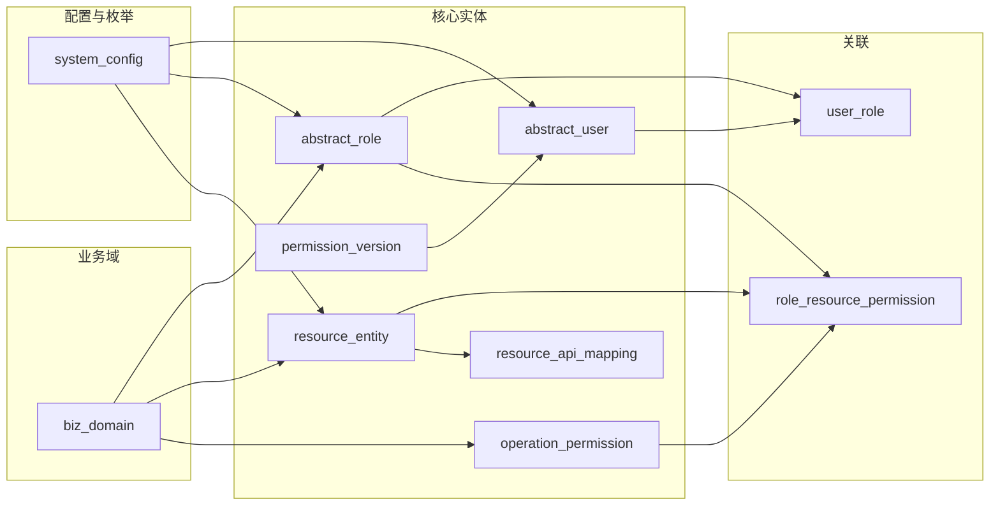

# 权限中心（Permission-Center）设计说明

本文档面向前端开发，说明权限中心模块的职责、核心概念、数据关系及页面与接口的对应关系，便于开发管理端页面。

后端表结构与鉴权流程细节见项目根目录 [plan/DESIGN.md](../../../plan/DESIGN.md)。

---

## 1. 模块概述

### 1.1 职责

权限中心提供：

- **鉴权**：按「用户 + 资源 + 操作」判断是否允许，支持依赖资源链与条件表达式。
- **用户-角色**：抽象用户与抽象角色的多对多关联，支持有效期（validFrom/validTo）。
- **角色-资源-操作**：角色对某资源在某操作上的授权，可带「可管理」标识与生效条件。
- **接口快照与版本**：面向 `gateway` 输出接口权限快照，并维护运行时权限版本。
- **冲突规则与检测**：定义同一资源上互斥的操作对，并在分配角色/权限时检测违规。
- **变更记录**：记录 user_role、role_resource_permission 等变更及影响用户/角色。
- **同步**：从外部系统同步用户、角色、资源、用户角色、角色权限。

### 1.2 前端调用基址

- 经网关后，前端请求基址为：**`/permission-center`**。
- 权限中心接口路径统一为：**`/api/perm/...`**。
- 完整示例：`POST /permission-center/api/perm/resources/list`。

---

## 2. 核心概念（与页面对应）

| 概念 | 说明 | 对应接口 |
|------|------|----------|
| 业务域 (biz_domain) | 对权限对象分类，控制数据量与管理边界 | `/api/perm/domains` |
| 抽象用户 (abstract_user) | 对应具体业务的人/服务/第三方，通过 user_type 区分 | `/api/perm/users`、`/api/perm/sync/users` |
| 抽象角色 (abstract_role) | 角色/组织/团队/职位等，属于某业务域或全局 | `/api/perm/roles`、`/api/perm/sync/roles` |
| 资源实体 (resource_entity) | 权限作用对象（菜单、报表、数据集等），支持树形 | `/api/perm/resources` |
| 接口资源映射 (resource_api_mapping) | 将接口类资源映射到服务编码、HTTP 方法、路径模式 | `/api/perm/resources`、`/api/perm/policy/interface-snapshot` |
| 操作权限 (operation_permission) | 如 VIEW、EDIT、APPROVAL、AUDIT | `/api/perm/operations` |
| 类型枚举 (system_config) | user_type、role_type、resource_type 等 KV 配置 | `/api/perm/system-config` |
| 用户-角色 (user_role) | 用户与角色多对多，可带 validFrom/validTo | `/api/perm/users/{userId}/roles` |
| 角色-资源-操作 (role_resource_permission) | 角色对某资源在某操作上的授权 | `/api/perm/roles/{roleId}/permissions` |
| 权限版本 (permission_version) | 运行时权限版本号，供登录与网关缓存刷新 | `/api/perm/version/query` |
| 权限条件 (permission_condition) | 生效条件（如 Java 表达式） | `/api/perm/conditions` |
| 资源依赖 (resource_dependency) | 鉴权时展开的依赖链 | `/api/perm/resource-dependencies` |
| 域配置 | 域范围、域关系、域引用 | `/api/perm/domain-scope`、`/api/perm/domain-relation`、`/api/perm/domain-binding` |
| 冲突规则 (permission_conflict_rule) | 同资源上互斥操作对 | `/api/perm/conflict-rules` |
| 变更记录 (permission_change_log) | 变更及影响用户/角色 | `/api/perm/change-logs` |

### 2.1 数据关系简图

- **用户 ↔ 角色**：多对多，通过 user_role，支持 validFrom/validTo。
- **角色 ↔ 资源 + 操作**：三元关系 role_resource_permission，可带 canManage、conditionId。
- **接口资源**：接口权限使用 `resource_entity + resource_api_mapping` 共同表达。
- **运行时版本**：`permission_version` 用于 identity-service 写入令牌版本、gateway 刷新本地接口快照。
- **类型枚举**：user_type、role_type、resource_type 等来自 system_config（configKey + typeValue + name）。
- **当前快照实现**：接口快照与接口判定已优先走真实表查询链，不再依赖内存目录。
- **当前主体约定**：`/api/perm/policy/interface-snapshot` 与 `/api/perm/decision/interface` 中的 `principalContext.subjectId` 现阶段按 `abstract_user_id` 使用。
- **当前条件边界**：带 `conditionId` 的授权暂不下发到网关接口快照。

---

## 3. 功能与页面-接口映射

便于前端拆页面与菜单，按功能块列出建议页面及对应接口。

| 功能 | 建议页面 | 接口路径 | 主要操作 |
|------|----------|----------|----------|
| 业务域 | 域列表、新增/编辑域 | `/api/perm/domains` | page、save、remove |
| 类型配置 | 枚举维护（用户类型/角色类型/资源类型等） | `/api/perm/system-config` | list、save |
| 资源管理 | 树形资源、新增/编辑/删除 | `/api/perm/resources` | list、save、remove |
| 操作权限 | 操作维护 | `/api/perm/operations` | list、save、remove |
| 角色管理 | 角色树、新增/编辑/删除 | `/api/perm/roles` | list、save、remove |
| 用户管理 | 用户分页、新增/编辑、同步 | `/api/perm/users`、`/api/perm/sync/users` | page、save、remove；sync/users |
| 用户-角色 | 分配/回收角色、有效期 | `/api/perm/users/{userId}/roles` | GET、POST、DELETE |
| 角色-权限 | 为角色配置资源+操作、可管理、条件 | `/api/perm/roles/{roleId}/permissions` | GET、POST、DELETE |
| 接口快照 | 供网关消费的接口权限快照 | `/api/perm/policy/interface-snapshot` | query |
| 接口判定 | 单次接口权限判定 | `/api/perm/decision/interface` | decide |
| 权限版本 | 查询当前运行时权限版本 | `/api/perm/version/query` | query |
| 权限条件 | 条件表达式维护 | `/api/perm/conditions` | list、save、remove |
| 资源依赖 | 依赖链配置 | `/api/perm/resource-dependencies` | list、save、remove |
| 域范围配置 | 域下允许的类型/操作 | `/api/perm/domain-scope` | list、save、remove |
| 域关系配置 | 域内可关联关系 | `/api/perm/domain-relation` | list、save、remove |
| 域引用绑定 | 域引用全局角色/资源/操作 | `/api/perm/domain-binding` | list、save、remove |
| 冲突规则 | 规则维护、冲突检测 | `/api/perm/conflict-rules` | list、save、remove、detect |
| 鉴权 | 单次校验（通常由业务后端调用） | `/api/perm/check` | check |
| 变更记录 | 按用户/角色/时间等查询 | `/api/perm/change-logs` | change-logs |
| 同步 | 用户/角色/资源/用户角色/角色权限 | `/api/perm/sync/*` | users、roles、resources、user-roles、role-permissions |

---

## 4. 统一约定

### 4.1 租户

- 所有写操作及大部分查询需传 **tenantId**（Long）。
- 列表/分页查询条件中通常包含 tenantId，部分接口还需 bizDomainId。

### 4.2 请求

- 所有接口均为 **POST**，`Content-Type: application/json`。
- 请求体为 JSON，字段命名与接口文档一致（驼峰）。

### 4.3 响应

- **列表（非分页）**：`R<List<Vo>>`，结构为 `{ code, msg, data }`，其中 data 为数组。
- **分页**：`TableDataInfo<Vo>`，结构为 `{ code, msg, rows, total }`，rows 为当前页数据，total 为总条数。
- **无体（如删除、保存成功）**：`R<Void>`，结构为 `{ code, msg, data: null }`。
- 成功时 code 为 200，失败时见 msg 或业务约定。

### 4.4 与现有 DESIGN 的衔接

- 表结构、唯一约束、软删除、鉴权步骤、变更记录写入约定等见 **plan/DESIGN.md**。
- 原权限表是单一事实来源，`kernel` 接口只是查询/消费包装层。
- 本设计说明仅保留前端需要的概念与页面-接口映射，避免重复并保持单一数据源。

---

## 5. 文档与接口文档的对应关系

- 本节「功能与页面-接口映射」与 **接口文档.md** 中的「按控制器分节」一一对应。
- 每个接口的请求/响应字段以 **接口文档.md** 为准，字段定义来源于 `domain.dto` 与 `domain.vo` 的 Java 类。
